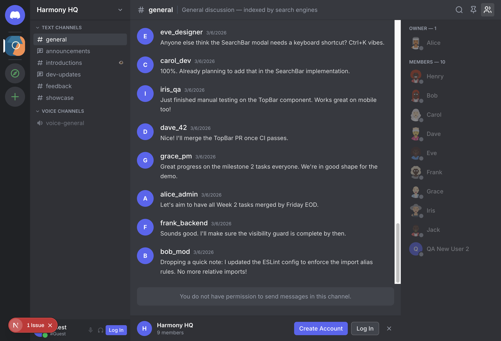
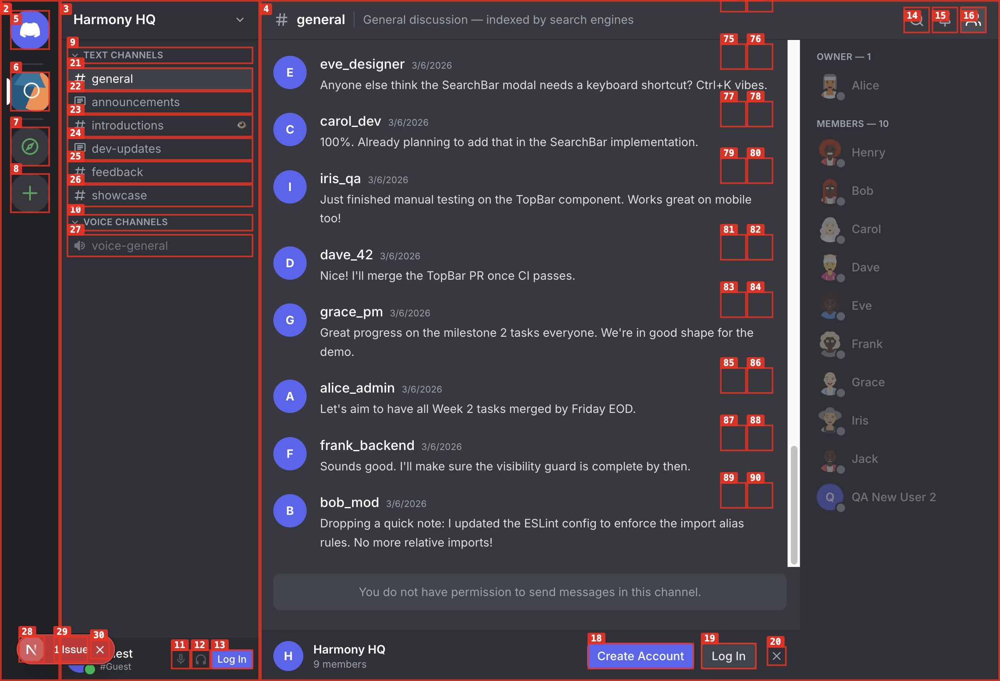
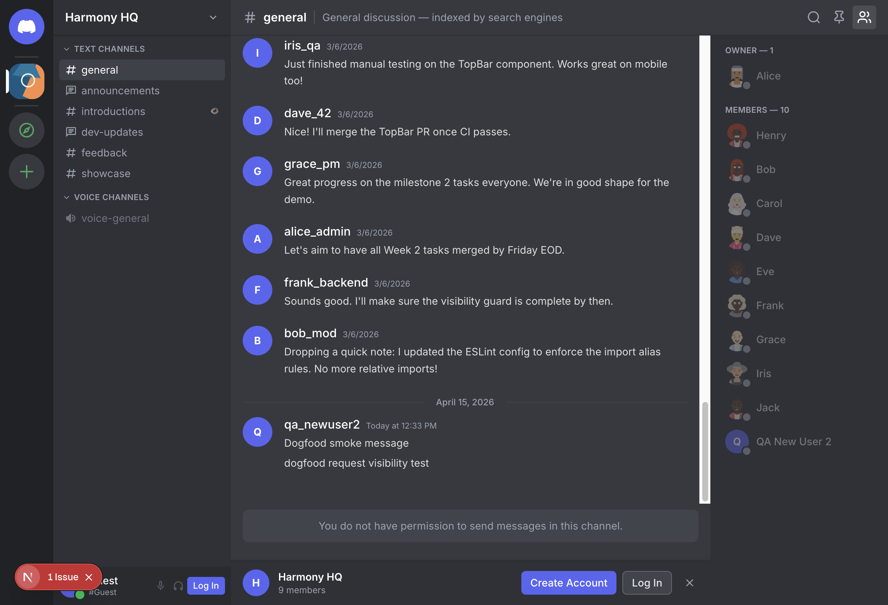
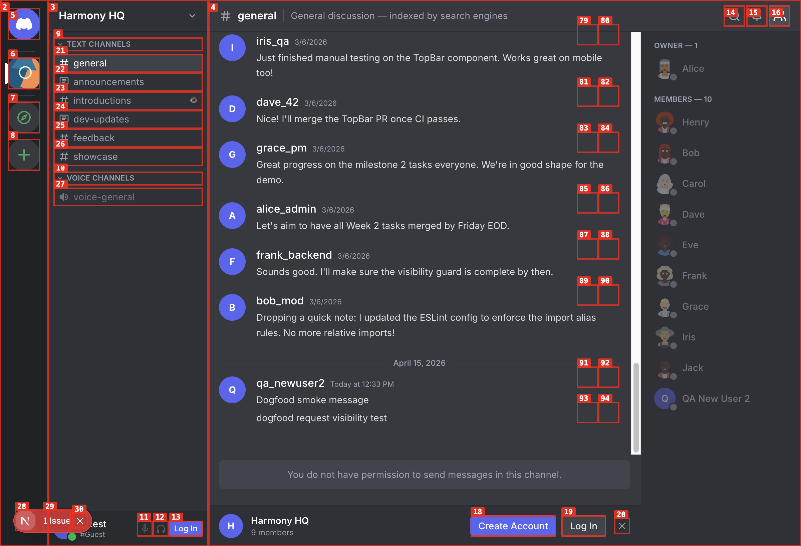
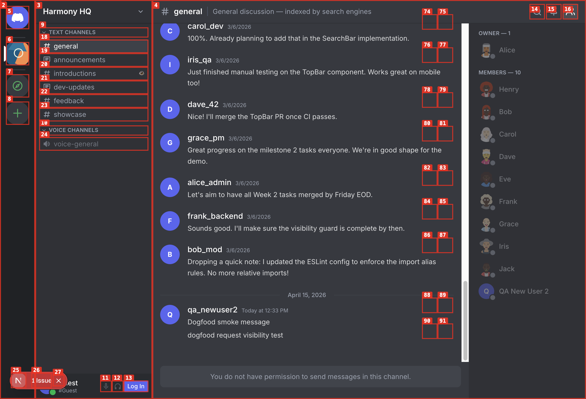
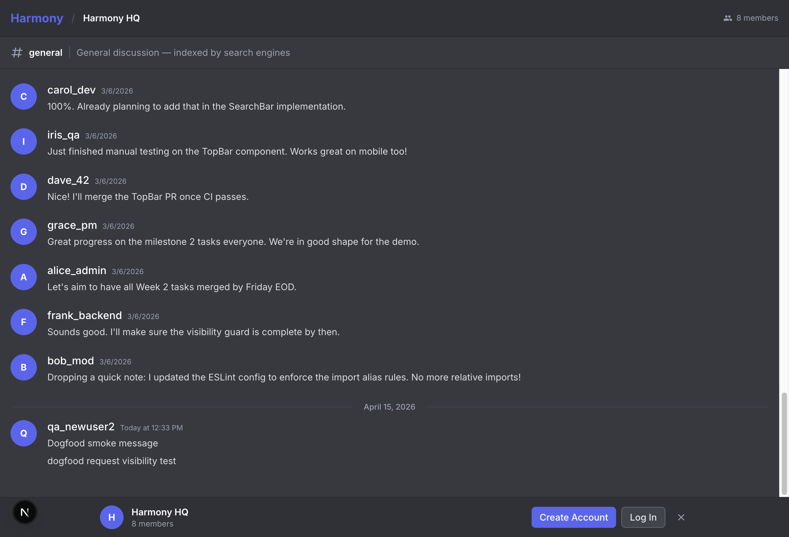
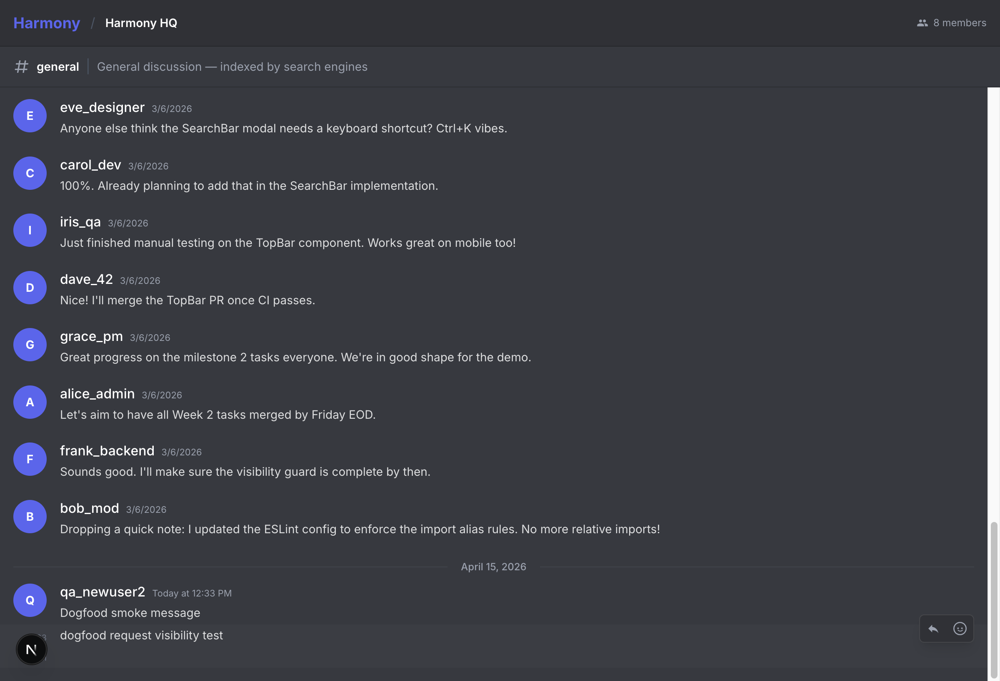
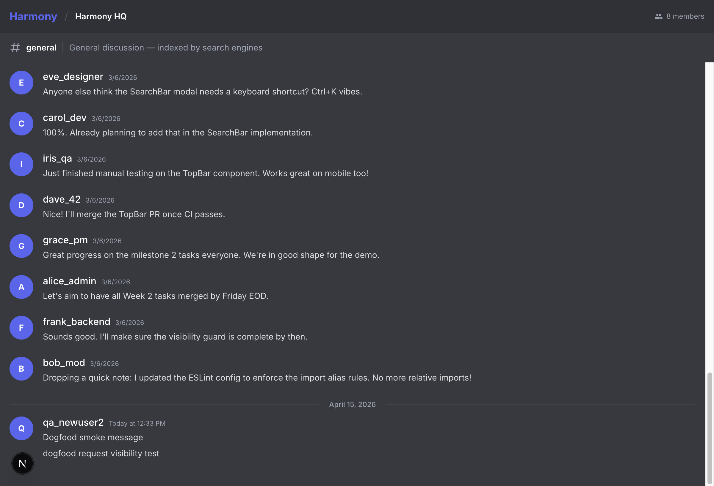
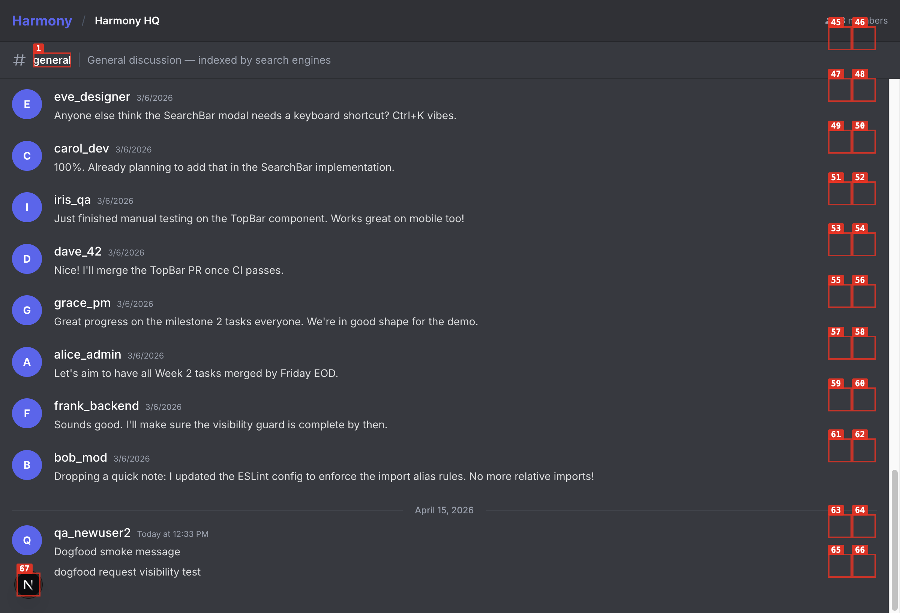
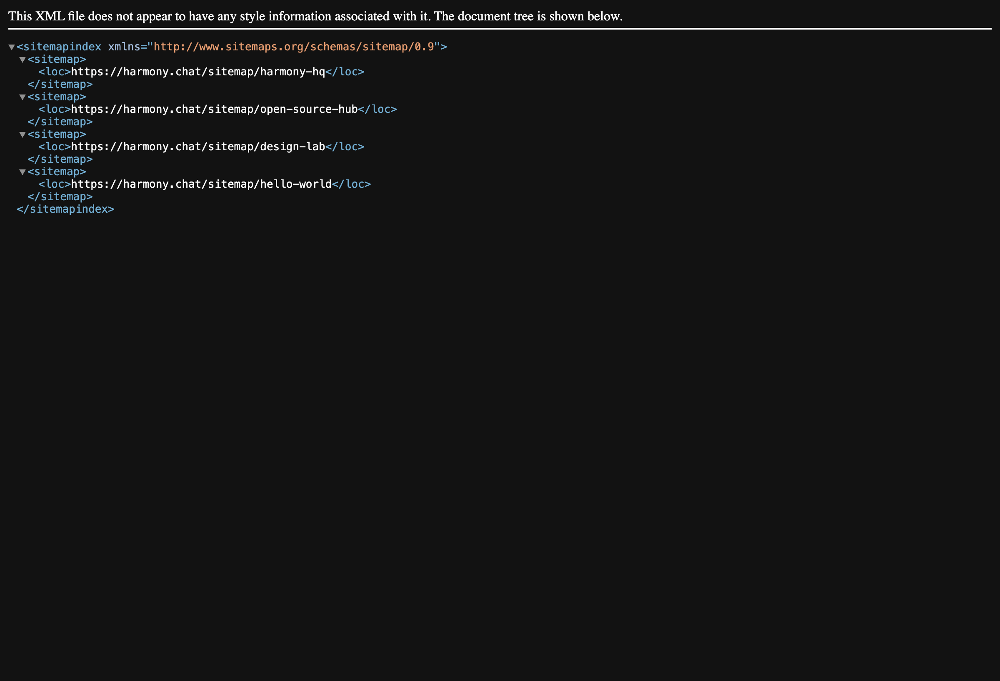

# Dogfood Report: Harmony (Local)

| Field | Value |
|-------|-------|
| **Date** | 2026-04-15 |
| **App URL** | http://localhost:3000 |
| **Session** | harmony-local-20260415 |
| **Scope** | Full app exploratory test (guest + authenticated flows) |

## Summary

| Severity | Count |
|----------|-------|
| Critical | 0 |
| High | 1 |
| Medium | 4 |
| Low | 0 |
| **Total** | **5** |

## Issues

### ISSUE-001: Guest "Reply" actions are clickable but do nothing and show no sign-in prompt

| Field | Value |
|-------|-------|
| **Severity** | medium |
| **Category** | ux |
| **URL** | http://localhost:3000/channels/harmony-hq/general |
| **Repro Video** | videos/issue-001-repro.webm |

**Description**

In the guest view of a public channel, each message shows a **Reply** button that appears interactive. Clicking it repeatedly produces no visible state change, no prompt to log in, and no network activity. Expected behavior is either (a) open reply composer/thread flow (if permitted) or (b) clearly redirect/prompt for authentication.

**Repro Steps**

<!-- Each step has a screenshot. A reader should be able to follow along visually. -->

1. Navigate to `http://localhost:3000/channels/harmony-hq/general` as a guest user.
   

2. Click a **Reply** button under a message.
   

3. Click **Reply** again on the same message.
   

4. **Observe:** there is no thread/reply UI and no sign-in prompt.
   

5. Inspect network log: `screenshots/issue-001-network.txt` shows `No requests captured`.

---

### ISSUE-002: Guest "Add Reaction" actions are clickable but do nothing and show no sign-in prompt

| Field | Value |
|-------|-------|
| **Severity** | medium |
| **Category** | ux |
| **URL** | http://localhost:3000/channels/harmony-hq/general |
| **Repro Video** | videos/issue-002-repro.webm |

**Description**

In the guest view, **Add Reaction** buttons are exposed on each message but clicking them has no effect and no login prompt appears. Expected behavior is either a reaction picker/auth flow or explicit guidance that authentication is required.

**Repro Steps**

1. Navigate to `http://localhost:3000/channels/harmony-hq/general` as a guest user.
   

2. Click **Add Reaction** on a message.
   

3. Click **Add Reaction** again.
   

4. **Observe:** no picker, no modal, no authentication guidance.
   

5. Inspect network log: `screenshots/issue-002-network.txt` shows `No requests captured`.

---

### ISSUE-003: "Browse Public Servers" CTA is disabled for guests on a public page

| Field | Value |
|-------|-------|
| **Severity** | medium |
| **Category** | functional |
| **URL** | http://localhost:3000/channels/harmony-hq/general |
| **Repro Video** | N/A |

**Description**

The sidebar exposes a **Browse Public Servers** call-to-action, but it is disabled when visiting as a guest. This blocks the expected public discovery flow from a public channel surface.

**Repro Steps**

1. Open `http://localhost:3000/channels/harmony-hq/general` as a guest.
2. Observe **Browse Public Servers** appears disabled in the Servers nav.
   

---

### ISSUE-004: Dismissing guest auth banner removes visible login/signup path (dead-end UX)

| Field | Value |
|-------|-------|
| **Severity** | medium |
| **Category** | ux |
| **URL** | http://localhost:3000/c/harmony-hq/general |
| **Repro Video** | videos/issue-004-repro.webm |

**Description**

The guest promo banner contains the only visible **Create Account**/**Log In** entry points on this route. After pressing **Dismiss banner**, those auth CTAs disappear and the screen shows only inert message actions, leaving a dead-end UX unless the user manually navigates elsewhere.

**Repro Steps**

1. Open `http://localhost:3000/c/harmony-hq/general` as a guest.
   

2. Click **Dismiss banner**.
   

3. Attempt to continue interaction via message controls.
   

4. **Observe:** auth CTAs are gone and no replacement auth path is shown in-page.
   

---

### ISSUE-005: sitemap.xml hardcodes production domain instead of current base URL

| Field | Value |
|-------|-------|
| **Severity** | high |
| **Category** | content |
| **URL** | http://localhost:3000/sitemap.xml |
| **Repro Video** | N/A |

**Description**

`/sitemap.xml` returns `<loc>` entries pointing to `https://harmony.chat/...` even when served from local environment (`http://localhost:3000`). This indicates sitemap host generation is not aligned with runtime base URL, which can cause incorrect environment indexing and verification issues.

**Repro Steps**

1. Navigate to `http://localhost:3000/sitemap.xml`.
2. Observe sitemap entries use `https://harmony.chat/...` instead of localhost.
   
3. Raw XML artifact: `screenshots/issue-005-sitemap.xml`.
