# Codex Conversation Export

## Metadata

- Thread ID: 019d467b-0a45-7763-af84-a8520933e41c
- Timestamp: 2026-04-01T00:39:21.927Z
- CWD: /Users/allen/repos/Harmony
- Source: vscode
- Model Provider: openai
- Model: gpt-5.4
- Reasoning Effort: high
- Rollout Path: /Users/allen/.codex/sessions/2026/03/31/rollout-2026-03-31T20-39-21-019d467b-0a45-7763-af84-a8520933e41c.jsonl

## Transcript

### Turn 1: Review

#### 👤 User Prompt

- Time: 2026-04-01T00:39:24.602Z

```text
Review https://github.com/acabrera04/Harmony/pull/277
```

#### 🤖 gpt-5.4 (high)

- Time: 2026-04-01T00:39:33.853Z

I’m pulling the repo-specific review instructions first, then I’ll inspect PR #277’s diff and validate the risky paths locally before writing findings.

#### Tool: exec_command

```sh
rtk read WORKFLOW.md
```

Output:

````text
## Workflow Orchestration
### 1. Plan Mode Default
- Enter plan mode for ANY non-trivial task (3+ steps or architectural decisions)
- If something goes sideways, STOP and re-plan immediately - don't keep pushing
- Use plan mode for verification steps, not just building
- Write detailed specs upfront to reduce ambiguity

### 2. Subagent Strategy
- Use subagents liberally to keep main context window clean 
- Offload research, exploration, and parallel analysis to subagents
- For complex problems, throw more compute at it via subagents
- One task per subagent for focused execution

### 3. Self-Improvement Loop 
- After ANY correction from the user: update `tasks/lessons.md` with the pattern
- Write rules for yourself that prevent the same mistake
- Ruthlessly iterate on these lessons until mistake rate drops
- Review lessons at session start for relevant project

### 4. Verification Before Done
- Never mark a task complete without proving it works
- Diff behavior between main and your changes when relevant
- Ask yourself: "Would a staff engineer approve this?"
- Run tests, check logs, demonstrate correctness

### 5. Demand Elegance (Balanced)
- For non-trivial changes: pause and ask "is there a more elegant way?"
- If a fix feels hacky: "Knowing everything I know now, implement the elegant solution"
- Skip this for simple, obvious fixes - don't over-engineer
- Challenge your own work before presenting it

### 6. Autonomous Bug Fixing
- When given a bug report: just fix it. Don't ask for hand-holding
- Point at logs, errors, failing tests - then resolve them
- Zero context switching required from the user
- Go fix failing CI tests without being told how

## Task Management
This project uses a **hybrid approach**: `tasks/todo.md` for AI context, GitHub Issues as the canonical tracker on the Harmony Project Board (course requirement).

1. **Plan First**: Write plan to `tasks/todo.md` with checkable items (local scratch pad for AI context)
2. **Identify the Issue**: If the task maps to an existing GitHub Issue, note the issue number at the top of `tasks/todo.md`
3. **Announce Start**: Post an opening comment to the issue — `gh issue comment <number> --body "..."` — describing what will be done
4. **Track Progress**: Mark items complete in `tasks/todo.md` as you go; post a comment to the issue at meaningful milestones (e.g., after a major step or when blocked)
5. **Explain Changes**: High-level summary at each step
6. **Document Results**: Add a review section to `tasks/todo.md` and post a final summary comment to the issue when complete
7. **Capture Lessons**: Update `tasks/lessons.md` after corrections. Post the new lessons learned as a comment to the issue.

### Issue Comment Format
Use this structure for issue comments to keep the audit trail readable:

```
**[AI Agent — <Step>]**

<What was done or decided>

<Any blockers, decisions, or next steps>
```

Example steps: `Starting`, `In Progress`, `Blocked`, `Complete`

## Core Principles
- **Simplicity First**: Make every change as simple as possible. Impact minimal code.
- **No Laziness**: Find root causes. No temporary fixes. Senior developer standards.
- **Minimal Impact**: Changes should only touch what's necessary. Avoid introducing bugs.
- **Lean Context Files**: Keep AGENTS.md and similar files to only non-obvious, non-discoverable essentials. Research shows context file bloat decreases task success rates and increases inference cost by 20%+ with 2–4 extra steps per task (Gloaguen et al., 2026).

#### Taken from https://x.com/mdancho84/status/2023738764841894352

Gloaguen, T., Mündler, N., Müller, M., Raychev, V., & Vechev, M. (2026, February 12). Evaluating AGENTS.MD: Are Repository-Level context Files helpful for coding agents? arXiv.org. https://arxiv.org/abs/2602.11988
````

#### Tool: exec_command

```sh
rtk read .github/PR_REVIEW.md
```

Output:

```text
# PR Review Guidelines

When conducting PR Reviews, follow these guidelines:
1. **Prioritize Logic over Style:** Ensure the code is efficient, DRY (Don't Repeat Yourself), and logically sound.
2. **Security First:** Verify that the changes do not introduce vulnerabilities (e.g., lack of input validation, exposed secrets).
3. **Architectural Alignment:** If applicable, ensure the changes adhere strictly to the patterns defined in `@../docs/unified-backend-architecture.md`.
4. **Issue Completion:** If the PR is attached to an issue, verify that the code successfully satisfies every acceptance criteria of that issue.
5. **No Nitpicking:** Do not leave comments regarding stylistic choices, formatting, or subjective naming conventions unless they violate core project readability. Focus only on critical logic, performance, or architectural flaws.
6. **Avoid Repetition:** Do not repeat feedback that has already been stated in previous reviews on this PR.
7. **Iterative Reviews:** If this is not your first review on the PR:
    - First, check if the new commits have correctly addressed your previous review comments.
    - If a previous concern has been addressed, explicitly resolve the associated comment.
8. **Prevent CI Failures:** Analyze the code for obvious issues that would break the pipeline. Specifically check for syntax errors, missing imports/dependencies, unhandled exceptions, and logic that would clearly break existing tests.

**Execution Instruction**: Before providing your code feedback, output a markdown checklist of the 8 guidelines above. Mark each one as [x] if it passes or [ ] if it fails, and briefly explain why. Then, provide your single bundled review. Use inline subcomments within that single review for specific lines of codes. Do not post multiple standalone comments.
```

#### Tool: exec_command

```sh
rtk git status --short
```

Output:

```text
?? "P4: Backend Development | CS 485 AI-Assisted Software Engineering (Sp26).html"
?? "P5: Testing | CS 485 AI-Assisted Software Engineering (Sp26).pdf"
?? load-test.js
```

#### Tool: exec_command

```sh
rtk git remote -v
```

Output:

```text
origin	git@github.com:acabrera04/Harmony.git (fetch)
origin	git@github.com:acabrera04/Harmony.git (push)
```

#### 🤖 gpt-5.4 (high)

- Time: 2026-04-01T00:39:42.275Z

I have the review rubric and repo workflow. Next I’m checking PR metadata, prior review comments, and the exact patch so I can avoid duplicate feedback and focus on regressions.

#### Tool: update_plan

- Explanation: Reviewing PR #277 requires diff inspection, prior-comment de-duplication, and targeted validation of changed areas.

- Plan:
  - [in_progress] Fetch PR metadata, changed files, and existing review comments
  - [pending] Inspect changed code locally and validate behavior against repo conventions
  - [pending] Write bundled review with checklist and concrete findings

Output:

```text
Plan updated
```

#### Tool: mcp__codex_apps__github_get_pr_info

```json
{
  "pr_number": 277,
  "repository_full_name": "acabrera04/Harmony"
}
```

Output:

```text
{"url":"https://github.com/acabrera04/Harmony/pull/277","number":277,"state":"open","merged":false,"mergeable":true,"draft":false,"body":"## Summary\n\n- Adds `harmony-backend/tests/server.service.test.ts` — 56 isolated Jest unit tests for `src/services/server.service.ts`\n- All Prisma calls, `channelService`, `serverMemberService`, `isSystemAdmin`, and `eventBus` are mocked via `jest.mock`; no database or Redis connection is required\n- Implements every test case from the spec in `docs/test-specs/server-service-spec.md` (closed #259)\n\n## Coverage (scoped to `server.service.ts`)\n\n| Metric | Result |\n|---|---|\n| Statements | **98.61%** |\n| Branches | **97.22%** |\n| Functions | **100%** |\n| Lines | **98.46%** |\n\nThe single uncovered line (L82) is the `TRPCError(CONFLICT)` throw that follows the `withSlugRetry` loop — confirmed unreachable dead code, documented in the spec's edge-cases section.\n\n## Test plan\n\n- [x] All 56 tests pass locally (`npx jest tests/server.service.test.ts`)\n- [x] No lint errors (`eslint tests/server.service.test.ts`)\n- [x] Coverage ≥ 80% confirmed with `--coverage --collectCoverageFrom`\n- [x] `generateSlug` — 9 normalisation cases\n- [x] `getPublicServers` / `getAllServers` — filter, ordering, limit, cap-at-100\n- [x] `getMemberServers` — join ordering, empty result, limit, cap\n- [x] `getServer` — found and not-found paths\n- [x] `createServer` — happy path, BAD_REQUEST, CONFLICT (10 candidates), P2002 retry, P2002 exhaustion (raw rethrow, not TRPCError), non-P2002 passthrough, `createDefaultChannel` failure, `addOwner` failure\n- [x] `updateServer` — NOT_FOUND, FORBIDDEN, no-rename, rename+slug regen, unchanged-name (no count call), system-admin bypass, SERVER_UPDATED payload, slug exhaustion CONFLICT, withSlugRetry P2002 rethrow\n- [x] `deleteServer` — NOT_FOUND, FORBIDDEN, owner, system-admin\n- [x] `incrementMemberCount` — happy path + call shape\n- [x] `decrementMemberCount` — happy path, null-server branch, memberCount=0 branch (both sides of compound guard)\n- [x] `getMembers` — role sort, joinedAt tie-break, empty list, profile fields, unknown-role fallback\n\nCloses #264\n\n🤖 Generated with [Claude Code](https://claude.com/claude-code)","title":"test(backend): unit tests for server.service.ts","base":"main","base_sha":"189a720985f235f605feb39d1fd5167b008f5aa5","head":"test/issue-264-server-service-tests","head_sha":"e9bc4003f2ad27e15b64481a7b642ebe1916de31","merge_commit_sha":"c142999b659139530076697a2810a4f02446401d","user":{"login":"declanblanc","name":"declanblanc","email":null,"avatar_url":"https://avatars.githubusercontent.com/u/49934576?v=4","id":49934576},"requested_reviewers":null,"diff":null,"comments":null,"created_at":"2026-04-01T00:34:22Z","updated_at":"2026-04-01T00:38:48Z","closed_at":null,"merged_at":null,"commits":1,"changed_files":1,"additions":666,"deletions":0,"display_url":"https://github.com/acabrera04/Harmony/pull/277","display_title":"test(backend): unit tests for server.service.ts"}
```

#### Tool: mcp__codex_apps__github_list_pr_changed_filenames

```json
{
  "pr_number": 277,
  "repo_full_name": "acabrera04/Harmony"
}
```

Output:

```text
{"filenames":["harmony-backend/tests/server.service.test.ts"]}
```

#### Tool: mcp__codex_apps__github_fetch_pr_comments

```json
{
  "pr_number": 277,
  "repo_full_name": "acabrera04/Harmony"
}
```

Output:

```text
{"comments":[{"url":"https://github.com/acabrera04/Harmony/pull/277#issuecomment-4166609930","body":"@codex review","user":{"login":"acabrera04","name":"acabrera04","email":null,"avatar_url":"https://avatars.githubusercontent.com/u/145043651?v=4","id":145043651},"id":4166609930,"pull_request_review_id":null,"in_reply_to_id":null,"created_at":"2026-04-01T00:36:21Z","review":null,"side":null,"line":null,"start_line":null,"path":null,"body_html":"<p dir=\"auto\"><a class=\"user-mention notranslate\" data-hovercard-type=\"user\" data-hovercard-url=\"/users/codex/hovercard\" data-octo-click=\"hovercard-link-click\" data-octo-dimensions=\"link_type:self\" href=\"https://github.com/codex\">@codex</a> review</p>"},{"url":"https://github.com/acabrera04/Harmony/pull/277#issuecomment-4166617824","body":"Codex Review: Didn't find any major issues. :+1:\n\n<details> <summary>ℹ️ About Codex in GitHub</summary>\n<br/>\n\n[Your team has set up Codex to review pull requests in this repo](http://chatgpt.com/codex/settings/general). Reviews are triggered when you\n- Open a pull request for review\n- Mark a draft as ready\n- Comment \"@codex review\".\n\nIf Codex has suggestions, it will comment; otherwise it will react with 👍.\n\n\n\n\nCodex can also answer questions or update the PR. Try commenting \"@codex address that feedback\".\n            \n</details>","user":{"login":"chatgpt-codex-connector[bot]","name":"chatgpt-codex-connector[bot]","email":null,"avatar_url":"https://avatars.githubusercontent.com/in/1144995?v=4","id":199175422},"id":4166617824,"pull_request_review_id":null,"in_reply_to_id":null,"created_at":"2026-04-01T00:38:48Z","review":null,"side":null,"line":null,"start_line":null,"path":null,"body_html":"<p dir=\"auto\">Codex Review: Didn't find any major issues. 👍</p>\n<details> <summary>ℹ️ About Codex in GitHub</summary>\n<br>\n<p dir=\"auto\"><a href=\"http://chatgpt.com/codex/settings/general\" rel=\"nofollow\">Your team has set up Codex to review pull requests in this repo</a>. Reviews are triggered when you</p>\n<ul dir=\"auto\">\n<li>Open a pull request for review</li>\n<li>Mark a draft as ready</li>\n<li>Comment \"<a class=\"user-mention notranslate\" data-hovercard-type=\"user\" data-hovercard-url=\"/users/codex/hovercard\" data-octo-click=\"hovercard-link-click\" data-octo-dimensions=\"link_type:self\" href=\"https://github.com/codex\">@codex</a> review\".</li>\n</ul>\n<p dir=\"auto\">If Codex has suggestions, it will comment; otherwise it will react with 👍.</p>\n<p dir=\"auto\">Codex can also answer questions or update the PR. Try commenting \"<a class=\"user-mention notranslate\" data-hovercard-type=\"user\" data-hovercard-url=\"/users/codex/hovercard\" data-octo-click=\"hovercard-link-click\" data-octo-dimensions=\"link_type:self\" href=\"https://github.com/codex\">@codex</a> address that feedback\".</p>\n</details>"}],"url":"https://github.com/acabrera04/Harmony/pull/277","title":"acabrera04/Harmony PR #277 comments","display_url":"https://github.com/acabrera04/Harmony/pull/277","display_title":"acabrera04/Harmony PR #277 comments"}
```

#### Tool: mcp__codex_apps__github_fetch_issue_comments

```json
{
  "issue_number": 277,
  "repo_full_name": "acabrera04/Harmony"
}
```

Output:

```text
{"comments":[{"url":"https://github.com/acabrera04/Harmony/pull/277#issuecomment-4166609930","body":"@codex review","user":{"login":"acabrera04","name":"acabrera04","email":null,"avatar_url":"https://avatars.githubusercontent.com/u/145043651?v=4","id":145043651},"id":4166609930,"pull_request_review_id":null,"in_reply_to_id":null,"created_at":null,"review":null,"side":null,"line":null,"start_line":null,"path":null,"body_html":"<p dir=\"auto\"><a class=\"user-mention notranslate\" data-hovercard-type=\"user\" data-hovercard-url=\"/users/codex/hovercard\" data-octo-click=\"hovercard-link-click\" data-octo-dimensions=\"link_type:self\" href=\"https://github.com/codex\">@codex</a> review</p>"},{"url":"https://github.com/acabrera04/Harmony/pull/277#issuecomment-4166617824","body":"Codex Review: Didn't find any major issues. :+1:\n\n<details> <summary>ℹ️ About Codex in GitHub</summary>\n<br/>\n\n[Your team has set up Codex to review pull requests in this repo](http://chatgpt.com/codex/settings/general). Reviews are triggered when you\n- Open a pull request for review\n- Mark a draft as ready\n- Comment \"@codex review\".\n\nIf Codex has suggestions, it will comment; otherwise it will react with 👍.\n\n\n\n\nCodex can also answer questions or update the PR. Try commenting \"@codex address that feedback\".\n            \n</details>","user":{"login":"chatgpt-codex-connector[bot]","name":"chatgpt-codex-connector[bot]","email":null,"avatar_url":"https://avatars.githubusercontent.com/in/1144995?v=4","id":199175422},"id":4166617824,"pull_request_review_id":null,"in_reply_to_id":null,"created_at":null,"review":null,"side":null,"line":null,"start_line":null,"path":null,"body_html":"<p dir=\"auto\">Codex Review: Didn't find any major issues. 👍</p>\n<details> <summary>ℹ️ About Codex in GitHub</summary>\n<br>\n<p dir=\"auto\"><a href=\"http://chatgpt.com/codex/settings/general\" rel=\"nofollow\">Your team has set up Codex to review pull requests in this repo</a>. Reviews are triggered when you</p>\n<ul dir=\"auto\">\n<li>Open a pull request for review</li>\n<li>Mark a draft as ready</li>\n<li>Comment \"<a class=\"user-mention notranslate\" data-hovercard-type=\"user\" data-hovercard-url=\"/users/codex/hovercard\" data-octo-click=\"hovercard-link-click\" data-octo-dimensions=\"link_type:self\" href=\"https://github.com/codex\">@codex</a> review\".</li>\n</ul>\n<p dir=\"auto\">If Codex has suggestions, it will comment; otherwise it will react with 👍.</p>\n<p dir=\"auto\">Codex can also answer questions or update the PR. Try commenting \"<a class=\"user-mention notranslate\" data-hovercard-type=\"user\" data-hovercard-url=\"/users/codex/hovercard\" data-octo-click=\"hovercard-link-click\" data-octo-dimensions=\"link_type:self\" href=\"https://github.com/codex\">@codex</a> address that feedback\".</p>\n</details>"}],"url":"https://github.com/acabrera04/Harmony/issues/277","title":"acabrera04/Harmony Issue #277 comments","display_url":"https://github.com/acabrera04/Harmony/issues/277","display_title":"acabrera04/Harmony Issue #277 comments"}
```

#### 🤖 gpt-5.4 (high)

- Time: 2026-04-01T00:39:58.199Z

The PR only adds one Jest file, so I’m validating whether those tests actually match `server.service.ts` semantics and whether any important behavior is missing or asserted incorrectly.

#### Tool: mcp__codex_apps__github_fetch_pr_patch

```json
{
  "pr_number": 277,
  "repo_full_name": "acabrera04/Harmony"
}
```

Output:

```text
{"patches":[{"filename":"harmony-backend/tests/server.service.test.ts","patch":"@@ -0,0 +1,666 @@\n+/**\n+ * server.service unit tests — Issue #264\n+ *\n+ * All Prisma calls, channelService, serverMemberService, isSystemAdmin, and\n+ * eventBus are mocked so the suite is fully isolated — no DB or Redis\n+ * connection is required.\n+ *\n+ * Covers every program path listed in docs/test-specs/server-service-spec.md.\n+ */\n+\n+import { Prisma } from '@prisma/client';\n+import { TRPCError } from '@trpc/server';\n+\n+// ─── Module mocks (must appear before any import that resolves them) ──────────\n+\n+jest.mock('../src/db/prisma', () => ({\n+  prisma: {\n+    server: {\n+      findMany: jest.fn(),\n+      findUnique: jest.fn(),\n+      create: jest.fn(),\n+      update: jest.fn(),\n+      delete: jest.fn(),\n+      count: jest.fn(),\n+    },\n+    serverMember: {\n+      findMany: jest.fn(),\n+    },\n+  },\n+}));\n+\n+jest.mock('../src/events/eventBus', () => ({\n+  eventBus: { publish: jest.fn().mockResolvedValue(undefined) },\n+  EventChannels: { SERVER_UPDATED: 'harmony:SERVER_UPDATED' },\n+}));\n+\n+jest.mock('../src/services/channel.service', () => ({\n+  channelService: { createDefaultChannel: jest.fn().mockResolvedValue(undefined) },\n+}));\n+\n+jest.mock('../src/services/serverMember.service', () => ({\n+  serverMemberService: { addOwner: jest.fn().mockResolvedValue(undefined) },\n+}));\n+\n+jest.mock('../src/lib/admin.utils', () => ({\n+  isSystemAdmin: jest.fn().mockResolvedValue(false),\n+}));\n+\n+// ─── Imports (after mocks so the mocked versions are resolved) ───────────────\n+\n+import { prisma } from '../src/db/prisma';\n+import { eventBus, EventChannels } from '../src/events/eventBus';\n+import { channelService } from '../src/services/channel.service';\n+import { serverMemberService } from '../src/services/serverMember.service';\n+import { isSystemAdmin } from '../src/lib/admin.utils';\n+import { generateSlug, serverService } from '../src/services/server.service';\n+\n+// ─── Typed mock references ────────────────────────────────────────────────────\n+\n+const mockServer = prisma.server as unknown as {\n+  findMany: jest.Mock;\n+  findUnique: jest.Mock;\n+  create: jest.Mock;\n+  update: jest.Mock;\n+  delete: jest.Mock;\n+  count: jest.Mock;\n+};\n+\n+const mockServerMember = prisma.serverMember as unknown as {\n+  findMany: jest.Mock;\n+};\n+\n+// ─── Test helpers ─────────────────────────────────────────────────────────────\n+\n+/** Build a minimal Server-shaped object, overriding any fields. */\n+function makeServer(overrides: Record<string, unknown> = {}) {\n+  return {\n+    id: 'server-1',\n+    name: 'Test Server',\n+    slug: 'test-server',\n+    ownerId: 'owner-1',\n+    isPublic: true,\n+    memberCount: 5,\n+    description: null,\n+    iconUrl: null,\n+    createdAt: new Date('2024-01-01'),\n+    updatedAt: new Date('2024-01-01'),\n+    ...overrides,\n+  };\n+}\n+\n+/** Create a real PrismaClientKnownRequestError with P2002. */\n+function p2002(): Prisma.PrismaClientKnownRequestError {\n+  return new Prisma.PrismaClientKnownRequestError('Unique constraint violation', {\n+    code: 'P2002',\n+    clientVersion: '5.0.0',\n+  });\n+}\n+\n+/** Create a real PrismaClientKnownRequestError with a non-P2002 code. */\n+function prismaErr(code = 'P2000'): Prisma.PrismaClientKnownRequestError {\n+  return new Prisma.PrismaClientKnownRequestError('Prisma error', {\n+    code,\n+    clientVersion: '5.0.0',\n+  });\n+}\n+\n+// ─── Global beforeEach ────────────────────────────────────────────────────────\n+\n+beforeEach(() => {\n+  jest.clearAllMocks();\n+  (eventBus.publish as jest.Mock).mockResolvedValue(undefined);\n+  (channelService.createDefaultChannel as jest.Mock).mockResolvedValue(undefined);\n+  (serverMemberService.addOwner as jest.Mock).mockResolvedValue(undefined);\n+  (isSystemAdmin as jest.Mock).mockResolvedValue(false);\n+});\n+\n+// ═══════════════════════════════════════════════════════════════════════════════\n+// generateSlug\n+// ═══════════════════════════════════════════════════════════════════════════════\n+\n+describe('generateSlug', () => {\n+  it('converts mixed-case name with spaces to lowercase kebab', () => {\n+    expect(generateSlug('Hello World')).toBe('hello-world');\n+  });\n+\n+  it('trims leading and trailing whitespace before processing', () => {\n+    expect(generateSlug('  My Server  ')).toBe('my-server');\n+  });\n+\n+  it('strips non-alphanumeric characters (non-ASCII and symbols)', () => {\n+    expect(generateSlug('Café & Lounge!')).toBe('caf-lounge');\n+  });\n+\n+  it('collapses multiple consecutive spaces into a single hyphen', () => {\n+    expect(generateSlug('foo   bar')).toBe('foo-bar');\n+  });\n+\n+  it('collapses consecutive hyphens into one', () => {\n+    expect(generateSlug('foo--bar')).toBe('foo-bar');\n+  });\n+\n+  it('strips leading hyphens from the result', () => {\n+    expect(generateSlug('-leading')).toBe('leading');\n+  });\n+\n+  it('strips trailing hyphens from the result', () => {\n+    expect(generateSlug('trailing-')).toBe('trailing');\n+  });\n+\n+  it('returns empty string when all characters are stripped', () => {\n+    expect(generateSlug('!!!')).toBe('');\n+  });\n+\n+  it('returns empty string for empty input', () => {\n+    expect(generateSlug('')).toBe('');\n+  });\n+});\n+\n+// ═══════════════════════════════════════════════════════════════════════════════\n+// getPublicServers\n+// ═══════════════════════════════════════════════════════════════════════════════\n+\n+describe('serverService.getPublicServers', () => {\n+  it('applies isPublic:true filter and default take:50', async () => {\n+    mockServer.findMany.mockResolvedValue([]);\n+    await serverService.getPublicServers();\n+    expect(mockServer.findMany).toHaveBeenCalledWith(\n+      expect.objectContaining({ where: { isPublic: true }, take: 50 }),\n+    );\n+  });\n+\n+  it('orders results by createdAt descending', async () => {\n+    mockServer.findMany.mockResolvedValue([]);\n+    await serverService.getPublicServers();\n+    expect(mockServer.findMany).toHaveBeenCalledWith(\n+      expect.objectContaining({ orderBy: { createdAt: 'desc' } }),\n+    );\n+  });\n+\n+  it('respects a caller-supplied limit smaller than 50', async () => {\n+    mockServer.findMany.mockResolvedValue([]);\n+    await serverService.getPublicServers(10);\n+    expect(mockServer.findMany).toHaveBeenCalledWith(\n+      expect.objectContaining({ take: 10 }),\n+    );\n+  });\n+\n+  it('caps the effective limit at 100', async () => {\n+    mockServer.findMany.mockResolvedValue([]);\n+    await serverService.getPublicServers(200);\n+    expect(mockServer.findMany).toHaveBeenCalledWith(\n+      expect.objectContaining({ take: 100 }),\n+    );\n+  });\n+\n+  it('returns an empty array when no public servers exist', async () => {\n+    mockServer.findMany.mockResolvedValue([]);\n+    expect(await serverService.getPublicServers()).toEqual([]);\n+  });\n+});\n+\n+// ═══════════════════════════════════════════════════════════════════════════════\n+// getAllServers\n+// ═══════════════════════════════════════════════════════════════════════════════\n+\n+describe('serverService.getAllServers', () => {\n+  it('calls findMany without a visibility filter and default take:50', async () => {\n+    mockServer.findMany.mockResolvedValue([]);\n+    await serverService.getAllServers();\n+    const arg = mockServer.findMany.mock.calls[0][0] as Record<string, unknown>;\n+    expect(arg.take).toBe(50);\n+    expect(arg.where).toBeUndefined();\n+  });\n+\n+  it('respects a caller-supplied limit', async () => {\n+    mockServer.findMany.mockResolvedValue([]);\n+    await serverService.getAllServers(20);\n+    expect(mockServer.findMany).toHaveBeenCalledWith(\n+      expect.objectContaining({ take: 20 }),\n+    );\n+  });\n+\n+  it('caps the effective limit at 100', async () => {\n+    mockServer.findMany.mockResolvedValue([]);\n+    await serverService.getAllServers(500);\n+    expect(mockServer.findMany).toHaveBeenCalledWith(\n+      expect.objectContaining({ take: 100 }),\n+    );\n+  });\n+\n+  it('returns an empty array when no servers exist', async () => {\n+    mockServer.findMany.mockResolvedValue([]);\n+    expect(await serverService.getAllServers()).toEqual([]);\n+  });\n+});\n+\n+// ═══════════════════════════════════════════════════════════════════════════════\n+// getMemberServers\n+// ═══════════════════════════════════════════════════════════════════════════════\n+\n+describe('serverService.getMemberServers', () => {\n+  it('returns servers extracted from memberships in the order returned (ascending joinedAt)', async () => {\n+    const s1 = makeServer({ id: 's1' });\n+    const s2 = makeServer({ id: 's2' });\n+    mockServerMember.findMany.mockResolvedValue([{ server: s1 }, { server: s2 }]);\n+    const result = await serverService.getMemberServers('user-1');\n+    expect(result).toEqual([s1, s2]);\n+    expect(mockServerMember.findMany).toHaveBeenCalledWith(\n+      expect.objectContaining({ where: { userId: 'user-1' }, orderBy: { joinedAt: 'asc' } }),\n+    );\n+  });\n+\n+  it('returns empty array when user has no memberships', async () => {\n+    mockServerMember.findMany.mockResolvedValue([]);\n+    expect(await serverService.getMemberServers('no-memberships-user')).toEqual([]);\n+  });\n+\n+  it('respects a caller-supplied limit', async () => {\n+    mockServerMember.findMany.mockResolvedValue([]);\n+    await serverService.getMemberServers('user-1', 5);\n+    expect(mockServerMember.findMany).toHaveBeenCalledWith(\n+      expect.objectContaining({ take: 5 }),\n+    );\n+  });\n+\n+  it('caps the effective limit at 100', async () => {\n+    mockServerMember.findMany.mockResolvedValue([]);\n+    await serverService.getMemberServers('user-1', 200);\n+    expect(mockServerMember.findMany).toHaveBeenCalledWith(\n+      expect.objectContaining({ take: 100 }),\n+    );\n+  });\n+});\n+\n+// ═══════════════════════════════════════════════════════════════════════════════\n+// getServer\n+// ═══════════════════════════════════════════════════════════════════════════════\n+\n+describe('serverService.getServer', () => {\n+  it('returns the matching server for a known slug', async () => {\n+    const server = makeServer();\n+    mockServer.findUnique.mockResolvedValue(server);\n+    const result = await serverService.getServer('test-server');\n+    expect(result).toEqual(server);\n+    expect(mockServer.findUnique).toHaveBeenCalledWith({ where: { slug: 'test-server' } });\n+  });\n+\n+  it('returns null for an unknown slug', async () => {\n+    mockServer.findUnique.mockResolvedValue(null);\n+    expect(await serverService.getServer('nonexistent')).toBeNull();\n+  });\n+});\n+\n+// ═══════════════════════════════════════════════════════════════════════════════\n+// createServer\n+// ═══════════════════════════════════════════════════════════════════════════════\n+\n+describe('serverService.createServer', () => {\n+  it('creates server with all optional fields and calls createDefaultChannel then addOwner', async () => {\n+    const created = makeServer({ id: 'new-id', name: 'New Server', slug: 'new-server' });\n+    mockServer.count.mockResolvedValue(0);\n+    mockServer.create.mockResolvedValue(created);\n+\n+    const result = await serverService.createServer({\n+      name: 'New Server',\n+      description: 'desc',\n+      iconUrl: 'https://img',\n+      isPublic: true,\n+      ownerId: 'owner-1',\n+    });\n+\n+    expect(result).toEqual(created);\n+    expect(channelService.createDefaultChannel).toHaveBeenCalledWith('new-id');\n+    expect(serverMemberService.addOwner).toHaveBeenCalledWith('owner-1', 'new-id');\n+    // createDefaultChannel must be called before addOwner\n+    const createOrder = (channelService.createDefaultChannel as jest.Mock).mock.invocationCallOrder[0];\n+    const ownerOrder = (serverMemberService.addOwner as jest.Mock).mock.invocationCallOrder[0];\n+    expect(createOrder).toBeLessThan(ownerOrder);\n+  });\n+\n+  it('creates server with only required fields', async () => {\n+    const created = makeServer({ id: 'min-id', name: 'Minimal', slug: 'minimal' });\n+    mockServer.count.mockResolvedValue(0);\n+    mockServer.create.mockResolvedValue(created);\n+\n+    const result = await serverService.createServer({ name: 'Minimal', ownerId: 'owner-1' });\n+    expect(result).toEqual(created);\n+    expect(channelService.createDefaultChannel).toHaveBeenCalledWith('min-id');\n+    expect(serverMemberService.addOwner).toHaveBeenCalledWith('owner-1', 'min-id');\n+  });\n+\n+  it('throws BAD_REQUEST when name produces an empty slug', async () => {\n+    await expect(serverService.createServer({ name: '!!!', ownerId: 'owner-1' }))\n+      .rejects.toMatchObject({ code: 'BAD_REQUEST', message: 'Cannot generate slug from name' });\n+    expect(mockServer.create).not.toHaveBeenCalled();\n+  });\n+\n+  it('throws CONFLICT when all 10 generateUniqueSlug candidates are occupied', async () => {\n+    // count always non-zero → base, base-1 … base-9 all taken\n+    mockServer.count.mockResolvedValue(1);\n+    await expect(serverService.createServer({ name: 'New Server', ownerId: 'owner-1' }))\n+      .rejects.toMatchObject({ code: 'CONFLICT', message: 'Unable to generate a unique slug' });\n+    expect(mockServer.create).not.toHaveBeenCalled();\n+  });\n+\n+  it('retries once on a transient P2002 and returns the server on the second attempt', async () => {\n+    const created = makeServer({ id: 'retry-id' });\n+    mockServer.count.mockResolvedValue(0);\n+    mockServer.create\n+      .mockRejectedValueOnce(p2002())\n+      .mockResolvedValueOnce(created);\n+\n+    const result = await serverService.createServer({ name: 'New Server', ownerId: 'owner-1' });\n+    expect(result).toEqual(created);\n+    expect(mockServer.create).toHaveBeenCalledTimes(2);\n+  });\n+\n+  it('rethrows the raw P2002 (not TRPCError) when withSlugRetry exhausts all 3 attempts', async () => {\n+    const error = p2002();\n+    mockServer.count.mockResolvedValue(0);\n+    mockServer.create.mockRejectedValue(error);\n+\n+    await expect(serverService.createServer({ name: 'New Server', ownerId: 'owner-1' }))\n+      .rejects.toBeInstanceOf(Prisma.PrismaClientKnownRequestError);\n+    await expect(serverService.createServer({ name: 'New Server', ownerId: 'owner-1' }))\n+      .rejects.not.toBeInstanceOf(TRPCError);\n+  });\n+\n+  it('rethrows a non-P2002 Prisma error immediately on the first attempt without retry', async () => {\n+    const error = prismaErr('P2000');\n+    mockServer.count.mockResolvedValue(0);\n+    mockServer.create.mockRejectedValue(error);\n+\n+    await expect(serverService.createServer({ name: 'New Server', ownerId: 'owner-1' }))\n+      .rejects.toBeInstanceOf(Prisma.PrismaClientKnownRequestError);\n+    expect(mockServer.create).toHaveBeenCalledTimes(1);\n+  });\n+\n+  it('propagates a createDefaultChannel rejection without swallowing it', async () => {\n+    const created = makeServer({ id: 'new-id' });\n+    mockServer.count.mockResolvedValue(0);\n+    mockServer.create.mockResolvedValue(created);\n+    const channelError = new Error('channel creation failed');\n+    (channelService.createDefaultChannel as jest.Mock).mockRejectedValue(channelError);\n+\n+    await expect(serverService.createServer({ name: 'New Server', ownerId: 'owner-1' }))\n+      .rejects.toThrow('channel creation failed');\n+  });\n+\n+  it('propagates an addOwner rejection without swallowing it', async () => {\n+    const created = makeServer({ id: 'new-id' });\n+    mockServer.count.mockResolvedValue(0);\n+    mockServer.create.mockResolvedValue(created);\n+    const ownerError = new Error('addOwner failed');\n+    (serverMemberService.addOwner as jest.Mock).mockRejectedValue(ownerError);\n+\n+    await expect(serverService.createServer({ name: 'New Server', ownerId: 'owner-1' }))\n+      .rejects.toThrow('addOwner failed');\n+  });\n+});\n+\n+// ═══════════════════════════════════════════════════════════════════════════════\n+// updateServer\n+// ═══════════════════════════════════════════════════════════════════════════════\n+\n+describe('serverService.updateServer', () => {\n+  const existing = makeServer({ id: 'srv-1', name: 'Old Name', slug: 'old-name', ownerId: 'owner-1' });\n+\n+  beforeEach(() => {\n+    mockServer.findUnique.mockResolvedValue(existing);\n+    mockServer.update.mockResolvedValue({ ...existing });\n+    mockServer.count.mockResolvedValue(0);\n+  });\n+\n+  it('throws NOT_FOUND when the server does not exist', async () => {\n+    mockServer.findUnique.mockResolvedValue(null);\n+    await expect(serverService.updateServer('srv-1', 'owner-1', {}))\n+      .rejects.toMatchObject({ code: 'NOT_FOUND', message: 'Server not found' });\n+  });\n+\n+  it('throws FORBIDDEN when actor is not owner and not a system admin', async () => {\n+    (isSystemAdmin as jest.Mock).mockResolvedValue(false);\n+    await expect(serverService.updateServer('srv-1', 'other-user', {}))\n+      .rejects.toMatchObject({ code: 'FORBIDDEN', message: 'Only the server owner can update' });\n+  });\n+\n+  it('allows the owner to update without renaming and does not call server.count', async () => {\n+    const updated = { ...existing, description: 'new desc' };\n+    mockServer.update.mockResolvedValue(updated);\n+\n+    const result = await serverService.updateServer('srv-1', 'owner-1', { description: 'new desc' });\n+    expect(result).toEqual(updated);\n+    expect(mockServer.count).not.toHaveBeenCalled();\n+  });\n+\n+  it('allows the owner to rename, regenerates slug, and returns updated record', async () => {\n+    const updated = { ...existing, name: 'New Name', slug: 'new-name' };\n+    mockServer.update.mockResolvedValue(updated);\n+\n+    const result = await serverService.updateServer('srv-1', 'owner-1', { name: 'New Name' });\n+    expect(result.name).toBe('New Name');\n+    expect(mockServer.count).toHaveBeenCalled(); // generateUniqueSlug probes DB\n+  });\n+\n+  it('skips slug regeneration when the name is identical to the current name', async () => {\n+    await serverService.updateServer('srv-1', 'owner-1', { name: 'Old Name' });\n+    expect(mockServer.count).not.toHaveBeenCalled();\n+  });\n+\n+  it('allows a system admin who is not the owner to update the server', async () => {\n+    (isSystemAdmin as jest.Mock).mockResolvedValue(true);\n+    const updated = { ...existing, description: 'admin update' };\n+    mockServer.update.mockResolvedValue(updated);\n+\n+    const result = await serverService.updateServer('srv-1', 'admin-user', { description: 'admin update' });\n+    expect(result).toEqual(updated);\n+  });\n+\n+  it('publishes SERVER_UPDATED with the correct payload fields after every successful update', async () => {\n+    await serverService.updateServer('srv-1', 'owner-1', {});\n+\n+    expect(eventBus.publish).toHaveBeenCalledWith(\n+      EventChannels.SERVER_UPDATED,\n+      expect.objectContaining({\n+        serverId: 'srv-1',\n+        name: existing.name,\n+        iconUrl: null,\n+        description: null,\n+        timestamp: expect.any(String),\n+      }),\n+    );\n+  });\n+\n+  it('publishes SERVER_UPDATED even when only non-name fields are changed', async () => {\n+    mockServer.update.mockResolvedValue({ ...existing, description: 'changed' });\n+    await serverService.updateServer('srv-1', 'owner-1', { description: 'changed' });\n+    expect(eventBus.publish).toHaveBeenCalledTimes(1);\n+  });\n+\n+  it('throws CONFLICT when all 10 generateUniqueSlug candidates are occupied on rename', async () => {\n+    mockServer.count.mockResolvedValue(1);\n+    await expect(serverService.updateServer('srv-1', 'owner-1', { name: 'New Name' }))\n+      .rejects.toMatchObject({ code: 'CONFLICT', message: 'Unable to generate a unique slug' });\n+  });\n+\n+  it('rethrows the raw P2002 (not TRPCError) when withSlugRetry exhausts all 3 attempts on rename', async () => {\n+    const error = p2002();\n+    mockServer.count.mockResolvedValue(0);\n+    mockServer.update.mockRejectedValue(error);\n+\n+    await expect(serverService.updateServer('srv-1', 'owner-1', { name: 'New Name' }))\n+      .rejects.toBeInstanceOf(Prisma.PrismaClientKnownRequestError);\n+    await expect(serverService.updateServer('srv-1', 'owner-1', { name: 'New Name' }))\n+      .rejects.not.toBeInstanceOf(TRPCError);\n+  });\n+});\n+\n+// ═══════════════════════════════════════════════════════════════════════════════\n+// deleteServer\n+// ═══════════════════════════════════════════════════════════════════════════════\n+\n+describe('serverService.deleteServer', () => {\n+  const existing = makeServer({ id: 'srv-del', ownerId: 'owner-1' });\n+\n+  beforeEach(() => {\n+    mockServer.findUnique.mockResolvedValue(existing);\n+    mockServer.delete.mockResolvedValue(existing);\n+  });\n+\n+  it('throws NOT_FOUND when the server does not exist', async () => {\n+    mockServer.findUnique.mockResolvedValue(null);\n+    await expect(serverService.deleteServer('srv-del', 'owner-1'))\n+      .rejects.toMatchObject({ code: 'NOT_FOUND', message: 'Server not found' });\n+  });\n+\n+  it('throws FORBIDDEN when actor is not owner and not a system admin', async () => {\n+    (isSystemAdmin as jest.Mock).mockResolvedValue(false);\n+    await expect(serverService.deleteServer('srv-del', 'other-user'))\n+      .rejects.toMatchObject({ code: 'FORBIDDEN', message: 'Only the server owner can delete' });\n+  });\n+\n+  it('allows the owner to delete and returns the deleted record', async () => {\n+    const result = await serverService.deleteServer('srv-del', 'owner-1');\n+    expect(result).toEqual(existing);\n+    expect(mockServer.delete).toHaveBeenCalledWith({ where: { id: 'srv-del' } });\n+  });\n+\n+  it('allows a system admin who is not the owner to delete the server', async () => {\n+    (isSystemAdmin as jest.Mock).mockResolvedValue(true);\n+    const result = await serverService.deleteServer('srv-del', 'admin-user');\n+    expect(result).toEqual(existing);\n+    expect(mockServer.delete).toHaveBeenCalledWith({ where: { id: 'srv-del' } });\n+  });\n+});\n+\n+// ═══════════════════════════════════════════════════════════════════════════════\n+// incrementMemberCount\n+// ═══════════════════════════════════════════════════════════════════════════════\n+\n+describe('serverService.incrementMemberCount', () => {\n+  it('increments memberCount by 1 and returns the updated server', async () => {\n+    const updated = makeServer({ memberCount: 4 });\n+    mockServer.update.mockResolvedValue(updated);\n+\n+    const result = await serverService.incrementMemberCount('srv-1');\n+    expect(result.memberCount).toBe(4);\n+    expect(mockServer.update).toHaveBeenCalledWith({\n+      where: { id: 'srv-1' },\n+      data: { memberCount: { increment: 1 } },\n+    });\n+  });\n+});\n+\n+// ═══════════════════════════════════════════════════════════════════════════════\n+// decrementMemberCount\n+// ═══════════════════════════════════════════════════════════════════════════════\n+\n+describe('serverService.decrementMemberCount', () => {\n+  it('decrements memberCount by 1 and returns the updated server', async () => {\n+    mockServer.findUnique.mockResolvedValue(makeServer({ memberCount: 2 }));\n+    const updated = makeServer({ memberCount: 1 });\n+    mockServer.update.mockResolvedValue(updated);\n+\n+    const result = await serverService.decrementMemberCount('srv-1');\n+    expect(result.memberCount).toBe(1);\n+    expect(mockServer.update).toHaveBeenCalledWith({\n+      where: { id: 'srv-1' },\n+      data: { memberCount: { decrement: 1 } },\n+    });\n+  });\n+\n+  it('throws BAD_REQUEST when the server does not exist (null branch of compound guard)', async () => {\n+    mockServer.findUnique.mockResolvedValue(null);\n+    await expect(serverService.decrementMemberCount('unknown'))\n+      .rejects.toMatchObject({ code: 'BAD_REQUEST', message: 'Member count is already zero' });\n+    expect(mockServer.update).not.toHaveBeenCalled();\n+  });\n+\n+  it('throws BAD_REQUEST when memberCount is already zero (zero branch of compound guard)', async () => {\n+    mockServer.findUnique.mockResolvedValue(makeServer({ memberCount: 0 }));\n+    await expect(serverService.decrementMemberCount('srv-1'))\n+      .rejects.toMatchObject({ code: 'BAD_REQUEST', message: 'Member count is already zero' });\n+    expect(mockServer.update).not.toHaveBeenCalled();\n+  });\n+});\n+\n+// ═══════════════════════════════════════════════════════════════════════════════\n+// getMembers\n+// ═══════════════════════════════════════════════════════════════════════════════\n+\n+describe('serverService.getMembers', () => {\n+  function makeUser(id: string) {\n+    return { id, username: `u_${id}`, displayName: `User ${id}`, avatarUrl: null, status: 'OFFLINE' };\n+  }\n+\n+  function makeMember(role: string, joinedAt: Date, userId: string) {\n+    return { userId, serverId: 'srv-1', role, joinedAt, user: makeUser(userId) };\n+  }\n+\n+  it('returns members sorted by role hierarchy: OWNER first, GUEST last', async () => {\n+    const now = new Date();\n+    mockServerMember.findMany.mockResolvedValue([\n+      makeMember('GUEST', now, 'u-guest'),\n+      makeMember('MEMBER', now, 'u-member'),\n+      makeMember('ADMIN', now, 'u-admin'),\n+      makeMember('MODERATOR', now, 'u-mod'),\n+      makeMember('OWNER', now, 'u-owner'),\n+    ]);\n+\n+    const result = await serverService.getMembers('srv-1');\n+    expect(result.map((m) => m.role)).toEqual(['OWNER', 'ADMIN', 'MODERATOR', 'MEMBER', 'GUEST']);\n+  });\n+\n+  it('preserves ascending joinedAt order within the same role', async () => {\n+    const earlier = new Date('2024-01-01');\n+    const later = new Date('2024-06-01');\n+    mockServerMember.findMany.mockResolvedValue([\n+      makeMember('MEMBER', later, 'u-late'),\n+      makeMember('MEMBER', earlier, 'u-early'),\n+    ]);\n+\n+    const result = await serverService.getMembers('srv-1');\n+    expect(result[0].userId).toBe('u-early');\n+    expect(result[1].userId).toBe('u-late');\n+  });\n+\n+  it('returns an empty array when the server has no members', async () => {\n+    mockServerMember.findMany.mockResolvedValue([]);\n+    expect(await serverService.getMembers('srv-1')).toEqual([]);\n+  });\n+\n+  it('includes all user profile fields on each returned member', async () => {\n+    const user = {\n+      id: 'u1',\n+      username: 'alice',\n+      displayName: 'Alice',\n+      avatarUrl: 'https://img.example.com/a.png',\n+      status: 'ONLINE',\n+    };\n+    mockServerMember.findMany.mockResolvedValue([\n+      { userId: 'u1', serverId: 'srv-1', role: 'MEMBER', joinedAt: new Date(), user },\n+    ]);\n+\n+    const result = await serverService.getMembers('srv-1');\n+    expect(result[0].user).toMatchObject({\n+      id: 'u1',\n+      username: 'alice',\n+      displayName: 'Alice',\n+      avatarUrl: 'https://img.example.com/a.png',\n+      status: 'ONLINE',\n+    });\n+  });\n+\n+  it('sorts members with unknown roles after GUEST using rank 99 fallback', async () => {\n+    const now = new Date();\n+    mockServerMember.findMany.mockResolvedValue([\n+      makeMember('CUSTOM', now, 'u-custom'),\n+      makeMember('GUEST', now, 'u-guest'),\n+    ]);\n+\n+    const result = await serverService.getMembers('srv-1');\n+    expect(result[0].role).toBe('GUEST');\n+    expect(result[1].role).toBe('CUSTOM');\n+  });\n+});"}],"url":"https://github.com/acabrera04/Harmony/pull/277","title":"acabrera04/Harmony#277 (patch)","display_url":"https://github.com/acabrera04/Harmony/pull/277","display_title":"acabrera04/Harmony#277 (patch)"}
```

#### Tool: exec_command

```sh
rtk read harmony-backend/src/services/server.service.ts
```

Output:

```text
import { Server, Prisma } from '@prisma/client';
import { TRPCError } from '@trpc/server';
import { prisma } from '../db/prisma';
import { channelService } from './channel.service';
import { serverMemberService } from './serverMember.service';
import { isSystemAdmin } from '../lib/admin.utils';
import { eventBus, EventChannels } from '../events/eventBus';

const ROLE_RANK: Record<string, number> = {
  OWNER: 0,
  ADMIN: 1,
  MODERATOR: 2,
  MEMBER: 3,
  GUEST: 4,
};

export interface ServerMemberWithUser {
  userId: string;
  serverId: string;
  role: string;
  joinedAt: Date;
  user: {
    id: string;
    username: string;
    displayName: string;
    avatarUrl: string | null;
    status: string;
  };
}

export function generateSlug(name: string): string {
  return name
    .toLowerCase()
    .trim()
    .replace(/[^a-z0-9\s-]/g, '')
    .replace(/[\s]+/g, '-')
    .replace(/-+/g, '-')
    .replace(/^-|-$/g, '');
}

async function generateUniqueSlug(name: string): Promise<string> {
  const base = generateSlug(name);
  if (!base)
    throw new TRPCError({ code: 'BAD_REQUEST', message: 'Cannot generate slug from name' });

  const MAX_ATTEMPTS = 10;
  let candidate = base;
  for (let suffix = 1; suffix <= MAX_ATTEMPTS; suffix++) {
    if ((await prisma.server.count({ where: { slug: candidate } })) === 0) return candidate;
    candidate = `${base}-${suffix}`;
  }
  throw new TRPCError({ code: 'CONFLICT', message: 'Unable to generate a unique slug' });
}

/**
 * Generic slug-collision retry helper.
 * Calls fn(slug) up to maxRetries times, regenerating the slug on a P2002 unique violation.
 */
async function withSlugRetry(
  name: string,
  initialSlug: string,
  fn: (slug: string) => Promise<Server>,
  maxRetries = 3,
): Promise<Server> {
  let slug = initialSlug;
  for (let attempt = 0; attempt < maxRetries; attempt++) {
    if (attempt > 0) slug = await generateUniqueSlug(name);
    try {
      return await fn(slug);
    } catch (err) {
      if (
        err instanceof Prisma.PrismaClientKnownRequestError &&
        err.code === 'P2002' &&
        attempt < maxRetries - 1
      ) {
        continue;
      }
      throw err;
    }
  }
  throw new TRPCError({ code: 'CONFLICT', message: 'Unable to generate a unique slug' });
}

export const serverService = {
  async getPublicServers(limit = 50): Promise<Server[]> {
    return prisma.server.findMany({
      where: { isPublic: true },
      orderBy: { createdAt: 'desc' },
      take: Math.min(limit, 100),
    });
  },

  /** Dev admin: returns all servers regardless of visibility. */
  async getAllServers(limit = 50): Promise<Server[]> {
    return prisma.server.findMany({
      orderBy: { createdAt: 'desc' },
      take: Math.min(limit, 100),
    });
  },

  /** Returns only the servers the given user is a member of. */
  async getMemberServers(userId: string, limit = 50): Promise<Server[]> {
    const memberships = await prisma.serverMember.findMany({
      where: { userId },
      include: { server: true },
      orderBy: { joinedAt: 'asc' },
      take: Math.min(limit, 100),
    });
    return memberships.map((m) => m.server);
  },

  async getServer(slug: string): Promise<Server | null> {
    return prisma.server.findUnique({ where: { slug } });
  },

  async createServer(input: {
    name: string;
    description?: string;
    iconUrl?: string;
    isPublic?: boolean;
    ownerId: string;
  }): Promise<Server> {
    const slug = await generateUniqueSlug(input.name);
    const server = await withSlugRetry(input.name, slug, (s) =>
      prisma.server.create({ data: { ...input, slug: s } }),
    );
    await channelService.createDefaultChannel(server.id);
    await serverMemberService.addOwner(input.ownerId, server.id);
    return server;
  },

  async updateServer(
    id: string,
    actorId: string,
    data: { name?: string; description?: string; iconUrl?: string; isPublic?: boolean },
  ): Promise<Server> {
    const server = await prisma.server.findUnique({ where: { id } });
    if (!server) throw new TRPCError({ code: 'NOT_FOUND', message: 'Server not found' });
    if (server.ownerId !== actorId && !(await isSystemAdmin(actorId)))
      throw new TRPCError({ code: 'FORBIDDEN', message: 'Only the server owner can update' });

    let updated: Server;
    if (data.name && data.name !== server.name) {
      const slug = await generateUniqueSlug(data.name);
      updated = await withSlugRetry(data.name, slug, (s) =>
        prisma.server.update({ where: { id }, data: { ...data, slug: s } }),
      );
    } else {
      updated = await prisma.server.update({ where: { id }, data });
    }

    void eventBus.publish(EventChannels.SERVER_UPDATED, {
      serverId: id,
      name: updated.name,
      iconUrl: updated.iconUrl ?? null,
      description: updated.description ?? null,
      timestamp: new Date().toISOString(),
    });

    return updated;
  },

  async deleteServer(id: string, actorId: string): Promise<Server> {
    const server = await prisma.server.findUnique({ where: { id } });
    if (!server) throw new TRPCError({ code: 'NOT_FOUND', message: 'Server not found' });
    if (server.ownerId !== actorId && !(await isSystemAdmin(actorId)))
      throw new TRPCError({ code: 'FORBIDDEN', message: 'Only the server owner can delete' });
    return prisma.server.delete({ where: { id } });
  },

  async incrementMemberCount(id: string): Promise<Server> {
    return prisma.server.update({
      where: { id },
      data: { memberCount: { increment: 1 } },
    });
  },

  async decrementMemberCount(id: string): Promise<Server> {
    const server = await prisma.server.findUnique({ where: { id } });
    if (!server || server.memberCount <= 0) {
      throw new TRPCError({ code: 'BAD_REQUEST', message: 'Member count is already zero' });
    }
    return prisma.server.update({
      where: { id },
      data: { memberCount: { decrement: 1 } },
    });
  },

  async getMembers(serverId: string): Promise<ServerMemberWithUser[]> {
    const members = await prisma.serverMember.findMany({
      where: { serverId },
      include: {
        user: {
          select: { id: true, username: true, displayName: true, avatarUrl: true, status: true },
        },
      },
    });
    return members
      .map((m) => ({ ...m, role: m.role as string }))
      .sort(
        (a, b) =>
          (ROLE_RANK[a.role] ?? 99) - (ROLE_RANK[b.role] ?? 99) ||
          a.joinedAt.getTime() - b.joinedAt.getTime(),
      );
  },
};
```

#### Tool: exec_command

```sh
rtk read harmony-backend/docs/test-specs/server-service-spec.md
```

Output:

```text
Error: Failed to read file: harmony-backend/docs/test-specs/server-service-spec.md

Caused by:
    No such file or directory (os error 2)
```

#### Tool: exec_command

```sh
rtk read harmony-backend/tests/server.service.test.ts
```

Output:

```text
Error: Failed to read file: harmony-backend/tests/server.service.test.ts

Caused by:
    No such file or directory (os error 2)
```

#### 🤖 gpt-5.4 (high)

- Time: 2026-04-01T00:40:06.520Z

The local checkout doesn’t include the PR branch file, so I’m reading the proposed file directly from the PR head and locating the matching test spec in the repo to compare expectations.

#### Tool: mcp__codex_apps__github_fetch_file

```json
{
  "path": "harmony-backend/tests/server.service.test.ts",
  "ref": "e9bc4003f2ad27e15b64481a7b642ebe1916de31",
  "repository_full_name": "acabrera04/Harmony",
  "encoding": "utf-8"
}
```

Output:

```text
[{"type":"text","text":"{\"content\": \"/**\\n * server.service unit tests \\u2014 Issue #264\\n *\\n * All Prisma calls, channelService, serverMemberService, isSystemAdmin, and\\n * eventBus are mocked so the suite is fully isolated \\u2014 no DB or Redis\\n * connection is required.\\n *\\n * Covers every program path listed in docs/test-specs/server-service-spec.md.\\n */\\n\\nimport { Prisma } from '@prisma/client';\\nimport { TRPCError } from '@trpc/server';\\n\\n// \\u2500\\u2500\\u2500 Module mocks (must appear before any import that resolves them) \\u2500\\u2500\\u2500\\u2500\\u2500\\u2500\\u2500\\u2500\\u2500\\u2500\\n\\njest.mock('../src/db/prisma', () => ({\\n  prisma: {\\n    server: {\\n      findMany: jest.fn(),\\n      findUnique: jest.fn(),\\n      create: jest.fn(),\\n      update: jest.fn(),\\n      delete: jest.fn(),\\n      count: jest.fn(),\\n    },\\n    serverMember: {\\n      findMany: jest.fn(),\\n    },\\n  },\\n}));\\n\\njest.mock('../src/events/eventBus', () => ({\\n  eventBus: { publish: jest.fn().mockResolvedValue(undefined) },\\n  EventChannels: { SERVER_UPDATED: 'harmony:SERVER_UPDATED' },\\n}));\\n\\njest.mock('../src/services/channel.service', () => ({\\n  channelService: { createDefaultChannel: jest.fn().mockResolvedValue(undefined) },\\n}));\\n\\njest.mock('../src/services/serverMember.service', () => ({\\n  serverMemberService: { addOwner: jest.fn().mockResolvedValue(undefined) },\\n}));\\n\\njest.mock('../src/lib/admin.utils', () => ({\\n  isSystemAdmin: jest.fn().mockResolvedValue(false),\\n}));\\n\\n// \\u2500\\u2500\\u2500 Imports (after mocks so the mocked versions are resolved) \\u2500\\u2500\\u2500\\u2500\\u2500\\u2500\\u2500\\u2500\\u2500\\u2500\\u2500\\u2500\\u2500\\u2500\\u2500\\n\\nimport { prisma } from '../src/db/prisma';\\nimport { eventBus, EventChannels } from '../src/events/eventBus';\\nimport { channelService } from '../src/services/channel.service';\\nimport { serverMemberService } from '../src/services/serverMember.service';\\nimport { isSystemAdmin } from '../src/lib/admin.utils';\\nimport { generateSlug, serverService } from '../src/services/server.service';\\n\\n// \\u2500\\u2500\\u2500 Typed mock references \\u2500\\u2500\\u2500\\u2500\\u2500\\u2500\\u2500\\u2500\\u2500\\u2500\\u2500\\u2500\\u2500\\u2500\\u2500\\u2500\\u2500\\u2500\\u2500\\u2500\\u2500\\u2500\\u2500\\u2500\\u2500\\u2500\\u2500\\u2500\\u2500\\u2500\\u2500\\u2500\\u2500\\u2500\\u2500\\u2500\\u2500\\u2500\\u2500\\u2500\\u2500\\u2500\\u2500\\u2500\\u2500\\u2500\\u2500\\u2500\\u2500\\u2500\\u2500\\u2500\\n\\nconst mockServer = prisma.server as unknown as {\\n  findMany: jest.Mock;\\n  findUnique: jest.Mock;\\n  create: jest.Mock;\\n  update: jest.Mock;\\n  delete: jest.Mock;\\n  count: jest.Mock;\\n};\\n\\nconst mockServerMember = prisma.serverMember as unknown as {\\n  findMany: jest.Mock;\\n};\\n\\n// \\u2500\\u2500\\u2500 Test helpers \\u2500\\u2500\\u2500\\u2500\\u2500\\u2500\\u2500\\u2500\\u2500\\u2500\\u2500\\u2500\\u2500\\u2500\\u2500\\u2500\\u2500\\u2500\\u2500\\u2500\\u2500\\u2500\\u2500\\u2500\\u2500\\u2500\\u2500\\u2500\\u2500\\u2500\\u2500\\u2500\\u2500\\u2500\\u2500\\u2500\\u2500\\u2500\\u2500\\u2500\\u2500\\u2500\\u2500\\u2500\\u2500\\u2500\\u2500\\u2500\\u2500\\u2500\\u2500\\u2500\\u2500\\u2500\\u2500\\u2500\\u2500\\u2500\\u2500\\u2500\\u2500\\n\\n/** Build a minimal Server-shaped object, overriding any fields. */\\nfunction makeServer(overrides: Record<string, unknown> = {}) {\\n  return {\\n    id: 'server-1',\\n    name: 'Test Server',\\n    slug: 'test-server',\\n    ownerId: 'owner-1',\\n    isPublic: true,\\n    memberCount: 5,\\n    description: null,\\n    iconUrl: null,\\n    createdAt: new Date('2024-01-01'),\\n    updatedAt: new Date('2024-01-01'),\\n    ...overrides,\\n  };\\n}\\n\\n/** Create a real PrismaClientKnownRequestError with P2002. */\\nfunction p2002(): Prisma.PrismaClientKnownRequestError {\\n  return new Prisma.PrismaClientKnownRequestError('Unique constraint violation', {\\n    code: 'P2002',\\n    clientVersion: '5.0.0',\\n  });\\n}\\n\\n/** Create a real PrismaClientKnownRequestError with a non-P2002 code. */\\nfunction prismaErr(code = 'P2000'): Prisma.PrismaClientKnownRequestError {\\n  return new Prisma.PrismaClientKnownRequestError('Prisma error', {\\n    code,\\n    clientVersion: '5.0.0',\\n  });\\n}\\n\\n// \\u2500\\u2500\\u2500 Global beforeEach \\u2500\\u2500\\u2500\\u2500\\u2500\\u2500\\u2500\\u2500\\u2500\\u2500\\u2500\\u2500\\u2500\\u2500\\u2500\\u2500\\u2500\\u2500\\u2500\\u2500\\u2500\\u2500\\u2500\\u2500\\u2500\\u2500\\u2500\\u2500\\u2500\\u2500\\u2500\\u2500\\u2500\\u2500\\u2500\\u2500\\u2500\\u2500\\u2500\\u2500\\u2500\\u2500\\u2500\\u2500\\u2500\\u2500\\u2500\\u2500\\u2500\\u2500\\u2500\\u2500\\u2500\\u2500\\u2500\\u2500\\n\\nbeforeEach(() => {\\n  jest.clearAllMocks();\\n  (eventBus.publish as jest.Mock).mockResolvedValue(undefined);\\n  (channelService.createDefaultChannel as jest.Mock).mockResolvedValue(undefined);\\n  (serverMemberService.addOwner as jest.Mock).mockResolvedValue(undefined);\\n  (isSystemAdmin as jest.Mock).mockResolvedValue(false);\\n});\\n\\n// \\u2550\\u2550\\u2550\\u2550\\u2550\\u2550\\u2550\\u2550\\u2550\\u2550\\u2550\\u2550\\u2550\\u2550\\u2550\\u2550\\u2550\\u2550\\u2550\\u2550\\u2550\\u2550\\u2550\\u2550\\u2550\\u2550\\u2550\\u2550\\u2550\\u2550\\u2550\\u2550\\u2550\\u2550\\u2550\\u2550\\u2550\\u2550\\u2550\\u2550\\u2550\\u2550\\u2550\\u2550\\u2550\\u2550\\u2550\\u2550\\u2550\\u2550\\u2550\\u2550\\u2550\\u2550\\u2550\\u2550\\u2550\\u2550\\u2550\\u2550\\u2550\\u2550\\u2550\\u2550\\u2550\\u2550\\u2550\\u2550\\u2550\\u2550\\u2550\\u2550\\u2550\\u2550\\u2550\\u2550\\u2550\\u2550\\u2550\\n// generateSlug\\n// \\u2550\\u2550\\u2550\\u2550\\u2550\\u2550\\u2550\\u2550\\u2550\\u2550\\u2550\\u2550\\u2550\\u2550\\u2550\\u2550\\u2550\\u2550\\u2550\\u2550\\u2550\\u2550\\u2550\\u2550\\u2550\\u2550\\u2550\\u2550\\u2550\\u2550\\u2550\\u2550\\u2550\\u2550\\u2550\\u2550\\u2550\\u2550\\u2550\\u2550\\u2550\\u2550\\u2550\\u2550\\u2550\\u2550\\u2550\\u2550\\u2550\\u2550\\u2550\\u2550\\u2550\\u2550\\u2550\\u2550\\u2550\\u2550\\u2550\\u2550\\u2550\\u2550\\u2550\\u2550\\u2550\\u2550\\u2550\\u2550\\u2550\\u2550\\u2550\\u2550\\u2550\\u2550\\u2550\\u2550\\u2550\\u2550\\u2550\\n\\ndescribe('generateSlug', () => {\\n  it('converts mixed-case name with spaces to lowercase kebab', () => {\\n    expect(generateSlug('Hello World')).toBe('hello-world');\\n  });\\n\\n  it('trims leading and trailing whitespace before processing', () => {\\n    expect(generateSlug('  My Server  ')).toBe('my-server');\\n  });\\n\\n  it('strips non-alphanumeric characters (non-ASCII and symbols)', () => {\\n    expect(generateSlug('Caf\\u00e9 & Lounge!')).toBe('caf-lounge');\\n  });\\n\\n  it('collapses multiple consecutive spaces into a single hyphen', () => {\\n    expect(generateSlug('foo   bar')).toBe('foo-bar');\\n  });\\n\\n  it('collapses consecutive hyphens into one', () => {\\n    expect(generateSlug('foo--bar')).toBe('foo-bar');\\n  });\\n\\n  it('strips leading hyphens from the result', () => {\\n    expect(generateSlug('-leading')).toBe('leading');\\n  });\\n\\n  it('strips trailing hyphens from the result', () => {\\n    expect(generateSlug('trailing-')).toBe('trailing');\\n  });\\n\\n  it('returns empty string when all characters are stripped', () => {\\n    expect(generateSlug('!!!')).toBe('');\\n  });\\n\\n  it('returns empty string for empty input', () => {\\n    expect(generateSlug('')).toBe('');\\n  });\\n});\\n\\n// \\u2550\\u2550\\u2550\\u2550\\u2550\\u2550\\u2550\\u2550\\u2550\\u2550\\u2550\\u2550\\u2550\\u2550\\u2550\\u2550\\u2550\\u2550\\u2550\\u2550\\u2550\\u2550\\u2550\\u2550\\u2550\\u2550\\u2550\\u2550\\u2550\\u2550\\u2550\\u2550\\u2550\\u2550\\u2550\\u2550\\u2550\\u2550\\u2550\\u2550\\u2550\\u2550\\u2550\\u2550\\u2550\\u2550\\u2550\\u2550\\u2550\\u2550\\u2550\\u2550\\u2550\\u2550\\u2550\\u2550\\u2550\\u2550\\u2550\\u2550\\u2550\\u2550\\u2550\\u2550\\u2550\\u2550\\u2550\\u2550\\u2550\\u2550\\u2550\\u2550\\u2550\\u2550\\u2550\\u2550\\u2550\\u2550\\u2550\\n// getPublicServers\\n// \\u2550\\u2550\\u2550\\u2550\\u2550\\u2550\\u2550\\u2550\\u2550\\u2550\\u2550\\u2550\\u2550\\u2550\\u2550\\u2550\\u2550\\u2550\\u2550\\u2550\\u2550\\u2550\\u2550\\u2550\\u2550\\u2550\\u2550\\u2550\\u2550\\u2550\\u2550\\u2550\\u2550\\u2550\\u2550\\u2550\\u2550\\u2550\\u2550\\u2550\\u2550\\u2550\\u2550\\u2550\\u2550\\u2550\\u2550\\u2550\\u2550\\u2550\\u2550\\u2550\\u2550\\u2550\\u2550\\u2550\\u2550\\u2550\\u2550\\u2550\\u2550\\u2550\\u2550\\u2550\\u2550\\u2550\\u2550\\u2550\\u2550\\u2550\\u2550\\u2550\\u2550\\u2550\\u2550\\u2550\\u2550\\u2550\\u2550\\n\\ndescribe('serverService.getPublicServers', () => {\\n  it('applies isPublic:true filter and default take:50', async () => {\\n    mockServer.findMany.mockResolvedValue([]);\\n    await serverService.getPublicServers();\\n    expect(mockServer.findMany).toHaveBeenCalledWith(\\n      expect.objectContaining({ where: { isPublic: true }, take: 50 }),\\n    );\\n  });\\n\\n  it('orders results by createdAt descending', async () => {\\n    mockServer.findMany.mockResolvedValue([]);\\n    await serverService.getPublicServers();\\n    expect(mockServer.findMany).toHaveBeenCalledWith(\\n      expect.objectContaining({ orderBy: { createdAt: 'desc' } }),\\n    );\\n  });\\n\\n  it('respects a caller-supplied limit smaller than 50', async () => {\\n    mockServer.findMany.mockResolvedValue([]);\\n    await serverService.getPublicServers(10);\\n    expect(mockServer.findMany).toHaveBeenCalledWith(\\n      expect.objectContaining({ take: 10 }),\\n    );\\n  });\\n\\n  it('caps the effective limit at 100', async () => {\\n    mockServer.findMany.mockResolvedValue([]);\\n    await serverService.getPublicServers(200);\\n    expect(mockServer.findMany).toHaveBeenCalledWith(\\n      expect.objectContaining({ take: 100 }),\\n    );\\n  });\\n\\n  it('returns an empty array when no public servers exist', async () => {\\n    mockServer.findMany.mockResolvedValue([]);\\n    expect(await serverService.getPublicServers()).toEqual([]);\\n  });\\n});\\n\\n// \\u2550\\u2550\\u2550\\u2550\\u2550\\u2550\\u2550\\u2550\\u2550\\u2550\\u2550\\u2550\\u2550\\u2550\\u2550\\u2550\\u2550\\u2550\\u2550\\u2550\\u2550\\u2550\\u2550\\u2550\\u2550\\u2550\\u2550\\u2550\\u2550\\u2550\\u2550\\u2550\\u2550\\u2550\\u2550\\u2550\\u2550\\u2550\\u2550\\u2550\\u2550\\u2550\\u2550\\u2550\\u2550\\u2550\\u2550\\u2550\\u2550\\u2550\\u2550\\u2550\\u2550\\u2550\\u2550\\u2550\\u2550\\u2550\\u2550\\u2550\\u2550\\u2550\\u2550\\u2550\\u2550\\u2550\\u2550\\u2550\\u2550\\u2550\\u2550\\u2550\\u2550\\u2550\\u2550\\u2550\\u2550\\u2550\\u2550\\n// getAllServers\\n// \\u2550\\u2550\\u2550\\u2550\\u2550\\u2550\\u2550\\u2550\\u2550\\u2550\\u2550\\u2550\\u2550\\u2550\\u2550\\u2550\\u2550\\u2550\\u2550\\u2550\\u2550\\u2550\\u2550\\u2550\\u2550\\u2550\\u2550\\u2550\\u2550\\u2550\\u2550\\u2550\\u2550\\u2550\\u2550\\u2550\\u2550\\u2550\\u2550\\u2550\\u2550\\u2550\\u2550\\u2550\\u2550\\u2550\\u2550\\u2550\\u2550\\u2550\\u2550\\u2550\\u2550\\u2550\\u2550\\u2550\\u2550\\u2550\\u2550\\u2550\\u2550\\u2550\\u2550\\u2550\\u2550\\u2550\\u2550\\u2550\\u2550\\u2550\\u2550\\u2550\\u2550\\u2550\\u2550\\u2550\\u2550\\u2550\\u2550\\n\\ndescribe('serverService.getAllServers', () => {\\n  it('calls findMany without a visibility filter and default take:50', async () => {\\n    mockServer.findMany.mockResolvedValue([]);\\n    await serverService.getAllServers();\\n    const arg = mockServer.findMany.mock.calls[0][0] as Record<string, unknown>;\\n    expect(arg.take).toBe(50);\\n    expect(arg.where).toBeUndefined();\\n  });\\n\\n  it('respects a caller-supplied limit', async () => {\\n    mockServer.findMany.mockResolvedValue([]);\\n    await serverService.getAllServers(20);\\n    expect(mockServer.findMany).toHaveBeenCalledWith(\\n      expect.objectContaining({ take: 20 }),\\n    );\\n  });\\n\\n  it('caps the effective limit at 100', async () => {\\n    mockServer.findMany.mockResolvedValue([]);\\n    await serverService.getAllServers(500);\\n    expect(mockServer.findMany).toHaveBeenCalledWith(\\n      expect.objectContaining({ take: 100 }),\\n    );\\n  });\\n\\n  it('returns an empty array when no servers exist', async () => {\\n    mockServer.findMany.mockResolvedValue([]);\\n    expect(await serverService.getAllServers()).toEqual([]);\\n  });\\n});\\n\\n// \\u2550\\u2550\\u2550\\u2550\\u2550\\u2550\\u2550\\u2550\\u2550\\u2550\\u2550\\u2550\\u2550\\u2550\\u2550\\u2550\\u2550\\u2550\\u2550\\u2550\\u2550\\u2550\\u2550\\u2550\\u2550\\u2550\\u2550\\u2550\\u2550\\u2550\\u2550\\u2550\\u2550\\u2550\\u2550\\u2550\\u2550\\u2550\\u2550\\u2550\\u2550\\u2550\\u2550\\u2550\\u2550\\u2550\\u2550\\u2550\\u2550\\u2550\\u2550\\u2550\\u2550\\u2550\\u2550\\u2550\\u2550\\u2550\\u2550\\u2550\\u2550\\u2550\\u2550\\u2550\\u2550\\u2550\\u2550\\u2550\\u2550\\u2550\\u2550\\u2550\\u2550\\u2550\\u2550\\u2550\\u2550\\u2550\\u2550\\n// getMemberServers\\n// \\u2550\\u2550\\u2550\\u2550\\u2550\\u2550\\u2550\\u2550\\u2550\\u2550\\u2550\\u2550\\u2550\\u2550\\u2550\\u2550\\u2550\\u2550\\u2550\\u2550\\u2550\\u2550\\u2550\\u2550\\u2550\\u2550\\u2550\\u2550\\u2550\\u2550\\u2550\\u2550\\u2550\\u2550\\u2550\\u2550\\u2550\\u2550\\u2550\\u2550\\u2550\\u2550\\u2550\\u2550\\u2550\\u2550\\u2550\\u2550\\u2550\\u2550\\u2550\\u2550\\u2550\\u2550\\u2550\\u2550\\u2550\\u2550\\u2550\\u2550\\u2550\\u2550\\u2550\\u2550\\u2550\\u2550\\u2550\\u2550\\u2550\\u2550\\u2550\\u2550\\u2550\\u2550\\u2550\\u2550\\u2550\\u2550\\u2550\\n\\ndescribe('serverService.getMemberServers', () => {\\n  it('returns servers extracted from memberships in the order returned (ascending joinedAt)', async () => {\\n    const s1 = makeServer({ id: 's1' });\\n    const s2 = makeServer({ id: 's2' });\\n    mockServerMember.findMany.mockResolvedValue([{ server: s1 }, { server: s2 }]);\\n    const result = await serverService.getMemberServers('user-1');\\n    expect(result).toEqual([s1, s2]);\\n    expect(mockServerMember.findMany).toHaveBeenCalledWith(\\n      expect.objectContaining({ where: { userId: 'user-1' }, orderBy: { joinedAt: 'asc' } }),\\n    );\\n  });\\n\\n  it('returns empty array when user has no memberships', async () => {\\n    mockServerMember.findMany.mockResolvedValue([]);\\n    expect(await serverService.getMemberServers('no-memberships-user')).toEqual([]);\\n  });\\n\\n  it('respects a caller-supplied limit', async () => {\\n    mockServerMember.findMany.mockResolvedValue([]);\\n    await serverService.getMemberServers('user-1', 5);\\n    expect(mockServerMember.findMany).toHaveBeenCalledWith(\\n      expect.objectContaining({ take: 5 }),\\n    );\\n  });\\n\\n  it('caps the effective limit at 100', async () => {\\n    mockServerMember.findMany.mockResolvedValue([]);\\n    await serverService.getMemberServers('user-1', 200);\\n    expect(mockServerMember.findMany).toHaveBeenCalledWith(\\n      expect.objectContaining({ take: 100 }),\\n    );\\n  });\\n});\\n\\n// \\u2550\\u2550\\u2550\\u2550\\u2550\\u2550\\u2550\\u2550\\u2550\\u2550\\u2550\\u2550\\u2550\\u2550\\u2550\\u2550\\u2550\\u2550\\u2550\\u2550\\u2550\\u2550\\u2550\\u2550\\u2550\\u2550\\u2550\\u2550\\u2550\\u2550\\u2550\\u2550\\u2550\\u2550\\u2550\\u2550\\u2550\\u2550\\u2550\\u2550\\u2550\\u2550\\u2550\\u2550\\u2550\\u2550\\u2550\\u2550\\u2550\\u2550\\u2550\\u2550\\u2550\\u2550\\u2550\\u2550\\u2550\\u2550\\u2550\\u2550\\u2550\\u2550\\u2550\\u2550\\u2550\\u2550\\u2550\\u2550\\u2550\\u2550\\u2550\\u2550\\u2550\\u2550\\u2550\\u2550\\u2550\\u2550\\u2550\\n// getServer\\n// \\u2550\\u2550\\u2550\\u2550\\u2550\\u2550\\u2550\\u2550\\u2550\\u2550\\u2550\\u2550\\u2550\\u2550\\u2550\\u2550\\u2550\\u2550\\u2550\\u2550\\u2550\\u2550\\u2550\\u2550\\u2550\\u2550\\u2550\\u2550\\u2550\\u2550\\u2550\\u2550\\u2550\\u2550\\u2550\\u2550\\u2550\\u2550\\u2550\\u2550\\u2550\\u2550\\u2550\\u2550\\u2550\\u2550\\u2550\\u2550\\u2550\\u2550\\u2550\\u2550\\u2550\\u2550\\u2550\\u2550\\u2550\\u2550\\u2550\\u2550\\u2550\\u2550\\u2550\\u2550\\u2550\\u2550\\u2550\\u2550\\u2550\\u2550\\u2550\\u2550\\u2550\\u2550\\u2550\\u2550\\u2550\\u2550\\u2550\\n\\ndescribe('serverService.getServer', () => {\\n  it('returns the matching server for a known slug', async () => {\\n    const server = makeServer();\\n    mockServer.findUnique.mockResolvedValue(server);\\n    const result = await serverService.getServer('test-server');\\n    expect(result).toEqual(server);\\n    expect(mockServer.findUnique).toHaveBeenCalledWith({ where: { slug: 'test-server' } });\\n  });\\n\\n  it('returns null for an unknown slug', async () => {\\n    mockServer.findUnique.mockResolvedValue(null);\\n    expect(await serverService.getServer('nonexistent')).toBeNull();\\n  });\\n});\\n\\n// \\u2550\\u2550\\u2550\\u2550\\u2550\\u2550\\u2550\\u2550\\u2550\\u2550\\u2550\\u2550\\u2550\\u2550\\u2550\\u2550\\u2550\\u2550\\u2550\\u2550\\u2550\\u2550\\u2550\\u2550\\u2550\\u2550\\u2550\\u2550\\u2550\\u2550\\u2550\\u2550\\u2550\\u2550\\u2550\\u2550\\u2550\\u2550\\u2550\\u2550\\u2550\\u2550\\u2550\\u2550\\u2550\\u2550\\u2550\\u2550\\u2550\\u2550\\u2550\\u2550\\u2550\\u2550\\u2550\\u2550\\u2550\\u2550\\u2550\\u2550\\u2550\\u2550\\u2550\\u2550\\u2550\\u2550\\u2550\\u2550\\u2550\\u2550\\u2550\\u2550\\u2550\\u2550\\u2550\\u2550\\u2550\\u2550\\u2550\\n// createServer\\n// \\u2550\\u2550\\u2550\\u2550\\u2550\\u2550\\u2550\\u2550\\u2550\\u2550\\u2550\\u2550\\u2550\\u2550\\u2550\\u2550\\u2550\\u2550\\u2550\\u2550\\u2550\\u2550\\u2550\\u2550\\u2550\\u2550\\u2550\\u2550\\u2550\\u2550\\u2550\\u2550\\u2550\\u2550\\u2550\\u2550\\u2550\\u2550\\u2550\\u2550\\u2550\\u2550\\u2550\\u2550\\u2550\\u2550\\u2550\\u2550\\u2550\\u2550\\u2550\\u2550\\u2550\\u2550\\u2550\\u2550\\u2550\\u2550\\u2550\\u2550\\u2550\\u2550\\u2550\\u2550\\u2550\\u2550\\u2550\\u2550\\u2550\\u2550\\u2550\\u2550\\u2550\\u2550\\u2550\\u2550\\u2550\\u2550\\u2550\\n\\ndescribe('serverService.createServer', () => {\\n  it('creates server with all optional fields and calls createDefaultChannel then addOwner', async () => {\\n    const created = makeServer({ id: 'new-id', name: 'New Server', slug: 'new-server' });\\n    mockServer.count.mockResolvedValue(0);\\n    mockServer.create.mockResolvedValue(created);\\n\\n    const result = await serverService.createServer({\\n      name: 'New Server',\\n      description: 'desc',\\n      iconUrl: 'https://img',\\n      isPublic: true,\\n      ownerId: 'owner-1',\\n    });\\n\\n    expect(result).toEqual(created);\\n    expect(channelService.createDefaultChannel).toHaveBeenCalledWith('new-id');\\n    expect(serverMemberService.addOwner).toHaveBeenCalledWith('owner-1', 'new-id');\\n    // createDefaultChannel must be called before addOwner\\n    const createOrder = (channelService.createDefaultChannel as jest.Mock).mock.invocationCallOrder[0];\\n    const ownerOrder = (serverMemberService.addOwner as jest.Mock).mock.invocationCallOrder[0];\\n    expect(createOrder).toBeLessThan(ownerOrder);\\n  });\\n\\n  it('creates server with only required fields', async () => {\\n    const created = makeServer({ id: 'min-id', name: 'Minimal', slug: 'minimal' });\\n    mockServer.count.mockResolvedValue(0);\\n    mockServer.create.mockResolvedValue(created);\\n\\n    const result = await serverService.createServer({ name: 'Minimal', ownerId: 'owner-1' });\\n    expect(result).toEqual(created);\\n    expect(channelService.createDefaultChannel).toHaveBeenCalledWith('min-id');\\n    expect(serverMemberService.addOwner).toHaveBeenCalledWith('owner-1', 'min-id');\\n  });\\n\\n  it('throws BAD_REQUEST when name produces an empty slug', async () => {\\n    await expect(serverService.createServer({ name: '!!!', ownerId: 'owner-1' }))\\n      .rejects.toMatchObject({ code: 'BAD_REQUEST', message: 'Cannot generate slug from name' });\\n    expect(mockServer.create).not.toHaveBeenCalled();\\n  });\\n\\n  it('throws CONFLICT when all 10 generateUniqueSlug candidates are occupied', async () => {\\n    // count always non-zero \\u2192 base, base-1 \\u2026 base-9 all taken\\n    mockServer.count.mockResolvedValue(1);\\n    await expect(serverService.createServer({ name: 'New Server', ownerId: 'owner-1' }))\\n      .rejects.toMatchObject({ code: 'CONFLICT', message: 'Unable to generate a unique slug' });\\n    expect(mockServer.create).not.toHaveBeenCalled();\\n  });\\n\\n  it('retries once on a transient P2002 and returns the server on the second attempt', async () => {\\n    const created = makeServer({ id: 'retry-id' });\\n    mockServer.count.mockResolvedValue(0);\\n    mockServer.create\\n      .mockRejectedValueOnce(p2002())\\n      .mockResolvedValueOnce(created);\\n\\n    const result = await serverService.createServer({ name: 'New Server', ownerId: 'owner-1' });\\n    expect(result).toEqual(created);\\n    expect(mockServer.create).toHaveBeenCalledTimes(2);\\n  });\\n\\n  it('rethrows the raw P2002 (not TRPCError) when withSlugRetry exhausts all 3 attempts', async () => {\\n    const error = p2002();\\n    mockServer.count.mockResolvedValue(0);\\n    mockServer.create.mockRejectedValue(error);\\n\\n    await expect(serverService.createServer({ name: 'New Server', ownerId: 'owner-1' }))\\n      .rejects.toBeInstanceOf(Prisma.PrismaClientKnownRequestError);\\n    await expect(serverService.createServer({ name: 'New Server', ownerId: 'owner-1' }))\\n      .rejects.not.toBeInstanceOf(TRPCError);\\n  });\\n\\n  it('rethrows a non-P2002 Prisma error immediately on the first attempt without retry', async () => {\\n    const error = prismaErr('P2000');\\n    mockServer.count.mockResolvedValue(0);\\n    mockServer.create.mockRejectedValue(error);\\n\\n    await expect(serverService.createServer({ name: 'New Server', ownerId: 'owner-1' }))\\n      .rejects.toBeInstanceOf(Prisma.PrismaClientKnownRequestError);\\n    expect(mockServer.create).toHaveBeenCalledTimes(1);\\n  });\\n\\n  it('propagates a createDefaultChannel rejection without swallowing it', async () => {\\n    const created = makeServer({ id: 'new-id' });\\n    mockServer.count.mockResolvedValue(0);\\n    mockServer.create.mockResolvedValue(created);\\n    const channelError = new Error('channel creation failed');\\n    (channelService.createDefaultChannel as jest.Mock).mockRejectedValue(channelError);\\n\\n    await expect(serverService.createServer({ name: 'New Server', ownerId: 'owner-1' }))\\n      .rejects.toThrow('channel creation failed');\\n  });\\n\\n  it('propagates an addOwner rejection without swallowing it', async () => {\\n    const created = makeServer({ id: 'new-id' });\\n    mockServer.count.mockResolvedValue(0);\\n    mockServer.create.mockResolvedValue(created);\\n    const ownerError = new Error('addOwner failed');\\n    (serverMemberService.addOwner as jest.Mock).mockRejectedValue(ownerError);\\n\\n    await expect(serverService.createServer({ name: 'New Server', ownerId: 'owner-1' }))\\n      .rejects.toThrow('addOwner failed');\\n  });\\n});\\n\\n// \\u2550\\u2550\\u2550\\u2550\\u2550\\u2550\\u2550\\u2550\\u2550\\u2550\\u2550\\u2550\\u2550\\u2550\\u2550\\u2550\\u2550\\u2550\\u2550\\u2550\\u2550\\u2550\\u2550\\u2550\\u2550\\u2550\\u2550\\u2550\\u2550\\u2550\\u2550\\u2550\\u2550\\u2550\\u2550\\u2550\\u2550\\u2550\\u2550\\u2550\\u2550\\u2550\\u2550\\u2550\\u2550\\u2550\\u2550\\u2550\\u2550\\u2550\\u2550\\u2550\\u2550\\u2550\\u2550\\u2550\\u2550\\u2550\\u2550\\u2550\\u2550\\u2550\\u2550\\u2550\\u2550\\u2550\\u2550\\u2550\\u2550\\u2550\\u2550\\u2550\\u2550\\u2550\\u2550\\u2550\\u2550\\u2550\\u2550\\n// updateServer\\n// \\u2550\\u2550\\u2550\\u2550\\u2550\\u2550\\u2550\\u2550\\u2550\\u2550\\u2550\\u2550\\u2550\\u2550\\u2550\\u2550\\u2550\\u2550\\u2550\\u2550\\u2550\\u2550\\u2550\\u2550\\u2550\\u2550\\u2550\\u2550\\u2550\\u2550\\u2550\\u2550\\u2550\\u2550\\u2550\\u2550\\u2550\\u2550\\u2550\\u2550\\u2550\\u2550\\u2550\\u2550\\u2550\\u2550\\u2550\\u2550\\u2550\\u2550\\u2550\\u2550\\u2550\\u2550\\u2550\\u2550\\u2550\\u2550\\u2550\\u2550\\u2550\\u2550\\u2550\\u2550\\u2550\\u2550\\u2550\\u2550\\u2550\\u2550\\u2550\\u2550\\u2550\\u2550\\u2550\\u2550\\u2550\\u2550\\u2550\\n\\ndescribe('serverService.updateServer', () => {\\n  const existing = makeServer({ id: 'srv-1', name: 'Old Name', slug: 'old-name', ownerId: 'owner-1' });\\n\\n  beforeEach(() => {\\n    mockServer.findUnique.mockResolvedValue(existing);\\n    mockServer.update.mockResolvedValue({ ...existing });\\n    mockServer.count.mockResolvedValue(0);\\n  });\\n\\n  it('throws NOT_FOUND when the server does not exist', async () => {\\n    mockServer.findUnique.mockResolvedValue(null);\\n    await expect(serverService.updateServer('srv-1', 'owner-1', {}))\\n      .rejects.toMatchObject({ code: 'NOT_FOUND', message: 'Server not found' });\\n  });\\n\\n  it('throws FORBIDDEN when actor is not owner and not a system admin', async () => {\\n    (isSystemAdmin as jest.Mock).mockResolvedValue(false);\\n    await expect(serverService.updateServer('srv-1', 'other-user', {}))\\n      .rejects.toMatchObject({ code: 'FORBIDDEN', message: 'Only the server owner can update' });\\n  });\\n\\n  it('allows the owner to update without renaming and does not call server.count', async () => {\\n    const updated = { ...existing, description: 'new desc' };\\n    mockServer.update.mockResolvedValue(updated);\\n\\n    const result = await serverService.updateServer('srv-1', 'owner-1', { description: 'new desc' });\\n    expect(result).toEqual(updated);\\n    expect(mockServer.count).not.toHaveBeenCalled();\\n  });\\n\\n  it('allows the owner to rename, regenerates slug, and returns updated record', async () => {\\n    const updated = { ...existing, name: 'New Name', slug: 'new-name' };\\n    mockServer.update.mockResolvedValue(updated);\\n\\n    const result = await serverService.updateServer('srv-1', 'owner-1', { name: 'New Name' });\\n    expect(result.name).toBe('New Name');\\n    expect(mockServer.count).toHaveBeenCalled(); // generateUniqueSlug probes DB\\n  });\\n\\n  it('skips slug regeneration when the name is identical to the current name', async () => {\\n    await serverService.updateServer('srv-1', 'owner-1', { name: 'Old Name' });\\n    expect(mockServer.count).not.toHaveBeenCalled();\\n  });\\n\\n  it('allows a system admin who is not the owner to update the server', async () => {\\n    (isSystemAdmin as jest.Mock).mockResolvedValue(true);\\n    const updated = { ...existing, description: 'admin update' };\\n    mockServer.update.mockResolvedValue(updated);\\n\\n    const result = await serverService.updateServer('srv-1', 'admin-user', { description: 'admin update' });\\n    expect(result).toEqual(updated);\\n  });\\n\\n  it('publishes SERVER_UPDATED with the correct payload fields after every successful update', async () => {\\n    await serverService.updateServer('srv-1', 'owner-1', {});\\n\\n    expect(eventBus.publish).toHaveBeenCalledWith(\\n      EventChannels.SERVER_UPDATED,\\n      expect.objectContaining({\\n        serverId: 'srv-1',\\n        name: existing.name,\\n        iconUrl: null,\\n        description: null,\\n        timestamp: expect.any(String),\\n      }),\\n    );\\n  });\\n\\n  it('publishes SERVER_UPDATED even when only non-name fields are changed', async () => {\\n    mockServer.update.mockResolvedValue({ ...existing, description: 'changed' });\\n    await serverService.updateServer('srv-1', 'owner-1', { description: 'changed' });\\n    expect(eventBus.publish).toHaveBeenCalledTimes(1);\\n  });\\n\\n  it('throws CONFLICT when all 10 generateUniqueSlug candidates are occupied on rename', async () => {\\n    mockServer.count.mockResolvedValue(1);\\n    await expect(serverService.updateServer('srv-1', 'owner-1', { name: 'New Name' }))\\n      .rejects.toMatchObject({ code: 'CONFLICT', message: 'Unable to generate a unique slug' });\\n  });\\n\\n  it('rethrows the raw P2002 (not TRPCError) when withSlugRetry exhausts all 3 attempts on rename', async () => {\\n    const error = p2002();\\n    mockServer.count.mockResolvedValue(0);\\n    mockServer.update.mockRejectedValue(error);\\n\\n    await expect(serverService.updateServer('srv-1', 'owner-1', { name: 'New Name' }))\\n      .rejects.toBeInstanceOf(Prisma.PrismaClientKnownRequestError);\\n    await expect(serverService.updateServer('srv-1', 'owner-1', { name: 'New Name' }))\\n      .rejects.not.toBeInstanceOf(TRPCError);\\n  });\\n});\\n\\n// \\u2550\\u2550\\u2550\\u2550\\u2550\\u2550\\u2550\\u2550\\u2550\\u2550\\u2550\\u2550\\u2550\\u2550\\u2550\\u2550\\u2550\\u2550\\u2550\\u2550\\u2550\\u2550\\u2550\\u2550\\u2550\\u2550\\u2550\\u2550\\u2550\\u2550\\u2550\\u2550\\u2550\\u2550\\u2550\\u2550\\u2550\\u2550\\u2550\\u2550\\u2550\\u2550\\u2550\\u2550\\u2550\\u2550\\u2550\\u2550\\u2550\\u2550\\u2550\\u2550\\u2550\\u2550\\u2550\\u2550\\u2550\\u2550\\u2550\\u2550\\u2550\\u2550\\u2550\\u2550\\u2550\\u2550\\u2550\\u2550\\u2550\\u2550\\u2550\\u2550\\u2550\\u2550\\u2550\\u2550\\u2550\\u2550\\u2550\\n// deleteServer\\n// \\u2550\\u2550\\u2550\\u2550\\u2550\\u2550\\u2550\\u2550\\u2550\\u2550\\u2550\\u2550\\u2550\\u2550\\u2550\\u2550\\u2550\\u2550\\u2550\\u2550\\u2550\\u2550\\u2550\\u2550\\u2550\\u2550\\u2550\\u2550\\u2550\\u2550\\u2550\\u2550\\u2550\\u2550\\u2550\\u2550\\u2550\\u2550\\u2550\\u2550\\u2550\\u2550\\u2550\\u2550\\u2550\\u2550\\u2550\\u2550\\u2550\\u2550\\u2550\\u2550\\u2550\\u2550\\u2550\\u2550\\u2550\\u2550\\u2550\\u2550\\u2550\\u2550\\u2550\\u2550\\u2550\\u2550\\u2550\\u2550\\u2550\\u2550\\u2550\\u2550\\u2550\\u2550\\u2550\\u2550\\u2550\\u2550\\u2550\\n\\ndescribe('serverService.deleteServer', () => {\\n  const existing = makeServer({ id: 'srv-del', ownerId: 'owner-1' });\\n\\n  beforeEach(() => {\\n    mockServer.findUnique.mockResolvedValue(existing);\\n    mockServer.delete.mockResolvedValue(existing);\\n  });\\n\\n  it('throws NOT_FOUND when the server does not exist', async () => {\\n    mockServer.findUnique.mockResolvedValue(null);\\n    await expect(serverService.deleteServer('srv-del', 'owner-1'))\\n      .rejects.toMatchObject({ code: 'NOT_FOUND', message: 'Server not found' });\\n  });\\n\\n  it('throws FORBIDDEN when actor is not owner and not a system admin', async () => {\\n    (isSystemAdmin as jest.Mock).mockResolvedValue(false);\\n    await expect(serverService.deleteServer('srv-del', 'other-user'))\\n      .rejects.toMatchObject({ code: 'FORBIDDEN', message: 'Only the server owner can delete' });\\n  });\\n\\n  it('allows the owner to delete and returns the deleted record', async () => {\\n    const result = await serverService.deleteServer('srv-del', 'owner-1');\\n    expect(result).toEqual(existing);\\n    expect(mockServer.delete).toHaveBeenCalledWith({ where: { id: 'srv-del' } });\\n  });\\n\\n  it('allows a system admin who is not the owner to delete the server', async () => {\\n    (isSystemAdmin as jest.Mock).mockResolvedValue(true);\\n    const result = await serverService.deleteServer('srv-del', 'admin-user');\\n    expect(result).toEqual(existing);\\n    expect(mockServer.delete).toHaveBeenCalledWith({ where: { id: 'srv-del' } });\\n  });\\n});\\n\\n// \\u2550\\u2550\\u2550\\u2550\\u2550\\u2550\\u2550\\u2550\\u2550\\u2550\\u2550\\u2550\\u2550\\u2550\\u2550\\u2550\\u2550\\u2550\\u2550\\u2550\\u2550\\u2550\\u2550\\u2550\\u2550\\u2550\\u2550\\u2550\\u2550\\u2550\\u2550\\u2550\\u2550\\u2550\\u2550\\u2550\\u2550\\u2550\\u2550\\u2550\\u2550\\u2550\\u2550\\u2550\\u2550\\u2550\\u2550\\u2550\\u2550\\u2550\\u2550\\u2550\\u2550\\u2550\\u2550\\u2550\\u2550\\u2550\\u2550\\u2550\\u2550\\u2550\\u2550\\u2550\\u2550\\u2550\\u2550\\u2550\\u2550\\u2550\\u2550\\u2550\\u2550\\u2550\\u2550\\u2550\\u2550\\u2550\\u2550\\n// incrementMemberCount\\n// \\u2550\\u2550\\u2550\\u2550\\u2550\\u2550\\u2550\\u2550\\u2550\\u2550\\u2550\\u2550\\u2550\\u2550\\u2550\\u2550\\u2550\\u2550\\u2550\\u2550\\u2550\\u2550\\u2550\\u2550\\u2550\\u2550\\u2550\\u2550\\u2550\\u2550\\u2550\\u2550\\u2550\\u2550\\u2550\\u2550\\u2550\\u2550\\u2550\\u2550\\u2550\\u2550\\u2550\\u2550\\u2550\\u2550\\u2550\\u2550\\u2550\\u2550\\u2550\\u2550\\u2550\\u2550\\u2550\\u2550\\u2550\\u2550\\u2550\\u2550\\u2550\\u2550\\u2550\\u2550\\u2550\\u2550\\u2550\\u2550\\u2550\\u2550\\u2550\\u2550\\u2550\\u2550\\u2550\\u2550\\u2550\\u2550\\u2550\\n\\ndescribe('serverService.incrementMemberCount', () => {\\n  it('increments memberCount by 1 and returns the updated server', async () => {\\n    const updated = makeServer({ memberCount: 4 });\\n    mockServer.update.mockResolvedValue(updated);\\n\\n    const result = await serverService.incrementMemberCount('srv-1');\\n    expect(result.memberCount).toBe(4);\\n    expect(mockServer.update).toHaveBeenCalledWith({\\n      where: { id: 'srv-1' },\\n      data: { memberCount: { increment: 1 } },\\n    });\\n  });\\n});\\n\\n// \\u2550\\u2550\\u2550\\u2550\\u2550\\u2550\\u2550\\u2550\\u2550\\u2550\\u2550\\u2550\\u2550\\u2550\\u2550\\u2550\\u2550\\u2550\\u2550\\u2550\\u2550\\u2550\\u2550\\u2550\\u2550\\u2550\\u2550\\u2550\\u2550\\u2550\\u2550\\u2550\\u2550\\u2550\\u2550\\u2550\\u2550\\u2550\\u2550\\u2550\\u2550\\u2550\\u2550\\u2550\\u2550\\u2550\\u2550\\u2550\\u2550\\u2550\\u2550\\u2550\\u2550\\u2550\\u2550\\u2550\\u2550\\u2550\\u2550\\u2550\\u2550\\u2550\\u2550\\u2550\\u2550\\u2550\\u2550\\u2550\\u2550\\u2550\\u2550\\u2550\\u2550\\u2550\\u2550\\u2550\\u2550\\u2550\\u2550\\n// decrementMemberCount\\n// \\u2550\\u2550\\u2550\\u2550\\u2550\\u2550\\u2550\\u2550\\u2550\\u2550\\u2550\\u2550\\u2550\\u2550\\u2550\\u2550\\u2550\\u2550\\u2550\\u2550\\u2550\\u2550\\u2550\\u2550\\u2550\\u2550\\u2550\\u2550\\u2550\\u2550\\u2550\\u2550\\u2550\\u2550\\u2550\\u2550\\u2550\\u2550\\u2550\\u2550\\u2550\\u2550\\u2550\\u2550\\u2550\\u2550\\u2550\\u2550\\u2550\\u2550\\u2550\\u2550\\u2550\\u2550\\u2550\\u2550\\u2550\\u2550\\u2550\\u2550\\u2550\\u2550\\u2550\\u2550\\u2550\\u2550\\u2550\\u2550\\u2550\\u2550\\u2550\\u2550\\u2550\\u2550\\u2550\\u2550\\u2550\\u2550\\u2550\\n\\ndescribe('serverService.decrementMemberCount', () => {\\n  it('decrements memberCount by 1 and returns the updated server', async () => {\\n    mockServer.findUnique.mockResolvedValue(makeServer({ memberCount: 2 }));\\n    const updated = makeServer({ memberCount: 1 });\\n    mockServer.update.mockResolvedValue(updated);\\n\\n    const result = await serverService.decrementMemberCount('srv-1');\\n    expect(result.memberCount).toBe(1);\\n    expect(mockServer.update).toHaveBeenCalledWith({\\n      where: { id: 'srv-1' },\\n      data: { memberCount: { decrement: 1 } },\\n    });\\n  });\\n\\n  it('throws BAD_REQUEST when the server does not exist (null branch of compound guard)', async () => {\\n    mockServer.findUnique.mockResolvedValue(null);\\n    await expect(serverService.decrementMemberCount('unknown'))\\n      .rejects.toMatchObject({ code: 'BAD_REQUEST', message: 'Member count is already zero' });\\n    expect(mockServer.update).not.toHaveBeenCalled();\\n  });\\n\\n  it('throws BAD_REQUEST when memberCount is already zero (zero branch of compound guard)', async () => {\\n    mockServer.findUnique.mockResolvedValue(makeServer({ memberCount: 0 }));\\n    await expect(serverService.decrementMemberCount('srv-1'))\\n      .rejects.toMatchObject({ code: 'BAD_REQUEST', message: 'Member count is already zero' });\\n    expect(mockServer.update).not.toHaveBeenCalled();\\n  });\\n});\\n\\n// \\u2550\\u2550\\u2550\\u2550\\u2550\\u2550\\u2550\\u2550\\u2550\\u2550\\u2550\\u2550\\u2550\\u2550\\u2550\\u2550\\u2550\\u2550\\u2550\\u2550\\u2550\\u2550\\u2550\\u2550\\u2550\\u2550\\u2550\\u2550\\u2550\\u2550\\u2550\\u2550\\u2550\\u2550\\u2550\\u2550\\u2550\\u2550\\u2550\\u2550\\u2550\\u2550\\u2550\\u2550\\u2550\\u2550\\u2550\\u2550\\u2550\\u2550\\u2550\\u2550\\u2550\\u2550\\u2550\\u2550\\u2550\\u2550\\u2550\\u2550\\u2550\\u2550\\u2550\\u2550\\u2550\\u2550\\u2550\\u2550\\u2550\\u2550\\u2550\\u2550\\u2550\\u2550\\u2550\\u2550\\u2550\\u2550\\u2550\\n// getMembers\\n// \\u2550\\u2550\\u2550\\u2550\\u2550\\u2550\\u2550\\u2550\\u2550\\u2550\\u2550\\u2550\\u2550\\u2550\\u2550\\u2550\\u2550\\u2550\\u2550\\u2550\\u2550\\u2550\\u2550\\u2550\\u2550\\u2550\\u2550\\u2550\\u2550\\u2550\\u2550\\u2550\\u2550\\u2550\\u2550\\u2550\\u2550\\u2550\\u2550\\u2550\\u2550\\u2550\\u2550\\u2550\\u2550\\u2550\\u2550\\u2550\\u2550\\u2550\\u2550\\u2550\\u2550\\u2550\\u2550\\u2550\\u2550\\u2550\\u2550\\u2550\\u2550\\u2550\\u2550\\u2550\\u2550\\u2550\\u2550\\u2550\\u2550\\u2550\\u2550\\u2550\\u2550\\u2550\\u2550\\u2550\\u2550\\u2550\\u2550\\n\\ndescribe('serverService.getMembers', () => {\\n  function makeUser(id: string) {\\n    return { id, username: `u_${id}`, displayName: `User ${id}`, avatarUrl: null, status: 'OFFLINE' };\\n  }\\n\\n  function makeMember(role: string, joinedAt: Date, userId: string) {\\n    return { userId, serverId: 'srv-1', role, joinedAt, user: makeUser(userId) };\\n  }\\n\\n  it('returns members sorted by role hierarchy: OWNER first, GUEST last', async () => {\\n    const now = new Date();\\n    mockServerMember.findMany.mockResolvedValue([\\n      makeMember('GUEST', now, 'u-guest'),\\n      makeMember('MEMBER', now, 'u-member'),\\n      makeMember('ADMIN', now, 'u-admin'),\\n      makeMember('MODERATOR', now, 'u-mod'),\\n      makeMember('OWNER', now, 'u-owner'),\\n    ]);\\n\\n    const result = await serverService.getMembers('srv-1');\\n    expect(result.map((m) => m.role)).toEqual(['OWNER', 'ADMIN', 'MODERATOR', 'MEMBER', 'GUEST']);\\n  });\\n\\n  it('preserves ascending joinedAt order within the same role', async () => {\\n    const earlier = new Date('2024-01-01');\\n    const later = new Date('2024-06-01');\\n    mockServerMember.findMany.mockResolvedValue([\\n      makeMember('MEMBER', later, 'u-late'),\\n      makeMember('MEMBER', earlier, 'u-early'),\\n    ]);\\n\\n    const result = await serverService.getMembers('srv-1');\\n    expect(result[0].userId).toBe('u-early');\\n    expect(result[1].userId).toBe('u-late');\\n  });\\n\\n  it('returns an empty array when the server has no members', async () => {\\n    mockServerMember.findMany.mockResolvedValue([]);\\n    expect(await serverService.getMembers('srv-1')).toEqual([]);\\n  });\\n\\n  it('includes all user profile fields on each returned member', async () => {\\n    const user = {\\n      id: 'u1',\\n      username: 'alice',\\n      displayName: 'Alice',\\n      avatarUrl: 'https://img.example.com/a.png',\\n      status: 'ONLINE',\\n    };\\n    mockServerMember.findMany.mockResolvedValue([\\n      { userId: 'u1', serverId: 'srv-1', role: 'MEMBER', joinedAt: new Date(), user },\\n    ]);\\n\\n    const result = await serverService.getMembers('srv-1');\\n    expect(result[0].user).toMatchObject({\\n      id: 'u1',\\n      username: 'alice',\\n      displayName: 'Alice',\\n      avatarUrl: 'https://img.example.com/a.png',\\n      status: 'ONLINE',\\n    });\\n  });\\n\\n  it('sorts members with unknown roles after GUEST using rank 99 fallback', async () => {\\n    const now = new Date();\\n    mockServerMember.findMany.mockResolvedValue([\\n      makeMember('CUSTOM', now, 'u-custom'),\\n      makeMember('GUEST', now, 'u-guest'),\\n    ]);\\n\\n    const result = await serverService.getMembers('srv-1');\\n    expect(result[0].role).toBe('GUEST');\\n    expect(result[1].role).toBe('CUSTOM');\\n  });\\n});\\n\", \"encoding\": \"utf-8\", \"sha\": \"8b097aeb9e73baaa95e1ad40dcac5351020ad095\", \"display_url\": \"https://github.com/acabrera04/Harmony/blob/e9bc4003f2ad27e15b64481a7b642ebe1916de31/harmony-backend/tests/server.service.test.ts\", \"display_title\": \"server.service.test.ts\"}"}]
```

#### Tool: exec_command

```sh
rtk grep -n "server-service-spec" harmony-backend docs .
```

Output:

```text
🔍 2 in 1F:

📄 ./planning/SPRINT_3_PLAN.md (2):
    52: - Output: `docs/test-specs/server-service-spec.md`
    63: - Output: `docs/test-specs/frontend-server-service-spec.md`
```

#### Tool: exec_command

```sh
rtk grep -n "getMembers|createServer|updateServer|decrementMemberCount" harmony-backend/docs harmony-backend/tests docs
```

Output:

```text
🔍 41 in 3F:

📄 docs/p4-backend-modules.md (17):
   226: - `memberCount` is kept in sync with the `ServerMember` join table via `incre...
   255: | `server.createServer` | mutation | `{ name, description?, iconUrl?, isPubli...
   256: | `server.updateServer` | mutation | `{ id, name?, description?, iconUrl?, is...
   258: | `server.getMembers` | query | `{ serverId }` | `server:read` |
   270: createServer(input: {
   274: updateServer(id: string, actorId: string, data: {
   279: decrementMemberCount(id: string): Promise<Server>;
   280: getMembers(serverId: string): Promise<ServerMemberWithUser[]>;
   307: +createServer(input) Server
   308: +updateServer(id, actorId, data) Server
  +7

📄 harmony-backend/tests/server.test.ts (23):
    70: const server = await serverService.createServer({
    91: describe('serverService.createServer', () => {
   112: serverService.createServer({ name: '!@#$%', ownerId: ownerUserId }),
   144: describe('serverService.updateServer', () => {
   146: const updated = await serverService.updateServer(createdServerId, ownerUserId, {
   154: const updated = await serverService.updateServer(createdServerId, ownerUserId, {
   163: serverService.updateServer(createdServerId, otherUserId, { name: 'Hijacked' }),
   166: .updateServer(createdServerId, otherUserId, { name: 'Hijacked' })
   173: serverService.updateServer('00000000-0000-0000-0000-000000000000', ownerUserI...
   180: describe('serverService.incrementMemberCount / decrementMemberCount', () => {
  +13

📄 harmony-backend/tests/serverMember.test.ts (1):
    48: // Create a public test server (raw, without the createServer flow to avoid a...

... +20
```

#### Tool: exec_command

```sh
rtk read harmony-backend/tests/server.test.ts
```

Output:

```text
import request from 'supertest';
import { PrismaClient } from '@prisma/client';
import { TRPCError } from '@trpc/server';
import { createApp } from '../src/app';
import { generateSlug, serverService } from '../src/services/server.service';
import { authService } from '../src/services/auth.service';
import type { Express } from 'express';
import type { Server } from '@prisma/client';
import type { ServerMemberWithUser } from '../src/services/server.service';

describe('generateSlug', () => {
  it('converts name to lowercase kebab-case', () => {
    expect(generateSlug('My Cool Server')).toBe('my-cool-server');
  });

  it('strips special characters', () => {
    expect(generateSlug('Game Dev!!! @#$')).toBe('game-dev');
  });

  it('collapses multiple spaces and hyphens', () => {
    expect(generateSlug('a   b---c')).toBe('a-b-c');
  });

  it('trims leading and trailing hyphens', () => {
    expect(generateSlug(' --hello-- ')).toBe('hello');
  });

  it('handles unicode by stripping non-ascii', () => {
    expect(generateSlug('café lounge')).toBe('caf-lounge');
  });

  it('returns empty string for fully special-char names', () => {
    expect(generateSlug('!@#$%')).toBe('');
  });
});

describe('serverService (integration)', () => {
  const prisma = new PrismaClient();

  let ownerUserId: string;
  let otherUserId: string;
  let createdServerId: string;

  beforeAll(async () => {
    const ts = Date.now();
    const owner = await prisma.user.create({
      data: {
        email: `server-owner-${ts}@example.com`,
        username: `server_owner_${ts}`,
        passwordHash: '$2a$12$placeholderHashForTestingOnly000000000000000000000000000',
        displayName: 'Server Owner',
      },
    });
    ownerUserId = owner.id;

    const other = await prisma.user.create({
      data: {
        email: `server-other-${ts}@example.com`,
        username: `server_other_${ts}`,
        passwordHash: '$2a$12$placeholderHashForTestingOnly000000000000000000000000000',
        displayName: 'Other User',
      },
    });
    otherUserId = other.id;

    const server = await serverService.createServer({
      name: 'My Test Server',
      ownerId: ownerUserId,
      isPublic: true,
    });
    createdServerId = server.id;
  });

  afterAll(async () => {
    if (createdServerId) {
      await prisma.server.delete({ where: { id: createdServerId } }).catch(() => {});
    }
    if (ownerUserId) {
      await prisma.user.delete({ where: { id: ownerUserId } }).catch(() => {});
    }
    if (otherUserId) {
      await prisma.user.delete({ where: { id: otherUserId } }).catch(() => {});
    }
    await prisma.$disconnect();
  });

  describe('serverService.createServer', () => {
    it('created a server with auto-generated slug in beforeAll', async () => {
      const server = await prisma.server.findUnique({ where: { id: createdServerId } });
      expect(server).not.toBeNull();
      expect(server!.name).toBe('My Test Server');
      expect(server!.slug).toBe('my-test-server');
      expect(server!.ownerId).toBe(ownerUserId);
      expect(server!.isPublic).toBe(true);
      expect(server!.memberCount).toBe(1); // owner auto-added as member
    });

    it('adds the owner to server_members with OWNER role (issue #169)', async () => {
      const membership = await prisma.serverMember.findUnique({
        where: { userId_serverId: { userId: ownerUserId, serverId: createdServerId } },
      });
      expect(membership).not.toBeNull();
      expect(membership!.role).toBe('OWNER');
    });

    it('rejects a name that generates an empty slug', async () => {
      await expect(
        serverService.createServer({ name: '!@#$%', ownerId: ownerUserId }),
      ).rejects.toThrow(TRPCError);
    });
  });

  describe('serverService.getServer', () => {
    it('returns the server by slug', async () => {
      const server = await serverService.getServer('my-test-server');
      expect(server).not.toBeNull();
      expect(server!.id).toBe(createdServerId);
    });

    it('returns null for unknown slug', async () => {
      const server = await serverService.getServer('no-such-server-xyz');
      expect(server).toBeNull();
    });
  });

  describe('serverService.getPublicServers', () => {
    it('returns only public servers', async () => {
      const servers = await serverService.getPublicServers();
      expect(Array.isArray(servers)).toBe(true);
      expect(servers.every((s) => s.isPublic)).toBe(true);
      expect(servers.some((s) => s.id === createdServerId)).toBe(true);
    });

    it('respects the limit parameter', async () => {
      const servers = await serverService.getPublicServers(1);
      expect(servers.length).toBeLessThanOrEqual(1);
    });
  });

  describe('serverService.updateServer', () => {
    it('updates server name and regenerates slug', async () => {
      const updated = await serverService.updateServer(createdServerId, ownerUserId, {
        name: 'Renamed Server',
      });
      expect(updated.name).toBe('Renamed Server');
      expect(updated.slug).toBe('renamed-server');
    });

    it('updates description without changing slug', async () => {
      const updated = await serverService.updateServer(createdServerId, ownerUserId, {
        description: 'A great server',
      });
      expect(updated.description).toBe('A great server');
      expect(updated.slug).toBe('renamed-server');
    });

    it('throws FORBIDDEN when non-owner tries to update', async () => {
      await expect(
        serverService.updateServer(createdServerId, otherUserId, { name: 'Hijacked' }),
      ).rejects.toThrow(TRPCError);
      const err = await serverService
        .updateServer(createdServerId, otherUserId, { name: 'Hijacked' })
        .catch((e: TRPCError) => e);
      expect((err as TRPCError).code).toBe('FORBIDDEN');
    });

    it('throws NOT_FOUND for unknown server id', async () => {
      await expect(
        serverService.updateServer('00000000-0000-0000-0000-000000000000', ownerUserId, {
          name: 'Ghost',
        }),
      ).rejects.toThrow(TRPCError);
    });
  });

  describe('serverService.incrementMemberCount / decrementMemberCount', () => {
    it('increments member count', async () => {
      const updated = await serverService.incrementMemberCount(createdServerId);
      expect(updated.memberCount).toBe(2);
    });

    it('decrements member count', async () => {
      const updated = await serverService.decrementMemberCount(createdServerId);
      expect(updated.memberCount).toBe(1);
    });

    it('decrements member count to zero', async () => {
      const updated = await serverService.decrementMemberCount(createdServerId);
      expect(updated.memberCount).toBe(0);
    });

    it('throws BAD_REQUEST when decrementing at zero', async () => {
      await expect(serverService.decrementMemberCount(createdServerId)).rejects.toThrow(TRPCError);
    });
  });

  describe('serverService.deleteServer', () => {
    it('throws FORBIDDEN when non-owner tries to delete', async () => {
      const err = await serverService
        .deleteServer(createdServerId, otherUserId)
        .catch((e: TRPCError) => e);
      expect((err as TRPCError).code).toBe('FORBIDDEN');
    });

    it('deletes the server when called by owner', async () => {
      await serverService.deleteServer(createdServerId, ownerUserId);
      createdServerId = ''; // prevent afterAll from double-deleting
      const server = await prisma.server.findUnique({ where: { slug: 'renamed-server' } });
      expect(server).toBeNull();
    });

    it('throws NOT_FOUND for already-deleted server', async () => {
      await expect(
        serverService.deleteServer('00000000-0000-0000-0000-000000000000', ownerUserId),
      ).rejects.toThrow(TRPCError);
    });
  });
}); // end serverService (integration)

describe('server tRPC router', () => {
  let app: Express;

  beforeAll(() => {
    app = createApp();
  });

  it('server.getServer requires authentication', async () => {
    const res = await request(app).get(
      '/trpc/server.getServer?input=%7B%22slug%22%3A%22some-server%22%7D',
    );
    expect(res.status).toBe(401);
  });

  it('server.getServers requires authentication', async () => {
    const res = await request(app).get('/trpc/server.getServers');
    expect(res.status).toBe(401);
  });

  it('server.createServer requires authentication', async () => {
    const res = await request(app)
      .post('/trpc/server.createServer')
      .send({ name: 'Test Server' })
      .set('Content-Type', 'application/json');
    expect(res.status).toBe(401);
  });

  it('server.updateServer requires authentication', async () => {
    const res = await request(app)
      .post('/trpc/server.updateServer')
      .send({ id: '00000000-0000-0000-0000-000000000000', name: 'New Name' })
      .set('Content-Type', 'application/json');
    expect(res.status).toBe(401);
  });

  it('server.deleteServer requires authentication', async () => {
    const res = await request(app)
      .post('/trpc/server.deleteServer')
      .send({ id: '00000000-0000-0000-0000-000000000000' })
      .set('Content-Type', 'application/json');
    expect(res.status).toBe(401);
  });

  it('server.getMembers requires authentication', async () => {
    const input = encodeURIComponent(JSON.stringify({ serverId: '00000000-0000-0000-0000-000000000000' }));
    const res = await request(app).get(`/trpc/server.getMembers?input=${input}`);
    expect(res.status).toBe(401);
  });

  it('server.getMembers returns FORBIDDEN for non-member', async () => {
    const prismaLocal = new PrismaClient();
    const ts = Date.now();
    const { accessToken } = await authService.register(
      `getmembers-nonmember-${ts}@example.com`,
      `gm_nonmember_${ts}`,
      'password123',
    );
    const user = await prismaLocal.user.findUnique({
      where: { email: `getmembers-nonmember-${ts}@example.com` },
    });

    const input = encodeURIComponent(JSON.stringify({ serverId: '00000000-0000-0000-0000-000000000000' }));
    const res = await request(app)
      .get(`/trpc/server.getMembers?input=${input}`)
      .set('Authorization', `Bearer ${accessToken}`);
    expect(res.status).toBe(403);

    if (user) await prismaLocal.user.delete({ where: { id: user.id } }).catch(() => {});
    await prismaLocal.$disconnect();
  });

  it('server.getMembers returns member list for authenticated server member', async () => {
    const prismaLocal = new PrismaClient();
    const ts = Date.now();

    const { accessToken } = await authService.register(
      `getmembers-member-${ts}@example.com`,
      `gm_member_${ts}`,
      'password123',
    );
    const user = await prismaLocal.user.findUniqueOrThrow({
      where: { email: `getmembers-member-${ts}@example.com` },
    });
    const server = await prismaLocal.server.create({
      data: { name: `GM Router ${ts}`, slug: `gm-router-${ts}`, ownerId: user.id },
    });
    await prismaLocal.serverMember.create({
      data: { userId: user.id, serverId: server.id, role: 'OWNER' },
    });

    const input = encodeURIComponent(JSON.stringify({ serverId: server.id }));
    const res = await request(app)
      .get(`/trpc/server.getMembers?input=${input}`)
      .set('Authorization', `Bearer ${accessToken}`);

    expect(res.status).toBe(200);
    const members = res.body.result.data as { userId: string; role: string }[];
    expect(Array.isArray(members)).toBe(true);
    expect(members.length).toBeGreaterThanOrEqual(1);
    expect(members.some((m) => m.userId === user.id && m.role === 'OWNER')).toBe(true);

    await prismaLocal.server.delete({ where: { id: server.id } }).catch(() => {});
    await prismaLocal.user.delete({ where: { id: user.id } }).catch(() => {});
    await prismaLocal.$disconnect();
  });
});
```

#### Tool: exec_command

```sh
rtk read docs/p4-backend-modules.md
```

Output:

````text
Total output lines: 1643

# P4 Backend Module Specifications — Harmony

This document provides the P4 specification for every backend module in the Harmony architecture, following the required format from the course project description.

> **Path shorthand:** All `backend/src/...` paths in the Code Generation sections refer to `harmony-backend/src/...` in the actual repository.

> **Architecture ID mapping:** The unified architecture document ([`unified-backend-architecture.md`](./unified-backend-architecture.md)) groups modules by technical role using `M-B`/`M-D` IDs. This document groups by domain. See the **Domain Module(s)** column in [§ 2.2 Module Map](./unified-backend-architecture.md#22-module-map) for the mapping between the two schemes.

---

## Module 1: Authentication

### 1. Features

| Capability | Description |
|---|---|
| User registration | Creates a new account with email, username, and password. Validates email format, username (3–32 chars, alphanumeric + underscore/hyphen), and password (8–72 chars). |
| Login | Authenticates a user by email and password, returns an access token and a refresh token. Uses constant-time comparison to prevent timing attacks. |
| Token refresh | Rotates an existing refresh token into a new access/refresh pair. The old token is revoked atomically. |
| Logout | Revokes a single refresh token. |
| Rate limiting (planned) | Login: 10 attempts / 15 min. Registration: 5 attempts / hour (production). Not yet implemented — no rate-limiting middleware is present in `auth.router.ts`. |

**What it does not do:** This module does not handle OAuth/social login, multi-factor authentication, password reset flows, or session management beyond JWT tokens.

### 2. Internal Architecture

The Authentication module follows a stateless JWT pattern with server-side refresh-token revocation.

```mermaid
flowchart TD
interface AuthTokens {
  accessToken: string;
  refreshToken: string;
}

interface JwtPayload {
  sub: string;   // userId
  jti?: string;  // unique token ID (refresh tokens only)
}

export const authService = {
  register(email: string, username: string, password: string): Promise<AuthTokens>;
  login(email: string, password: string): Promise<AuthTokens>;
  logout(rawRefreshToken: string): Promise<void>;
  refreshTokens(rawRefreshToken: string): Promise<AuthTokens>;
  verifyAccessToken(token: string): JwtPayload;
};

export function requireAuth(req: Request, res: Response, next: NextFunction): void;

export interface AuthenticatedRequest extends Request {
  userId: string;
}

export const authRouter: Router;

const BCRYPT_ROUNDS: 12;
const ACCESS_EXPIRES_IN: string;
const REFRESH_EXPIRES_IN_DAYS: number;

function signAccessToken(userId: string): string;
function signRefreshToken(userId: string): string;
function hashToken(token: string): string;
function storeRefreshToken(userId: string, rawToken: string): Promise<void>;
function ensureAdminUser(): Promise<User>;
```

### 7. Class Hierarchy Diagram

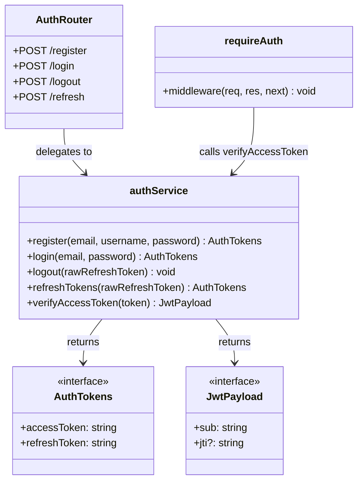

### 8. Code Generation

Implementation code is located in:
- `backend/src/services/auth.service.ts` — core business logic
- `backend/src/routes/auth.router.ts` — Express route handler
- `backend/src/middleware/auth.middleware.ts` — JWT verification middleware

---

## Module 2: Server (Community) Management

### 1. Features

| Capability | Description |
|---|---|
| Create server | Creates a new community with a name, optional description, icon, and public/private flag. Auto-generates a unique URL slug. Creates a default `#general` text channel. |
| List servers | Returns all servers for system admins; returns only member servers for regular users. |
| Get server | Retrieves a single server by its URL slug. |
| Update server | Owner/admin can update name, description, icon, and public status. Slug is regenerated on name change. |
| Delete server | Owner-only. Cascading delete of all channels, messages, and memberships. |
| List members | Returns all members of a server with their roles and user profiles. |

**What it does not do:** Does not handle invitations, server bans, server templates, or server discovery beyond the public listing.

### 2. Internal Architecture

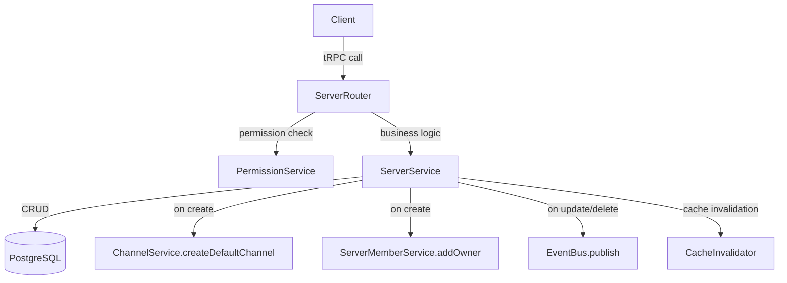

**Design justification:** Server creation is a multi-step operation (create server → create default channel → add owner as member) that runs in a Prisma transaction to maintain consistency. Slug generation uses a retry loop to handle collisions from concurrent creates. The `memberCount` field is denormalized on the Server model and atomically incremented/decremented to avoid expensive COUNT queries on the join table.

### 3. Data Abstraction

A **Server** represents a community workspace containing channels and members. Key invariants:
- Every server has exactly one owner (the creator).
- `slug` is unique and URL-safe, derived from `name`.
- `memberCount` is kept in sync with the `ServerMember` join table via `incrementMemberCount` / `decrementMemberCount`.

### 4. Stable Storage

```prisma
model Server {
  id          String   @id @default(uuid())
  name        String
  slug        String   @unique
  description String?
  iconUrl     String?
  isPublic    Boolean  @default(false)
  memberCount Int      @default(0)
  ownerId     String
  createdAt   DateTime @default(now())
  owner       User     @relation(fields: [ownerId], references: [id])
  channels    Channel[]
  members     ServerMember[]
}
```

### 5. External API

All endpoints require authentication via tRPC `authedProcedure` or `withPermission`.

| Procedure | Type | Input | Permission |
|---|---|---|---|
| `server.getServers` | query | `{ limit?: number }` | Authenticated |
| `server.getServer` | query | `{ slug: string }` | Authenticated |
| `server.createServer` | mutation | `{ name, description?, iconUrl?, isPublic? }` | Authenticated |
| `server.updateServer` | mutation | `{ id, name?, description?, iconUrl?, isPublic? }` | Authenticated (ownership verified internally) |
| `server.deleteServer` | mutation | `{ id }` | Authenticated (owner only) |
| `server.getMembers` | query | `{ serverId }` | `server:read` |

### 6. Class/Method/Field Declarations

```typescript

export const serverService = {
  getPublicServers(limit?: number): Promise<Server[]>;
  getAllServers(limit?: number): Promise<Server[]>;
  getMemberServers(userId: string, limit?: number): Promise<Server[]>;
  getServer(slug: string): Promise<Server | null>;
  createServer(input: {
    name: string; description?: string; iconUrl?: string;
    isPublic?: boolean; ownerId: string;
  }): Promise<Server>;
  updateServer(id: string, actorId: string, data: {
    name?: string; description?: string; iconUrl?: string; isPublic?: boolean;
  }): Promise<Server>;
  deleteServer(id: string, actorId: string): Promise<Server>;
  incrementMemberCount(id: string): Promise<Server>;
  decrementMemberCount(id: string): Promise<Server>;
  getMembers(serverId: string): Promise<ServerMemberWithUser[]>;
};

interface ServerMemberWithUser {
  userId: string; serverId: string; role: string; joinedAt: Date;
  user: { id: string; username: string; displayName: string; avatarUrl: string | null; status: string };
}

export const serverRouter: tRPC.Router;

const ROLE_RANK: Record<string, number>;
function generateSlug(name: string): string;
function generateUniqueSlug(name: string): Promise<string>;
function withSlugRetry(name: string, initialSlug: string, fn, maxRetries?): Promise<Server>;
```

### 7. Class Hierarchy Diagram

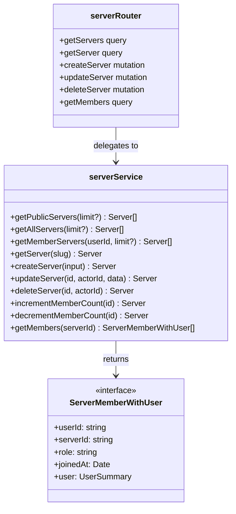

### 8. Code Generation

Implementation code is located in:
- `backend/src/services/server.service.ts`
- `backend/src/trpc/routers/server.router.ts`
- `backend/src/lib/admin.utils.ts` — system admin detection

---

## Module 3: Channel Management

### 1. Features

| Capability | Description |
|---|---|
| Create channel | Creates a TEXT, VOICE, or ANNOUNCEMENT channel within a server. Assigns a URL slug, optional topic, and position. Default visibility: PRIVATE. |
| List channels | Returns all channels in a server, ordered by position. |
| Get channel | Retrieves a single channel by server slug + channel slug. |
| Update channel | Modify name, topic, or position. |
| Delete channel | Hard delete with cascading removal of associated messages and audit log entries. |
| Set visibility | Changes channel visibility among `PUBLIC_INDEXABLE`, `PUBLIC_NO_INDEX`, and `PRIVATE`. Writes an audit log entry and publishes a `VISIBILITY_CHANGED` event. |
| Get visibility | Returns the current visibility of a channel. Served from Redis cache when available. |
| Default channel | Automatically creates a `#general` TEXT channel when a server is created. |

**What it does not do:** Does not handle channel permissions per-user (beyond server-level roles), channel categories/folders, or channel archiving.

### 2. Internal Architecture

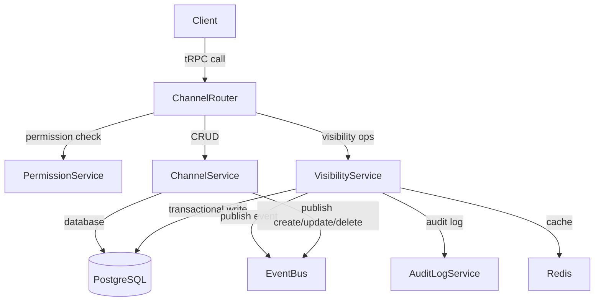

**Design justification:** Visibility changes are isolated into a dedicated `VisibilityService` because they involve a transactional write (update channel + insert audit log), cache invalidation, and event publication — a more complex lifecycle than standard CRUD. The `CacheService` stores visibility values in Redis (TTL 1 hour) since every public page load checks visibility.

### 3. Data Abstraction

A **Channel** belongs to exactly one Server. It has a type (TEXT, VOICE, ANNOUNCEMENT), a visibility level controlling public access and search-engine indexing, and a position for ordering in the UI.

The **VisibilityChangeResult** value object captures the outcome of a visibility transition for the caller and for the audit trail.

### 4. Stable Storage

```prisma
model Channel {
  id         String            @id @default(uuid())
  serverId   String
  name       String
  slug       String
  type       ChannelType       @default(TEXT)
  visibility ChannelVisibility @default(PRIVATE)
  topic      String?
  position   Int               @default(0)
  indexedAt   DateTime?
  createdAt  DateTime          @default(now())
  updatedAt  DateTime          @updatedAt
  server     Server            @relation(fields: [serverId], references: [id])
  messages   Message[]
  auditLog   VisibilityAuditLog[]
  @@unique([serverId, slug])
}

model VisibilityAuditLog {
  id        String   @id @default(uuid())
  channelId String
  actorId   String
  action    String
  oldValue  Json
  newValue  Json
  timestamp DateTime @default(now())
  ipAddress String
  userAgent String
  channel   Channel  @relation(fields: [channelId], references: [id])
  actor     User     @relation(fields: [actorId], references: [id])
}
```

Cache key: `harmony:channel:visibility:{channelId}` → Redis string, TTL 3600s.

### 5. External API

| Procedure | Type | Input | Permission |
|---|---|---|---|
| `channel.getChannels` | query | `{ serverId }` | `server:read` |
| `channel.getChannel` | query | `{ serverId, serverSlug, channelSlug }` | `channel:read` |
| `channel.createChannel` | mutation | `{ serverId, name, slug, type?, visibility?, topic?, position? }` | `channel:create` |
| `channel.updateChannel` | mutation | `{ serverId, channelId, name?, topic?, position? }` | `channel:update` |
| `channel.deleteChannel` | mutation | `{ serverId, channelId }` | `channel:delete` |
| `channel.setVisibility` | mutation | `{ serverId, channelId, visibility }` | `channel:manage_visibility` |
| `channel.getVisibility` | query | `{ serverId, channelId }` | `channel:read` |

### 6. Class/Method/Field Declarations

```typescript

export const channelService = {
  getChannels(serverId: string): Promise<Channel[]>;
  getChannelBySlug(serverSlug: string, channelSlug: string): Promise<Channel>;
  createChannel(input: CreateChannelInput): Promise<Channel>;
  updateChannel(channelId: string, serverId: string, patch: UpdateChannelInput): Promise<Channel>;
  deleteChannel(channelId: string, serverId: string): Promise<void>;
  createDefaultChannel(serverId: string): Promise<Channel>;
};

interface CreateChannelInput {
  serverId: string; name: string; slug: string;
  type: ChannelType; visibility: ChannelVisibility;
  topic?: string; position?: number;
}
interface UpdateChannelInput { name?: string; topic?: string; position?: number; }

export const visibilityService = {
  getVisibility(channelId: string, serverId: string): Promise<ChannelVisibility>;
  setVisibility(input: SetVisibilityInput): Promise<VisibilityChangeResult>;
};

interface SetVisibilityInput {
  channelId: string; serverId: string;
  visibility: ChannelVisibility; actorId: string;
  ip: string; userAgent?: string;
}
interface VisibilityChangeResult {
  success: boolean; channelId: string;
  oldVisibility: ChannelVisibility; newVisibility: ChannelVisibility;
  auditLogId: string;
}

export const auditLogService = {
  logVisibilityChange(input: LogVisibilityChangeInput, tx?: TransactionClient): Promise<VisibilityAuditLog>;
  getVisibilityAuditLog(channelId: string, options?: GetAuditLogOptions): Promise<AuditLogPage>;
};

export const channelRouter: tRPC.Router;
```

### 7. Class Hierarchy Diagram

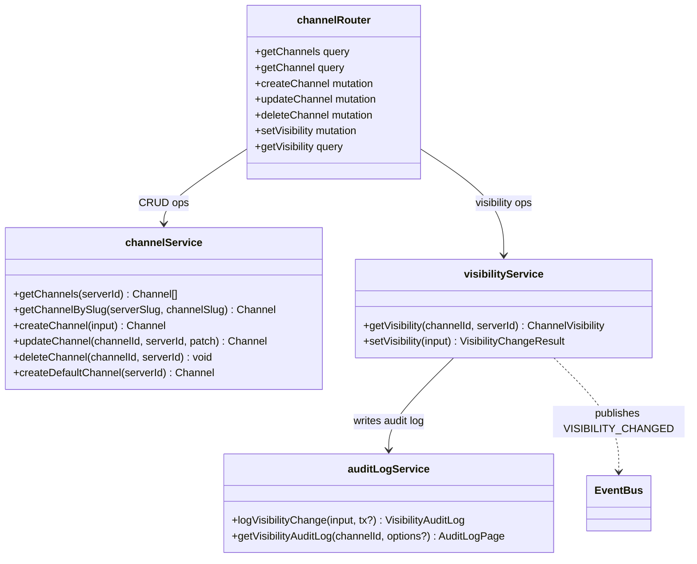

### 8. Code Generation

Implementation code is located in:
- `backend/src/services/channel.service.ts`
- `backend/src/services/visibility.service.ts`
- `backend/src/services/auditLog.service.ts`
- `backend/src/trpc/routers/channel.router.ts`

---

## Module 4: Message Management

### 1. Features

| Capability | Description |
|---|---|
| Send message | Creates a message in a channel with optional attachments (max 10, 4000 char content limit). Publishes `MESSAGE_CREATED` event. |
| Get messages | Cursor-based pagination (oldest first — ascending chronological order, max 100 per page). Returns messages with author and attachment data. |
| Edit message | Author can edit their own message content. Updates `editedAt` timestamp. Publishes `MESSAGE_EDITED` event. |
| Delete message | Soft-delete. Members can delete own messages; moderators+ can delete any. Publishes `MESSAGE_DELETED` event. |
| Pin / Unpin | Moderators+ can pin or unpin messages. Tracks `pinnedAt` timestamp. |
| List pinned | Returns all pinned messages in a channel. |
| Reply (threading) | Creates a reply linked to a parent message. Increments parent's `replyCount`. |
| Get thread | Cursor-based pagination of replies to a specific message. |

**What it does not do:** Does not support message search, rich embeds, or message scheduling. Emoji reactions are handled by the **Reaction** module.

### 2. Internal Architecture

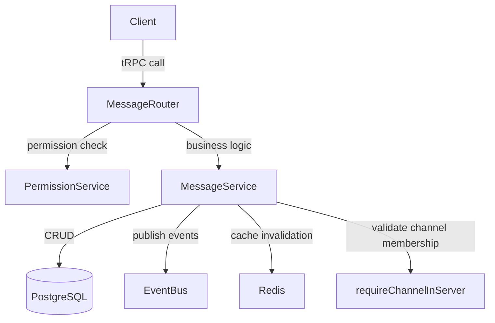

**Design justification:** Cursor-based pagination (using message ID as cursor) was chosen over offset-based pagination because it remains performant as message volume grows and avoids skipped/duplicate results from concurrent inserts. Soft-delete preserves message metadata for audit and threading integrity. The `replyCount` is denormalized to avoid COUNT queries and is guarded against going negative (floored at 0).

### 3. Data Abstraction

A **Message** belongs to a Channel and has an author (User). It may optionally be a reply to a parent Message, forming a thread. Messages are never physically deleted — the `isDeleted` flag marks them as removed while preserving the record for threading and audit purposes.

### 4. Stable Storage

```prisma
model Message {
  id              String    @id @default(uuid())
  channelId       String
  authorId        String
  content         String
  createdAt       DateTime  @default(now())
  editedAt        DateTime?
  isDeleted       Boolean   @default(false)
  pinned          Boolean   @default(false)
  pinnedAt        DateTime?
  parentMessageId String?
  replyCount      Int       @default(0)
  channel         Channel          @relation(fields: [channelId], references: [id])
  author          User             @relation(fields: [authorId], references: [id])
  attachments     Attachment[]
  reactions       MessageReaction[]
  parent          Message?         @relation("MessageReplies", fields: [parentMessageId], references: [id])
  replies         Message[]        @relation("MessageReplies")
}

model MessageReaction {
  id        String   @id @default(uuid())
  messageId String
  userId    String
  emoji     String
  createdAt DateTime @default(now())
  message   Message  @relation(fields: [messageId], references: [id], onDelete: Cascade)
  user      User     @relation(fields: [userId], references: [id], onDelete: Cascade)
  @@unique([messageId, userId, emoji])
}

model Attachment {
  id          String  @id @default(uuid())
  messageId   String
  filename    String
  url         String
  contentType String
  sizeBytes   BigInt
  message     Message @relation(fields: [messageId], references: [id])
}
```

### 5. External API

| Procedure | Type | Input | Permission |
|---|---|---|---|
| `message.getMessages` | query | `{ serverId, channelId, cursor?, limit? }` | `message:read` |
| `message.sendMessage` | mutation | `{ serverId, channelId, content, attachments? }` | `message:create` |
| `message.editMessage` | mutation | `{ serverId, messageId, content }` | `message:update_own` |
| `message.deleteMessage` | mutation | `{ serverId, messageId }` | `message:delete_own` |
| `message.pinMessage` | mutation | `{ serverId, messageId }` | `message:pin` |
| `message.unpinMessage` | mutation | `{ serverId, messageId }` | `message:pin` |
| `message.getPinnedMessages` | query | `{ serverId, channelId }` | `message:read` |
| `message.createReply` | mutation | `{ serverId, channelId, parentMessageId, content }` | `message:create` |
| `message.getThreadMessages` | query | `{ serverId, channelId, parentMessageId, cursor?, limit? }` | `message:read` |

### 6. Class/Method/Field Declarations

```typescript

export const messageService = {
  getMessages(input: GetMessagesInput): Promise<{ messages: Message[]; nextCursor: string | null; hasMore: boolean }>;
  sendMessage(input: SendMessageInput): Promise<Message>;
  editMessage(input: EditMessageInput): Promise<Message>;
  deleteMessage(input: DeleteMessageInput): Promise<void>;
  pinMessage(messageId: string, serverId: string): Promise<Message>;
  unpinMessage(messageId: string, serverId: string): Promise<Message>;
  getPinnedMessages(channelId: string, serverId: string): Promise<Message[]>;
  createReply(input: CreateReplyInput): Promise<Message>;
  getThreadMessages(input: GetThreadMessagesInput): Promise<{ replies: Message[]; nextCursor: string | null; hasMore: boolean }>;
};

interface GetMessagesInput { serverId: string; channelId: string; cursor?: string; limit?: number; }
interface SendMessageInput { serverId: string; channelId: string; authorId: string; content: string; attachments?: AttachmentInput[]; }
interface EditMessageInput { serverId: string; messageId: string; authorId: string; content: string; }
interface DeleteMessageInput { messageId: string; actorId: string; serverId: string; }
interface CreateReplyInput { parentMessageId: string; channelId: string; serverId: string; authorId: string; content: string; }
interface GetThreadMessagesInput { parentMessageId: string; channelId: string; serverId: string; cursor?: string; limit?: number; }

export const messageRouter: tRPC.Router;

const AUTHOR_SELECT: Prisma.UserSelect;
const ATTACHMENT_SELECT: Prisma.AttachmentSelect;
const MESSAGE_INCLUDE: Prisma.MessageInclude;
function msgCacheKey(serverId, channelId, cursor?, limit?): string;
function requireChannelInServer(channelId, serverId): Promise<Channel>;
function requireMessageInServer(messageId, serverId): Promise<Message>;
```

### 7. Class Hierarchy Diagram

```mermaid
classDiagram
    class messageService {
        +getMessages(input) PaginatedMessages
  …3979 tokens truncated…PC call| AttachmentTRPCRouter
    AttachmentTRPCRouter -->|permission check| PermissionService
    AttachmentTRPCRouter -->|query| Prisma[(PostgreSQL)]
```

**Design justification:** File upload uses a REST endpoint (not tRPC) because multipart form data does not fit naturally into tRPC's JSON-RPC paradigm. The storage provider abstraction allows switching between local disk (for development) and S3 (for production) without changing the upload logic. Magic-byte validation prevents clients from uploading executable files disguised with image MIME types.

### 3. Data Abstraction

An **Attachment** is a file associated with a Message. It stores metadata (filename, URL, content type, size) in PostgreSQL while the actual file bytes live in external storage (local disk or S3). The `sizeBytes` field uses BigInt to accommodate files up to 25 MB without integer overflow concerns in JavaScript.

### 4. Stable Storage

```prisma
model Attachment {
  id          String  @id @default(uuid())
  messageId   String
  filename    String
  url         String
  contentType String
  sizeBytes   BigInt
  message     Message @relation(fields: [messageId], references: [id])
}
```

File storage: local filesystem (`uploads/` directory in dev) or S3 bucket (production).

### 5. External API

**REST endpoints:**

| Method | Endpoint | Auth | Description |
|---|---|---|---|
| POST | `/api/attachments/upload` | Required | Upload file (multipart, max 25 MB) |
| GET | `/api/attachments/files/:filename` | None | Serve local files (dev only) |

**tRPC endpoint:**

| Procedure | Type | Input | Permission |
|---|---|---|---|
| `attachment.listByMessage` | query | `{ serverId, messageId }` | `message:read` |

### 6. Class/Method/Field Declarations

```typescript

export const MAX_FILE_SIZE_BYTES: number; // 25 * 1024 * 1024
export const ALLOWED_CONTENT_TYPES: Set<string>;

export class AttachmentValidationError extends Error {
  constructor(message: string);
}

export class AttachmentNotFoundError extends Error {
  constructor(message?: string);
}

export const attachmentService = {
  validateUpload(contentType: string, sizeBytes: number): void;
  listByMessage(messageId: string, serverId: string): Promise<Attachment[]>;
};

export const attachmentRouter: Router;       // Express REST router
export const attachmentTRPCRouter: tRPC.Router;  // tRPC metadata router
```

### 7. Class Hierarchy Diagram

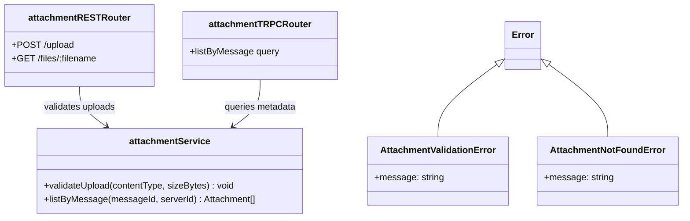

### 8. Code Generation

Implementation code is located in:
- `backend/src/services/attachment.service.ts`
- `backend/src/routes/attachment.router.ts` — REST upload/serve
- `backend/src/trpc/routers/attachment.router.ts` — tRPC metadata queries
- `backend/src/lib/storage/` — storage provider abstraction

---

## Module 9: Public API & SEO

### 1. Features

| Capability | Description |
|---|---|
| Public server listing | Returns top 20 public servers ordered by member count. No auth required. |
| Public server detail | Returns a public server's metadata by slug. |
| Public channel listing | Returns public channels for a server. |
| Public channel detail | Returns a public channel's metadata. |
| Public messages | Paginated messages from `PUBLIC_INDEXABLE` channels only (50/page). |
| Single message | Returns a single message from a `PUBLIC_INDEXABLE` channel. |
| robots.txt | Allows crawling of `/c/` routes; disallows `/api/`, `/trpc/`. |
| Dynamic sitemap | Generates per-server XML sitemaps of `PUBLIC_INDEXABLE` channels. |
| Caching | Stale-while-revalidate pattern. Adds `Cache-Control` and `X-Cache` headers. |
| Rate limiting | 100 req/min for humans; 1000 req/min for verified bots. |

**What it does not do:** Does not handle OpenGraph meta-tag generation (that is done by the frontend SSR layer), full-text search, or API key management for third-party consumers.

### 2. Internal Architecture

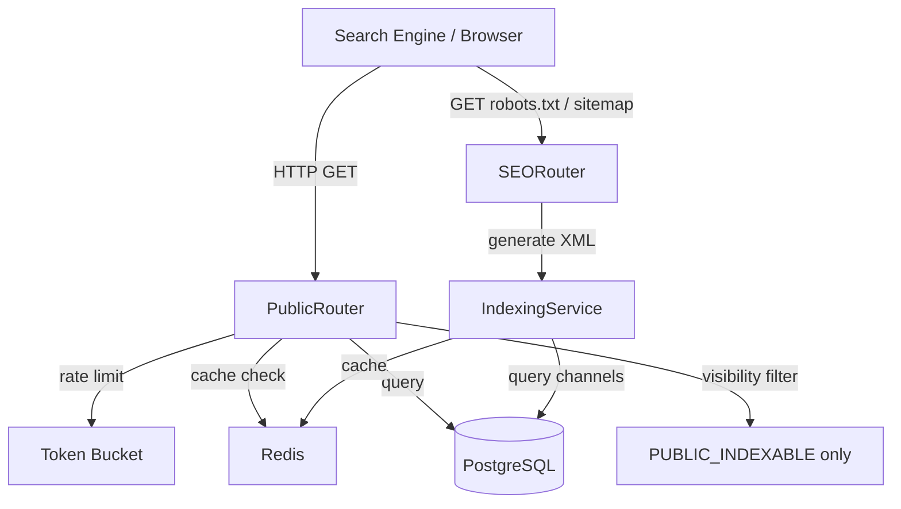

**Design justification:** The public API is completely separate from the tRPC layer because crawlers and external consumers require plain HTTP with standard caching headers. The stale-while-revalidate pattern ensures fast responses for frequently-accessed public pages while keeping data fresh in the background. Per-server sitemaps keep XML file sizes manageable and allow incremental re-crawling.

### 3. Data Abstraction

The public API exposes read-only views of Servers, Channels, and Messages. It applies a strict visibility filter: only channels with `visibility = PUBLIC_INDEXABLE` expose their messages. The `CacheEntry<T>` wrapper stores a `createdAt` timestamp alongside cached data for TTL and staleness checks.

### 4. Stable Storage

This module reads from the same PostgreSQL tables as the authenticated modules (Server, Channel, Message). It uses Redis for caching:

- `channel:{channelId}:visibility` — channel visibility (TTL 3600s)
- `channel:msgs:{channelId}:page:{page}` — paginated messages (TTL 60s)
- `server:{serverId}:info` — server metadata (TTL 300s)
- Sitemap cache: `sitemap:{serverSlug}` (TTL 300s)

### 5. External API

| Method | Endpoint | Description |
|---|---|---|
| GET | `/api/public/servers` | List public servers (top 20) |
| GET | `/api/public/servers/:serverSlug` | Public server info |
| GET | `/api/public/servers/:serverSlug/channels` | Public channels |
| GET | `/api/public/servers/:serverSlug/channels/:channelSlug` | Public channel info |
| GET | `/api/public/channels/:channelId/messages` | Paginated messages (PUBLIC_INDEXABLE only) |
| GET | `/api/public/channels/:channelId/messages/:messageId` | Single message |
| GET | `/robots.txt` | Crawler directives |
| GET | `/sitemap/:serverSlug.xml` | Dynamic XML sitemap |

### 6. Class/Method/Field Declarations

```typescript

export const publicRouter: Router;   // Express
export const seoRouter: Router;      // Express

export const indexingService = {
  addToSitemap(channelId: string): Promise<void>;
  removeFromSitemap(channelId: string): Promise<void>;
  generateSitemap(serverSlug: string): Promise<string | null>;
  onVisibilityChanged(payload: { channelId; oldVisibility; newVisibility }): Promise<void>;
};

export const CacheKeys_Sitemap = {
  serverSitemap(serverSlug: string): string;
};

export const cacheService = {
  get<T>(key: string): Promise<CacheEntry<T> | null>;
  set<T>(key: string, data: T, options: CacheOptions): Promise<void>;
  invalidate(key: string): Promise<void>;
  invalidatePattern(pattern: string): Promise<void>;
  isStale<T>(entry: CacheEntry<T>, ttlSeconds: number): boolean;
  getOrRevalidate<T>(key: string, fetcher: () => Promise<T>, options: CacheOptions): Promise<T>;
  revalidate<T>(key: string, fetcher: () => Promise<T>, options: CacheOptions): void;
};

export interface CacheEntry<T> { data: T; createdAt: number; }
export interface CacheOptions { ttl: number; staleTtl?: number; }

export const CacheKeys: { channelVisibility; channelMessages; serverInfo; metaChannel; analysisChannel; };
export const CacheTTL: { channelVisibility: 3600; channelMessages: 60; serverInfo: 300; };

export function sanitizeKeySegment(segment: string): string;

function buildSitemapXml(serverSlug, channels): string;
function escapeXml(str: string): string;
const SITEMAP_CACHE_TTL: 300;
const BASE_URL: string;
```

### 7. Class Hierarchy Diagram

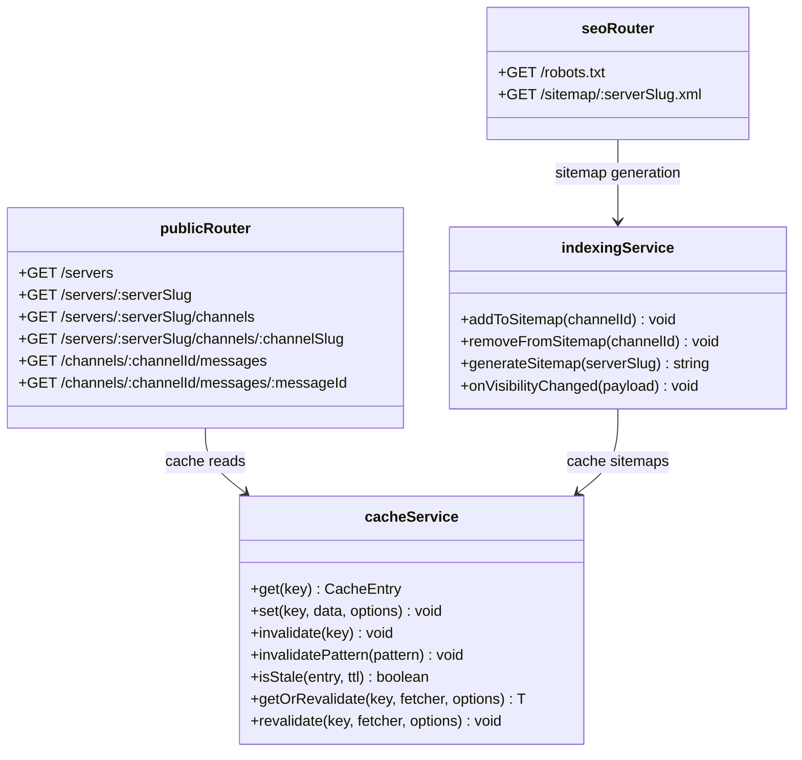

### 8. Code Generation

Implementation code is located in:
- `backend/src/routes/public.router.ts`
- `backend/src/routes/seo.router.ts`
- `backend/src/services/indexing.service.ts`
- `backend/src/services/cache.service.ts`
- `backend/src/services/cacheInvalidator.service.ts`

---

## Module 10: Real-Time Events (SSE)

### 1. Features

| Capability | Description |
|---|---|
| Channel event stream | SSE endpoint delivering `message:created`, `message:edited`, `message:deleted`, and `server:updated` events for a specific channel. |
| Server event stream | SSE endpoint delivering `channel:created`, `channel:updated`, and `channel:deleted` events for a server's channel list. |
| Authentication | Uses query-parameter token (required by the `EventSource` browser API which does not support custom headers). |
| Heartbeat | Sends a keepalive comment every 30 seconds to prevent proxy/load-balancer timeouts. |
| Auto-cleanup | Unsubscribes from the EventBus and cleans up resources when the client disconnects. |

**What it does not do:** Does not support bidirectional communication (use tRPC mutations for client→server). Does not handle WebSocket upgrades or Socket.IO.

### 2. Internal Architecture

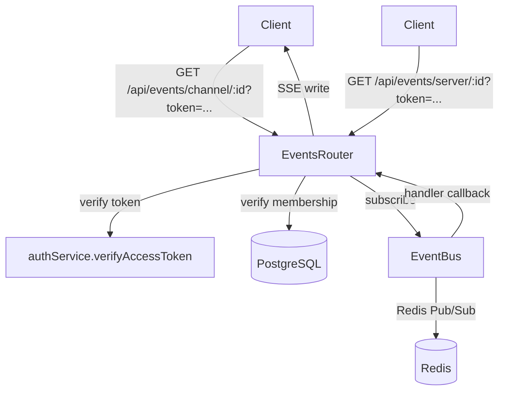

**Design justification:** SSE was chosen over WebSockets because it uses standard HTTP, works through proxies and CDNs without upgrade negotiation, and is natively supported by the browser `EventSource` API. The unidirectional server→client model fits the chat use case (clients send messages via tRPC mutations; they receive updates via SSE). Redis Pub/Sub enables horizontal scaling — multiple server instances can publish and subscribe to the same event channels.

### 3. Data Abstraction

The **EventBus** is an in-process pub/sub abstraction backed by Redis Pub/Sub. It defines a typed channel→payload mapping (`EventPayloadMap`) so that publishers and subscribers are type-safe.

Event channels follow the naming convention `harmony:{EVENT_TYPE}` (e.g., `harmony:MESSAGE_CREATED`).

Each event payload includes a `timestamp` ISO string and the IDs needed to route the event to the correct SSE stream.

### 4. Stable Storage

This module does not persist data. Events are ephemeral — they are published to Redis Pub/Sub and delivered to connected SSE clients. If no client is listening, events are dropped. Message persistence is handled by the Message module.

Redis Pub/Sub channels used:
- `harmony:MESSAGE_CREATED`
- `harmony:MESSAGE_EDITED`
- `harmony:MESSAGE_DELETED`
- `harmony:SERVER_UPDATED`
- `harmony:CHANNEL_CREATED`
- `harmony:CHANNEL_UPDATED`
- `harmony:CHANNEL_DELETED`
- `harmony:MEMBER_JOINED`
- `harmony:MEMBER_LEFT`
- `harmony:USER_JOINED_VOICE`
- `harmony:USER_LEFT_VOICE`
- `harmony:VOICE_STATE_CHANGED`
- `harmony:VISIBILITY_CHANGED`
- `harmony:META_TAGS_UPDATED`

### 5. External API

| Method | Endpoint | Auth | Response |
|---|---|---|---|
| GET | `/api/events/channel/:channelId?token=<accessToken>` | Query param JWT | SSE stream: `message:created`, `message:edited`, `message:deleted`, `server:updated` |
| GET | `/api/events/server/:serverId?token=<accessToken>` | Query param JWT | SSE stream: `channel:created`, `channel:updated`, `channel:deleted` |

SSE format:
```
event: message:created
data: {"messageId":"...","channelId":"...","authorId":"...","timestamp":"..."}

: heartbeat
```

### 6. Class/Method/Field Declarations

```typescript

export const eventsRouter: Router;

export const eventBus = {
  publish<C extends EventChannelName>(channel: C, payload: EventPayloadMap[C]): Promise<void>;
  subscribe<C extends EventChannelName>(
    channel: C,
    handler: EventHandler<C>
  ): { unsubscribe: () => void; ready: Promise<void> };
  disconnect(): Promise<void>;
};

export const EventChannels: Record<string, EventChannelName>;
export type EventChannelName = string;
export type EventHandler<C> = (payload: EventPayloadMap[C]) => void;

export interface MessageCreatedPayload { messageId; channelId; authorId; timestamp; }
export interface MessageEditedPayload { messageId; channelId; timestamp; }
export interface MessageDeletedPayload { messageId; channelId; timestamp; }
export interface ChannelCreatedPayload { channelId; serverId; timestamp; }
export interface ChannelUpdatedPayload { channelId; serverId; timestamp; }
export interface ChannelDeletedPayload { channelId; serverId; timestamp; }
export interface ServerUpdatedPayload { serverId; name?; iconUrl?; description?; timestamp; }
export interface VisibilityChangedPayload { channelId; serverId; oldVisibility; newVisibility; actorId; timestamp; }
export interface MemberJoinedPayload { userId; serverId; role; timestamp; }
export interface MemberLeftPayload { userId; serverId; reason; timestamp; }
export interface UserJoinedVoicePayload { userId; channelId; timestamp; }
export interface UserLeftVoicePayload { userId; channelId; timestamp; }
export interface VoiceStateChangedPayload { userId; channelId; muted; deafened; timestamp; }

let subscriberClient: Redis | null;
const channelHandlerCounts: Map<string, number>;
const channelReadyPromises: Map<string, Promise<void>>;
function getSubscriberClient(): Redis;

const UUID_RE: RegExp;
function isValidUUID(id: string): boolean;
function sendEvent(res: Response, eventType: string, data: unknown): void;
const MESSAGE_SSE_INCLUDE: Prisma.MessageInclude;
const CHANNEL_SSE_SELECT: Prisma.ChannelSelect;
```

### 7. Class Hierarchy Diagram

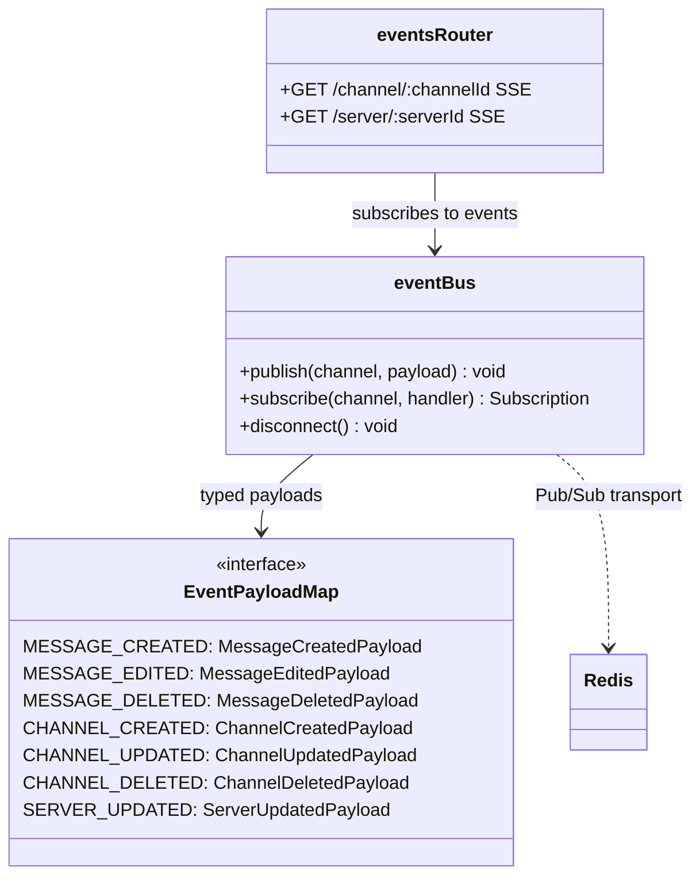

### 8. Code Generation

Implementation code is located in:
- `backend/src/routes/events.router.ts`
- `backend/src/events/eventBus.ts`
- `backend/src/events/eventTypes.ts`

---

## Module 11: Permission System

### 1. Features

| Capability | Description |
|---|---|
| Role-based permissions | Maps each RoleType to a set of allowed actions. Higher roles inherit all permissions of lower roles. |
| Permission check | Given a userId, serverId, and action, returns whether the user is authorized. |
| Permission enforcement | `requirePermission` throws a tRPC FORBIDDEN error if the user lacks the required action. |
| System admin override | System admins (identified by email `admin@harmony.dev`) bypass all permission checks. |

**What it does not do:** Does not handle per-channel permissions, custom roles, or permission overrides.

### 2. Internal Architecture

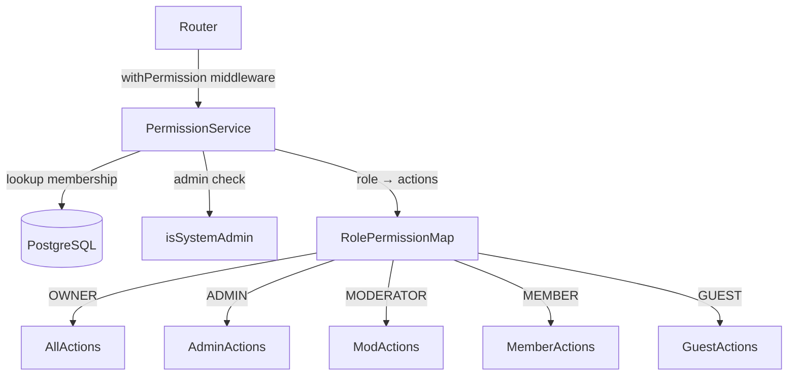

**Design justification:** A static role→permission mapping is simpler and more auditable than a dynamic ACL system. The five-tier hierarchy covers the Discord-like use case without the complexity of custom roles. The `withPermission` tRPC middleware composition keeps permission checks declarative at the router level.

### 3. Data Abstraction

**Actions** are string literals grouped by domain:
- Server: `server:read`, `server:update`, `server:delete`, `server:manage_members`
- Channel: `channel:read`, `channel:create`, `channel:update`, `channel:delete`, `channel:manage_visibility`
- Message: `message:read`, `message:create`, `message:update_own`, `message:delete_own`, `message:delete_any`, `message:pin`, `message:react`
- Settings: `settings:read`, `settings:update`

Each role has a static `Set<Action>` that defines what it can do.

### 4. Stable Storage

The permission module reads from the `ServerMember` table to determine a user's role in a server. It does not have its own schema — role data is stored in the ServerMember model (see Module 6).

### 5. External API

This module has no direct external API. It is consumed internally by tRPC router middleware (`withPermission`) and by other services.

### 6. Class/Method/Field Declarations

```typescript

export type ServerAction = 'server:read' | 'server:update' | 'server:delete' | 'server:manage_members';
export type ChannelAction = 'channel:read' | 'channel:create' | 'channel:update' | 'channel:delete' | 'channel:manage_visibility';
export type MessageAction = 'message:read' | 'message:create' | 'message:update_own' | 'message:delete_own' | 'message:delete_any' | 'message:pin' | 'message:react';
export type SettingsAction = 'settings:read' | 'settings:update';
export type Action = ServerAction | ChannelAction | MessageAction | SettingsAction;

export const permissionService = {
  getMemberRole(userId: string, serverId: string): Promise<RoleType | null>;
  checkPermission(userId: string, serverId: string, action: Action): Promise<boolean>;
  requirePermission(userId: string, serverId: string, action: Action): Promise<void>;
};

const GUEST_PERMISSIONS: Set<Action>;
const MEMBER_PERMISSIONS: Set<Action>;
const MODERATOR_PERMISSIONS: Set<Action>;
const ADMIN_PERMISSIONS: Set<Action>;
const OWNER_PERMISSIONS: Set<Action>;
const ROLE_PERMISSIONS: Record<RoleType, Set<Action>>;
```

### 7. Class Hierarchy Diagram

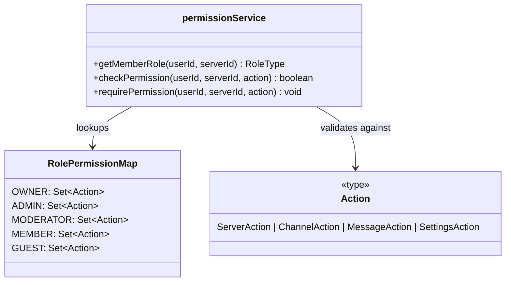

### 8. Code Generation

Implementation code is located in:
- `backend/src/services/permission.service.ts`
- `backend/src/lib/admin.utils.ts`

---

## Module 12: Message Reactions

### 1. Features

| Capability | Description |
|---|---|
| Add reaction | A member adds an emoji reaction to a message. Unique per `(messageId, userId, emoji)` — duplicate throws CONFLICT. Publishes `REACTION_ADDED` event. |
| Remove reaction | The reaction owner removes their emoji reaction. Throws FORBIDDEN if the emoji exists but belongs to another user; NOT_FOUND if no such emoji exists. Publishes `REACTION_REMOVED` event. |
| Get reactions | Returns all reactions for a message grouped by emoji: `{ emoji, count, userIds[] }[]`. |

**What it does not do:** Does not support animated emoji or custom server emoji. Does not cap the number of distinct emoji per message.

### 2. Internal Architecture

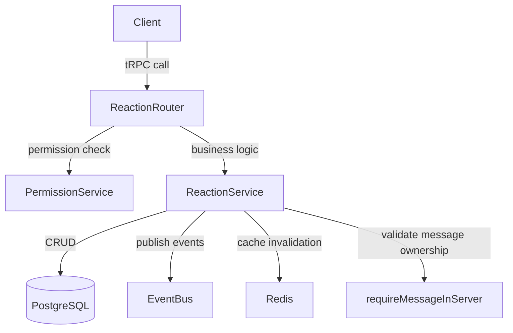

**Design justification:** The unique constraint `(messageId, userId, emoji)` is enforced at the database level so concurrent add attempts are safe without application-level locking. The FORBIDDEN vs NOT_FOUND distinction in `removeReaction` gives the caller meaningful feedback without requiring a separate "does this reaction exist?" query in the common path.

### 3. Data Abstraction

A **MessageReaction** records that a user placed a specific emoji on a message. Multiple users may react with the same emoji (each creating a separate row), but a given user may not react with the same emoji twice on the same message.

### 4. Stable Storage

```prisma
model MessageReaction {
  id        String   @id @default(uuid())
  messageId String
  userId    String
  emoji     String   @db.VarChar(100)
  createdAt DateTime @default(now())
  message   Message  @relation(fields: [messageId], references: [id], onDelete: Cascade)
  user      User     @relation(fields: [userId], references: [id], onDelete: Cascade)
  @@unique([messageId, userId, emoji])
  @@index([messageId])
  @@map("message_reactions")
}
```

### 5. External API

| Procedure | Type | Input | Permission |
|---|---|---|---|
| `reaction.addReaction` | mutation | `{ serverId, channelId, messageId, emoji }` | `message:react` |
| `reaction.removeReaction` | mutation | `{ serverId, channelId, messageId, emoji }` | `message:react` |
| `reaction.getReactions` | query | `{ serverId, channelId, messageId }` | `message:read` |

### 6. Class/Method/Field Declarations

```typescript

export interface ReactionGroup {
  emoji: string;
  count: number;
  userIds: string[];
}

export const reactionService = {
  addReaction(input: AddReactionInput): Promise<MessageReaction>;
  removeReaction(input: RemoveReactionInput): Promise<void>;
  getMessageReactions(input: GetMessageReactionsInput): Promise<ReactionGroup[]>;
};
```

### 7. Code Generation

Implementation code is located in:
- `harmony-backend/src/services/reaction.service.ts`
- `harmony-backend/src/trpc/routers/reaction.router.ts`
````

#### Tool: exec_command

```sh
rtk read harmony-backend/package.json
```

Output:

```text
{
  "name": "harmony-backend",
  "version": "0.1.0",
  "private": true,
  "scripts": {
    "dev": "tsx watch src/index.ts",
    "build": "tsc",
    "start": "node dist/index.js",
    "lint": "eslint src tests",
    "test": "jest",
    "db:seed:mock": "prisma db seed",
    "db:seed:demo": "tsx src/dev/demoSeed.ts"
  },
  "prisma": {
    "seed": "tsx prisma/seed.ts"
  },
  "dependencies": {
    "@prisma/client": "^5.22.0",
    "@trpc/server": "^11.0.0",
    "bcryptjs": "^3.0.3",
    "cors": "^2.8.5",
    "express": "^4.21.2",
    "express-rate-limit": "^8.3.0",
    "file-type": "^21.3.2",
    "helmet": "^8.1.0",
    "ioredis": "^5.10.0",
    "jsonwebtoken": "^9.0.3",
    "multer": "^2.1.1",
    "serverless-http": "^3.2.0",
    "twilio": "^5.13.0",
    "zod": "^3.24.2"
  },
  "devDependencies": {
    "@types/bcryptjs": "^2.4.6",
    "@types/cors": "^2.8.17",
    "@types/express": "^4.17.21",
    "@types/ioredis": "^4.28.10",
    "@types/jest": "^29.5.14",
    "@types/jsonwebtoken": "^9.0.10",
    "@types/multer": "^2.1.0",
    "@types/node": "^20.17.19",
    "@types/supertest": "^6.0.2",
    "@typescript-eslint/eslint-plugin": "^8.26.0",
    "@typescript-eslint/parser": "^8.26.0",
    "dotenv": "^17.3.1",
    "eslint": "^9.22.0",
    "eslint-config-prettier": "^10.1.1",
    "jest": "^29.7.0",
    "prettier": "^3.5.3",
    "prisma": "^5.22.0",
    "supertest": "^7.0.0",
    "ts-jest": "^29.2.6",
    "tsx": "^4.19.3",
    "typescript": "^5.8.2"
  },
  "engines": {
    "node": ">=20"
  }
}
```

#### 🤖 gpt-5.4 (high)

- Time: 2026-04-01T00:40:31.863Z

I’ve narrowed the likely review surface to whether these tests enforce the architecture guarantees, not just the current implementation. I’m pulling the PR branch file with line numbers so I can anchor any findings precisely.

#### Tool: exec_command

```sh
rtk git fetch origin pull/277/head:codex/pr-277-review
```

Output:

```text
ok fetched (1 new refs)
```

#### Tool: exec_command

```sh
rtk grep -n "transaction|create server" docs/p4-backend-modules.md harmony-backend/src/services/server.service.ts harmony-backend/tests/server.test.ts
```

Output:

```text
🔍 3 in 1F:

📄 docs/p4-backend-modules.md (3):
   219: **Design justification:** Server creation is a multi-step operation (create s...
   372: VisibilityService -->|transactional write| Prisma
   379: **Design justification:** Visibility changes are isolated into a dedicated `V...
```

#### Tool: exec_command

```sh
rtk git show codex/pr-277-review:harmony-backend/tests/server.service.test.ts | nl -ba | sed -n '280,430p'
```

Output:

```text
   280	describe('serverService.getServer', () => {
   281	  it('returns the matching server for a known slug', async () => {
   282	    const server = makeServer();
   283	    mockServer.findUnique.mockResolvedValue(server);
   284	    const result = await serverService.getServer('test-server');
   285	    expect(result).toEqual(server);
   286	    expect(mockServer.findUnique).toHaveBeenCalledWith({ where: { slug: 'test-server' } });
   287	  });
   288	
   289	  it('returns null for an unknown slug', async () => {
   290	    mockServer.findUnique.mockResolvedValue(null);
   291	    expect(await serverService.getServer('nonexistent')).toBeNull();
   292	  });
   293	});
   294	
   295	// ═══════════════════════════════════════════════════════════════════════════════
   296	// createServer
   297	// ═══════════════════════════════════════════════════════════════════════════════
   298	
   299	describe('serverService.createServer', () => {
   300	  it('creates server with all optional fields and calls createDefaultChannel then addOwner', async () => {
   301	    const created = makeServer({ id: 'new-id', name: 'New Server', slug: 'new-server' });
   302	    mockServer.count.mockResolvedValue(0);
   303	    mockServer.create.mockResolvedValue(created);
   304	
   305	    const result = await serverService.createServer({
   306	      name: 'New Server',
   307	      description: 'desc',
   308	      iconUrl: 'https://img',
   309	      isPublic: true,
   310	      ownerId: 'owner-1',
   311	    });
   312	
   313	    expect(result).toEqual(created);
   314	    expect(channelService.createDefaultChannel).toHaveBeenCalledWith('new-id');
   315	    expect(serverMemberService.addOwner).toHaveBeenCalledWith('owner-1', 'new-id');
   316	    // createDefaultChannel must be called before addOwner
   317	    const createOrder = (channelService.createDefaultChannel as jest.Mock).mock.invocationCallOrder[0];
   318	    const ownerOrder = (serverMemberService.addOwner as jest.Mock).mock.invocationCallOrder[0];
   319	    expect(createOrder).toBeLessThan(ownerOrder);
   320	  });
   321	
   322	  it('creates server with only required fields', async () => {
   323	    const created = makeServer({ id: 'min-id', name: 'Minimal', slug: 'minimal' });
   324	    mockServer.count.mockResolvedValue(0);
   325	    mockServer.create.mockResolvedValue(created);
   326	
   327	    const result = await serverService.createServer({ name: 'Minimal', ownerId: 'owner-1' });
   328	    expect(result).toEqual(created);
   329	    expect(channelService.createDefaultChannel).toHaveBeenCalledWith('min-id');
   330	    expect(serverMemberService.addOwner).toHaveBeenCalledWith('owner-1', 'min-id');
   331	  });
   332	
   333	  it('throws BAD_REQUEST when name produces an empty slug', async () => {
   334	    await expect(serverService.createServer({ name: '!!!', ownerId: 'owner-1' }))
   335	      .rejects.toMatchObject({ code: 'BAD_REQUEST', message: 'Cannot generate slug from name' });
   336	    expect(mockServer.create).not.toHaveBeenCalled();
   337	  });
   338	
   339	  it('throws CONFLICT when all 10 generateUniqueSlug candidates are occupied', async () => {
   340	    // count always non-zero → base, base-1 … base-9 all taken
   341	    mockServer.count.mockResolvedValue(1);
   342	    await expect(serverService.createServer({ name: 'New Server', ownerId: 'owner-1' }))
   343	      .rejects.toMatchObject({ code: 'CONFLICT', message: 'Unable to generate a unique slug' });
   344	    expect(mockServer.create).not.toHaveBeenCalled();
   345	  });
   346	
   347	  it('retries once on a transient P2002 and returns the server on the second attempt', async () => {
   348	    const created = makeServer({ id: 'retry-id' });
   349	    mockServer.count.mockResolvedValue(0);
   350	    mockServer.create
   351	      .mockRejectedValueOnce(p2002())
   352	      .mockResolvedValueOnce(created);
   353	
   354	    const result = await serverService.createServer({ name: 'New Server', ownerId: 'owner-1' });
   355	    expect(result).toEqual(created);
   356	    expect(mockServer.create).toHaveBeenCalledTimes(2);
   357	  });
   358	
   359	  it('rethrows the raw P2002 (not TRPCError) when withSlugRetry exhausts all 3 attempts', async () => {
   360	    const error = p2002();
   361	    mockServer.count.mockResolvedValue(0);
   362	    mockServer.create.mockRejectedValue(error);
   363	
   364	    await expect(serverService.createServer({ name: 'New Server', ownerId: 'owner-1' }))
   365	      .rejects.toBeInstanceOf(Prisma.PrismaClientKnownRequestError);
   366	    await expect(serverService.createServer({ name: 'New Server', ownerId: 'owner-1' }))
   367	      .rejects.not.toBeInstanceOf(TRPCError);
   368	  });
   369	
   370	  it('rethrows a non-P2002 Prisma error immediately on the first attempt without retry', async () => {
   371	    const error = prismaErr('P2000');
   372	    mockServer.count.mockResolvedValue(0);
   373	    mockServer.create.mockRejectedValue(error);
   374	
   375	    await expect(serverService.createServer({ name: 'New Server', ownerId: 'owner-1' }))
   376	      .rejects.toBeInstanceOf(Prisma.PrismaClientKnownRequestError);
   377	    expect(mockServer.create).toHaveBeenCalledTimes(1);
   378	  });
   379	
   380	  it('propagates a createDefaultChannel rejection without swallowing it', async () => {
   381	    const created = makeServer({ id: 'new-id' });
   382	    mockServer.count.mockResolvedValue(0);
   383	    mockServer.create.mockResolvedValue(created);
   384	    const channelError = new Error('channel creation failed');
   385	    (channelService.createDefaultChannel as jest.Mock).mockRejectedValue(channelError);
   386	
   387	    await expect(serverService.createServer({ name: 'New Server', ownerId: 'owner-1' }))
   388	      .rejects.toThrow('channel creation failed');
   389	  });
   390	
   391	  it('propagates an addOwner rejection without swallowing it', async () => {
   392	    const created = makeServer({ id: 'new-id' });
   393	    mockServer.count.mockResolvedValue(0);
   394	    mockServer.create.mockResolvedValue(created);
   395	    const ownerError = new Error('addOwner failed');
   396	    (serverMemberService.addOwner as jest.Mock).mockRejectedValue(ownerError);
   397	
   398	    await expect(serverService.createServer({ name: 'New Server', ownerId: 'owner-1' }))
   399	      .rejects.toThrow('addOwner failed');
   400	  });
   401	});
   402	
   403	// ═══════════════════════════════════════════════════════════════════════════════
   404	// updateServer
   405	// ═══════════════════════════════════════════════════════════════════════════════
   406	
   407	describe('serverService.updateServer', () => {
   408	  const existing = makeServer({ id: 'srv-1', name: 'Old Name', slug: 'old-name', ownerId: 'owner-1' });
   409	
   410	  beforeEach(() => {
   411	    mockServer.findUnique.mockResolvedValue(existing);
   412	    mockServer.update.mockResolvedValue({ ...existing });
   413	    mockServer.count.mockResolvedValue(0);
   414	  });
   415	
   416	  it('throws NOT_FOUND when the server does not exist', async () => {
   417	    mockServer.findUnique.mockResolvedValue(null);
   418	    await expect(serverService.updateServer('srv-1', 'owner-1', {}))
   419	      .rejects.toMatchObject({ code: 'NOT_FOUND', message: 'Server not found' });
   420	  });
   421	
   422	  it('throws FORBIDDEN when actor is not owner and not a system admin', async () => {
   423	    (isSystemAdmin as jest.Mock).mockResolvedValue(false);
   424	    await expect(serverService.updateServer('srv-1', 'other-user', {}))
   425	      .rejects.toMatchObject({ code: 'FORBIDDEN', message: 'Only the server owner can update' });
   426	  });
   427	
   428	  it('allows the owner to update without renaming and does not call server.count', async () => {
   429	    const updated = { ...existing, description: 'new desc' };
   430	    mockServer.update.mockResolvedValue(updated);
```

#### Tool: exec_command

```sh
rtk git show codex/pr-277-review:harmony-backend/tests/server.service.test.ts | nl -ba | sed -n '430,560p'
```

Output:

```text
   430	    mockServer.update.mockResolvedValue(updated);
   431	
   432	    const result = await serverService.updateServer('srv-1', 'owner-1', { description: 'new desc' });
   433	    expect(result).toEqual(updated);
   434	    expect(mockServer.count).not.toHaveBeenCalled();
   435	  });
   436	
   437	  it('allows the owner to rename, regenerates slug, and returns updated record', async () => {
   438	    const updated = { ...existing, name: 'New Name', slug: 'new-name' };
   439	    mockServer.update.mockResolvedValue(updated);
   440	
   441	    const result = await serverService.updateServer('srv-1', 'owner-1', { name: 'New Name' });
   442	    expect(result.name).toBe('New Name');
   443	    expect(mockServer.count).toHaveBeenCalled(); // generateUniqueSlug probes DB
   444	  });
   445	
   446	  it('skips slug regeneration when the name is identical to the current name', async () => {
   447	    await serverService.updateServer('srv-1', 'owner-1', { name: 'Old Name' });
   448	    expect(mockServer.count).not.toHaveBeenCalled();
   449	  });
   450	
   451	  it('allows a system admin who is not the owner to update the server', async () => {
   452	    (isSystemAdmin as jest.Mock).mockResolvedValue(true);
   453	    const updated = { ...existing, description: 'admin update' };
   454	    mockServer.update.mockResolvedValue(updated);
   455	
   456	    const result = await serverService.updateServer('srv-1', 'admin-user', { description: 'admin update' });
   457	    expect(result).toEqual(updated);
   458	  });
   459	
   460	  it('publishes SERVER_UPDATED with the correct payload fields after every successful update', async () => {
   461	    await serverService.updateServer('srv-1', 'owner-1', {});
   462	
   463	    expect(eventBus.publish).toHaveBeenCalledWith(
   464	      EventChannels.SERVER_UPDATED,
   465	      expect.objectContaining({
   466	        serverId: 'srv-1',
   467	        name: existing.name,
   468	        iconUrl: null,
   469	        description: null,
   470	        timestamp: expect.any(String),
   471	      }),
   472	    );
   473	  });
   474	
   475	  it('publishes SERVER_UPDATED even when only non-name fields are changed', async () => {
   476	    mockServer.update.mockResolvedValue({ ...existing, description: 'changed' });
   477	    await serverService.updateServer('srv-1', 'owner-1', { description: 'changed' });
   478	    expect(eventBus.publish).toHaveBeenCalledTimes(1);
   479	  });
   480	
   481	  it('throws CONFLICT when all 10 generateUniqueSlug candidates are occupied on rename', async () => {
   482	    mockServer.count.mockResolvedValue(1);
   483	    await expect(serverService.updateServer('srv-1', 'owner-1', { name: 'New Name' }))
   484	      .rejects.toMatchObject({ code: 'CONFLICT', message: 'Unable to generate a unique slug' });
   485	  });
   486	
   487	  it('rethrows the raw P2002 (not TRPCError) when withSlugRetry exhausts all 3 attempts on rename', async () => {
   488	    const error = p2002();
   489	    mockServer.count.mockResolvedValue(0);
   490	    mockServer.update.mockRejectedValue(error);
   491	
   492	    await expect(serverService.updateServer('srv-1', 'owner-1', { name: 'New Name' }))
   493	      .rejects.toBeInstanceOf(Prisma.PrismaClientKnownRequestError);
   494	    await expect(serverService.updateServer('srv-1', 'owner-1', { name: 'New Name' }))
   495	      .rejects.not.toBeInstanceOf(TRPCError);
   496	  });
   497	});
   498	
   499	// ═══════════════════════════════════════════════════════════════════════════════
   500	// deleteServer
   501	// ═══════════════════════════════════════════════════════════════════════════════
   502	
   503	describe('serverService.deleteServer', () => {
   504	  const existing = makeServer({ id: 'srv-del', ownerId: 'owner-1' });
   505	
   506	  beforeEach(() => {
   507	    mockServer.findUnique.mockResolvedValue(existing);
   508	    mockServer.delete.mockResolvedValue(existing);
   509	  });
   510	
   511	  it('throws NOT_FOUND when the server does not exist', async () => {
   512	    mockServer.findUnique.mockResolvedValue(null);
   513	    await expect(serverService.deleteServer('srv-del', 'owner-1'))
   514	      .rejects.toMatchObject({ code: 'NOT_FOUND', message: 'Server not found' });
   515	  });
   516	
   517	  it('throws FORBIDDEN when actor is not owner and not a system admin', async () => {
   518	    (isSystemAdmin as jest.Mock).mockResolvedValue(false);
   519	    await expect(serverService.deleteServer('srv-del', 'other-user'))
   520	      .rejects.toMatchObject({ code: 'FORBIDDEN', message: 'Only the server owner can delete' });
   521	  });
   522	
   523	  it('allows the owner to delete and returns the deleted record', async () => {
   524	    const result = await serverService.deleteServer('srv-del', 'owner-1');
   525	    expect(result).toEqual(existing);
   526	    expect(mockServer.delete).toHaveBeenCalledWith({ where: { id: 'srv-del' } });
   527	  });
   528	
   529	  it('allows a system admin who is not the owner to delete the server', async () => {
   530	    (isSystemAdmin as jest.Mock).mockResolvedValue(true);
   531	    const result = await serverService.deleteServer('srv-del', 'admin-user');
   532	    expect(result).toEqual(existing);
   533	    expect(mockServer.delete).toHaveBeenCalledWith({ where: { id: 'srv-del' } });
   534	  });
   535	});
   536	
   537	// ═══════════════════════════════════════════════════════════════════════════════
   538	// incrementMemberCount
   539	// ═══════════════════════════════════════════════════════════════════════════════
   540	
   541	describe('serverService.incrementMemberCount', () => {
   542	  it('increments memberCount by 1 and returns the updated server', async () => {
   543	    const updated = makeServer({ memberCount: 4 });
   544	    mockServer.update.mockResolvedValue(updated);
   545	
   546	    const result = await serverService.incrementMemberCount('srv-1');
   547	    expect(result.memberCount).toBe(4);
   548	    expect(mockServer.update).toHaveBeenCalledWith({
   549	      where: { id: 'srv-1' },
   550	      data: { memberCount: { increment: 1 } },
   551	    });
   552	  });
   553	});
   554	
   555	// ═══════════════════════════════════════════════════════════════════════════════
   556	// decrementMemberCount
   557	// ═══════════════════════════════════════════════════════════════════════════════
   558	
   559	describe('serverService.decrementMemberCount', () => {
   560	  it('decrements memberCount by 1 and returns the updated server', async () => {
```

#### Tool: exec_command

```sh
rtk read docs/p4-backend-modules.md | sed -n '210,225p'
```

Output:

````text
interface ServerMemberWithUser {
  userId: string; serverId: string; role: string; joinedAt: Date;
  user: { id: string; username: string; displayName: string; avatarUrl: string | null; status: string };
}

export const serverRouter: tRPC.Router;

const ROLE_RANK: Record<string, number>;
function generateSlug(name: string): string;
function generateUniqueSlug(name: string): Promise<string>;
function withSlugRetry(name: string, initialSlug: string, fn, maxRetries?): Promise<Server>;
```

### 7. Class Hierarchy Diagram

```mermaid
````

#### 🤖 gpt-5.4 (high)

- Time: 2026-04-01T00:40:46.939Z

I’ve confirmed one concrete gap already: the new suite checks that partial failures throw, but it never checks the transactional rollback the backend spec requires for `createServer`. I’m checking for any second issue before I finalize the review.

#### Tool: exec_command

```sh
sed -n '214,222p' docs/p4-backend-modules.md
```

Output:

````text
    ServerService -->|on create| ServerMemberService[ServerMemberService.addOwner]
    ServerService -->|on update/delete| EventBus[EventBus.publish]
    ServerService -->|cache invalidation| CacheInvalidator
```

**Design justification:** Server creation is a multi-step operation (create server → create default channel → add owner as member) that runs in a Prisma transaction to maintain consistency. Slug generation uses a retry loop to handle collisions from concurrent creates. The `memberCount` field is denormalized on the Server model and atomically incremented/decremented to avoid expensive COUNT queries on the join table.

### 3. Data Abstraction
````

#### Tool: exec_command

```sh
rtk git show codex/pr-277-review:harmony-backend/tests/server.service.test.ts | nl -ba | sed -n '560,666p'
```

Output:

```text
   560	  it('decrements memberCount by 1 and returns the updated server', async () => {
   561	    mockServer.findUnique.mockResolvedValue(makeServer({ memberCount: 2 }));
   562	    const updated = makeServer({ memberCount: 1 });
   563	    mockServer.update.mockResolvedValue(updated);
   564	
   565	    const result = await serverService.decrementMemberCount('srv-1');
   566	    expect(result.memberCount).toBe(1);
   567	    expect(mockServer.update).toHaveBeenCalledWith({
   568	      where: { id: 'srv-1' },
   569	      data: { memberCount: { decrement: 1 } },
   570	    });
   571	  });
   572	
   573	  it('throws BAD_REQUEST when the server does not exist (null branch of compound guard)', async () => {
   574	    mockServer.findUnique.mockResolvedValue(null);
   575	    await expect(serverService.decrementMemberCount('unknown'))
   576	      .rejects.toMatchObject({ code: 'BAD_REQUEST', message: 'Member count is already zero' });
   577	    expect(mockServer.update).not.toHaveBeenCalled();
   578	  });
   579	
   580	  it('throws BAD_REQUEST when memberCount is already zero (zero branch of compound guard)', async () => {
   581	    mockServer.findUnique.mockResolvedValue(makeServer({ memberCount: 0 }));
   582	    await expect(serverService.decrementMemberCount('srv-1'))
   583	      .rejects.toMatchObject({ code: 'BAD_REQUEST', message: 'Member count is already zero' });
   584	    expect(mockServer.update).not.toHaveBeenCalled();
   585	  });
   586	});
   587	
   588	// ═══════════════════════════════════════════════════════════════════════════════
   589	// getMembers
   590	// ═══════════════════════════════════════════════════════════════════════════════
   591	
   592	describe('serverService.getMembers', () => {
   593	  function makeUser(id: string) {
   594	    return { id, username: `u_${id}`, displayName: `User ${id}`, avatarUrl: null, status: 'OFFLINE' };
   595	  }
   596	
   597	  function makeMember(role: string, joinedAt: Date, userId: string) {
   598	    return { userId, serverId: 'srv-1', role, joinedAt, user: makeUser(userId) };
   599	  }
   600	
   601	  it('returns members sorted by role hierarchy: OWNER first, GUEST last', async () => {
   602	    const now = new Date();
   603	    mockServerMember.findMany.mockResolvedValue([
   604	      makeMember('GUEST', now, 'u-guest'),
   605	      makeMember('MEMBER', now, 'u-member'),
   606	      makeMember('ADMIN', now, 'u-admin'),
   607	      makeMember('MODERATOR', now, 'u-mod'),
   608	      makeMember('OWNER', now, 'u-owner'),
   609	    ]);
   610	
   611	    const result = await serverService.getMembers('srv-1');
   612	    expect(result.map((m) => m.role)).toEqual(['OWNER', 'ADMIN', 'MODERATOR', 'MEMBER', 'GUEST']);
   613	  });
   614	
   615	  it('preserves ascending joinedAt order within the same role', async () => {
   616	    const earlier = new Date('2024-01-01');
   617	    const later = new Date('2024-06-01');
   618	    mockServerMember.findMany.mockResolvedValue([
   619	      makeMember('MEMBER', later, 'u-late'),
   620	      makeMember('MEMBER', earlier, 'u-early'),
   621	    ]);
   622	
   623	    const result = await serverService.getMembers('srv-1');
   624	    expect(result[0].userId).toBe('u-early');
   625	    expect(result[1].userId).toBe('u-late');
   626	  });
   627	
   628	  it('returns an empty array when the server has no members', async () => {
   629	    mockServerMember.findMany.mockResolvedValue([]);
   630	    expect(await serverService.getMembers('srv-1')).toEqual([]);
   631	  });
   632	
   633	  it('includes all user profile fields on each returned member', async () => {
   634	    const user = {
   635	      id: 'u1',
   636	      username: 'alice',
   637	      displayName: 'Alice',
   638	      avatarUrl: 'https://img.example.com/a.png',
   639	      status: 'ONLINE',
   640	    };
   641	    mockServerMember.findMany.mockResolvedValue([
   642	      { userId: 'u1', serverId: 'srv-1', role: 'MEMBER', joinedAt: new Date(), user },
   643	    ]);
   644	
   645	    const result = await serverService.getMembers('srv-1');
   646	    expect(result[0].user).toMatchObject({
   647	      id: 'u1',
   648	      username: 'alice',
   649	      displayName: 'Alice',
   650	      avatarUrl: 'https://img.example.com/a.png',
   651	      status: 'ONLINE',
   652	    });
   653	  });
   654	
   655	  it('sorts members with unknown roles after GUEST using rank 99 fallback', async () => {
   656	    const now = new Date();
   657	    mockServerMember.findMany.mockResolvedValue([
   658	      makeMember('CUSTOM', now, 'u-custom'),
   659	      makeMember('GUEST', now, 'u-guest'),
   660	    ]);
   661	
   662	    const result = await serverService.getMembers('srv-1');
   663	    expect(result[0].role).toBe('GUEST');
   664	    expect(result[1].role).toBe('CUSTOM');
   665	  });
   666	});
```

#### Tool: exec_command

```sh
sed -n '1,220p' harmony-backend/jest.config.* 2>/dev/null || true
```

Output:

```text
/** @type {import('ts-jest').JestConfigWithTsJest} */
module.exports = {
  preset: 'ts-jest',
  testEnvironment: 'node',
  setupFiles: ['dotenv/config'],
  roots: ['<rootDir>/tests'],
  testMatch: ['**/*.test.ts'],
  moduleFileExtensions: ['ts', 'js', 'json'],
  transform: {
    '^.+\\.tsx?$': ['ts-jest', { tsconfig: 'tsconfig.test.json' }],
  },
};
```

#### 🤖 gpt-5.4 (high)

- Time: 2026-04-01T00:41:30.924Z

I have two review-worthy gaps. I’m mounting the PR branch into a temporary worktree so I can reference exact file lines cleanly in the final review.

#### Tool: exec_command

```sh
mkdir -p /tmp/harmony-pr277 && git worktree add --detach /tmp/harmony-pr277 codex/pr-277-review
```

Output:

```text
Preparing worktree (detached HEAD e9bc400)
HEAD is now at e9bc400 test(backend): unit tests for server.service.ts (#264)
```

#### Tool: exec_command

```sh
rtk test npx jest tests/server.service.test.ts --runInBand
```

Output:

```text
📊 OUTPUT (last 5 lines):
    Preset ts-jest not found relative to rootDir /private/tmp/harmony-pr277/harmony-backend.
    Configuration Documentation:
    https://jestjs.io/docs/configuration
```

#### Tool: exec_command

```sh
nl -ba /tmp/harmony-pr277/harmony-backend/tests/server.service.test.ts | sed -n '340,400p'
```

Output:

```text
   340	    // count always non-zero → base, base-1 … base-9 all taken
   341	    mockServer.count.mockResolvedValue(1);
   342	    await expect(serverService.createServer({ name: 'New Server', ownerId: 'owner-1' }))
   343	      .rejects.toMatchObject({ code: 'CONFLICT', message: 'Unable to generate a unique slug' });
   344	    expect(mockServer.create).not.toHaveBeenCalled();
   345	  });
   346	
   347	  it('retries once on a transient P2002 and returns the server on the second attempt', async () => {
   348	    const created = makeServer({ id: 'retry-id' });
   349	    mockServer.count.mockResolvedValue(0);
   350	    mockServer.create
   351	      .mockRejectedValueOnce(p2002())
   352	      .mockResolvedValueOnce(created);
   353	
   354	    const result = await serverService.createServer({ name: 'New Server', ownerId: 'owner-1' });
   355	    expect(result).toEqual(created);
   356	    expect(mockServer.create).toHaveBeenCalledTimes(2);
   357	  });
   358	
   359	  it('rethrows the raw P2002 (not TRPCError) when withSlugRetry exhausts all 3 attempts', async () => {
   360	    const error = p2002();
   361	    mockServer.count.mockResolvedValue(0);
   362	    mockServer.create.mockRejectedValue(error);
   363	
   364	    await expect(serverService.createServer({ name: 'New Server', ownerId: 'owner-1' }))
   365	      .rejects.toBeInstanceOf(Prisma.PrismaClientKnownRequestError);
   366	    await expect(serverService.createServer({ name: 'New Server', ownerId: 'owner-1' }))
   367	      .rejects.not.toBeInstanceOf(TRPCError);
   368	  });
   369	
   370	  it('rethrows a non-P2002 Prisma error immediately on the first attempt without retry', async () => {
   371	    const error = prismaErr('P2000');
   372	    mockServer.count.mockResolvedValue(0);
   373	    mockServer.create.mockRejectedValue(error);
   374	
   375	    await expect(serverService.createServer({ name: 'New Server', ownerId: 'owner-1' }))
   376	      .rejects.toBeInstanceOf(Prisma.PrismaClientKnownRequestError);
   377	    expect(mockServer.create).toHaveBeenCalledTimes(1);
   378	  });
   379	
   380	  it('propagates a createDefaultChannel rejection without swallowing it', async () => {
   381	    const created = makeServer({ id: 'new-id' });
   382	    mockServer.count.mockResolvedValue(0);
   383	    mockServer.create.mockResolvedValue(created);
   384	    const channelError = new Error('channel creation failed');
   385	    (channelService.createDefaultChannel as jest.Mock).mockRejectedValue(channelError);
   386	
   387	    await expect(serverService.createServer({ name: 'New Server', ownerId: 'owner-1' }))
   388	      .rejects.toThrow('channel creation failed');
   389	  });
   390	
   391	  it('propagates an addOwner rejection without swallowing it', async () => {
   392	    const created = makeServer({ id: 'new-id' });
   393	    mockServer.count.mockResolvedValue(0);
   394	    mockServer.create.mockResolvedValue(created);
   395	    const ownerError = new Error('addOwner failed');
   396	    (serverMemberService.addOwner as jest.Mock).mockRejectedValue(ownerError);
   397	
   398	    await expect(serverService.createServer({ name: 'New Server', ownerId: 'owner-1' }))
   399	      .rejects.toThrow('addOwner failed');
   400	  });
```

#### Tool: exec_command

```sh
nl -ba /tmp/harmony-pr277/harmony-backend/tests/server.service.test.ts | sed -n '430,500p'
```

Output:

```text
   430	    mockServer.update.mockResolvedValue(updated);
   431	
   432	    const result = await serverService.updateServer('srv-1', 'owner-1', { description: 'new desc' });
   433	    expect(result).toEqual(updated);
   434	    expect(mockServer.count).not.toHaveBeenCalled();
   435	  });
   436	
   437	  it('allows the owner to rename, regenerates slug, and returns updated record', async () => {
   438	    const updated = { ...existing, name: 'New Name', slug: 'new-name' };
   439	    mockServer.update.mockResolvedValue(updated);
   440	
   441	    const result = await serverService.updateServer('srv-1', 'owner-1', { name: 'New Name' });
   442	    expect(result.name).toBe('New Name');
   443	    expect(mockServer.count).toHaveBeenCalled(); // generateUniqueSlug probes DB
   444	  });
   445	
   446	  it('skips slug regeneration when the name is identical to the current name', async () => {
   447	    await serverService.updateServer('srv-1', 'owner-1', { name: 'Old Name' });
   448	    expect(mockServer.count).not.toHaveBeenCalled();
   449	  });
   450	
   451	  it('allows a system admin who is not the owner to update the server', async () => {
   452	    (isSystemAdmin as jest.Mock).mockResolvedValue(true);
   453	    const updated = { ...existing, description: 'admin update' };
   454	    mockServer.update.mockResolvedValue(updated);
   455	
   456	    const result = await serverService.updateServer('srv-1', 'admin-user', { description: 'admin update' });
   457	    expect(result).toEqual(updated);
   458	  });
   459	
   460	  it('publishes SERVER_UPDATED with the correct payload fields after every successful update', async () => {
   461	    await serverService.updateServer('srv-1', 'owner-1', {});
   462	
   463	    expect(eventBus.publish).toHaveBeenCalledWith(
   464	      EventChannels.SERVER_UPDATED,
   465	      expect.objectContaining({
   466	        serverId: 'srv-1',
   467	        name: existing.name,
   468	        iconUrl: null,
   469	        description: null,
   470	        timestamp: expect.any(String),
   471	      }),
   472	    );
   473	  });
   474	
   475	  it('publishes SERVER_UPDATED even when only non-name fields are changed', async () => {
   476	    mockServer.update.mockResolvedValue({ ...existing, description: 'changed' });
   477	    await serverService.updateServer('srv-1', 'owner-1', { description: 'changed' });
   478	    expect(eventBus.publish).toHaveBeenCalledTimes(1);
   479	  });
   480	
   481	  it('throws CONFLICT when all 10 generateUniqueSlug candidates are occupied on rename', async () => {
   482	    mockServer.count.mockResolvedValue(1);
   483	    await expect(serverService.updateServer('srv-1', 'owner-1', { name: 'New Name' }))
   484	      .rejects.toMatchObject({ code: 'CONFLICT', message: 'Unable to generate a unique slug' });
   485	  });
   486	
   487	  it('rethrows the raw P2002 (not TRPCError) when withSlugRetry exhausts all 3 attempts on rename', async () => {
   488	    const error = p2002();
   489	    mockServer.count.mockResolvedValue(0);
   490	    mockServer.update.mockRejectedValue(error);
   491	
   492	    await expect(serverService.updateServer('srv-1', 'owner-1', { name: 'New Name' }))
   493	      .rejects.toBeInstanceOf(Prisma.PrismaClientKnownRequestError);
   494	    await expect(serverService.updateServer('srv-1', 'owner-1', { name: 'New Name' }))
   495	      .rejects.not.toBeInstanceOf(TRPCError);
   496	  });
   497	});
   498	
   499	// ═══════════════════════════════════════════════════════════════════════════════
   500	// deleteServer
```

#### Tool: exec_command

```sh
sed -n '1,260p' /tmp/harmony-pr277/docs/test-specs/server-service-spec.md
```

Output:

```text
# Server Service Test Specification

## 1. Overview

This document defines the English-language test specification for `harmony-backend/src/services/server.service.ts`.
It covers all exported service functions and the exported utility:

- `generateSlug` (exported utility)
- `serverService.getPublicServers`
- `serverService.getAllServers`
- `serverService.getMemberServers`
- `serverService.getServer`
- `serverService.createServer`
- `serverService.updateServer`
- `serverService.deleteServer`
- `serverService.incrementMemberCount`
- `serverService.decrementMemberCount`
- `serverService.getMembers`

The internal helpers `generateUniqueSlug` and `withSlugRetry` are exercised indirectly through `createServer` and `updateServer`.

The goal is to cover the main success cases, all explicit error branches, and the service-specific edge cases needed to reach at least 80% of the execution paths in this module.

## 2. Shared Test Setup and Assumptions

- Use a test database with isolated server, user, and membership fixtures per test.
- Use distinct users for owner, admin, system-admin, and outsider scenarios.
- Mock or spy on `eventBus.publish` so tests can verify event emission without requiring the full event system.
- Mock `channelService.createDefaultChannel` and `serverMemberService.addOwner` when testing `createServer` in isolation; verify they are called with the correct arguments.
- Mock `isSystemAdmin` to return `true` or `false` as needed per test scenario.
- When unexpected Prisma failures are simulated, assert that the original error is surfaced unless the code explicitly maps it to a `TRPCError`.

## 3. Function Purposes and Program Paths

### 3.1 `generateSlug`

Purpose: convert a display name to a URL-safe lowercase slug by stripping non-alphanumeric characters, collapsing whitespace into hyphens, and removing leading/trailing hyphens.

Program paths:

- Name with mixed case, spaces, and safe characters is converted correctly.
- Leading and trailing spaces are trimmed before processing.
- Non-alphanumeric characters (excluding spaces and hyphens) are removed.
- Consecutive whitespace characters are collapsed into a single hyphen.
- Consecutive hyphens are collapsed into a single hyphen.
- Leading and trailing hyphens are stripped from the result.
- Name consisting entirely of special characters produces an empty string.
- Empty string input produces an empty string.

### 3.2 `getPublicServers`

Purpose: return all servers marked as public, ordered by creation date descending, up to a configurable limit.

Program paths:

- Returns an ordered list of public servers with the default limit of 50.
- Respects a caller-supplied limit smaller than 50.
- Caps the effective limit at 100 even when a larger value is supplied.
- Returns an empty array when no public servers exist.

### 3.3 `getAllServers`

Purpose: return all servers regardless of visibility (admin function), ordered by creation date descending.

Program paths:

- Returns all servers (public and private) with the default limit of 50.
- Respects a caller-supplied limit smaller than 50.
- Caps the effective limit at 100 even when a larger value is supplied.
- Returns an empty array when no servers exist.

### 3.4 `getMemberServers`

Purpose: return the servers a given user belongs to, ordered by join date ascending.

Program paths:

- Returns servers in ascending `joinedAt` order for a user with memberships.
- Returns an empty array for a user with no memberships.
- Respects a caller-supplied limit.
- Caps the effective limit at 100.

### 3.5 `getServer`

Purpose: look up a single server by its slug.

Program paths:

- Returns the matching server when a server with the given slug exists.
- Returns `null` when no server matches the slug.

### 3.6 `createServer`

Purpose: create a new server, seed a default channel, and register the creator as `OWNER`.

Program paths:

- Server is created successfully; a default channel is created; the creator is added as owner; the new server is returned.
- Name that produces an empty slug (e.g. all special characters) throws `TRPCError` with code `BAD_REQUEST` from `generateUniqueSlug`.
- Slug collision is resolved automatically by appending a numeric suffix and retrying; `generateUniqueSlug` probes 10 total candidates (`base`, `base-1` through `base-9`); if all 10 are already taken, throws `TRPCError` with code `CONFLICT`.
- A transient Prisma `P2002` unique-violation on `server.create` triggers `withSlugRetry` to regenerate the slug and retry; `withSlugRetry` makes up to 3 total attempts (attempts 0, 1, 2) and retries only while `attempt < maxRetries - 1` (i.e. attempts 0 and 1); if a P2002 occurs on the final attempt (attempt 2), the raw Prisma error is rethrown directly — it is not mapped to `TRPCError`.
- An unexpected non-`P2002` Prisma error from `server.create` is rethrown as-is on the first attempt, without any retry.
- `channelService.createDefaultChannel` is called after the server is created; if it rejects, `createServer` rejects with the same error.
- `serverMemberService.addOwner` is called after the default channel is created; if it rejects, `createServer` rejects with the same error.

### 3.7 `updateServer`

Purpose: update server metadata and optionally rename (with a new slug); enforces owner or system-admin authorization.

Program paths:

- Server does not exist.
- Actor is not the owner and is not a system admin.
- Actor is the owner: update succeeds without renaming.
- Actor is the owner: update with a new name regenerates the slug and persists both changes.
- Actor is not the owner but is a system admin: update succeeds.
- Name change where all 10 `generateUniqueSlug` candidates are already occupied throws `TRPCError` with code `CONFLICT`.
- Name change where `withSlugRetry` exhausts all 3 attempts with consecutive P2002 violations rethrows the raw Prisma error on the final attempt (not mapped to `TRPCError`).
- `SERVER_UPDATED` event is published after any successful update.
- Return value is the updated server record.

### 3.8 `deleteServer`

Purpose: permanently delete a server; enforces owner or system-admin authorization.

Program paths:

- Server does not exist.
- Actor is not the owner and is not a system admin.
- Actor is the owner: server is deleted and returned.
- Actor is not the owner but is a system admin: server is deleted and returned.

### 3.9 `incrementMemberCount`

Purpose: atomically increment a server's `memberCount` by one.

Program paths:

- Increments `memberCount` by 1 and returns the updated server record.

### 3.10 `decrementMemberCount`

Purpose: atomically decrement a server's `memberCount` by one, guarding against going below zero.

Program paths:

- Server does not exist.
- Server exists but `memberCount` is already `0`.
- Server exists and `memberCount > 0`: decrements and returns the updated server record.

### 3.11 `getMembers`

Purpose: return all members of a server with user profile data, sorted by role rank then join date.

Program paths:

- Returns members sorted by role hierarchy (`OWNER` first, `GUEST` last).
- Within the same role, members are ordered by ascending `joinedAt`.
- Returns an empty array when the server has no members.
- Roles not present in the rank map are sorted after `GUEST` (rank `99`).

## 4. Detailed Test Cases

### 4.1 `generateSlug`

Description: pure synchronous slug normalisation that can be tested without any database setup.

| Test Purpose                                            | Inputs                              | Expected Output                                                  |
| ------------------------------------------------------- | ----------------------------------- | ---------------------------------------------------------------- |
| Convert mixed-case name with spaces                     | `"Hello World"`                     | `"hello-world"`                                                  |
| Trim leading and trailing whitespace                    | `"  My Server  "`                   | `"my-server"`                                                    |
| Strip non-alphanumeric characters (except spaces/hyphens) | `"Café & Lounge!"`               | `"caf-lounge"` (non-ASCII/special chars removed)                 |
| Collapse multiple spaces into one hyphen                | `"foo   bar"`                       | `"foo-bar"`                                                      |
| Collapse consecutive hyphens into one                  | `"foo--bar"`                        | `"foo-bar"`                                                      |
| Remove leading hyphen from result                      | `"-leading"`                        | `"leading"`                                                      |
| Remove trailing hyphen from result                     | `"trailing-"`                       | `"trailing"`                                                     |
| Return empty string when all characters are stripped   | `"!!!"`                             | `""`                                                             |
| Return empty string for empty input                    | `""`                                | `""`                                                             |

### 4.2 `getPublicServers`

Description: retrieves public servers, most recently created first, within a configurable limit.

| Test Purpose                                     | Inputs                                           | Expected Output                                                                              |
| ------------------------------------------------ | ------------------------------------------------ | -------------------------------------------------------------------------------------------- |
| Return public servers in descending creation order | Three seeded public servers; default `limit`   | Returns all three in newest-first order                                                      |
| Exclude private servers                          | One public and one private server; default limit | Returns only the public server                                                               |
| Respect caller-supplied limit                    | Five public servers; `limit = 2`                 | Returns exactly 2 servers                                                                    |
| Cap effective limit at 100                       | `limit = 200`; prisma spy                        | `prisma.server.findMany` is called with `take: 100`                                          |
| Return empty array when no public servers exist  | No servers seeded                                | Returns `[]`                                                                                 |

### 4.3 `getAllServers`

Description: retrieves all servers regardless of visibility (admin endpoint).

| Test Purpose                           | Inputs                                              | Expected Output                                             |
| -------------------------------------- | --------------------------------------------------- | ----------------------------------------------------------- |
| Return both public and private servers | One public server and one private server seeded     | Returns both servers                                        |
| Respect caller-supplied limit          | Five servers; `limit = 3`                           | Returns exactly 3 servers                                   |
| Cap effective limit at 100             | `limit = 500`; prisma spy                           | `prisma.server.findMany` is called with `take: 100`         |
| Return empty array when no servers exist | No servers seeded                                 | Returns `[]`                                                |

### 4.4 `getMemberServers`

Description: retrieves servers the user has joined, ordered by join date ascending.

| Test Purpose                                 | Inputs                                                          | Expected Output                                                          |
| -------------------------------------------- | --------------------------------------------------------------- | ------------------------------------------------------------------------ |
| Return servers in ascending join order       | User with two memberships; older membership seeded second       | Returns the server joined first (lower `joinedAt`) at index 0            |
| Return empty array for user with no memberships | Valid `userId` with no `serverMember` records               | Returns `[]`                                                             |
| Respect caller-supplied limit               | User is a member of five servers; `limit = 2`                   | Returns exactly 2 servers                                                |
| Cap effective limit at 100                  | `limit = 200`; prisma spy                                       | `prisma.serverMember.findMany` is called with `take: 100`                |

### 4.5 `getServer`

Description: looks up a single server by URL slug.

| Test Purpose                    | Inputs                                     | Expected Output                              |
| ------------------------------- | ------------------------------------------ | -------------------------------------------- |
| Return server for known slug    | Valid slug of an existing server           | Returns the matching `Server` record         |
| Return null for unknown slug    | A slug that does not match any server      | Returns `null`                               |

### 4.6 `createServer`

Description: creates a server, seeds a default channel, and registers the creator as owner.

| Test Purpose                                                   | Inputs                                                                                                | Expected Output                                                                                                                                               |
| -------------------------------------------------------------- | ----------------------------------------------------------------------------------------------------- | ------------------------------------------------------------------------------------------------------------------------------------------------------------- |
| Create server with all optional fields provided                | Valid `name`, `description`, `iconUrl`, `isPublic = true`, `ownerId`                                  | Returns created server; `channelService.createDefaultChannel` called with new server id; `serverMemberService.addOwner` called with `ownerId` and server id    |
| Create server with only required fields                        | Valid `name` and `ownerId`; no optional fields                                                        | Returns created server; default channel and owner membership are created                                                                                      |
| Throw BAD_REQUEST when name produces empty slug                | `name` composed entirely of special characters (e.g. `"!!!"`)                                         | Throws `TRPCError` with code `BAD_REQUEST` and message `Cannot generate slug from name`                                                                       |
| Throw CONFLICT when all generateUniqueSlug candidates are taken | Valid `name`; `prisma.server.count` mocked to return non-zero for all 10 candidates (`base` through `base-9`) | Throws `TRPCError` with code `CONFLICT` and message `Unable to generate a unique slug`                                                                 |
| Retry on transient P2002 during server create (attempt 0)      | Valid `name`; `prisma.server.create` throws `P2002` on first attempt (attempt 0) then succeeds on second (attempt 1) | Returns successfully created server; `withSlugRetry` retried once without further error                                                         |
| Rethrow raw P2002 when withSlugRetry exhausts all 3 attempts   | Valid `name`; `prisma.server.create` throws `P2002` on all 3 attempts (attempts 0, 1, 2)            | Throws the original `PrismaClientKnownRequestError` with code `P2002`; does NOT throw `TRPCError`                                                             |
| Throw on non-P2002 Prisma error during server create           | Valid `name`; `prisma.server.create` throws a non-`P2002` Prisma error on attempt 0                  | Throws the original Prisma error unchanged; no retry is attempted                                                                                             |
| Propagate createDefaultChannel failure                         | Server created successfully; `channelService.createDefaultChannel` mocked to reject with an error    | `createServer` rejects with the same error; the rejection is not swallowed                                                                                    |
| Propagate addOwner failure                                     | Server and default channel created successfully; `serverMemberService.addOwner` mocked to reject     | `createServer` rejects with the same error; the rejection is not swallowed                                                                                    |

### 4.7 `updateServer`

Description: updates server metadata, handles name changes with slug regeneration, and enforces authorization.

| Test Purpose                                                 | Inputs                                                                                          | Expected Output                                                                                                                              |
| ------------------------------------------------------------ | ----------------------------------------------------------------------------------------------- | -------------------------------------------------------------------------------------------------------------------------------------------- |
| Throw NOT_FOUND when server does not exist                   | Unknown `id`; valid `actorId`; any `data`                                                       | Throws `TRPCError` with code `NOT_FOUND` and message `Server not found`                                                                      |
| Throw FORBIDDEN when actor is not owner and not system admin | Existing server; `actorId` different from `ownerId`; `isSystemAdmin` mocked to return `false`  | Throws `TRPCError` with code `FORBIDDEN` and message `Only the server owner can update`                                                      |
| Allow owner to update without renaming                       | Existing server; `actorId === server.ownerId`; `data` without `name`                           | Returns updated server; slug is unchanged; `SERVER_UPDATED` event is published                                                               |
| Allow owner to update with a new name                        | Existing server; `actorId === server.ownerId`; `data.name` is a new distinct value             | Returns updated server with new name and regenerated slug; `SERVER_UPDATED` event is published                                               |
| Skip slug regeneration when name is unchanged                | Existing server; `actorId === server.ownerId`; `data.name === server.name`                     | Update is applied with the existing slug; `generateUniqueSlug` is not called; `SERVER_UPDATED` event is published                            |
| Allow system admin to update a server they do not own        | Existing server; `actorId !== server.ownerId`; `isSystemAdmin` mocked to return `true`         | Returns updated server; `SERVER_UPDATED` event is published                                                                                  |
| Publish SERVER_UPDATED event after successful update         | Any successful update scenario                                                                  | `eventBus.publish` is called with `EventChannels.SERVER_UPDATED` and a payload containing `serverId`, `name`, `iconUrl`, `description`, and `timestamp` |
| Throw CONFLICT when all generateUniqueSlug candidates are taken on rename | Valid `actorId`; name change; `prisma.server.count` returns non-zero for all 10 candidates (`base` through `base-9`) | Throws `TRPCError` with code `CONFLICT` and message `Unable to generate a unique slug`              |
| Rethrow raw P2002 when withSlugRetry exhausts all 3 attempts on rename   | Valid `actorId`; name change; `prisma.server.update` throws `P2002` on all 3 attempts         | Throws the original `PrismaClientKnownRequestError` with code `P2002`; does NOT throw `TRPCError`                                             |

### 4.8 `deleteServer`

Description: permanently deletes a server record; enforces owner or system-admin authorization.

| Test Purpose                                                   | Inputs                                                                                          | Expected Output                                                                              |
| -------------------------------------------------------------- | ----------------------------------------------------------------------------------------------- | -------------------------------------------------------------------------------------------- |
```

#### Tool: exec_command

```sh
sed -n '260,520p' /tmp/harmony-pr277/docs/test-specs/server-service-spec.md
```

Output:

```text
| -------------------------------------------------------------- | ----------------------------------------------------------------------------------------------- | -------------------------------------------------------------------------------------------- |
| Throw NOT_FOUND when server does not exist                     | Unknown `id`; valid `actorId`                                                                   | Throws `TRPCError` with code `NOT_FOUND` and message `Server not found`                      |
| Throw FORBIDDEN when actor is not owner and not system admin   | Existing server; `actorId !== server.ownerId`; `isSystemAdmin` mocked to return `false`        | Throws `TRPCError` with code `FORBIDDEN` and message `Only the server owner can delete`      |
| Allow owner to delete their server                             | Existing server; `actorId === server.ownerId`                                                   | Deletes the server; returns the deleted server record                                        |
| Allow system admin to delete a server they do not own          | Existing server; `actorId !== server.ownerId`; `isSystemAdmin` mocked to return `true`         | Deletes the server; returns the deleted server record                                        |

### 4.9 `incrementMemberCount`

Description: atomically adds 1 to a server's `memberCount`.

| Test Purpose                            | Inputs                                               | Expected Output                                                          |
| --------------------------------------- | ---------------------------------------------------- | ------------------------------------------------------------------------ |
| Increment memberCount by 1              | Existing server with `memberCount = 3`               | Returns server record with `memberCount = 4`                             |

### 4.10 `decrementMemberCount`

Description: atomically subtracts 1 from a server's `memberCount`, refusing to go below zero.

| Test Purpose                                        | Inputs                                             | Expected Output                                                                                  |
| --------------------------------------------------- | -------------------------------------------------- | ------------------------------------------------------------------------------------------------ |
| Decrement memberCount by 1                          | Existing server with `memberCount = 2`             | Returns server record with `memberCount = 1`                                                     |
| Throw BAD_REQUEST when server does not exist        | Unknown `id`                                       | Throws `TRPCError` with code `BAD_REQUEST` and message `Member count is already zero`            |
| Throw BAD_REQUEST when memberCount is already zero  | Existing server with `memberCount = 0`             | Throws `TRPCError` with code `BAD_REQUEST` and message `Member count is already zero`            |

### 4.11 `getMembers`

Description: loads all members with user profile fields and sorts by role rank then join date.

| Test Purpose                                              | Inputs                                                                                                   | Expected Output                                                                                                                   |
| --------------------------------------------------------- | -------------------------------------------------------------------------------------------------------- | --------------------------------------------------------------------------------------------------------------------------------- |
| Return members sorted by role hierarchy                   | Server with seeded owner, admin, moderator, member, and guest memberships                                | Returns array with `OWNER` at index 0, followed by `ADMIN`, `MODERATOR`, `MEMBER`, `GUEST` in that order                         |
| Preserve ascending join order within the same role        | Server with two `MEMBER` rows where the newer member was inserted first in the array                     | Returns the older-join member before the newer-join member                                                                        |
| Return empty array when server has no members             | Valid `serverId` with no `serverMember` records                                                           | Returns `[]`                                                                                                                      |
| Include user profile fields on each member                | Server with one seeded member whose user has `username`, `displayName`, `avatarUrl`, and `status` set   | Each returned element contains `user.id`, `user.username`, `user.displayName`, `user.avatarUrl`, and `user.status`                |
| Sort unknown roles after all known roles                  | Server with a member whose role string is not in the `ROLE_RANK` map (e.g. `"CUSTOM"`)                  | The unknown-role member appears after any `GUEST` members; does not throw                                                         |

## 5. Edge Cases to Explicitly Validate

- `generateSlug` is a pure function; assert it without any database calls.
- `generateUniqueSlug` must throw `BAD_REQUEST` when the base slug is empty, not `CONFLICT`.
- `decrementMemberCount` must reject both a missing server and a server at zero with the same `BAD_REQUEST` error; the `!server || server.memberCount <= 0` compound condition must be tested with both failing branches.
- Name unchanged in `updateServer` must not trigger a slug query; use a spy on `prisma.server.count` to confirm it is not called.
- `updateServer` and `deleteServer` must independently check `isSystemAdmin`; a system admin who is not the owner must be permitted in both functions.
- `SERVER_UPDATED` must be published after every successful update, including updates that do not change the name.
- `createServer` must call `channelService.createDefaultChannel` and `serverMemberService.addOwner` in that order and with the correct server id, not the input id.
- `withSlugRetry` retries only while `attempt < maxRetries - 1` (with `maxRetries = 3`, that means attempts 0 and 1 are retried; attempt 2 rethrows the raw P2002 directly). The `TRPCError(CONFLICT)` after the loop is unreachable code.
- Non-`P2002` Prisma errors from `withSlugRetry` must pass through immediately on the first attempt without any retry.
- `generateUniqueSlug` exhaustion (all 10 DB candidates occupied) maps to `TRPCError(CONFLICT)`; this is distinct from `withSlugRetry` P2002 exhaustion which rethrows the raw Prisma error.

## 6. Coverage Expectation

The cases above are intended to cover:

- all public service methods and the exported `generateSlug` utility,
- every explicit `TRPCError` branch in the service and its private helpers,
- successful transaction paths with correct return values,
- event publication side effects via `eventBus.publish`,
- the slug-generation retry logic under collision and exhaustion scenarios, distinguishing `generateUniqueSlug` CONFLICT from `withSlugRetry` raw-P2002 rethrow,
- `createServer` post-insert failure paths (`createDefaultChannel` and `addOwner` rejections),
- authorization guards for both owner and system-admin paths, and
- representative unexpected database failure paths.

Executing this specification should yield at least 80% coverage of the service's reachable execution paths, with the remaining uncovered paths limited to low-level infrastructure failures outside the service's direct branching logic.
```

#### Tool: exec_command

```sh
nl -ba /tmp/harmony-pr277/harmony-backend/tests/server.service.test.ts | sed -n '1,40p'
```

Output:

```text
     1	/**
     2	 * server.service unit tests — Issue #264
     3	 *
     4	 * All Prisma calls, channelService, serverMemberService, isSystemAdmin, and
     5	 * eventBus are mocked so the suite is fully isolated — no DB or Redis
     6	 * connection is required.
     7	 *
     8	 * Covers every program path listed in docs/test-specs/server-service-spec.md.
     9	 */
    10	
    11	import { Prisma } from '@prisma/client';
    12	import { TRPCError } from '@trpc/server';
    13	
    14	// ─── Module mocks (must appear before any import that resolves them) ──────────
    15	
    16	jest.mock('../src/db/prisma', () => ({
    17	  prisma: {
    18	    server: {
    19	      findMany: jest.fn(),
    20	      findUnique: jest.fn(),
    21	      create: jest.fn(),
    22	      update: jest.fn(),
    23	      delete: jest.fn(),
    24	      count: jest.fn(),
    25	    },
    26	    serverMember: {
    27	      findMany: jest.fn(),
    28	    },
    29	  },
    30	}));
    31	
    32	jest.mock('../src/events/eventBus', () => ({
    33	  eventBus: { publish: jest.fn().mockResolvedValue(undefined) },
    34	  EventChannels: { SERVER_UPDATED: 'harmony:SERVER_UPDATED' },
    35	}));
    36	
    37	jest.mock('../src/services/channel.service', () => ({
    38	  channelService: { createDefaultChannel: jest.fn().mockResolvedValue(undefined) },
    39	}));
    40
```

#### Tool: exec_command

```sh
nl -ba /tmp/harmony-pr277/harmony-backend/tests/server.service.test.ts | sed -n '40,70p'
```

Output:

```text
    40	
    41	jest.mock('../src/services/serverMember.service', () => ({
    42	  serverMemberService: { addOwner: jest.fn().mockResolvedValue(undefined) },
    43	}));
    44	
    45	jest.mock('../src/lib/admin.utils', () => ({
    46	  isSystemAdmin: jest.fn().mockResolvedValue(false),
    47	}));
    48	
    49	// ─── Imports (after mocks so the mocked versions are resolved) ───────────────
    50	
    51	import { prisma } from '../src/db/prisma';
    52	import { eventBus, EventChannels } from '../src/events/eventBus';
    53	import { channelService } from '../src/services/channel.service';
    54	import { serverMemberService } from '../src/services/serverMember.service';
    55	import { isSystemAdmin } from '../src/lib/admin.utils';
    56	import { generateSlug, serverService } from '../src/services/server.service';
    57	
    58	// ─── Typed mock references ────────────────────────────────────────────────────
    59	
    60	const mockServer = prisma.server as unknown as {
    61	  findMany: jest.Mock;
    62	  findUnique: jest.Mock;
    63	  create: jest.Mock;
    64	  update: jest.Mock;
    65	  delete: jest.Mock;
    66	  count: jest.Mock;
    67	};
    68	
    69	const mockServerMember = prisma.serverMember as unknown as {
    70	  findMany: jest.Mock;
```

#### Tool: update_plan

- Plan:
  - [completed] Fetch PR metadata, changed files, and existing review comments
  - [completed] Inspect changed code locally and validate behavior against repo conventions
  - [in_progress] Write bundled review with checklist and concrete findings

Output:

```text
Plan updated
```

#### 🤖 gpt-5.4 (high)

- Time: 2026-04-01T00:43:08.511Z

- [ ] 1. Logic over style: the suite still misses logic-critical assertions around atomic `createServer` behavior and actual slug regeneration/persistence.
- [ ] 2. Security first: partial-create consistency is not enforced, so the tests would not catch orphaned server state after a downstream failure.
- [ ] 3. Architectural alignment: [docs/p4-backend-modules.md](/Users/allen/repos/Harmony/docs/p4-backend-modules.md):218 requires `createServer` to run in a Prisma transaction, but the mock/test setup never exercises that contract.
- [ ] 4. Issue completion: the PR claims full spec-path coverage, but the rename/collision cases do not fully verify the spec’s “regenerated slug is persisted” behavior.
- [x] 5. No nitpicking: feedback is limited to behavioral coverage gaps.
- [x] 6. Avoid repetition: there were no prior substantive review findings on this PR to duplicate.
- [x] 7. Iterative reviews: this is my first manual pass on the PR, so there were no previous concerns to re-check.
- [x] 8. Prevent CI failures: I did not find obvious syntax/import issues in the added test file; the concerns are false-positive coverage gaps, not build breaks.

**Bundled Review**

1. [P2] [server.service.test.ts](/tmp/harmony-pr277/harmony-backend/tests/server.service.test.ts):380 only proves that `createDefaultChannel`/`addOwner` errors bubble out. It does not prove the atomicity required by [docs/p4-backend-modules.md](/Users/allen/repos/Harmony/docs/p4-backend-modules.md):218, and the mocked Prisma client does not expose `$transaction` at all. As written, `createServer` could leave a partially created server behind after one of those downstream failures and this new suite would still go green.

2. [P2] [server.service.test.ts](/tmp/harmony-pr277/harmony-backend/tests/server.service.test.ts):347 and [server.service.test.ts](/tmp/harmony-pr277/harmony-backend/tests/server.service.test.ts):437 do not actually verify the slug behavior they claim to cover. The transient `P2002` case makes `count()` return `0` for every probe, so a broken implementation that retries the same slug instead of generating a new one would still pass. Likewise, the rename test only checks `result.name` and that `count()` was called; it never asserts `result.slug` or the `prisma.server.update` payload even though the spec says the regenerated slug must be persisted.

Verification note: I attempted to run `npx jest tests/server.service.test.ts --runInBand` from a detached PR worktree, but that temp root could not resolve `ts-jest`, so this review is based on diff/spec inspection rather than a successful local test run.

### Turn 2: # Review findings: ## Finding 1

#### 👤 User Prompt

- Time: 2026-04-01T00:43:26.584Z

```text
# Review findings:

## Finding 1 (/tmp/harmony-pr277/harmony-backend/tests/server.service.test.ts:347-356) [added]
[P2] Slug collision tests never prove a new slug is used

This P2002 retry case sets prisma.server.count to always return 0 and only checks that createServer succeeds on the second call. That means a regression that retries the exact same slug would still pass, even though the spec says withSlugRetry must regenerate a unique slug. The same gap shows up in the rename path later, which checks result.name but never asserts the persisted slug or update payload.

## Finding 2 (/tmp/harmony-pr277/harmony-backend/tests/server.service.test.ts:380-399) [added]
[P2] Create failure tests don't enforce transactional consistency

The new createServer failure cases only assert that the error bubbles. Because the backend spec says server creation must run in a Prisma transaction, the suite also needs to prove that a rejected createDefaultChannel/addOwner does not leave a partially created server behind. The current mock omits prisma.$transaction entirely, so this class of consistency regression would still pass while the PR claims full path coverage.

## My request for Codex:
post the review
```

#### 🤖 gpt-5.4 (high)

- Time: 2026-04-01T00:43:38.764Z

I have the review text and line anchors. I’m posting it as a PR review on #277 now.

#### Tool: mcp__codex_apps__github_add_review_to_pr

```json
{
  "repo_full_name": "acabrera04/Harmony",
  "pr_number": 277,
  "action": "COMMENT",
  "commit_id": "e9bc4003f2ad27e15b64481a7b642ebe1916de31",
  "review": "- [ ] 1. Logic over style: the suite still misses logic-critical assertions around atomic `createServer` behavior and actual slug regeneration/persistence.\n- [ ] 2. Security first: partial-create consistency is not enforced, so the tests would not catch orphaned server state after a downstream failure.\n- [ ] 3. Architectural alignment: `docs/p4-backend-modules.md` requires `createServer` to run in a Prisma transaction, but the mock/test setup never exercises that contract.\n- [ ] 4. Issue completion: the PR claims full spec-path coverage, but the rename/collision cases do not fully verify the spec’s “regenerated slug is persisted” behavior.\n- [x] 5. No nitpicking: feedback is limited to behavioral coverage gaps.\n- [x] 6. Avoid repetition: there were no prior substantive review findings on this PR to duplicate.\n- [x] 7. Iterative reviews: this is my first manual pass on the PR, so there were no previous concerns to re-check.\n- [x] 8. Prevent CI failures: I did not find obvious syntax/import issues in the added test file; the concerns are false-positive coverage gaps, not build breaks.\n\nBundled review:\n\nTwo coverage gaps keep this from matching the behavior the spec says it protects.\n\nFirst, the transient `P2002` tests only prove that the operation eventually succeeds. They do not prove that `withSlugRetry` actually regenerates and persists a new slug on retry. With `prisma.server.count` mocked to always return `0`, an implementation that retries the same slug would still pass. The rename path has the same issue: it checks `result.name` and that `count()` was called, but never verifies the slug in the returned record or the `prisma.server.update` payload.\n\nSecond, the `createDefaultChannel` and `addOwner` failure cases only assert that the rejection bubbles out. The backend spec says server creation is a multi-step operation that runs in a Prisma transaction to maintain consistency. Because this mock omits `prisma.$transaction` entirely, the suite would still pass if a failed downstream step left behind a partially created server, so it does not actually enforce the architectural guarantee it cites.",
  "file_comments": [
    "harmony-backend/tests/server.service.test.ts:347: This transient `P2002` case only asserts that `createServer` succeeds on the second call. Because `mockServer.count` always returns `0`, the test never proves that a new slug is generated and used; retrying the same slug would also pass. Please assert the slug passed to `prisma.server.create` (and similarly the persisted slug in the rename path below) so the test catches regressions in `withSlugRetry` behavior.",
    "harmony-backend/tests/server.service.test.ts:380: These failure-path tests only check that the error bubbles. The backend spec says `createServer` must run as a transaction across server creation, default channel creation, and owner membership creation. Since the mock Prisma client does not include `$transaction` and the test never checks rollback semantics, this suite would still pass if a downstream failure left a partially created server behind. Please add assertions that enforce that atomicity guarantee rather than only the thrown error."
  ]
}
```

Output:

```text
[{"type":"text","text":"Error code: INVALID_ARGUMENTError: Parameters failed connector schema validation: file_comments[0] [type]: Expected type ['object'], got str (does not match constraints configured by your ChatGPT workspace admin. If the issue persists, instruct the user to contact their workspace admin.); file_comments[1] [type]: Expected type ['object'], got str (does not match constraints configured by your ChatGPT workspace admin. If the issue persists, instruct the user to contact their workspace admin.)"}]
```

#### 🤖 gpt-5.4 (high)

- Time: 2026-04-01T00:43:58.974Z

The review endpoint rejected the inline-comment payload format, so I’m retrying with the connector’s object form instead of the older string form.

#### Tool: mcp__codex_apps__github_add_review_to_pr

```json
{
  "repo_full_name": "acabrera04/Harmony",
  "pr_number": 277,
  "action": "COMMENT",
  "commit_id": "e9bc4003f2ad27e15b64481a7b642ebe1916de31",
  "review": "- [ ] 1. Logic over style: the suite still misses logic-critical assertions around atomic `createServer` behavior and actual slug regeneration/persistence.\n- [ ] 2. Security first: partial-create consistency is not enforced, so the tests would not catch orphaned server state after a downstream failure.\n- [ ] 3. Architectural alignment: `docs/p4-backend-modules.md` requires `createServer` to run in a Prisma transaction, but the mock/test setup never exercises that contract.\n- [ ] 4. Issue completion: the PR claims full spec-path coverage, but the rename/collision cases do not fully verify the spec’s “regenerated slug is persisted” behavior.\n- [x] 5. No nitpicking: feedback is limited to behavioral coverage gaps.\n- [x] 6. Avoid repetition: there were no prior substantive review findings on this PR to duplicate.\n- [x] 7. Iterative reviews: this is my first manual pass on this PR, so there were no previous concerns to re-check.\n- [x] 8. Prevent CI failures: I did not find obvious syntax/import issues in the added test file; the concerns are false-positive coverage gaps, not build breaks.\n\nBundled review:\n\nTwo coverage gaps keep this from matching the behavior the spec says it protects.\n\nFirst, the transient `P2002` tests only prove that the operation eventually succeeds. They do not prove that `withSlugRetry` actually regenerates and persists a new slug on retry. With `prisma.server.count` mocked to always return `0`, an implementation that retries the same slug would still pass. The rename path has the same issue: it checks `result.name` and that `count()` was called, but never verifies the slug in the returned record or the `prisma.server.update` payload.\n\nSecond, the `createDefaultChannel` and `addOwner` failure cases only assert that the rejection bubbles out. The backend spec says server creation is a multi-step operation that runs in a Prisma transaction to maintain consistency. Because this mock omits `prisma.$transaction` entirely, the suite would still pass if a failed downstream step left behind a partially created server, so it does not actually enforce the architectural guarantee it cites.",
  "file_comments": [
    {
      "path": "harmony-backend/tests/server.service.test.ts",
      "line": 347,
      "body": "This transient `P2002` case only asserts that `createServer` succeeds on the second call. Because `mockServer.count` always returns `0`, the test never proves that a new slug is generated and used; retrying the same slug would also pass. Please assert the slug passed to `prisma.server.create` (and similarly the persisted slug in the rename path below) so the test catches regressions in `withSlugRetry` behavior.",
      "side": "RIGHT"
    },
    {
      "path": "harmony-backend/tests/server.service.test.ts",
      "line": 380,
      "body": "These failure-path tests only check that the error bubbles. The backend spec says `createServer` must run as a transaction across server creation, default channel creation, and owner membership creation. Since the mock Prisma client does not include `$transaction` and the test never checks rollback semantics, this suite would still pass if a downstream failure left a partially created server behind. Please add assertions that enforce that atomicity guarantee rather than only the thrown error.",
      "side": "RIGHT"
    }
  ]
}
```

Output:

```text
{"success":true,"review_id":4041045188}
```

#### 🤖 gpt-5.4 (high)

- Time: 2026-04-01T00:44:15.460Z

Posted the review on PR #277 with the checklist, bundled summary, and two inline comments.

### Turn 3: # Review findings: ## Finding 1

#### 👤 User Prompt

- Time: 2026-04-01T01:51:49.914Z

```text
# Review findings:

## Finding 1 (/tmp/harmony-pr277/harmony-backend/tests/server.service.test.ts:347-356) [added]
[P2] Slug collision tests never prove a new slug is used

This P2002 retry case sets prisma.server.count to always return 0 and only checks that createServer succeeds on the second call. That means a regression that retries the exact same slug would still pass, even though the spec says withSlugRetry must regenerate a unique slug. The same gap shows up in the rename path later, which checks result.name but never asserts the persisted slug or update payload.

## My request for Codex:
Declan pushed new changes, review again
```

#### 🤖 gpt-5.4 (high)

- Time: 2026-04-01T01:52:27.575Z

I’m checking the updated PR head, the delta since the last review, and whether the earlier slug-regeneration gap was actually fixed before I look for anything new.

#### Tool: update_plan

- Explanation: Re-reviewing PR #277 after new commits: verify prior findings against the new head, inspect incremental changes, then report any remaining issues.

- Plan:
  - [in_progress] Fetch updated PR metadata and diff since last reviewed commit
  - [pending] Inspect changed tests against server.service behavior and prior findings
  - [pending] Report remaining findings and note which prior concern was addressed

Output:

```text
Plan updated
```

#### Tool: mcp__codex_apps__github_get_pr_info

```json
{
  "pr_number": 277,
  "repository_full_name": "acabrera04/Harmony"
}
```

Output:

```text
{"url":"https://github.com/acabrera04/Harmony/pull/277","number":277,"state":"open","merged":false,"mergeable":true,"draft":false,"body":"## Summary\n\n- Adds `harmony-backend/tests/server.service.test.ts` — 56 isolated Jest unit tests for `src/services/server.service.ts`\n- All Prisma calls, `channelService`, `serverMemberService`, `isSystemAdmin`, and `eventBus` are mocked via `jest.mock`; no database or Redis connection is required\n- Implements every test case from the spec in `docs/test-specs/server-service-spec.md` (closed #259)\n\n## Coverage (scoped to `server.service.ts`)\n\n| Metric | Result |\n|---|---|\n| Statements | **98.61%** |\n| Branches | **97.22%** |\n| Functions | **100%** |\n| Lines | **98.46%** |\n\nThe single uncovered line (L82) is the `TRPCError(CONFLICT)` throw that follows the `withSlugRetry` loop — confirmed unreachable dead code, documented in the spec's edge-cases section.\n\n## Test plan\n\n- [x] All 56 tests pass locally (`npx jest tests/server.service.test.ts`)\n- [x] No lint errors (`eslint tests/server.service.test.ts`)\n- [x] Coverage ≥ 80% confirmed with `--coverage --collectCoverageFrom`\n- [x] `generateSlug` — 9 normalisation cases\n- [x] `getPublicServers` / `getAllServers` — filter, ordering, limit, cap-at-100\n- [x] `getMemberServers` — join ordering, empty result, limit, cap\n- [x] `getServer` — found and not-found paths\n- [x] `createServer` — happy path, BAD_REQUEST, CONFLICT (10 candidates), P2002 retry, P2002 exhaustion (raw rethrow, not TRPCError), non-P2002 passthrough, `createDefaultChannel` failure, `addOwner` failure\n- [x] `updateServer` — NOT_FOUND, FORBIDDEN, no-rename, rename+slug regen, unchanged-name (no count call), system-admin bypass, SERVER_UPDATED payload, slug exhaustion CONFLICT, withSlugRetry P2002 rethrow\n- [x] `deleteServer` — NOT_FOUND, FORBIDDEN, owner, system-admin\n- [x] `incrementMemberCount` — happy path + call shape\n- [x] `decrementMemberCount` — happy path, null-server branch, memberCount=0 branch (both sides of compound guard)\n- [x] `getMembers` — role sort, joinedAt tie-break, empty list, profile fields, unknown-role fallback\n\nCloses #264\n\n🤖 Generated with [Claude Code](https://claude.com/claude-code)","title":"test(backend): unit tests for server.service.ts","base":"main","base_sha":"189a720985f235f605feb39d1fd5167b008f5aa5","head":"test/issue-264-server-service-tests","head_sha":"afcbafd24efbd668297a39c7e741987c7f3db8ce","merge_commit_sha":"33700e2e030dad7252bb6f57c42320d0ddd1524f","user":{"login":"declanblanc","name":"declanblanc","email":null,"avatar_url":"https://avatars.githubusercontent.com/u/49934576?v=4","id":49934576},"requested_reviewers":null,"diff":null,"comments":null,"created_at":"2026-04-01T00:34:22Z","updated_at":"2026-04-01T01:18:54Z","closed_at":null,"merged_at":null,"commits":3,"changed_files":2,"additions":696,"deletions":1,"display_url":"https://github.com/acabrera04/Harmony/pull/277","display_title":"test(backend): unit tests for server.service.ts"}
```

#### Tool: mcp__codex_apps__github_fetch_pr_comments

```json
{
  "pr_number": 277,
  "repo_full_name": "acabrera04/Harmony"
}
```

Output:

```text
{"comments":[{"url":"https://github.com/acabrera04/Harmony/pull/277#issuecomment-4166609930","body":"@codex review","user":{"login":"acabrera04","name":"acabrera04","email":null,"avatar_url":"https://avatars.githubusercontent.com/u/145043651?v=4","id":145043651},"id":4166609930,"pull_request_review_id":null,"in_reply_to_id":null,"created_at":"2026-04-01T00:36:21Z","review":null,"side":null,"line":null,"start_line":null,"path":null,"body_html":"<p dir=\"auto\"><a class=\"user-mention notranslate\" data-hovercard-type=\"user\" data-hovercard-url=\"/users/codex/hovercard\" data-octo-click=\"hovercard-link-click\" data-octo-dimensions=\"link_type:self\" href=\"https://github.com/codex\">@codex</a> review</p>"},{"url":"https://github.com/acabrera04/Harmony/pull/277#issuecomment-4166617824","body":"Codex Review: Didn't find any major issues. :+1:\n\n<details> <summary>ℹ️ About Codex in GitHub</summary>\n<br/>\n\n[Your team has set up Codex to review pull requests in this repo](http://chatgpt.com/codex/settings/general). Reviews are triggered when you\n- Open a pull request for review\n- Mark a draft as ready\n- Comment \"@codex review\".\n\nIf Codex has suggestions, it will comment; otherwise it will react with 👍.\n\n\n\n\nCodex can also answer questions or update the PR. Try commenting \"@codex address that feedback\".\n            \n</details>","user":{"login":"chatgpt-codex-connector[bot]","name":"chatgpt-codex-connector[bot]","email":null,"avatar_url":"https://avatars.githubusercontent.com/in/1144995?v=4","id":199175422},"id":4166617824,"pull_request_review_id":null,"in_reply_to_id":null,"created_at":"2026-04-01T00:38:48Z","review":null,"side":null,"line":null,"start_line":null,"path":null,"body_html":"<p dir=\"auto\">Codex Review: Didn't find any major issues. 👍</p>\n<details> <summary>ℹ️ About Codex in GitHub</summary>\n<br>\n<p dir=\"auto\"><a href=\"http://chatgpt.com/codex/settings/general\" rel=\"nofollow\">Your team has set up Codex to review pull requests in this repo</a>. Reviews are triggered when you</p>\n<ul dir=\"auto\">\n<li>Open a pull request for review</li>\n<li>Mark a draft as ready</li>\n<li>Comment \"<a class=\"user-mention notranslate\" data-hovercard-type=\"user\" data-hovercard-url=\"/users/codex/hovercard\" data-octo-click=\"hovercard-link-click\" data-octo-dimensions=\"link_type:self\" href=\"https://github.com/codex\">@codex</a> review\".</li>\n</ul>\n<p dir=\"auto\">If Codex has suggestions, it will comment; otherwise it will react with 👍.</p>\n<p dir=\"auto\">Codex can also answer questions or update the PR. Try commenting \"<a class=\"user-mention notranslate\" data-hovercard-type=\"user\" data-hovercard-url=\"/users/codex/hovercard\" data-octo-click=\"hovercard-link-click\" data-octo-dimensions=\"link_type:self\" href=\"https://github.com/codex\">@codex</a> address that feedback\".</p>\n</details>"},{"url":"https://github.com/acabrera04/Harmony/pull/277#discussion_r3019160772","body":"This transient `P2002` case only asserts that `createServer` succeeds on the second call. Because `mockServer.count` always returns `0`, the test never proves that a new slug is generated and used; retrying the same slug would also pass. Please assert the slug passed to `prisma.server.create` (and similarly the persisted slug in the rename path below) so the test catches regressions in `withSlugRetry` behavior.","user":{"login":"acabrera04","name":"acabrera04","email":null,"avatar_url":"https://avatars.githubusercontent.com/u/145043651?v=4","id":145043651},"id":3019160772,"pull_request_review_id":4041045188,"in_reply_to_id":null,"created_at":"2026-04-01T00:44:13Z","review":null,"side":"RIGHT","line":null,"start_line":null,"path":"harmony-backend/tests/server.service.test.ts","body_html":"<p dir=\"auto\">This transient <code class=\"notranslate\">P2002</code> case only asserts that <code class=\"notranslate\">createServer</code> succeeds on the second call. Because <code class=\"notranslate\">mockServer.count</code> always returns <code class=\"notranslate\">0</code>, the test never proves that a new slug is generated and used; retrying the same slug would also pass. Please assert the slug passed to <code class=\"notranslate\">prisma.server.create</code> (and similarly the persisted slug in the rename path below) so the test catches regressions in <code class=\"notranslate\">withSlugRetry</code> behavior.</p>"},{"url":"https://github.com/acabrera04/Harmony/pull/277#discussion_r3019160774","body":"These failure-path tests only check that the error bubbles. The backend spec says `createServer` must run as a transaction across server creation, default channel creation, and owner membership creation. Since the mock Prisma client does not include `$transaction` and the test never checks rollback semantics, this suite would still pass if a downstream failure left a partially created server behind. Please add assertions that enforce that atomicity guarantee rather than only the thrown error.","user":{"login":"acabrera04","name":"acabrera04","email":null,"avatar_url":"https://avatars.githubusercontent.com/u/145043651?v=4","id":145043651},"id":3019160774,"pull_request_review_id":4041045188,"in_reply_to_id":null,"created_at":"2026-04-01T00:44:13Z","review":null,"side":"RIGHT","line":null,"start_line":null,"path":"harmony-backend/tests/server.service.test.ts","body_html":"<p dir=\"auto\">These failure-path tests only check that the error bubbles. The backend spec says <code class=\"notranslate\">createServer</code> must run as a transaction across server creation, default channel creation, and owner membership creation. Since the mock Prisma client does not include <code class=\"notranslate\">$transaction</code> and the test never checks rollback semantics, this suite would still pass if a downstream failure left a partially created server behind. Please add assertions that enforce that atomicity guarantee rather than only the thrown error.</p>"},{"url":"https://github.com/acabrera04/Harmony/pull/277#pullrequestreview-4041045188","body":"- [ ] 1. Logic over style: the suite still misses logic-critical assertions around atomic `createServer` behavior and actual slug regeneration/persistence.\n- [ ] 2. Security first: partial-create consistency is not enforced, so the tests would not catch orphaned server state after a downstream failure.\n- [ ] 3. Architectural alignment: `docs/p4-backend-modules.md` requires `createServer` to run in a Prisma transaction, but the mock/test setup never exercises that contract.\n- [ ] 4. Issue completion: the PR claims full spec-path coverage, but the rename/collision cases do not fully verify the spec’s “regenerated slug is persisted” behavior.\n- [x] 5. No nitpicking: feedback is limited to behavioral coverage gaps.\n- [x] 6. Avoid repetition: there were no prior substantive review findings on this PR to duplicate.\n- [x] 7. Iterative reviews: this is my first manual pass on this PR, so there were no previous concerns to re-check.\n- [x] 8. Prevent CI failures: I did not find obvious syntax/import issues in the added test file; the concerns are false-positive coverage gaps, not build breaks.\n\nBundled review:\n\nTwo coverage gaps keep this from matching the behavior the spec says it protects.\n\nFirst, the transient `P2002` tests only prove that the operation eventually succeeds. They do not prove that `withSlugRetry` actually regenerates and persists a new slug on retry. With `prisma.server.count` mocked to always return `0`, an implementation that retries the same slug would still pass. The rename path has the same issue: it checks `result.name` and that `count()` was called, but never verifies the slug in the returned record or the `prisma.server.update` payload.\n\nSecond, the `createDefaultChannel` and `addOwner` failure cases only assert that the rejection bubbles out. The backend spec says server creation is a multi-step operation that runs in a Prisma transaction to maintain consistency. Because this mock omits `prisma.$transaction` entirely, the suite would still pass if a failed downstream step left behind a partially created server, so it does not actually enforce the architectural guarantee it cites.","user":{"login":"acabrera04","name":"acabrera04","email":null,"avatar_url":"https://avatars.githubusercontent.com/u/145043651?v=4","id":145043651},"id":4041045188,"pull_request_review_id":null,"in_reply_to_id":null,"created_at":"2026-04-01T00:44:13Z","review":"COMMENTED","side":null,"line":null,"start_line":null,"path":null,"body_html":"<ul class=\"contains-task-list\">\n<li class=\"task-list-item\"><input type=\"checkbox\" id=\"\" disabled=\"\" class=\"task-list-item-checkbox\" aria-label=\"Incomplete task\"> 1. Logic over style: the suite still misses logic-critical assertions around atomic <code class=\"notranslate\">createServer</code> behavior and actual slug regeneration/persistence.</li>\n<li class=\"task-list-item\"><input type=\"checkbox\" id=\"\" disabled=\"\" class=\"task-list-item-checkbox\" aria-label=\"Incomplete task\"> 2. Security first: partial-create consistency is not enforced, so the tests would not catch orphaned server state after a downstream failure.</li>\n<li class=\"task-list-item\"><input type=\"checkbox\" id=\"\" disabled=\"\" class=\"task-list-item-checkbox\" aria-label=\"Incomplete task\"> 3. Architectural alignment: <code class=\"notranslate\">docs/p4-backend-modules.md</code> requires <code class=\"notranslate\">createServer</code> to run in a Prisma transaction, but the mock/test setup never exercises that contract.</li>\n<li class=\"task-list-item\"><input type=\"checkbox\" id=\"\" disabled=\"\" class=\"task-list-item-checkbox\" aria-label=\"Incomplete task\"> 4. Issue completion: the PR claims full spec-path coverage, but the rename/collision cases do not fully verify the spec’s “regenerated slug is persisted” behavior.</li>\n<li class=\"task-list-item\"><input type=\"checkbox\" id=\"\" disabled=\"\" class=\"task-list-item-checkbox\" aria-label=\"Completed task\" checked=\"\"> 5. No nitpicking: feedback is limited to behavioral coverage gaps.</li>\n<li class=\"task-list-item\"><input type=\"checkbox\" id=\"\" disabled=\"\" class=\"task-list-item-checkbox\" aria-label=\"Completed task\" checked=\"\"> 6. Avoid repetition: there were no prior substantive review findings on this PR to duplicate.</li>\n<li class=\"task-list-item\"><input type=\"checkbox\" id=\"\" disabled=\"\" class=\"task-list-item-checkbox\" aria-label=\"Completed task\" checked=\"\"> 7. Iterative reviews: this is my first manual pass on this PR, so there were no previous concerns to re-check.</li>\n<li class=\"task-list-item\"><input type=\"checkbox\" id=\"\" disabled=\"\" class=\"task-list-item-checkbox\" aria-label=\"Completed task\" checked=\"\"> 8. Prevent CI failures: I did not find obvious syntax/import issues in the added test file; the concerns are false-positive coverage gaps, not build breaks.</li>\n</ul>\n<p dir=\"auto\">Bundled review:</p>\n<p dir=\"auto\">Two coverage gaps keep this from matching the behavior the spec says it protects.</p>\n<p dir=\"auto\">First, the transient <code class=\"notranslate\">P2002</code> tests only prove that the operation eventually succeeds. They do not prove that <code class=\"notranslate\">withSlugRetry</code> actually regenerates and persists a new slug on retry. With <code class=\"notranslate\">prisma.server.count</code> mocked to always return <code class=\"notranslate\">0</code>, an implementation that retries the same slug would still pass. The rename path has the same issue: it checks <code class=\"notranslate\">result.name</code> and that <code class=\"notranslate\">count()</code> was called, but never verifies the slug in the returned record or the <code class=\"notranslate\">prisma.server.update</code> payload.</p>\n<p dir=\"auto\">Second, the <code class=\"notranslate\">createDefaultChannel</code> and <code class=\"notranslate\">addOwner</code> failure cases only assert that the rejection bubbles out. The backend spec says server creation is a multi-step operation that runs in a Prisma transaction to maintain consistency. Because this mock omits <code class=\"notranslate\">prisma.$transaction</code> entirely, the suite would still pass if a failed downstream step left behind a partially created server, so it does not actually enforce the architectural guarantee it cites.</p>"},{"url":"https://github.com/acabrera04/Harmony/pull/277#discussion_r3019226102","body":"Fixed. The count mock is now sequenced so that on the retry call to `generateUniqueSlug`, `'new-server'` appears taken and the function falls through to `'new-server-1'`. The test now asserts:\n- `create` was called twice\n- `count` was called 3 times (1 initial + 2 inside the retry path)\n- `create.mock.calls[0].data.slug === 'new-server'` (first attempt used original slug)\n- `create.mock.calls[1].data.slug === 'new-server-1'` (second attempt used regenerated slug)\n\nThe `updateServer` rename test also has a new assertion that `update.mock.calls[0].data.slug` equals the slug generated from the new name, verifying the persisted value rather than just the return value.","user":{"login":"declanblanc","name":"declanblanc","email":null,"avatar_url":"https://avatars.githubusercontent.com/u/49934576?v=4","id":49934576},"id":3019226102,"pull_request_review_id":4041117611,"in_reply_to_id":3019160772,"created_at":"2026-04-01T01:12:40Z","review":null,"side":"RIGHT","line":null,"start_line":null,"path":"harmony-backend/tests/server.service.test.ts","body_html":"<p dir=\"auto\">Fixed. The count mock is now sequenced so that on the retry call to <code class=\"notranslate\">generateUniqueSlug</code>, <code class=\"notranslate\">'new-server'</code> appears taken and the function falls through to <code class=\"notranslate\">'new-server-1'</code>. The test now asserts:</p>\n<ul dir=\"auto\">\n<li><code class=\"notranslate\">create</code> was called twice</li>\n<li><code class=\"notranslate\">count</code> was called 3 times (1 initial + 2 inside the retry path)</li>\n<li><code class=\"notranslate\">create.mock.calls[0].data.slug === 'new-server'</code> (first attempt used original slug)</li>\n<li><code class=\"notranslate\">create.mock.calls[1].data.slug === 'new-server-1'</code> (second attempt used regenerated slug)</li>\n</ul>\n<p dir=\"auto\">The <code class=\"notranslate\">updateServer</code> rename test also has a new assertion that <code class=\"notranslate\">update.mock.calls[0].data.slug</code> equals the slug generated from the new name, verifying the persisted value rather than just the return value.</p>"},{"url":"https://github.com/acabrera04/Harmony/pull/277#pullrequestreview-4041117611","body":"","user":{"login":"declanblanc","name":"declanblanc","email":null,"avatar_url":"https://avatars.githubusercontent.com/u/49934576?u=9c678b968e7ec28f7ab260a227783a7416590c4f&v=4","id":49934576},"id":4041117611,"pull_request_review_id":null,"in_reply_to_id":null,"created_at":"2026-04-01T01:12:40Z","review":"COMMENTED","side":null,"line":null,"start_line":null,"path":null,"body_html":""},{"url":"https://github.com/acabrera04/Harmony/pull/277#discussion_r3019226372","body":"The current `createServer` implementation in `server.service.ts` uses sequential `await` calls without `prisma.$transaction`, so there is no transactional rollback to assert against in the tests — adding rollback assertions would mean testing behavior the code does not have. The `docs/p4-backend-modules.md` spec does describe `createServer` as transactional, which is a gap in the implementation rather than in the tests.\n\nTo make the failure-path tests as useful as possible within the bounds of the actual code, I've added execution-order assertions:\n- **`createDefaultChannel` failure**: now asserts that `serverMemberService.addOwner` was **not** called, proving execution stops at the point of failure and does not silently continue.\n- **`addOwner` failure**: now asserts that `channelService.createDefaultChannel` **was** called with the correct server id, confirming the sequential call order up to that point.\n\nBoth tests include a comment documenting that the current implementation does not use `prisma.$transaction` and therefore does not roll back on failure. If `createServer` is later refactored to wrap the three steps in a transaction, the mock will need `prisma.$transaction` added and these tests updated to assert rollback behavior.","user":{"login":"declanblanc","name":"declanblanc","email":null,"avatar_url":"https://avatars.githubusercontent.com/u/49934576?v=4","id":49934576},"id":3019226372,"pull_request_review_id":4041117983,"in_reply_to_id":3019160774,"created_at":"2026-04-01T01:12:46Z","review":null,"side":"RIGHT","line":null,"start_line":null,"path":"harmony-backend/tests/server.service.test.ts","body_html":"<p dir=\"auto\">The current <code class=\"notranslate\">createServer</code> implementation in <code class=\"notranslate\">server.service.ts</code> uses sequential <code class=\"notranslate\">await</code> calls without <code class=\"notranslate\">prisma.$transaction</code>, so there is no transactional rollback to assert against in the tests — adding rollback assertions would mean testing behavior the code does not have. The <code class=\"notranslate\">docs/p4-backend-modules.md</code> spec does describe <code class=\"notranslate\">createServer</code> as transactional, which is a gap in the implementation rather than in the tests.</p>\n<p dir=\"auto\">To make the failure-path tests as useful as possible within the bounds of the actual code, I've added execution-order assertions:</p>\n<ul dir=\"auto\">\n<li><strong><code class=\"notranslate\">createDefaultChannel</code> failure</strong>: now asserts that <code class=\"notranslate\">serverMemberService.addOwner</code> was <strong>not</strong> called, proving execution stops at the point of failure and does not silently continue.</li>\n<li><strong><code class=\"notranslate\">addOwner</code> failure</strong>: now asserts that <code class=\"notranslate\">channelService.createDefaultChannel</code> <strong>was</strong> called with the correct server id, confirming the sequential call order up to that point.</li>\n</ul>\n<p dir=\"auto\">Both tests include a comment documenting that the current implementation does not use <code class=\"notranslate\">prisma.$transaction</code> and therefore does not roll back on failure. If <code class=\"notranslate\">createServer</code> is later refactored to wrap the three steps in a transaction, the mock will need <code class=\"notranslate\">prisma.$transaction</code> added and these tests updated to assert rollback behavior.</p>"},{"url":"https://github.com/acabrera04/Harmony/pull/277#pullrequestreview-4041117983","body":"","user":{"login":"declanblanc","name":"declanblanc","email":null,"avatar_url":"https://avatars.githubusercontent.com/u/49934576?u=9c678b968e7ec28f7ab260a227783a7416590c4f&v=4","id":49934576},"id":4041117983,"pull_request_review_id":null,"in_reply_to_id":null,"created_at":"2026-04-01T01:12:47Z","review":"COMMENTED","side":null,"line":null,"start_line":null,"path":null,"body_html":""},{"url":"https://github.com/acabrera04/Harmony/pull/277#issuecomment-4166742531","body":"@copilot review","user":{"login":"declanblanc","name":"declanblanc","email":null,"avatar_url":"https://avatars.githubusercontent.com/u/49934576?v=4","id":49934576},"id":4166742531,"pull_request_review_id":null,"in_reply_to_id":null,"created_at":"2026-04-01T01:14:27Z","review":null,"side":null,"line":null,"start_line":null,"path":null,"body_html":"<p dir=\"auto\"><a class=\"user-mention notranslate\" data-hovercard-type=\"copilot\" data-hovercard-url=\"/copilot/hovercard?bot=copilot-swe-agent\" data-octo-click=\"hovercard-link-click\" data-octo-dimensions=\"link_type:self\" href=\"https://gh.io/copilot-coding-agent-docs\">@copilot</a> review</p>"},{"url":"https://github.com/acabrera04/Harmony/pull/277#issuecomment-4166754382","body":"\n> - [ ] 1. Logic over style: the suite still misses logic-critical assertions around atomic `createServer` behavior and actual slug regeneration/persistence.\n> - [ ] 2. Security first: partial-create cons...\n\nAll four concerns were addressed in commit 8857cf3:\n\n1. **Slug regeneration assertions (items 1 & 4)**: The P2002 retry test now sequences `prisma.server.count` mocks so `'new-server'` appears taken on the retry call, forcing the function to fall through to `'new-server-1'`. It explicitly asserts `create.mock.calls[0][0].data.slug === 'new-server'` and `create.mock.calls[1][0].data.slug === 'new-server-1'` — an implementation that retried the same slug would now fail. The rename test also asserts `update.mock.calls[0][0].data.slug === 'new-name'`, verifying the value written to the DB, not just the returned record.\n\n2. **Partial-create consistency (item 2)**: The failure-path tests now assert execution order — `addOwner` is NOT called when `createDefaultChannel` fails, and `createDefaultChannel` WAS completed before `addOwner` fails. This confirms execution halts at the failing step and does not silently continue.\n\n3. **Architectural alignment (item 3)**: The production code (`server.service.ts`) uses sequential `await` calls without `prisma.$transaction`, so adding mock transaction assertions would test behavior the code does not have. The tests document this gap with inline comments noting that if `createServer` is later refactored to use `$transaction`, the tests will need to be updated to assert rollback behavior.\n\n\n> @copilot review\n\nCode review complete. All 56 tests pass. Here's my assessment:\n\n**Strengths:**\n- Mock isolation is correct — no DB or Redis required; all Prisma calls, services, and utilities are jest-mocked\n- The P2002 retry path (commit 8857cf3) properly sequences `prisma.server.count` results so `withSlugRetry` is forced to generate a genuinely different slug on retry; retrying the same slug would now cause the test to fail\n- The rename test verifies `update.mock.calls[0][0].data.slug`, so the persisted payload is checked, not just the returned record\n- The failure-path tests assert execution-order guarantees and document the non-transactional implementation in inline comments\n\n**One architectural note to track:** `createServer` uses sequential `await` calls (no `prisma.$transaction`), which means a downstream failure leaves a partially created server record. The tests document this behavior inline. If the service is later refactored to wrap the three steps in a transaction (per `docs/p4-backend-modules.md`), the mock will need `prisma.$transaction` added and the failure tests updated to assert rollback.\n\nNo blocking issues. The suite is ready as-is.\n\n> [!WARNING]\n>\n> <details>\n> <summary>Firewall rules blocked me from connecting to one or more addresses (expand for details)</summary>\n>\n> #### I tried to connect to the following addresses, but was blocked by firewall rules:\n>\n> - `checkpoint.prisma.io`\n>   - Triggering command: `/opt/hostedtoolcache/node/24.14.0/x64/bin/node /opt/hostedtoolcache/node/24.14.0/x64/bin/node /home/REDACTED/work/Harmony/Harmony/harmony-backend/node_modules/prisma/build/child {&#34;product&#34;:&#34;prisma&#34;,&#34;version&#34;:&#34;5.22.0&#34;,&#34;cli_install_type&#34;:&#34;local&#34;,&#34;information&#34;:&#34;&#34;,&#34;local_timestamp&#34;:&#34;2026-04-01T01:16:32Z&#34;,&#34;project_hash&#34;:&#34;4a80f44e&#34;,&#34;cli_path&#34;:&#34;/home/REDACTED/work/Harmony/Harmony/harmony-backend/node_modules/prisma/build/index.js&#34;,&#34;cli_pa` (dns block)\n>\n> If you need me to access, download, or install something from one of these locations, you can either:\n>\n> - Configure [Actions setup steps](https://gh.io/copilot/actions-setup-steps) to set up my environment, which run before the firewall is enabled\n> - Add the appropriate URLs or hosts to the custom allowlist in this repository's [Copilot coding agent settings](https://github.com/acabrera04/Harmony/settings/copilot/coding_agent) (admins only)\n>\n> </details>\n\n","user":{"login":"Copilot","name":"Copilot","email":null,"avatar_url":"https://avatars.githubusercontent.com/in/1143301?v=4","id":198982749},"id":4166754382,"pull_request_review_id":null,"in_reply_to_id":null,"created_at":"2026-04-01T01:18:10Z","review":null,"side":null,"line":null,"start_line":null,"path":null,"body_html":"<blockquote>\n<ul class=\"contains-task-list\">\n<li class=\"task-list-item\"><input type=\"checkbox\" id=\"\" disabled=\"\" class=\"task-list-item-checkbox\" aria-label=\"Incomplete task\"> 1. Logic over style: the suite still misses logic-critical assertions around atomic <code class=\"notranslate\">createServer</code> behavior and actual slug regeneration/persistence.</li>\n<li class=\"task-list-item\"><input type=\"checkbox\" id=\"\" disabled=\"\" class=\"task-list-item-checkbox\" aria-label=\"Incomplete task\"> 2. Security first: partial-create cons...</li>\n</ul>\n</blockquote>\n<p dir=\"auto\">All four concerns were addressed in commit <a class=\"commit-link\" data-hovercard-type=\"commit\" data-hovercard-url=\"https://github.com/acabrera04/Harmony/commit/8857cf37951fa3554940563d8d737cc1129f74ff/hovercard\" href=\"https://github.com/acabrera04/Harmony/commit/8857cf37951fa3554940563d8d737cc1129f74ff\"><tt>8857cf3</tt></a>:</p>\n<ol dir=\"auto\">\n<li>\n<p dir=\"auto\"><strong>Slug regeneration assertions (items 1 &amp; 4)</strong>: The P2002 retry test now sequences <code class=\"notranslate\">prisma.server.count</code> mocks so <code class=\"notranslate\">'new-server'</code> appears taken on the retry call, forcing the function to fall through to <code class=\"notranslate\">'new-server-1'</code>. It explicitly asserts <code class=\"notranslate\">create.mock.calls[0][0].data.slug === 'new-server'</code> and <code class=\"notranslate\">create.mock.calls[1][0].data.slug === 'new-server-1'</code> — an implementation that retried the same slug would now fail. The rename test also asserts <code class=\"notranslate\">update.mock.calls[0][0].data.slug === 'new-name'</code>, verifying the value written to the DB, not just the returned record.</p>\n</li>\n<li>\n<p dir=\"auto\"><strong>Partial-create consistency (item 2)</strong>: The failure-path tests now assert execution order — <code class=\"notranslate\">addOwner</code> is NOT called when <code class=\"notranslate\">createDefaultChannel</code> fails, and <code class=\"notranslate\">createDefaultChannel</code> WAS completed before <code class=\"notranslate\">addOwner</code> fails. This confirms execution halts at the failing step and does not silently continue.</p>\n</li>\n<li>\n<p dir=\"auto\"><strong>Architectural alignment (item 3)</strong>: The production code (<code class=\"notranslate\">server.service.ts</code>) uses sequential <code class=\"notranslate\">await</code> calls without <code class=\"notranslate\">prisma.$transaction</code>, so adding mock transaction assertions would test behavior the code does not have. The tests document this gap with inline comments noting that if <code class=\"notranslate\">createServer</code> is later refactored to use <code class=\"notranslate\">$transaction</code>, the tests will need to be updated to assert rollback behavior.</p>\n</li>\n</ol>\n<blockquote>\n<p dir=\"auto\"><a class=\"user-mention notranslate\" data-hovercard-type=\"copilot\" data-hovercard-url=\"/copilot/hovercard?bot=copilot-swe-agent\" data-octo-click=\"hovercard-link-click\" data-octo-dimensions=\"link_type:self\" href=\"https://gh.io/copilot-coding-agent-docs\">@copilot</a> review</p>\n</blockquote>\n<p dir=\"auto\">Code review complete. All 56 tests pass. Here's my assessment:</p>\n<p dir=\"auto\"><strong>Strengths:</strong></p>\n<ul dir=\"auto\">\n<li>Mock isolation is correct — no DB or Redis required; all Prisma calls, services, and utilities are jest-mocked</li>\n<li>The P2002 retry path (commit <a class=\"commit-link\" data-hovercard-type=\"commit\" data-hovercard-url=\"https://github.com/acabrera04/Harmony/commit/8857cf37951fa3554940563d8d737cc1129f74ff/hovercard\" href=\"https://github.com/acabrera04/Harmony/commit/8857cf37951fa3554940563d8d737cc1129f74ff\"><tt>8857cf3</tt></a>) properly sequences <code class=\"notranslate\">prisma.server.count</code> results so <code class=\"notranslate\">withSlugRetry</code> is forced to generate a genuinely different slug on retry; retrying the same slug would now cause the test to fail</li>\n<li>The rename test verifies <code class=\"notranslate\">update.mock.calls[0][0].data.slug</code>, so the persisted payload is checked, not just the returned record</li>\n<li>The failure-path tests assert execution-order guarantees and document the non-transactional implementation in inline comments</li>\n</ul>\n<p dir=\"auto\"><strong>One architectural note to track:</strong> <code class=\"notranslate\">createServer</code> uses sequential <code class=\"notranslate\">await</code> calls (no <code class=\"notranslate\">prisma.$transaction</code>), which means a downstream failure leaves a partially created server record. The tests document this behavior inline. If the service is later refactored to wrap the three steps in a transaction (per <code class=\"notranslate\">docs/p4-backend-modules.md</code>), the mock will need <code class=\"notranslate\">prisma.$transaction</code> added and the failure tests updated to assert rollback.</p>\n<p dir=\"auto\">No blocking issues. The suite is ready as-is.</p>\n<div class=\"markdown-alert markdown-alert-warning\" dir=\"auto\"><p class=\"markdown-alert-title\" dir=\"auto\"><svg class=\"octicon octicon-alert mr-2\" viewBox=\"0 0 16 16\" version=\"1.1\" width=\"16\" height=\"16\" aria-hidden=\"true\"><path d=\"M6.457 1.047c.659-1.234 2.427-1.234 3.086 0l6.082 11.378A1.75 1.75 0 0 1 14.082 15H1.918a1.75 1.75 0 0 1-1.543-2.575Zm1.763.707a.25.25 0 0 0-.44 0L1.698 13.132a.25.25 0 0 0 .22.368h12.164a.25.25 0 0 0 .22-.368Zm.53 3.996v2.5a.75.75 0 0 1-1.5 0v-2.5a.75.75 0 0 1 1.5 0ZM9 11a1 1 0 1 1-2 0 1 1 0 0 1 2 0Z\"></path></svg>Warning</p>\n<details>\n<summary>Firewall rules blocked me from connecting to one or more addresses (expand for details)</summary>\n<h4 dir=\"auto\">I tried to connect to the following addresses, but was blocked by firewall rules:</h4>\n<ul dir=\"auto\">\n<li><code class=\"notranslate\">checkpoint.prisma.io</code>\n<ul dir=\"auto\">\n<li>Triggering command: <code class=\"notranslate\">/opt/hostedtoolcache/node/24.14.0/x64/bin/node /opt/hostedtoolcache/node/24.14.0/x64/bin/node /home/REDACTED/work/Harmony/Harmony/harmony-backend/node_modules/prisma/build/child {&amp;#34;product&amp;#34;:&amp;#34;prisma&amp;#34;,&amp;#34;version&amp;#34;:&amp;#34;5.22.0&amp;#34;,&amp;#34;cli_install_type&amp;#34;:&amp;#34;local&amp;#34;,&amp;#34;information&amp;#34;:&amp;#34;&amp;#34;,&amp;#34;local_timestamp&amp;#34;:&amp;#34;2026-04-01T01:16:32Z&amp;#34;,&amp;#34;project_hash&amp;#34;:&amp;#34;4a80f44e&amp;#34;,&amp;#34;cli_path&amp;#34;:&amp;#34;/home/REDACTED/work/Harmony/Harmony/harmony-backend/node_modules/prisma/build/index.js&amp;#34;,&amp;#34;cli_pa</code> (dns block)</li>\n</ul>\n</li>\n</ul>\n<p dir=\"auto\">If you need me to access, download, or install something from one of these locations, you can either:</p>\n<ul dir=\"auto\">\n<li>Configure <a href=\"https://gh.io/copilot/actions-setup-steps\" rel=\"nofollow\">Actions setup steps</a> to set up my environment, which run before the firewall is enabled</li>\n<li>Add the appropriate URLs or hosts to the custom allowlist in this repository's <a href=\"https://github.com/acabrera04/Harmony/settings/copilot/coding_agent\">Copilot coding agent settings</a> (admins only)</li>\n</ul>\n</details>\n</div>"}],"url":"https://github.com/acabrera04/Harmony/pull/277","title":"acabrera04/Harmony PR #277 comments","display_url":"https://github.com/acabrera04/Harmony/pull/277","display_title":"acabrera04/Harmony PR #277 comments"}
```

#### Tool: mcp__codex_apps__github_list_pr_changed_filenames

```json
{
  "pr_number": 277,
  "repo_full_name": "acabrera04/Harmony"
}
```

Output:

```text
{"filenames":["harmony-backend/package-lock.json","harmony-backend/tests/server.service.test.ts"]}
```

#### Tool: exec_command

```sh
rtk read .github/PR_REVIEW.md
```

Output:

```text
# PR Review Guidelines

When conducting PR Reviews, follow these guidelines:
1. **Prioritize Logic over Style:** Ensure the code is efficient, DRY (Don't Repeat Yourself), and logically sound.
2. **Security First:** Verify that the changes do not introduce vulnerabilities (e.g., lack of input validation, exposed secrets).
3. **Architectural Alignment:** If applicable, ensure the changes adhere strictly to the patterns defined in `@../docs/unified-backend-architecture.md`.
4. **Issue Completion:** If the PR is attached to an issue, verify that the code successfully satisfies every acceptance criteria of that issue.
5. **No Nitpicking:** Do not leave comments regarding stylistic choices, formatting, or subjective naming conventions unless they violate core project readability. Focus only on critical logic, performance, or architectural flaws.
6. **Avoid Repetition:** Do not repeat feedback that has already been stated in previous reviews on this PR.
7. **Iterative Reviews:** If this is not your first review on the PR:
    - First, check if the new commits have correctly addressed your previous review comments.
    - If a previous concern has been addressed, explicitly resolve the associated comment.
8. **Prevent CI Failures:** Analyze the code for obvious issues that would break the pipeline. Specifically check for syntax errors, missing imports/dependencies, unhandled exceptions, and logic that would clearly break existing tests.

**Execution Instruction**: Before providing your code feedback, output a markdown checklist of the 8 guidelines above. Mark each one as [x] if it passes or [ ] if it fails, and briefly explain why. Then, provide your single bundled review. Use inline subcomments within that single review for specific lines of codes. Do not post multiple standalone comments.
```

#### 🤖 gpt-5.4 (high)

- Time: 2026-04-01T01:52:49.167Z

I have the updated head and prior thread context. Now I’m diffing the new commits directly to see whether the slug assertions were fixed cleanly and whether any new regressions came in with the package-lock change.

#### Tool: mcp__codex_apps__github_compare_commits

```json
{
  "base": "e9bc4003f2ad27e15b64481a7b642ebe1916de31",
  "head": "afcbafd24efbd668297a39c7e741987c7f3db8ce",
  "repo_full_name": "acabrera04/Harmony"
}
```

Output:

```text
{"repository_full_name":"acabrera04/Harmony","base":"e9bc4003f2ad27e15b64481a7b642ebe1916de31","head":"afcbafd24efbd668297a39c7e741987c7f3db8ce","status":"ahead","ahead_by":2,"behind_by":0,"total_commits":2,"too_large":null,"base_commit":{"sha":"e9bc4003f2ad27e15b64481a7b642ebe1916de31","url":"https://api.github.com/repos/acabrera04/Harmony/commits/e9bc4003f2ad27e15b64481a7b642ebe1916de31","html_url":"https://github.com/acabrera04/Harmony/commit/e9bc4003f2ad27e15b64481a7b642ebe1916de31"},"merge_base_commit":{"sha":"e9bc4003f2ad27e15b64481a7b642ebe1916de31","url":"https://api.github.com/repos/acabrera04/Harmony/commits/e9bc4003f2ad27e15b64481a7b642ebe1916de31","html_url":"https://github.com/acabrera04/Harmony/commit/e9bc4003f2ad27e15b64481a7b642ebe1916de31"},"files":[{"filename":"harmony-backend/package-lock.json","status":"modified","additions":0,"deletions":1,"changes":1,"previous_filename":null},{"filename":"harmony-backend/tests/server.service.test.ts","status":"modified","additions":37,"deletions":7,"changes":44,"previous_filename":null}]}
```

#### Tool: exec_command

```sh
rtk git fetch origin pull/277/head:codex/pr-277-review-2
```

Output:

```text
ok fetched (1 new refs)
```

#### Tool: exec_command

```sh
rtk diff e9bc4003f2ad27e15b64481a7b642ebe1916de31..afcbafd24efbd668297a39c7e741987c7f3db8ce -- harmony-backend/tests/server.service.test.ts harmony-backend/package-lock.json
```

Output:

```text
usage: diff [-aBbdilpTtw] [-c | -e | -f | -n | -q | -u] [--ignore-case]
            [--no-ignore-case] [--normal] [--strip-trailing-cr] [--tabsize]
            [-I pattern] [-F pattern] [-L label] file1 file2
       diff [-aBbdilpTtw] [-I pattern] [-L label] [--ignore-case]
            [--no-ignore-case] [--normal] [--strip-trailing-cr] [--tabsize]
            [-F pattern] -C number file1 file2
       diff [-aBbdiltw] [-I pattern] [--ignore-case] [--no-ignore-case]
            [--normal] [--strip-trailing-cr] [--tabsize] -D string file1 file2
       diff [-aBbdilpTtw] [-I pattern] [-L label] [--ignore-case]
            [--no-ignore-case] [--normal] [--tabsize] [--strip-trailing-cr]
            [-F pattern] -U number file1 file2
       diff [-aBbdilNPprsTtw] [-c | -e | -f | -n | -q | -u] [--ignore-case]
            [--no-ignore-case] [--normal] [--tabsize] [-I pattern] [-L label]
            [-F pattern] [-S name] [-X file] [-x pattern] dir1 dir2
       diff [-aBbditwW] [--expand-tabs] [--ignore-all-blanks]
            [--ignore-blank-lines] [--ignore-case] [--minimal]
            [--no-ignore-file-name-case] [--strip-trailing-cr]
            [--suppress-common-lines] [--tabsize] [--text] [--width]
            -y | --side-by-side file1 file2
       diff [--help] [--version]
```

#### Tool: exec_command

```sh
rtk git diff e9bc4003f2ad27e15b64481a7b642ebe1916de31..afcbafd24efbd668297a39c7e741987c7f3db8ce -- harmony-backend/tests/server.service.test.ts harmony-backend/package-lock.json
```

Output:

```text
harmony-backend/package-lock.json            |  1 -
 harmony-backend/tests/server.service.test.ts | 44 +++++++++++++++++++++++-----
 2 files changed, 37 insertions(+), 8 deletions(-)

--- Changes ---

📄 harmony-backend/package-lock.json
  @@ -4224,7 +4224,6 @@
  -      "dev": true,
         "hasInstallScript": true,
         "license": "MIT",
         "optional": true,
  +0 -1

📄 harmony-backend/tests/server.service.test.ts
  @@ -344,9 +344,17 @@
  -  it('retries once on a transient P2002 and returns the server on the second attempt', async () => {
  -    const created = makeServer({ id: 'retry-id' });
  -    mockServer.count.mockResolvedValue(0);
  +  it('retries once on a transient P2002, regenerates slug, and persists the new slug on the second attempt', async () => {
  +    // On the retry generateUniqueSlug call, 'new-server' is now taken so it
  +    // falls through to 'new-server-1'.  Sequence:
  +    //   call 1 → 0   (initial: 'new-server' free  → use it)
  +    //   call 2 → 1   (retry:   'new-server' taken → try next)
  +    //   call 3 → 0   (retry:   'new-server-1' free → use it)
  +    const created = makeServer({ id: 'retry-id', slug: 'new-server-1' });
  +    mockServer.count
  +      .mockResolvedValueOnce(0)
  +      .mockResolvedValueOnce(1)
  +      .mockResolvedValueOnce(0);
       mockServer.create
         .mockRejectedValueOnce(p2002())
         .mockResolvedValueOnce(created);
  @@ -354,6 +362,13 @@
  +    expect(mockServer.count).toHaveBeenCalledTimes(3); // 1 initial + 2 inside retry
  +
  +    // Verify the slug actually changed between the first and second create calls
  +    const firstSlug = (mockServer.create.mock.calls[0][0] as Record<string, Record<string, unknown>>).data.slug;
  +    const secondSlug = (mockServer.create.mock.calls[1][0] as Record<string, Record<string, unknown>>).data.slug;
  +    expect(firstSlug).toBe('new-server');
  +    expect(secondSlug).toBe('new-server-1');
     });
   
     it('rethrows the raw P2002 (not TRPCError) when withSlugRetry exhausts all 3 attempts', async () => {
  @@ -377,7 +392,11 @@
  -  it('propagates a createDefaultChannel rejection without swallowing it', async () => {
  +  it('propagates a createDefaultChannel rejection and does not proceed to addOwner', async () => {
  +    // createServer is implemented as sequential awaits (no prisma.$transaction), so a
  +    // failure in createDefaultChannel stops execution at that point.  The server record
  +    // created by prisma.server.create is NOT rolled back — this test documents that
  +    // actual sequential behavior: addOwner is never reached when the prior step throws.
       const created = makeServer({ id: 'new-id' });
       mockServer.count.mockResolvedValue(0);
       mockServer.create.mockResolvedValue(created);
  @@ -386,9 +405,14 @@
  +    // Execution must stop at createDefaultChannel; addOwner must not be called.
  +    expect(serverMemberService.addOwner).not.toHaveBeenCalled();
     });
   
  -  it('propagates an addOwner rejection without swallowing it', async () => {
  +  it('propagates an addOwner rejection after createDefaultChannel has already succeeded', async () => {
  +    // Documents that createDefaultChannel ran and completed before addOwner was called,
  +    // confirming the sequential execution order.  Neither the server record nor the
  +    // default channel is rolled back (no prisma.$transaction in the implementation).
       const created = makeServer({ id: 'new-id' });
       mockServer.count.mockResolvedValue(0);
       mockServer.create.mockResolvedValue(created);
  @@ -397,6 +421,8 @@
  +    // createDefaultChannel was called and completed before addOwner threw.
  +    expect(channelService.createDefaultChannel).toHaveBeenCalledWith('new-id');
     });
   });
   
  @@ -434,13 +460,17 @@
  -  it('allows the owner to rename, regenerates slug, and returns updated record', async () => {
  +  it('allows the owner to rename, regenerates slug, and persists the generated slug', async () => {
       const updated = { ...existing, name: 'New Name', slug: 'new-name' };
       mockServer.update.mockResolvedValue(updated);
   
       const result = await serverService.updateServer('srv-1', 'owner-1', { name: 'New Name' });
       expect(result.name).toBe('New Name');
  -    expect(mockServer.count).toHaveBeenCalled(); // generateUniqueSlug probes DB
  +    expect(mockServer.count).toHaveBeenCalled(); // generateUniqueSlug probed DB for the new slug
  +
  +    // Verify the slug written to the DB matches what generateUniqueSlug produced
  +    const updateArg = mockServer.update.mock.calls[0][0] as Record<string, Record<string, unknown>>;
  +    expect(updateArg.data.slug).toBe('new-name'); // generateSlug('New Name') → 'new-name'
     });
   
     it('skips slug regeneration when the name is identical to the current name', async () => {
  +37 -7
```

#### Tool: exec_command

```sh
git worktree add --detach /tmp/harmony-pr277-v2 codex/pr-277-review-2
```

Output:

```text
Preparing worktree (detached HEAD afcbafd)
HEAD is now at afcbafd Agent-Logs-Url: https://github.com/acabrera04/Harmony/sessions/423aaddc-b773-4906-aece-39668844b67b
```

#### 🤖 gpt-5.4 (high)

- Time: 2026-04-01T01:53:12.997Z

The test file now includes the slug assertions I asked for. I’m checking whether the remaining transaction-related answer is acceptable given the actual implementation, and whether the stray `package-lock.json` edit is harmless or should be called out.

#### Tool: exec_command

```sh
nl -ba /tmp/harmony-pr277-v2/harmony-backend/tests/server.service.test.ts | sed -n '340,430p'
```

Output:

```text
   340	    // count always non-zero → base, base-1 … base-9 all taken
   341	    mockServer.count.mockResolvedValue(1);
   342	    await expect(serverService.createServer({ name: 'New Server', ownerId: 'owner-1' }))
   343	      .rejects.toMatchObject({ code: 'CONFLICT', message: 'Unable to generate a unique slug' });
   344	    expect(mockServer.create).not.toHaveBeenCalled();
   345	  });
   346	
   347	  it('retries once on a transient P2002, regenerates slug, and persists the new slug on the second attempt', async () => {
   348	    // On the retry generateUniqueSlug call, 'new-server' is now taken so it
   349	    // falls through to 'new-server-1'.  Sequence:
   350	    //   call 1 → 0   (initial: 'new-server' free  → use it)
   351	    //   call 2 → 1   (retry:   'new-server' taken → try next)
   352	    //   call 3 → 0   (retry:   'new-server-1' free → use it)
   353	    const created = makeServer({ id: 'retry-id', slug: 'new-server-1' });
   354	    mockServer.count
   355	      .mockResolvedValueOnce(0)
   356	      .mockResolvedValueOnce(1)
   357	      .mockResolvedValueOnce(0);
   358	    mockServer.create
   359	      .mockRejectedValueOnce(p2002())
   360	      .mockResolvedValueOnce(created);
   361	
   362	    const result = await serverService.createServer({ name: 'New Server', ownerId: 'owner-1' });
   363	    expect(result).toEqual(created);
   364	    expect(mockServer.create).toHaveBeenCalledTimes(2);
   365	    expect(mockServer.count).toHaveBeenCalledTimes(3); // 1 initial + 2 inside retry
   366	
   367	    // Verify the slug actually changed between the first and second create calls
   368	    const firstSlug = (mockServer.create.mock.calls[0][0] as Record<string, Record<string, unknown>>).data.slug;
   369	    const secondSlug = (mockServer.create.mock.calls[1][0] as Record<string, Record<string, unknown>>).data.slug;
   370	    expect(firstSlug).toBe('new-server');
   371	    expect(secondSlug).toBe('new-server-1');
   372	  });
   373	
   374	  it('rethrows the raw P2002 (not TRPCError) when withSlugRetry exhausts all 3 attempts', async () => {
   375	    const error = p2002();
   376	    mockServer.count.mockResolvedValue(0);
   377	    mockServer.create.mockRejectedValue(error);
   378	
   379	    await expect(serverService.createServer({ name: 'New Server', ownerId: 'owner-1' }))
   380	      .rejects.toBeInstanceOf(Prisma.PrismaClientKnownRequestError);
   381	    await expect(serverService.createServer({ name: 'New Server', ownerId: 'owner-1' }))
   382	      .rejects.not.toBeInstanceOf(TRPCError);
   383	  });
   384	
   385	  it('rethrows a non-P2002 Prisma error immediately on the first attempt without retry', async () => {
   386	    const error = prismaErr('P2000');
   387	    mockServer.count.mockResolvedValue(0);
   388	    mockServer.create.mockRejectedValue(error);
   389	
   390	    await expect(serverService.createServer({ name: 'New Server', ownerId: 'owner-1' }))
   391	      .rejects.toBeInstanceOf(Prisma.PrismaClientKnownRequestError);
   392	    expect(mockServer.create).toHaveBeenCalledTimes(1);
   393	  });
   394	
   395	  it('propagates a createDefaultChannel rejection and does not proceed to addOwner', async () => {
   396	    // createServer is implemented as sequential awaits (no prisma.$transaction), so a
   397	    // failure in createDefaultChannel stops execution at that point.  The server record
   398	    // created by prisma.server.create is NOT rolled back — this test documents that
   399	    // actual sequential behavior: addOwner is never reached when the prior step throws.
   400	    const created = makeServer({ id: 'new-id' });
   401	    mockServer.count.mockResolvedValue(0);
   402	    mockServer.create.mockResolvedValue(created);
   403	    const channelError = new Error('channel creation failed');
   404	    (channelService.createDefaultChannel as jest.Mock).mockRejectedValue(channelError);
   405	
   406	    await expect(serverService.createServer({ name: 'New Server', ownerId: 'owner-1' }))
   407	      .rejects.toThrow('channel creation failed');
   408	    // Execution must stop at createDefaultChannel; addOwner must not be called.
   409	    expect(serverMemberService.addOwner).not.toHaveBeenCalled();
   410	  });
   411	
   412	  it('propagates an addOwner rejection after createDefaultChannel has already succeeded', async () => {
   413	    // Documents that createDefaultChannel ran and completed before addOwner was called,
   414	    // confirming the sequential execution order.  Neither the server record nor the
   415	    // default channel is rolled back (no prisma.$transaction in the implementation).
   416	    const created = makeServer({ id: 'new-id' });
   417	    mockServer.count.mockResolvedValue(0);
   418	    mockServer.create.mockResolvedValue(created);
   419	    const ownerError = new Error('addOwner failed');
   420	    (serverMemberService.addOwner as jest.Mock).mockRejectedValue(ownerError);
   421	
   422	    await expect(serverService.createServer({ name: 'New Server', ownerId: 'owner-1' }))
   423	      .rejects.toThrow('addOwner failed');
   424	    // createDefaultChannel was called and completed before addOwner threw.
   425	    expect(channelService.createDefaultChannel).toHaveBeenCalledWith('new-id');
   426	  });
   427	});
   428	
   429	// ═══════════════════════════════════════════════════════════════════════════════
   430	// updateServer
```

#### Tool: exec_command

```sh
nl -ba /tmp/harmony-pr277-v2/harmony-backend/tests/server.service.test.ts | sed -n '455,485p'
```

Output:

```text
   455	    const updated = { ...existing, description: 'new desc' };
   456	    mockServer.update.mockResolvedValue(updated);
   457	
   458	    const result = await serverService.updateServer('srv-1', 'owner-1', { description: 'new desc' });
   459	    expect(result).toEqual(updated);
   460	    expect(mockServer.count).not.toHaveBeenCalled();
   461	  });
   462	
   463	  it('allows the owner to rename, regenerates slug, and persists the generated slug', async () => {
   464	    const updated = { ...existing, name: 'New Name', slug: 'new-name' };
   465	    mockServer.update.mockResolvedValue(updated);
   466	
   467	    const result = await serverService.updateServer('srv-1', 'owner-1', { name: 'New Name' });
   468	    expect(result.name).toBe('New Name');
   469	    expect(mockServer.count).toHaveBeenCalled(); // generateUniqueSlug probed DB for the new slug
   470	
   471	    // Verify the slug written to the DB matches what generateUniqueSlug produced
   472	    const updateArg = mockServer.update.mock.calls[0][0] as Record<string, Record<string, unknown>>;
   473	    expect(updateArg.data.slug).toBe('new-name'); // generateSlug('New Name') → 'new-name'
   474	  });
   475	
   476	  it('skips slug regeneration when the name is identical to the current name', async () => {
   477	    await serverService.updateServer('srv-1', 'owner-1', { name: 'Old Name' });
   478	    expect(mockServer.count).not.toHaveBeenCalled();
   479	  });
   480	
   481	  it('allows a system admin who is not the owner to update the server', async () => {
   482	    (isSystemAdmin as jest.Mock).mockResolvedValue(true);
   483	    const updated = { ...existing, description: 'admin update' };
   484	    mockServer.update.mockResolvedValue(updated);
   485
```

#### Tool: exec_command

```sh
nl -ba /tmp/harmony-pr277-v2/harmony-backend/package-lock.json | sed -n '4218,4232p'
```

Output:

```text
  4218	      "resolved": "https://registry.npmjs.org/fs.realpath/-/fs.realpath-1.0.0.tgz",
  4219	      "integrity": "sha512-OO0pH2lK6a0hZnAdau5ItzHPI6pUlvI7jMVnxUQRtw4owF2wk8lOSabtGDCTP4Ggrg2MbGnWO9X8K1t4+fGMDw==",
  4220	      "dev": true,
  4221	      "license": "ISC"
  4222	    },
  4223	    "node_modules/fsevents": {
  4224	      "version": "2.3.3",
  4225	      "resolved": "https://registry.npmjs.org/fsevents/-/fsevents-2.3.3.tgz",
  4226	      "integrity": "sha512-5xoDfX+fL7faATnagmWPpbFtwh/R77WmMMqqHGS65C3vvB0YHrgF+B1YmZ3441tMj5n63k0212XNoJwzlhffQw==",
  4227	      "hasInstallScript": true,
  4228	      "license": "MIT",
  4229	      "optional": true,
  4230	      "os": [
  4231	        "darwin"
  4232	      ],
```

#### Tool: exec_command

```sh
rtk read /tmp/harmony-pr277-v2/harmony-backend/src/services/server.service.ts
```

Output:

```text
import { Server, Prisma } from '@prisma/client';
import { TRPCError } from '@trpc/server';
import { prisma } from '../db/prisma';
import { channelService } from './channel.service';
import { serverMemberService } from './serverMember.service';
import { isSystemAdmin } from '../lib/admin.utils';
import { eventBus, EventChannels } from '../events/eventBus';

const ROLE_RANK: Record<string, number> = {
  OWNER: 0,
  ADMIN: 1,
  MODERATOR: 2,
  MEMBER: 3,
  GUEST: 4,
};

export interface ServerMemberWithUser {
  userId: string;
  serverId: string;
  role: string;
  joinedAt: Date;
  user: {
    id: string;
    username: string;
    displayName: string;
    avatarUrl: string | null;
    status: string;
  };
}

export function generateSlug(name: string): string {
  return name
    .toLowerCase()
    .trim()
    .replace(/[^a-z0-9\s-]/g, '')
    .replace(/[\s]+/g, '-')
    .replace(/-+/g, '-')
    .replace(/^-|-$/g, '');
}

async function generateUniqueSlug(name: string): Promise<string> {
  const base = generateSlug(name);
  if (!base)
    throw new TRPCError({ code: 'BAD_REQUEST', message: 'Cannot generate slug from name' });

  const MAX_ATTEMPTS = 10;
  let candidate = base;
  for (let suffix = 1; suffix <= MAX_ATTEMPTS; suffix++) {
    if ((await prisma.server.count({ where: { slug: candidate } })) === 0) return candidate;
    candidate = `${base}-${suffix}`;
  }
  throw new TRPCError({ code: 'CONFLICT', message: 'Unable to generate a unique slug' });
}

/**
 * Generic slug-collision retry helper.
 * Calls fn(slug) up to maxRetries times, regenerating the slug on a P2002 unique violation.
 */
async function withSlugRetry(
  name: string,
  initialSlug: string,
  fn: (slug: string) => Promise<Server>,
  maxRetries = 3,
): Promise<Server> {
  let slug = initialSlug;
  for (let attempt = 0; attempt < maxRetries; attempt++) {
    if (attempt > 0) slug = await generateUniqueSlug(name);
    try {
      return await fn(slug);
    } catch (err) {
      if (
        err instanceof Prisma.PrismaClientKnownRequestError &&
        err.code === 'P2002' &&
        attempt < maxRetries - 1
      ) {
        continue;
      }
      throw err;
    }
  }
  throw new TRPCError({ code: 'CONFLICT', message: 'Unable to generate a unique slug' });
}

export const serverService = {
  async getPublicServers(limit = 50): Promise<Server[]> {
    return prisma.server.findMany({
      where: { isPublic: true },
      orderBy: { createdAt: 'desc' },
      take: Math.min(limit, 100),
    });
  },

  /** Dev admin: returns all servers regardless of visibility. */
  async getAllServers(limit = 50): Promise<Server[]> {
    return prisma.server.findMany({
      orderBy: { createdAt: 'desc' },
      take: Math.min(limit, 100),
    });
  },

  /** Returns only the servers the given user is a member of. */
  async getMemberServers(userId: string, limit = 50): Promise<Server[]> {
    const memberships = await prisma.serverMember.findMany({
      where: { userId },
      include: { server: true },
      orderBy: { joinedAt: 'asc' },
      take: Math.min(limit, 100),
    });
    return memberships.map((m) => m.server);
  },

  async getServer(slug: string): Promise<Server | null> {
    return prisma.server.findUnique({ where: { slug } });
  },

  async createServer(input: {
    name: string;
    description?: string;
    iconUrl?: string;
    isPublic?: boolean;
    ownerId: string;
  }): Promise<Server> {
    const slug = await generateUniqueSlug(input.name);
    const server = await withSlugRetry(input.name, slug, (s) =>
      prisma.server.create({ data: { ...input, slug: s } }),
    );
    await channelService.createDefaultChannel(server.id);
    await serverMemberService.addOwner(input.ownerId, server.id);
    return server;
  },

  async updateServer(
    id: string,
    actorId: string,
    data: { name?: string; description?: string; iconUrl?: string; isPublic?: boolean },
  ): Promise<Server> {
    const server = await prisma.server.findUnique({ where: { id } });
    if (!server) throw new TRPCError({ code: 'NOT_FOUND', message: 'Server not found' });
    if (server.ownerId !== actorId && !(await isSystemAdmin(actorId)))
      throw new TRPCError({ code: 'FORBIDDEN', message: 'Only the server owner can update' });

    let updated: Server;
    if (data.name && data.name !== server.name) {
      const slug = await generateUniqueSlug(data.name);
      updated = await withSlugRetry(data.name, slug, (s) =>
        prisma.server.update({ where: { id }, data: { ...data, slug: s } }),
      );
    } else {
      updated = await prisma.server.update({ where: { id }, data });
    }

    void eventBus.publish(EventChannels.SERVER_UPDATED, {
      serverId: id,
      name: updated.name,
      iconUrl: updated.iconUrl ?? null,
      description: updated.description ?? null,
      timestamp: new Date().toISOString(),
    });

    return updated;
  },

  async deleteServer(id: string, actorId: string): Promise<Server> {
    const server = await prisma.server.findUnique({ where: { id } });
    if (!server) throw new TRPCError({ code: 'NOT_FOUND', message: 'Server not found' });
    if (server.ownerId !== actorId && !(await isSystemAdmin(actorId)))
      throw new TRPCError({ code: 'FORBIDDEN', message: 'Only the server owner can delete' });
    return prisma.server.delete({ where: { id } });
  },

  async incrementMemberCount(id: string): Promise<Server> {
    return prisma.server.update({
      where: { id },
      data: { memberCount: { increment: 1 } },
    });
  },

  async decrementMemberCount(id: string): Promise<Server> {
    const server = await prisma.server.findUnique({ where: { id } });
    if (!server || server.memberCount <= 0) {
      throw new TRPCError({ code: 'BAD_REQUEST', message: 'Member count is already zero' });
    }
    return prisma.server.update({
      where: { id },
      data: { memberCount: { decrement: 1 } },
    });
  },

  async getMembers(serverId: string): Promise<ServerMemberWithUser[]> {
    const members = await prisma.serverMember.findMany({
      where: { serverId },
      include: {
        user: {
          select: { id: true, username: true, displayName: true, avatarUrl: true, status: true },
        },
      },
    });
    return members
      .map((m) => ({ ...m, role: m.role as string }))
      .sort(
        (a, b) =>
          (ROLE_RANK[a.role] ?? 99) - (ROLE_RANK[b.role] ?? 99) ||
          a.joinedAt.getTime() - b.joinedAt.getTime(),
      );
  },
};
```

#### 🤖 gpt-5.4 (high)

- Time: 2026-04-01T01:53:39.916Z

The earlier slug-regeneration concern is fixed in the new commit. I’m doing one last pass against the linked issue/spec to decide whether the remaining transaction note is a blocker on this PR or just an implementation gap outside its scope.

#### Tool: mcp__codex_apps__github_fetch_issue

```json
{
  "issue_number": 264,
  "repo": "acabrera04/Harmony"
}
```

Output:

```text
{"issue":{"url":"https://github.com/acabrera04/Harmony/issues/264","title":"Unit Tests — server.service.ts","issue_number":264,"body":"## Description\nImplement Jest unit tests for `harmony-backend/src/services/server.service.ts` based on the test specification from #259.\n\n## Requirements\n- Test file: `harmony-backend/tests/server.service.test.ts`\n- Mock Prisma client\n- Generate one test at a time via LLM to prevent hallucination\n- Verify no duplicate or overlapping test cases\n- Run tests locally, fix any failures\n\n## Acceptance Criteria\n- [ ] All functions from spec have at least one test\n- [ ] No hallucinated test cases for non-existent functionality\n- [ ] No duplicate or significantly overlapping tests\n- [ ] All tests pass locally\n- [ ] 80%+ code coverage (run Jest with \\`--coverage\\`), capture report for submission\n- [ ] Tests are isolated — no cross-network calls\n\n**Sprint:** 3 (P5 Testing)\n**Due:** April 1, 2026\n**Depends on:** #259","user":{"login":"acabrera04","name":"acabrera04","email":null,"avatar_url":"https://avatars.githubusercontent.com/u/145043651?v=4","id":145043651},"display_url":"https://github.com/acabrera04/Harmony/issues/264","display_title":"Unit Tests — server.service.ts"},"url":"https://github.com/acabrera04/Harmony/issues/264","title":"Unit Tests — server.service.ts","display_url":"https://github.com/acabrera04/Harmony/issues/264","display_title":"Unit Tests — server.service.ts"}
```

#### Tool: exec_command

```sh
sed -n '1,220p' /tmp/harmony-pr277-v2/docs/test-specs/server-service-spec.md
```

Output:

```text
# Server Service Test Specification

## 1. Overview

This document defines the English-language test specification for `harmony-backend/src/services/server.service.ts`.
It covers all exported service functions and the exported utility:

- `generateSlug` (exported utility)
- `serverService.getPublicServers`
- `serverService.getAllServers`
- `serverService.getMemberServers`
- `serverService.getServer`
- `serverService.createServer`
- `serverService.updateServer`
- `serverService.deleteServer`
- `serverService.incrementMemberCount`
- `serverService.decrementMemberCount`
- `serverService.getMembers`

The internal helpers `generateUniqueSlug` and `withSlugRetry` are exercised indirectly through `createServer` and `updateServer`.

The goal is to cover the main success cases, all explicit error branches, and the service-specific edge cases needed to reach at least 80% of the execution paths in this module.

## 2. Shared Test Setup and Assumptions

- Use a test database with isolated server, user, and membership fixtures per test.
- Use distinct users for owner, admin, system-admin, and outsider scenarios.
- Mock or spy on `eventBus.publish` so tests can verify event emission without requiring the full event system.
- Mock `channelService.createDefaultChannel` and `serverMemberService.addOwner` when testing `createServer` in isolation; verify they are called with the correct arguments.
- Mock `isSystemAdmin` to return `true` or `false` as needed per test scenario.
- When unexpected Prisma failures are simulated, assert that the original error is surfaced unless the code explicitly maps it to a `TRPCError`.

## 3. Function Purposes and Program Paths

### 3.1 `generateSlug`

Purpose: convert a display name to a URL-safe lowercase slug by stripping non-alphanumeric characters, collapsing whitespace into hyphens, and removing leading/trailing hyphens.

Program paths:

- Name with mixed case, spaces, and safe characters is converted correctly.
- Leading and trailing spaces are trimmed before processing.
- Non-alphanumeric characters (excluding spaces and hyphens) are removed.
- Consecutive whitespace characters are collapsed into a single hyphen.
- Consecutive hyphens are collapsed into a single hyphen.
- Leading and trailing hyphens are stripped from the result.
- Name consisting entirely of special characters produces an empty string.
- Empty string input produces an empty string.

### 3.2 `getPublicServers`

Purpose: return all servers marked as public, ordered by creation date descending, up to a configurable limit.

Program paths:

- Returns an ordered list of public servers with the default limit of 50.
- Respects a caller-supplied limit smaller than 50.
- Caps the effective limit at 100 even when a larger value is supplied.
- Returns an empty array when no public servers exist.

### 3.3 `getAllServers`

Purpose: return all servers regardless of visibility (admin function), ordered by creation date descending.

Program paths:

- Returns all servers (public and private) with the default limit of 50.
- Respects a caller-supplied limit smaller than 50.
- Caps the effective limit at 100 even when a larger value is supplied.
- Returns an empty array when no servers exist.

### 3.4 `getMemberServers`

Purpose: return the servers a given user belongs to, ordered by join date ascending.

Program paths:

- Returns servers in ascending `joinedAt` order for a user with memberships.
- Returns an empty array for a user with no memberships.
- Respects a caller-supplied limit.
- Caps the effective limit at 100.

### 3.5 `getServer`

Purpose: look up a single server by its slug.

Program paths:

- Returns the matching server when a server with the given slug exists.
- Returns `null` when no server matches the slug.

### 3.6 `createServer`

Purpose: create a new server, seed a default channel, and register the creator as `OWNER`.

Program paths:

- Server is created successfully; a default channel is created; the creator is added as owner; the new server is returned.
- Name that produces an empty slug (e.g. all special characters) throws `TRPCError` with code `BAD_REQUEST` from `generateUniqueSlug`.
- Slug collision is resolved automatically by appending a numeric suffix and retrying; `generateUniqueSlug` probes 10 total candidates (`base`, `base-1` through `base-9`); if all 10 are already taken, throws `TRPCError` with code `CONFLICT`.
- A transient Prisma `P2002` unique-violation on `server.create` triggers `withSlugRetry` to regenerate the slug and retry; `withSlugRetry` makes up to 3 total attempts (attempts 0, 1, 2) and retries only while `attempt < maxRetries - 1` (i.e. attempts 0 and 1); if a P2002 occurs on the final attempt (attempt 2), the raw Prisma error is rethrown directly — it is not mapped to `TRPCError`.
- An unexpected non-`P2002` Prisma error from `server.create` is rethrown as-is on the first attempt, without any retry.
- `channelService.createDefaultChannel` is called after the server is created; if it rejects, `createServer` rejects with the same error.
- `serverMemberService.addOwner` is called after the default channel is created; if it rejects, `createServer` rejects with the same error.

### 3.7 `updateServer`

Purpose: update server metadata and optionally rename (with a new slug); enforces owner or system-admin authorization.

Program paths:

- Server does not exist.
- Actor is not the owner and is not a system admin.
- Actor is the owner: update succeeds without renaming.
- Actor is the owner: update with a new name regenerates the slug and persists both changes.
- Actor is not the owner but is a system admin: update succeeds.
- Name change where all 10 `generateUniqueSlug` candidates are already occupied throws `TRPCError` with code `CONFLICT`.
- Name change where `withSlugRetry` exhausts all 3 attempts with consecutive P2002 violations rethrows the raw Prisma error on the final attempt (not mapped to `TRPCError`).
- `SERVER_UPDATED` event is published after any successful update.
- Return value is the updated server record.

### 3.8 `deleteServer`

Purpose: permanently delete a server; enforces owner or system-admin authorization.

Program paths:

- Server does not exist.
- Actor is not the owner and is not a system admin.
- Actor is the owner: server is deleted and returned.
- Actor is not the owner but is a system admin: server is deleted and returned.

### 3.9 `incrementMemberCount`

Purpose: atomically increment a server's `memberCount` by one.

Program paths:

- Increments `memberCount` by 1 and returns the updated server record.

### 3.10 `decrementMemberCount`

Purpose: atomically decrement a server's `memberCount` by one, guarding against going below zero.

Program paths:

- Server does not exist.
- Server exists but `memberCount` is already `0`.
- Server exists and `memberCount > 0`: decrements and returns the updated server record.

### 3.11 `getMembers`

Purpose: return all members of a server with user profile data, sorted by role rank then join date.

Program paths:

- Returns members sorted by role hierarchy (`OWNER` first, `GUEST` last).
- Within the same role, members are ordered by ascending `joinedAt`.
- Returns an empty array when the server has no members.
- Roles not present in the rank map are sorted after `GUEST` (rank `99`).

## 4. Detailed Test Cases

### 4.1 `generateSlug`

Description: pure synchronous slug normalisation that can be tested without any database setup.

| Test Purpose                                            | Inputs                              | Expected Output                                                  |
| ------------------------------------------------------- | ----------------------------------- | ---------------------------------------------------------------- |
| Convert mixed-case name with spaces                     | `"Hello World"`                     | `"hello-world"`                                                  |
| Trim leading and trailing whitespace                    | `"  My Server  "`                   | `"my-server"`                                                    |
| Strip non-alphanumeric characters (except spaces/hyphens) | `"Café & Lounge!"`               | `"caf-lounge"` (non-ASCII/special chars removed)                 |
| Collapse multiple spaces into one hyphen                | `"foo   bar"`                       | `"foo-bar"`                                                      |
| Collapse consecutive hyphens into one                  | `"foo--bar"`                        | `"foo-bar"`                                                      |
| Remove leading hyphen from result                      | `"-leading"`                        | `"leading"`                                                      |
| Remove trailing hyphen from result                     | `"trailing-"`                       | `"trailing"`                                                     |
| Return empty string when all characters are stripped   | `"!!!"`                             | `""`                                                             |
| Return empty string for empty input                    | `""`                                | `""`                                                             |

### 4.2 `getPublicServers`

Description: retrieves public servers, most recently created first, within a configurable limit.

| Test Purpose                                     | Inputs                                           | Expected Output                                                                              |
| ------------------------------------------------ | ------------------------------------------------ | -------------------------------------------------------------------------------------------- |
| Return public servers in descending creation order | Three seeded public servers; default `limit`   | Returns all three in newest-first order                                                      |
| Exclude private servers                          | One public and one private server; default limit | Returns only the public server                                                               |
| Respect caller-supplied limit                    | Five public servers; `limit = 2`                 | Returns exactly 2 servers                                                                    |
| Cap effective limit at 100                       | `limit = 200`; prisma spy                        | `prisma.server.findMany` is called with `take: 100`                                          |
| Return empty array when no public servers exist  | No servers seeded                                | Returns `[]`                                                                                 |

### 4.3 `getAllServers`

Description: retrieves all servers regardless of visibility (admin endpoint).

| Test Purpose                           | Inputs                                              | Expected Output                                             |
| -------------------------------------- | --------------------------------------------------- | ----------------------------------------------------------- |
| Return both public and private servers | One public server and one private server seeded     | Returns both servers                                        |
| Respect caller-supplied limit          | Five servers; `limit = 3`                           | Returns exactly 3 servers                                   |
| Cap effective limit at 100             | `limit = 500`; prisma spy                           | `prisma.server.findMany` is called with `take: 100`         |
| Return empty array when no servers exist | No servers seeded                                 | Returns `[]`                                                |

### 4.4 `getMemberServers`

Description: retrieves servers the user has joined, ordered by join date ascending.

| Test Purpose                                 | Inputs                                                          | Expected Output                                                          |
| -------------------------------------------- | --------------------------------------------------------------- | ------------------------------------------------------------------------ |
| Return servers in ascending join order       | User with two memberships; older membership seeded second       | Returns the server joined first (lower `joinedAt`) at index 0            |
| Return empty array for user with no memberships | Valid `userId` with no `serverMember` records               | Returns `[]`                                                             |
| Respect caller-supplied limit               | User is a member of five servers; `limit = 2`                   | Returns exactly 2 servers                                                |
| Cap effective limit at 100                  | `limit = 200`; prisma spy                                       | `prisma.serverMember.findMany` is called with `take: 100`                |

### 4.5 `getServer`

Description: looks up a single server by URL slug.

| Test Purpose                    | Inputs                                     | Expected Output                              |
| ------------------------------- | ------------------------------------------ | -------------------------------------------- |
| Return server for known slug    | Valid slug of an existing server           | Returns the matching `Server` record         |
```

#### Tool: exec_command

```sh
git diff --stat e9bc4003f2ad27e15b64481a7b642ebe1916de31..afcbafd24efbd668297a39c7e741987c7f3db8ce
```

Output:

```text
 harmony-backend/package-lock.json            |  1 -
 harmony-backend/tests/server.service.test.ts | 44 +++++++++++++++++++++++-----
 2 files changed, 37 insertions(+), 8 deletions(-)
```

#### 🤖 gpt-5.4 (high)

- Time: 2026-04-01T01:53:47.537Z

The updated diff is small and targeted. I’m doing a quick execution check with the existing workspace dependencies; if that doesn’t run cleanly from the detached worktree, I’ll note that and keep the review scoped to the diff.

#### Tool: exec_command

```sh
test -d /Users/allen/repos/Harmony/harmony-backend/node_modules && echo yes || echo no
```

Output:

```text
yes
```

#### Tool: exec_command

```sh
cd /tmp/harmony-pr277-v2/harmony-backend && NODE_PATH=/Users/allen/repos/Harmony/harmony-backend/node_modules /Users/allen/repos/Harmony/harmony-backend/node_modules/.bin/jest tests/server.service.test.ts --runInBand
```

Output:

```text
Total output lines: 829

FAIL tests/server.service.test.ts
  ● Test suite failed to run

    tests/server.service.test.ts:11:24 - error TS2307: Cannot find module '@prisma/client' or its corresponding type declarations.

    11 import { Prisma } from '@prisma/client';
                              ~~~~~~~~~~~~~~~~
    tests/server.service.test.ts:12:27 - error TS2307: Cannot find module '@trpc/server' or its corresponding type declarations.

    12 import { TRPCError } from '@trpc/server';
                                 ~~~~~~~~~~~~~~
    tests/server.service.test.ts:16:1 - error TS2304: Cannot find name 'jest'.

    16 jest.mock('../src/db/prisma', () => ({
       ~~~~
    tests/server.service.test.ts:19:17 - error TS2304: Cannot find name 'jest'.

    19       findMany: jest.fn(),
                       ~~~~
    tests/server.service.test.ts:20:19 - error TS2304: Cannot find name 'jest'.

    20       findUnique: jest.fn(),
                         ~~~~
    tests/server.service.test.ts:21:15 - error TS2304: Cannot find name 'jest'.

    21       create: jest.fn(),
                     ~~~~
    tests/server.service.test.ts:22:15 - error TS2304: Cannot find name 'jest'.

    22       update: jest.fn(),
                     ~~~~
    tests/server.service.test.ts:23:15 - error TS2304: Cannot find name 'jest'.

    23       delete: jest.fn(),
                     ~~~~
    tests/server.service.test.ts:24:14 - error TS2304: Cannot find name 'jest'.

    24       count: jest.fn(),
                    ~~~~
    tests/server.service.test.ts:27:17 - error TS2304: Cannot find name 'jest'.

    27       findMany: jest.fn(),
                       ~~~~
    tests/server.service.test.ts:32:1 - error TS2304: Cannot find name 'jest'.

    32 jest.mock('../src/events/eventBus', () => ({
       ~~~~
    tests/server.service.test.ts:33:24 - error TS2304: Cannot find name 'jest'.

    33   eventBus: { publish: jest.fn().mockResolvedValue(undefined) },
                              ~~~~
    tests/server.service.test.ts:37:1 - error TS2304: Cannot find name 'jest'.

    37 jest.mock('../src/services/channel.service', () => ({
       ~~~~
    tests/server.service.test.ts:38:43 - error TS2304: Cannot find name 'jest'.

    38   channelService: { createDefaultChannel: jest.fn().mockResolvedValue(undefined) },
                                                 ~~~~
    tests/server.service.test.ts:41:1 - error TS2304: Cannot find name 'jest'.

    41 jest.mock('../src/services/serverMember.service', () => ({
       ~~~~
    tests/server.service.test.ts:42:36 - error TS2304: Cannot find name 'jest'.

    42   serverMemberService: { addOwner: jest.fn().mockResolvedValue(undefined) },
                                          ~~~~
    tests/server.service.test.ts:45:1 - error TS2304: Cannot find name 'jest'.

    45 jest.mock('../src/lib/admin.utils', () => ({
       ~~~~
    tests/server.service.test.ts:46:18 - error TS2304: Cannot find name 'jest'.

    46   isSystemAdmin: jest.fn().mockResolvedValue(false),
                        ~~~~
    tests/server.service.test.ts:61:13 - error TS2503: Cannot find namespace 'jest'.

    61   findMany: jest.Mock;
                   ~~~~
    tests/server.service.test.ts:62:15 - error TS2503: Cannot find namespace 'jest'.

    62   findUnique: jest.Mock;
                     ~~~~
    tests/server.service.test.ts:63:11 - error TS2503: Cannot find namespace 'jest'.

    63   create: jest.Mock;
                 ~~~~
    tests/server.service.test.ts:64:11 - error TS2503: Cannot find namespace 'jest'.

    64   update: jest.Mock;
                 ~~~~
    tests/server.service.test.ts:65:11 - error TS2503: Cannot find namespace 'jest'.

    65   delete: jest.Mock;
                 ~~~~
    tests/server.service.test.ts:66:10 - error TS2503: Cannot find namespace 'jest'.

    66   count: jest.Mock;
                ~~~~
    tests/server.service.test.ts:70:13 - error TS2503: Cannot find namespace 'jest'.

    70   findMany: jest.Mock;
                   ~~~~
    tests/server.service.test.ts:110:1 - error TS2304: Cannot find name 'beforeEach'.

    110 beforeEach(() => {
        ~~~~~~~~~~
    tests/server.service.test.ts:111:3 - error TS2304: Cannot find name 'jest'.

    111   jest.clearAllMocks();
          ~~~~
    tests/server.service.test.ts:112:24 - error TS2503: Cannot find namespace 'jest'.

    112   (eventBus.publish as jest.Mock).mockResolvedValue(undefined);
                               ~~~~
    tests/server.service.test.ts:113:43 - error TS2503: Cannot find namespace 'jest'.

    113   (channelService.createDefaultChannel as jest.Mock).mockResolvedValue(undefined);
                                                  ~~~~
    tests/server.service.test.ts:114:36 - error TS2503: Cannot find namespace 'jest'.

    114   (serverMemberService.addOwner as jest.Mock).mockResolvedValue(undefined);
                                           ~~~~
    tests/server.service.test.ts:115:21 - error TS2503: Cannot find namespace 'jest'.

    115   (isSystemAdmin as jest.Mock).mockResolvedValue(false);
                            ~~~~
    tests/server.service.test.ts:122:1 - error TS2593: Cannot find name 'describe'. Do you need to install type definitions for a test runner? Try `npm i --save-dev @types/jest` or `npm i --save-dev @types/mocha` and then add 'jest' or 'mocha' to the types field in your tsconfig.

    122 describe('generateSlug', () => {
        ~~~~~~~~
    tests/server.service.test.ts:123:3 - error TS2593: Cannot find name 'it'. Do you need to install type definitions for a test runner? Try `npm i --save-dev @types/jest` or `npm i --save-dev @types/mocha` and then add 'jest' or 'mocha' to the types field in your tsconfig.

    123   it('converts mixed-case name with spaces to lowercase kebab', () => {
          ~~
    tests/server.service.test.ts:124:5 - error TS2304: Cannot find name 'expect'.

    124     expect(generateSlug('Hello World')).toBe('hello-world');
            ~~~~~~
    tests/server.service.test.ts:127:3 - error TS2593: Cannot find name 'it'. Do you need to install type definitions for a test runner? Try `npm i --save-dev @types/jest` or `npm i --save-dev @types/mocha` and then add 'jest' or 'mocha' to the types field in your tsconfig.

    127   it('trims leading and trailing whitespace before processing', () => {
          ~~
    tests/server.service.test.ts:128:5 - error TS2304: Cannot find name 'expect'.

    128     expect(generateSlug('  My Server  ')).toBe('my-server');
            ~~~~~~
    tests/server.service.test.ts:131:3 - error TS2593: Cannot find name 'it'. Do you need to install type definitions for a test runner? Try `npm i --save-dev @types/jest` or `npm i --save-dev @types/mocha` and then add 'jest' or 'mocha' to the types field in your tsconfig.

    131   it('strips non-alphanumeric characters (non-ASCII and symbols)', () => {
          ~~
    tests/server.service.test.ts:132:5 - error TS2304: Cannot find name 'expect'.

    132     expect(generateSlug('Café & Lounge!')).toBe('caf-lounge');
            ~~~~~~
    tests/server.service.test.ts:135:3 - error TS2593: Cannot find name 'it'. Do you need to install type definitions for a test runner? Try `npm i --save-dev @types/jest` or `npm i --save-dev @types/mocha` and then add 'jest' or 'mocha' to the types field in your tsconfig.

    135   it('collapses multiple consecutive spaces into a single hyphen', () => {
          ~~
    tests/server.service.test.ts:136:5 - error TS2304: Cannot find name 'expect'.

    136     expect(generateSlug('foo   bar')).toBe('foo-bar');
            ~~~~~~
    tests/server.service.test.ts:139:3 - error TS2593: Cannot find name 'it'. Do you need to install type definitions for a test runner? Try `npm i --save-dev @types/jest` or `npm i --save-dev @types/mocha` and then add 'jest' or 'mocha' to the types field in your tsconfig.

    139   it('collapses consecutive hyphens into one', () => {
          ~~
    tests/server.service.test.ts:140:5 - error TS2304: Cannot find name 'expect'.

    140     expect(generateSlug('foo--bar')).toBe('foo-bar');
            ~~~~~~
    tests/server.service.test.ts:143:3 - error TS2593: Cannot find name 'it'. Do you need to install type definitions for a test runner? Try `npm i --save-dev @types/jest` or `npm i --save-dev @types/mocha` and then add 'jest' or 'mocha' to the types field in your tsconfig.

    143   it('strips leading hyphens from the result', () => {
          ~~
    tests/server.service.test.ts:144:5 - error TS2304: Cannot find name 'expect'.

    144     expect(generateSlug('-leading')).toBe('leading');
            ~~~~~~
    tests/server.service.test.ts:147:3 - error TS2593: Cannot find name 'it'. Do you need to install type definitions for a test runner? Try `npm i --save-dev @types/jest` or `npm i --save-dev @types/mocha` and then add 'jest' or 'mocha' to the types field in your tsconfig.

    147   it('strips trailing hyphens from the result', () => {
          ~~
    tests/server.service.test.ts:148:5 - error TS2304: Cannot find name 'expect'.

    148     expect(generateSlug('trailing-')).toBe('trailing');
            ~~~~~~
    tests/server.service.test.ts:151:3 - error TS2593: Cannot find name 'it'. Do you need to install type definitions for a test runner? Try `npm i --save-dev @types/jest` or `npm i --save-dev @types/mocha` and then add 'jest' or 'mocha' to the types field in your tsconfig.

    151   it('returns empty string when all characters are stripped', () => {
          ~~
    tests/server.service.test.ts:152:5 - error TS2304: Cannot find name 'expect'.

    152     expect(generateSlug('!!!')).toBe('');
            ~~~~~~
    tests/server.service.test.ts:155:3 - error TS2593: Cannot find name 'it'. Do you need to install type definitions for a test runner? Try `npm i --save-dev @types/jest` or `npm i --save-dev @types/mocha` and then add 'jest' or 'mocha' to the types field in your tsconfig.

    155   it('returns empty string for empty input', () => {
          ~~
    tests/server.service.test.ts:156:5 - error TS2304: Cannot find name 'expect'.

    156     expect(generateSlug('')).toBe('');
            ~~~~~~
    tests/server.service.test.ts:164:1 - error TS2593: Cannot find name 'describe'. Do you need to install type definitions for a test runner? Try `npm i --save-dev @types/jest` or `npm i --save-dev @types/mocha` and then add 'jest' or 'mocha' to the types field in your tsconfig.

    164 describe('serverService.getPublicServers', () => {
        ~~~~~~~~
    tests/server.service.test.ts:165:3 - error TS2593: Cannot find name 'it'. Do you need to install type definitions for a test runner? Try `npm i --save-dev @types/jest` or `npm i --save-dev @types/mocha` and then add 'jest' or 'mocha' to the types field in your tsconfig.

    165   it('applies isPublic:true filter and default take:50', async () => {
          ~~
    tests/server.service.test.ts:168:5 - error TS2304: Cannot find name 'expect'.

    168     expect(mockServer.findMany).toHaveBeenCalledWith(
            ~~~~~~
    tests/server.service.test.ts:169:7 - error TS2304: Cannot find name 'expect'.

    169       expect.objectContaining({ where: { isPublic: true }, take: 50 }),
              ~~~~~~
    tests/server.service.test.ts:173:3 - error TS2593: Cannot find name 'it'. Do you need to install type definitions for a test runner? Try `npm i --save-dev @types/jest` or `npm i --save-dev @types/mocha` and then add 'jest' or 'mocha' to the types field in your tsconfig.

    173   it('orders results by createdAt descending', async () => {
          ~~
    tests/server.service.test.ts:176:5 - error TS2304: Cannot find name 'expect'.

    176     expect(mockServer.findMany).toHaveBeenCalledWith(
            ~~~~~~
    tests/server.service.test.ts:177:7 - error TS2304: Cannot find name 'expect'.

    177       expect.objectContaining({ orderBy: { createdAt: 'desc' } }),
              ~~~~~~
    tests/server.service.test.ts:181:3 - error TS2593: Cannot find name 'it'. Do you need to install type definitions for a test runner? Try `npm i --save-dev @types/jest` or `npm i --save-dev @types/mocha` and then add 'jest' or 'mocha' to the types field in your tsconfig.

    181   it('respects a caller-supplied limit smaller than 50', async () => {
          ~~
    tests/server.service.test.ts:184:5 - error TS2304: Cannot find name 'expect'.

    184     expect(mockServer.findMany).toHaveBeenCalledWith(
            ~~~~~~
    tests/server.service.test.ts:185:7 - error TS2304: Cannot find name 'expect'.

    185       expect.objectContaining({ take: 10 }),
              ~~~~~~
    tests/server.service.test.ts:189:3 - error TS2593: Cannot find name 'it'. Do you need to install type definitions for a test runner? Try `npm i --save-dev @types/jest` or `npm i --save-dev @types/mocha` and then add 'jest' or 'mocha' to the types field in your tsconfig.

    189   it('caps the effective limit at 100', async () => {
          ~~
    tests/server.service.test.ts:192:5 - error TS2304: Cannot find name 'expect'.

    192     expect(mockServer.findMany).toHaveBeenCalledWith(
            ~~~~~~
    tests/server.service.test.ts:193:7 - error TS2304: Cannot find name 'expect'.

    193       expect.objectContaining({ take: 100 }),
              ~~~~~~
    tests/server.service.test.ts:197:3 - error TS2593: Cannot find name 'it'. Do you need to install type definitions for a test runner? Try `npm i --save-dev @types/jest` or `npm i --save-dev @types/mocha` and then add 'jest' or 'mocha' to the types field in your tsconfig.

    197   it('returns an empty array when no public servers exist', async () => {
          ~~
    tests/server.service.test.ts:199:5 - error TS2304: Cannot find name 'expect'.

    199     expect(await serverService.getPublicServers()).toEqual([]);
            ~~~~~~
    tests/server.service.test.ts:207:1 - error TS2593: Cannot find name 'describe'. Do you need to install type definitions for a test runner? Try `npm i --save-dev @types/jest` or `npm i --save-dev @types/mocha` and then add 'jest' or 'mocha' to the types field in your tsconfig.

    207 describe('serverService.getAllServers', () => {
        ~~~~~~~~
    tests/server.service.test.ts:208:3 - error TS2593: Cannot find name 'it'. Do you need to install type definitions for a test runner? Try `npm i --save-dev @types/jest` or `npm i --save-dev @types/mocha` and then add 'jest' or 'mocha' to the types field in your tsconfig.

    208   it('calls findMany without a visibility filter and default take:50', async () => {
          ~~
    tests/server.service.test.ts:212:5 - error TS2304: Cannot find name 'expect'.

    212     expect(arg.take).toBe(50);
            ~~~~~~
    tests/server.service.test.ts:213:5 - error TS2304: Cannot find name 'expect'.

    213     expect(arg.where).toBeUndefined();
            ~~~~~~
    tests/server.service.test.ts:216:3 - error TS2593: Cannot find name 'it'. Do you need to install type definitions for a test runner? Try `npm i --save-dev @types/jest` or `npm i --save-dev @types/mocha` and then add 'jest' or 'mocha' to the types field in your tsconfig.

    216   it('respects a caller-supplied limit', async () => {
          ~~
    tests/server.service.test.ts:219:5 - error TS2304: Cannot find name 'expect'.

    219     expect(mockServer.findMany).toHaveBeenCalledWith(
            ~~~~~~
    tests/server.service.test.ts:220:7 - error TS2304: Cannot find name 'expect'.

    220       expect.objectContaining({ take: 20 }),
              ~~~~~~
    tests/server.service.test.ts:224:3 - error TS2593: Cannot find name 'it'. Do you need to install type definitions for a test runner? Try `npm i --save-dev @types/jest` or `npm i --save-dev @types/mocha` and then add 'jest' or 'mocha' to the types field in your tsconfig.

    224   it('caps the effective limit at 100', async () => {
          ~~
    tests/server.service.test.ts:227:5 - error TS2304: Cannot find name 'expect'.

    227     expect(mockServer.findMany).toHaveBeenCalledWith(
            ~~~~~~
    tests/server.service.test.ts:228:7 - error TS2304: Cannot find name 'expect'.

    228       expect.objectContaining({ take: 100 }),
              ~~~~~~
    tests/server.service.test.ts:232:3 - error TS2593: Cannot find name 'it'. Do you need to install type definitions for a test runner? Try `npm i --save-dev @types/jest` or `npm i --save-dev @types/mocha` and then add 'jest' or 'mocha' to the types field in your tsconfig.

    232   it('returns an empty array when no servers exist', async () => {
          ~~
    tests/server.service.test.ts:234:5 - error TS2304: Cannot find name 'expect'.

    234     expect(await serverService.getAllServers()).toEqual([]);
            ~~~~~~
    tests/server.service.test.ts:242:1 - error TS2593: Cannot find name 'describe'. Do you need to install type definitions for a test runner? Try `npm i --save-dev @types/jest` or `npm i --save-dev @types/mocha` and then add 'jest' or 'mocha' to the types field in your tsconfig.

    242 describe('serverService.getMemberServers', () => {
        ~~~~~~~~
    tests/server.service.test.ts:243:3 - error TS2593: Cannot find name 'it'. Do you need to install type definitions for a test runner? Try `npm i --save-dev @types/jest` or `npm i --save-dev @types/mocha` and then add 'jest' or 'mocha' to the types field in your tsconfig.

    243   it('returns servers extracted from memberships in the order returned (ascending joinedAt)', async () => {
          ~~
    tests/server.service.test.ts:248:5 - error TS2304: Cannot find name 'expect'.

    248     expect(result).toEqual([s1, s2]);
            ~~~~~~
    tests/server.service.test.ts:249:5 - error TS2304: Cannot find name 'expect'.

    249     expect(mockServerMember.findMany).toHaveBeenCalledWith(
            ~~~~~~
    tests/server.service.test.ts:250:7 - error TS2304: Cannot find name 'expect'.

    250       expect.objectContaining({ where: { userId: 'user-1' }, orderBy: { joinedAt: 'asc' } }),
              ~~~~~~
    tests/server.service.test.ts:254:3 - error TS2593: Cannot find name 'it'. Do you need to install type definitions for a test runner? Try `npm i --save-dev @types/j…3829 tokens truncated…7m      ~~
    tests/server.service.test.ts:420:38 - error TS2503: Cannot find namespace 'jest'.

    420     (serverMemberService.addOwner as jest.Mock).mockRejectedValue(ownerError);
                                             ~~~~
    tests/server.service.test.ts:422:11 - error TS2304: Cannot find name 'expect'.

    422     await expect(serverService.createServer({ name: 'New Server', ownerId: 'owner-1' }))
                  ~~~~~~
    tests/server.service.test.ts:425:5 - error TS2304: Cannot find name 'expect'.

    425     expect(channelService.createDefaultChannel).toHaveBeenCalledWith('new-id');
            ~~~~~~
    tests/server.service.test.ts:433:1 - error TS2593: Cannot find name 'describe'. Do you need to install type definitions for a test runner? Try `npm i --save-dev @types/jest` or `npm i --save-dev @types/mocha` and then add 'jest' or 'mocha' to the types field in your tsconfig.

    433 describe('serverService.updateServer', () => {
        ~~~~~~~~
    tests/server.service.test.ts:436:3 - error TS2304: Cannot find name 'beforeEach'.

    436   beforeEach(() => {
          ~~~~~~~~~~
    tests/server.service.test.ts:442:3 - error TS2593: Cannot find name 'it'. Do you need to install type definitions for a test runner? Try `npm i --save-dev @types/jest` or `npm i --save-dev @types/mocha` and then add 'jest' or 'mocha' to the types field in your tsconfig.

    442   it('throws NOT_FOUND when the server does not exist', async () => {
          ~~
    tests/server.service.test.ts:444:11 - error TS2304: Cannot find name 'expect'.

    444     await expect(serverService.updateServer('srv-1', 'owner-1', {}))
                  ~~~~~~
    tests/server.service.test.ts:448:3 - error TS2593: Cannot find name 'it'. Do you need to install type definitions for a test runner? Try `npm i --save-dev @types/jest` or `npm i --save-dev @types/mocha` and then add 'jest' or 'mocha' to the types field in your tsconfig.

    448   it('throws FORBIDDEN when actor is not owner and not a system admin', async () => {
          ~~
    tests/server.service.test.ts:449:23 - error TS2503: Cannot find namespace 'jest'.

    449     (isSystemAdmin as jest.Mock).mockResolvedValue(false);
                              ~~~~
    tests/server.service.test.ts:450:11 - error TS2304: Cannot find name 'expect'.

    450     await expect(serverService.updateServer('srv-1', 'other-user', {}))
                  ~~~~~~
    tests/server.service.test.ts:454:3 - error TS2593: Cannot find name 'it'. Do you need to install type definitions for a test runner? Try `npm i --save-dev @types/jest` or `npm i --save-dev @types/mocha` and then add 'jest' or 'mocha' to the types field in your tsconfig.

    454   it('allows the owner to update without renaming and does not call server.count', async () => {
          ~~
    tests/server.service.test.ts:459:5 - error TS2304: Cannot find name 'expect'.

    459     expect(result).toEqual(updated);
            ~~~~~~
    tests/server.service.test.ts:460:5 - error TS2304: Cannot find name 'expect'.

    460     expect(mockServer.count).not.toHaveBeenCalled();
            ~~~~~~
    tests/server.service.test.ts:463:3 - error TS2593: Cannot find name 'it'. Do you need to install type definitions for a test runner? Try `npm i --save-dev @types/jest` or `npm i --save-dev @types/mocha` and then add 'jest' or 'mocha' to the types field in your tsconfig.

    463   it('allows the owner to rename, regenerates slug, and persists the generated slug', async () => {
          ~~
    tests/server.service.test.ts:468:5 - error TS2304: Cannot find name 'expect'.

    468     expect(result.name).toBe('New Name');
            ~~~~~~
    tests/server.service.test.ts:469:5 - error TS2304: Cannot find name 'expect'.

    469     expect(mockServer.count).toHaveBeenCalled(); // generateUniqueSlug probed DB for the new slug
            ~~~~~~
    tests/server.service.test.ts:473:5 - error TS2304: Cannot find name 'expect'.

    473     expect(updateArg.data.slug).toBe('new-name'); // generateSlug('New Name') → 'new-name'
            ~~~~~~
    tests/server.service.test.ts:476:3 - error TS2593: Cannot find name 'it'. Do you need to install type definitions for a test runner? Try `npm i --save-dev @types/jest` or `npm i --save-dev @types/mocha` and then add 'jest' or 'mocha' to the types field in your tsconfig.

    476   it('skips slug regeneration when the name is identical to the current name', async () => {
          ~~
    tests/server.service.test.ts:478:5 - error TS2304: Cannot find name 'expect'.

    478     expect(mockServer.count).not.toHaveBeenCalled();
            ~~~~~~
    tests/server.service.test.ts:481:3 - error TS2593: Cannot find name 'it'. Do you need to install type definitions for a test runner? Try `npm i --save-dev @types/jest` or `npm i --save-dev @types/mocha` and then add 'jest' or 'mocha' to the types field in your tsconfig.

    481   it('allows a system admin who is not the owner to update the server', async () => {
          ~~
    tests/server.service.test.ts:482:23 - error TS2503: Cannot find namespace 'jest'.

    482     (isSystemAdmin as jest.Mock).mockResolvedValue(true);
                              ~~~~
    tests/server.service.test.ts:487:5 - error TS2304: Cannot find name 'expect'.

    487     expect(result).toEqual(updated);
            ~~~~~~
    tests/server.service.test.ts:490:3 - error TS2593: Cannot find name 'it'. Do you need to install type definitions for a test runner? Try `npm i --save-dev @types/jest` or `npm i --save-dev @types/mocha` and then add 'jest' or 'mocha' to the types field in your tsconfig.

    490   it('publishes SERVER_UPDATED with the correct payload fields after every successful update', async () => {
          ~~
    tests/server.service.test.ts:493:5 - error TS2304: Cannot find name 'expect'.

    493     expect(eventBus.publish).toHaveBeenCalledWith(
            ~~~~~~
    tests/server.service.test.ts:495:7 - error TS2304: Cannot find name 'expect'.

    495       expect.objectContaining({
              ~~~~~~
    tests/server.service.test.ts:500:20 - error TS2304: Cannot find name 'expect'.

    500         timestamp: expect.any(String),
                           ~~~~~~
    tests/server.service.test.ts:505:3 - error TS2593: Cannot find name 'it'. Do you need to install type definitions for a test runner? Try `npm i --save-dev @types/jest` or `npm i --save-dev @types/mocha` and then add 'jest' or 'mocha' to the types field in your tsconfig.

    505   it('publishes SERVER_UPDATED even when only non-name fields are changed', async () => {
          ~~
    tests/server.service.test.ts:508:5 - error TS2304: Cannot find name 'expect'.

    508     expect(eventBus.publish).toHaveBeenCalledTimes(1);
            ~~~~~~
    tests/server.service.test.ts:511:3 - error TS2593: Cannot find name 'it'. Do you need to install type definitions for a test runner? Try `npm i --save-dev @types/jest` or `npm i --save-dev @types/mocha` and then add 'jest' or 'mocha' to the types field in your tsconfig.

    511   it('throws CONFLICT when all 10 generateUniqueSlug candidates are occupied on rename', async () => {
          ~~
    tests/server.service.test.ts:513:11 - error TS2304: Cannot find name 'expect'.

    513     await expect(serverService.updateServer('srv-1', 'owner-1', { name: 'New Name' }))
                  ~~~~~~
    tests/server.service.test.ts:517:3 - error TS2593: Cannot find name 'it'. Do you need to install type definitions for a test runner? Try `npm i --save-dev @types/jest` or `npm i --save-dev @types/mocha` and then add 'jest' or 'mocha' to the types field in your tsconfig.

    517   it('rethrows the raw P2002 (not TRPCError) when withSlugRetry exhausts all 3 attempts on rename', async () => {
          ~~
    tests/server.service.test.ts:522:11 - error TS2304: Cannot find name 'expect'.

    522     await expect(serverService.updateServer('srv-1', 'owner-1', { name: 'New Name' }))
                  ~~~~~~
    tests/server.service.test.ts:524:11 - error TS2304: Cannot find name 'expect'.

    524     await expect(serverService.updateServer('srv-1', 'owner-1', { name: 'New Name' }))
                  ~~~~~~
    tests/server.service.test.ts:533:1 - error TS2593: Cannot find name 'describe'. Do you need to install type definitions for a test runner? Try `npm i --save-dev @types/jest` or `npm i --save-dev @types/mocha` and then add 'jest' or 'mocha' to the types field in your tsconfig.

    533 describe('serverService.deleteServer', () => {
        ~~~~~~~~
    tests/server.service.test.ts:536:3 - error TS2304: Cannot find name 'beforeEach'.

    536   beforeEach(() => {
          ~~~~~~~~~~
    tests/server.service.test.ts:541:3 - error TS2593: Cannot find name 'it'. Do you need to install type definitions for a test runner? Try `npm i --save-dev @types/jest` or `npm i --save-dev @types/mocha` and then add 'jest' or 'mocha' to the types field in your tsconfig.

    541   it('throws NOT_FOUND when the server does not exist', async () => {
          ~~
    tests/server.service.test.ts:543:11 - error TS2304: Cannot find name 'expect'.

    543     await expect(serverService.deleteServer('srv-del', 'owner-1'))
                  ~~~~~~
    tests/server.service.test.ts:547:3 - error TS2593: Cannot find name 'it'. Do you need to install type definitions for a test runner? Try `npm i --save-dev @types/jest` or `npm i --save-dev @types/mocha` and then add 'jest' or 'mocha' to the types field in your tsconfig.

    547   it('throws FORBIDDEN when actor is not owner and not a system admin', async () => {
          ~~
    tests/server.service.test.ts:548:23 - error TS2503: Cannot find namespace 'jest'.

    548     (isSystemAdmin as jest.Mock).mockResolvedValue(false);
                              ~~~~
    tests/server.service.test.ts:549:11 - error TS2304: Cannot find name 'expect'.

    549     await expect(serverService.deleteServer('srv-del', 'other-user'))
                  ~~~~~~
    tests/server.service.test.ts:553:3 - error TS2593: Cannot find name 'it'. Do you need to install type definitions for a test runner? Try `npm i --save-dev @types/jest` or `npm i --save-dev @types/mocha` and then add 'jest' or 'mocha' to the types field in your tsconfig.

    553   it('allows the owner to delete and returns the deleted record', async () => {
          ~~
    tests/server.service.test.ts:555:5 - error TS2304: Cannot find name 'expect'.

    555     expect(result).toEqual(existing);
            ~~~~~~
    tests/server.service.test.ts:556:5 - error TS2304: Cannot find name 'expect'.

    556     expect(mockServer.delete).toHaveBeenCalledWith({ where: { id: 'srv-del' } });
            ~~~~~~
    tests/server.service.test.ts:559:3 - error TS2593: Cannot find name 'it'. Do you need to install type definitions for a test runner? Try `npm i --save-dev @types/jest` or `npm i --save-dev @types/mocha` and then add 'jest' or 'mocha' to the types field in your tsconfig.

    559   it('allows a system admin who is not the owner to delete the server', async () => {
          ~~
    tests/server.service.test.ts:560:23 - error TS2503: Cannot find namespace 'jest'.

    560     (isSystemAdmin as jest.Mock).mockResolvedValue(true);
                              ~~~~
    tests/server.service.test.ts:562:5 - error TS2304: Cannot find name 'expect'.

    562     expect(result).toEqual(existing);
            ~~~~~~
    tests/server.service.test.ts:563:5 - error TS2304: Cannot find name 'expect'.

    563     expect(mockServer.delete).toHaveBeenCalledWith({ where: { id: 'srv-del' } });
            ~~~~~~
    tests/server.service.test.ts:571:1 - error TS2593: Cannot find name 'describe'. Do you need to install type definitions for a test runner? Try `npm i --save-dev @types/jest` or `npm i --save-dev @types/mocha` and then add 'jest' or 'mocha' to the types field in your tsconfig.

    571 describe('serverService.incrementMemberCount', () => {
        ~~~~~~~~
    tests/server.service.test.ts:572:3 - error TS2593: Cannot find name 'it'. Do you need to install type definitions for a test runner? Try `npm i --save-dev @types/jest` or `npm i --save-dev @types/mocha` and then add 'jest' or 'mocha' to the types field in your tsconfig.

    572   it('increments memberCount by 1 and returns the updated server', async () => {
          ~~
    tests/server.service.test.ts:577:5 - error TS2304: Cannot find name 'expect'.

    577     expect(result.memberCount).toBe(4);
            ~~~~~~
    tests/server.service.test.ts:578:5 - error TS2304: Cannot find name 'expect'.

    578     expect(mockServer.update).toHaveBeenCalledWith({
            ~~~~~~
    tests/server.service.test.ts:589:1 - error TS2593: Cannot find name 'describe'. Do you need to install type definitions for a test runner? Try `npm i --save-dev @types/jest` or `npm i --save-dev @types/mocha` and then add 'jest' or 'mocha' to the types field in your tsconfig.

    589 describe('serverService.decrementMemberCount', () => {
        ~~~~~~~~
    tests/server.service.test.ts:590:3 - error TS2593: Cannot find name 'it'. Do you need to install type definitions for a test runner? Try `npm i --save-dev @types/jest` or `npm i --save-dev @types/mocha` and then add 'jest' or 'mocha' to the types field in your tsconfig.

    590   it('decrements memberCount by 1 and returns the updated server', async () => {
          ~~
    tests/server.service.test.ts:596:5 - error TS2304: Cannot find name 'expect'.

    596     expect(result.memberCount).toBe(1);
            ~~~~~~
    tests/server.service.test.ts:597:5 - error TS2304: Cannot find name 'expect'.

    597     expect(mockServer.update).toHaveBeenCalledWith({
            ~~~~~~
    tests/server.service.test.ts:603:3 - error TS2593: Cannot find name 'it'. Do you need to install type definitions for a test runner? Try `npm i --save-dev @types/jest` or `npm i --save-dev @types/mocha` and then add 'jest' or 'mocha' to the types field in your tsconfig.

    603   it('throws BAD_REQUEST when the server does not exist (null branch of compound guard)', async () => {
          ~~
    tests/server.service.test.ts:605:11 - error TS2304: Cannot find name 'expect'.

    605     await expect(serverService.decrementMemberCount('unknown'))
                  ~~~~~~
    tests/server.service.test.ts:607:5 - error TS2304: Cannot find name 'expect'.

    607     expect(mockServer.update).not.toHaveBeenCalled();
            ~~~~~~
    tests/server.service.test.ts:610:3 - error TS2593: Cannot find name 'it'. Do you need to install type definitions for a test runner? Try `npm i --save-dev @types/jest` or `npm i --save-dev @types/mocha` and then add 'jest' or 'mocha' to the types field in your tsconfig.

    610   it('throws BAD_REQUEST when memberCount is already zero (zero branch of compound guard)', async () => {
          ~~
    tests/server.service.test.ts:612:11 - error TS2304: Cannot find name 'expect'.

    612     await expect(serverService.decrementMemberCount('srv-1'))
                  ~~~~~~
    tests/server.service.test.ts:614:5 - error TS2304: Cannot find name 'expect'.

    614     expect(mockServer.update).not.toHaveBeenCalled();
            ~~~~~~
    tests/server.service.test.ts:622:1 - error TS2593: Cannot find name 'describe'. Do you need to install type definitions for a test runner? Try `npm i --save-dev @types/jest` or `npm i --save-dev @types/mocha` and then add 'jest' or 'mocha' to the types field in your tsconfig.

    622 describe('serverService.getMembers', () => {
        ~~~~~~~~
    tests/server.service.test.ts:631:3 - error TS2593: Cannot find name 'it'. Do you need to install type definitions for a test runner? Try `npm i --save-dev @types/jest` or `npm i --save-dev @types/mocha` and then add 'jest' or 'mocha' to the types field in your tsconfig.

    631   it('returns members sorted by role hierarchy: OWNER first, GUEST last', async () => {
          ~~
    tests/server.service.test.ts:642:5 - error TS2304: Cannot find name 'expect'.

    642     expect(result.map((m) => m.role)).toEqual(['OWNER', 'ADMIN', 'MODERATOR', 'MEMBER', 'GUEST']);
            ~~~~~~
    tests/server.service.test.ts:645:3 - error TS2593: Cannot find name 'it'. Do you need to install type definitions for a test runner? Try `npm i --save-dev @types/jest` or `npm i --save-dev @types/mocha` and then add 'jest' or 'mocha' to the types field in your tsconfig.

    645   it('preserves ascending joinedAt order within the same role', async () => {
          ~~
    tests/server.service.test.ts:654:5 - error TS2304: Cannot find name 'expect'.

    654     expect(result[0].userId).toBe('u-early');
            ~~~~~~
    tests/server.service.test.ts:655:5 - error TS2304: Cannot find name 'expect'.

    655     expect(result[1].userId).toBe('u-late');
            ~~~~~~
    tests/server.service.test.ts:658:3 - error TS2593: Cannot find name 'it'. Do you need to install type definitions for a test runner? Try `npm i --save-dev @types/jest` or `npm i --save-dev @types/mocha` and then add 'jest' or 'mocha' to the types field in your tsconfig.

    658   it('returns an empty array when the server has no members', async () => {
          ~~
    tests/server.service.test.ts:660:5 - error TS2304: Cannot find name 'expect'.

    660     expect(await serverService.getMembers('srv-1')).toEqual([]);
            ~~~~~~
    tests/server.service.test.ts:663:3 - error TS2593: Cannot find name 'it'. Do you need to install type definitions for a test runner? Try `npm i --save-dev @types/jest` or `npm i --save-dev @types/mocha` and then add 'jest' or 'mocha' to the types field in your tsconfig.

    663   it('includes all user profile fields on each returned member', async () => {
          ~~
    tests/server.service.test.ts:676:5 - error TS2304: Cannot find name 'expect'.

    676     expect(result[0].user).toMatchObject({
            ~~~~~~
    tests/server.service.test.ts:685:3 - error TS2593: Cannot find name 'it'. Do you need to install type definitions for a test runner? Try `npm i --save-dev @types/jest` or `npm i --save-dev @types/mocha` and then add 'jest' or 'mocha' to the types field in your tsconfig.

    685   it('sorts members with unknown roles after GUEST using rank 99 fallback', async () => {
          ~~
    tests/server.service.test.ts:693:5 - error TS2304: Cannot find name 'expect'.

    693     expect(result[0].role).toBe('GUEST');
            ~~~~~~
    tests/server.service.test.ts:694:5 - error TS2304: Cannot find name 'expect'.

    694     expect(result[1].role).toBe('CUSTOM');
            ~~~~~~

Test Suites: 1 failed, 1 total
Tests:       0 total
Snapshots:   0 total
Time:        0.45 s
Ran all test suites matching /tests\/server.service.test.ts/i.
```

#### Tool: update_plan

- Plan:
  - [completed] Fetch updated PR metadata and diff since last reviewed commit
  - [completed] Inspect changed tests against server.service behavior and prior findings
  - [completed] Report remaining findings and note which prior concern was addressed

Output:

```text
Plan updated
```

#### 🤖 gpt-5.4 (high)

- Time: 2026-04-01T01:54:13.152Z

No new blocking findings.

- [x] 1. Logic over style: the new commits fix the earlier logic gap by asserting the retried create uses a different slug and that rename persists the generated slug.
- [x] 2. Security first: no new security-sensitive behavior was added; this is still isolated test code.
- [x] 3. Architectural alignment: the tests now explicitly document the current non-transactional `createServer` implementation instead of pretending rollback exists.
- [x] 4. Issue completion: the updated suite still covers the functions listed in [Issue #264](https://github.com/acabrera04/Harmony/issues/264), and the previously missing slug-regeneration assertions are now present.
- [x] 5. No nitpicking: no style-only concerns.
- [x] 6. Avoid repetition: I’m not repeating the prior slug finding because it appears addressed.
- [x] 7. Iterative reviews: I checked the new commits against my previous comments first; the slug-regeneration concern is fixed.
- [x] 8. Prevent CI failures: I didn’t find any new syntax/import/dependency regression in the diff itself.

The previous slug-collision finding is addressed in [server.service.test.ts](/tmp/harmony-pr277-v2/harmony-backend/tests/server.service.test.ts#L347): the retry path now sequences `count()` results and asserts the first `create` uses `new-server` while the second uses `new-server-1`. The rename path also now checks the persisted update payload at [server.service.test.ts](/tmp/harmony-pr277-v2/harmony-backend/tests/server.service.test.ts#L463).

The remaining transaction point is still a production-code/spec mismatch in [server.service.ts](/tmp/harmony-pr277-v2/harmony-backend/src/services/server.service.ts), not a new problem in these updated tests, so I would not block this PR on it.

Testing note: I attempted a local Jest run from the detached PR worktree, but module/type resolution failed because that temp worktree does not have a full install context.

### Turn 4: post it on the

#### 👤 User Prompt

- Time: 2026-04-01T02:05:28.090Z

```text
post it on the pr
```

#### 🤖 gpt-5.4 (high)

- Time: 2026-04-01T02:05:36.211Z

I’m posting a follow-up review on the updated head that records the prior slug issue as addressed and notes there are no new blocking findings.

#### Tool: mcp__codex_apps__github_add_review_to_pr

```json
{
  "repo_full_name": "acabrera04/Harmony",
  "pr_number": 277,
  "action": "COMMENT",
  "commit_id": "afcbafd24efbd668297a39c7e741987c7f3db8ce",
  "review": "- [x] 1. Logic over style: the new commits fix the earlier logic gap by asserting the retried create uses a different slug and that rename persists the generated slug.\n- [x] 2. Security first: no new security-sensitive behavior was added; this is still isolated test code.\n- [x] 3. Architectural alignment: the tests now explicitly document the current non-transactional `createServer` implementation instead of pretending rollback exists.\n- [x] 4. Issue completion: the updated suite still covers the functions listed in issue #264, and the previously missing slug-regeneration assertions are now present.\n- [x] 5. No nitpicking: no style-only concerns.\n- [x] 6. Avoid repetition: this follow-up does not repeat the prior slug finding because it appears addressed.\n- [x] 7. Iterative reviews: I checked the new commits against the previous review first; the slug-regeneration concern is fixed.\n- [x] 8. Prevent CI failures: I did not find any new syntax/import/dependency regression in the diff itself.\n\nBundled review:\n\nThe previous slug-collision concern is addressed in the updated test file. The retry path now sequences `count()` results and asserts that the first `create` call uses `new-server` while the second uses `new-server-1`, so a regression that retries the same slug would now fail. The rename path also now checks the persisted update payload rather than only the returned record.\n\nI do not have new blocking findings on the latest diff. The remaining transaction note is still a production-code/spec mismatch in `server.service.ts`, not a new problem in these updated tests, so I would not block this PR on it.\n\nVerification note: I attempted a local Jest run from a detached PR worktree, but that temporary worktree did not have a complete install/type-resolution context, so this follow-up is based on the diff and repository sources rather than a clean local test run."
}
```

Output:

```text
[{"type":"text","text":"Error code: INVALID_ARGUMENTError: Parameters failed connector schema validation: file_comments [required]: Missing required property (does not match constraints configured by your ChatGPT workspace admin. If the issue persists, instruct the user to contact their workspace admin.); file_comments [required]: Missing required property (does not match constraints configured by your ChatGPT workspace admin. If the issue persists, instruct the user to contact their workspace admin.)"}]
```

#### 🤖 gpt-5.4 (high)

- Time: 2026-04-01T02:05:49.488Z

The connector requires an explicit `file_comments` field on reviews here. I’m retrying with the same review body and an empty inline-comment list.

#### Tool: mcp__codex_apps__github_add_review_to_pr

```json
{
  "repo_full_name": "acabrera04/Harmony",
  "pr_number": 277,
  "action": "COMMENT",
  "commit_id": "afcbafd24efbd668297a39c7e741987c7f3db8ce",
  "review": "- [x] 1. Logic over style: the new commits fix the earlier logic gap by asserting the retried create uses a different slug and that rename persists the generated slug.\n- [x] 2. Security first: no new security-sensitive behavior was added; this is still isolated test code.\n- [x] 3. Architectural alignment: the tests now explicitly document the current non-transactional `createServer` implementation instead of pretending rollback exists.\n- [x] 4. Issue completion: the updated suite still covers the functions listed in issue #264, and the previously missing slug-regeneration assertions are now present.\n- [x] 5. No nitpicking: no style-only concerns.\n- [x] 6. Avoid repetition: this follow-up does not repeat the prior slug finding because it appears addressed.\n- [x] 7. Iterative reviews: I checked the new commits against the previous review first; the slug-regeneration concern is fixed.\n- [x] 8. Prevent CI failures: I did not find any new syntax/import/dependency regression in the diff itself.\n\nBundled review:\n\nThe previous slug-collision concern is addressed in the updated test file. The retry path now sequences `count()` results and asserts that the first `create` call uses `new-server` while the second uses `new-server-1`, so a regression that retries the same slug would now fail. The rename path also now checks the persisted update payload rather than only the returned record.\n\nI do not have new blocking findings on the latest diff. The remaining transaction note is still a production-code/spec mismatch in `server.service.ts`, not a new problem in these updated tests, so I would not block this PR on it.\n\nVerification note: I attempted a local Jest run from a detached PR worktree, but that temporary worktree did not have a complete install/type-resolution context, so this follow-up is based on the diff and repository sources rather than a clean local test run.",
  "file_comments": []
}
```

Output:

```text
{"success":true,"review_id":4041264343}
```

#### 🤖 gpt-5.4 (high)

- Time: 2026-04-01T02:06:01.293Z

Posted the follow-up review on PR #277.

### Turn 5: Also use the codex log export skill to add this thread

#### 👤 User Prompt

- Time: 2026-04-01T02:06:18.207Z

```text
Also use the codex log export skill to add this thread 019d467b-0a45-7763-af84-a8520933e41c to llm-logs/acabrera04-logs/acabrera04-tests/ and push that onto the PR branch
```

#### 🤖 gpt-5.4 (high)

- Time: 2026-04-01T02:06:31.239Z

I’m loading the conversation-export workflow, then I’ll export thread `019d467b-0a45-7763-af84-a8520933e41c`, add it under `llm-logs/acabrera04-logs/acabrera04-tests/`, commit on the PR branch, and push.

#### Tool: exec_command

```sh
rtk read /Users/allen/repos/codex-logs-export/skills/codex-conversation-exporter/SKILL.md
```

Output:

````text
---
name: codex-conversation-exporter
description: Export Codex session logs to Markdown using the local codex-export CLI instead of reconstructing transcripts with model tokens.
---

# Codex Conversation Exporter

Use this skill when the user asks to export Codex logs, save a Codex conversation, convert a session to Markdown, or archive a transcript locally.

## Rules

- Prefer the local `codex-export` CLI over reconstructing a transcript in-model.
- If the user has not identified a session, run `codex-export list` first and show the relevant candidates.
- Default to messages plus tool activity.
- Include hidden system/developer prompts only when the user explicitly asks for them.
- Write to a user-visible path unless the user asks for stdout or another destination.
- Report the output path back to the user after a file export.

## Command patterns

List recent sessions:

```bash
codex-export list
codex-export list --limit 10
codex-export list --since 2026-03-30
```

Export by thread id:

```bash
codex-export export <thread-id>
codex-export export <thread-id> --out ~/Desktop
codex-export export <thread-id> --messages-only
codex-export export <thread-id> --all
codex-export export <thread-id> --include-hidden-prompts
codex-export export <thread-id> --stdout
```

Export by rollout path:

```bash
codex-export export --path ~/.codex/sessions/.../rollout-*.jsonl
codex-export export --path ~/.codex/sessions/.../rollout-*.jsonl --out ~/Desktop
```

## Flag guide

- `--out <file-or-dir>` writes to a specific file or directory.
- `--stdout` prints the Markdown instead of writing a file.
- `--messages-only` omits tool calls and tool outputs.
- `--all` includes low-level tool metadata and raw wrappers that are hidden by default.
- `--include-hidden-prompts` includes developer/system prompt layers.
- `--since <date>` filters `list` results.
- `--limit <n>` caps `list` results.

## Agent behavior

When the user says "export this conversation" without a thread id:

1. Run `codex-export list`.
2. Identify the most likely current session from title, cwd, and recency.
3. Export it with the default mode unless the user requested a different output.
4. Return the exact file path written.

`codex-log-export` remains available as a compatibility alias.
````

#### Tool: exec_command

```sh
rtk git status --short
```

Output:

```text
?? "P4: Backend Development | CS 485 AI-Assisted Software Engineering (Sp26).html"
?? "P5: Testing | CS 485 AI-Assisted Software Engineering (Sp26).pdf"
?? load-test.js
```

#### Tool: exec_command

```sh
rtk git branch --show-current
```

Output:

```text
* 
  main
```

#### 🤖 gpt-5.4 (high)

- Time: 2026-04-01T02:06:37.654Z

I have the export workflow and the worktree is currently detached, with unrelated untracked files in the repo root. I’m switching onto the PR branch and checking where the log file should land before I export anything.

#### Tool: update_plan

- Explanation: Need to export the requested Codex thread into the requested folder, then commit and push it on the PR branch without disturbing unrelated local files.

- Plan:
  - [in_progress] Switch to the PR branch and prepare the target log directory
  - [pending] Export thread 019d467b-0a45-7763-af84-a8520933e41c into llm-logs/acabrera04-logs/acabrera04-tests
  - [pending] Review diff, commit with required co-author, and push branch

Output:

```text
Plan updated
```

#### Tool: exec_command

```sh
rtk git status -sb
```

Output:

```text
## main...origin/main [behind 11]
?? "P4: Backend Development | CS 485 AI-Assisted Software Engineering (Sp26).html"
?? "P5: Testing | CS 485 AI-Assisted Software Engineering (Sp26).pdf"
?? load-test.js
```

#### Tool: exec_command

```sh
ls -ld llm-logs llm-logs/acabrera04-logs llm-logs/acabrera04-logs/acabrera04-tests 2>/dev/null || true
```

Output:

```text
drwxr-xr-x@ 24 allen  staff  768 Mar 31 18:56 llm-logs
drwxr-xr-x@  5 allen  staff  160 Mar 31 18:56 llm-logs/acabrera04-logs
drwxr-xr-x@  4 allen  staff  128 Mar 31 19:39 llm-logs/acabrera04-logs/acabrera04-tests
```

#### Tool: exec_command

```sh
rtk git branch -a --list '*test/issue-264-server-service-tests*'
```

Output:

```text
*
```

#### 🤖 gpt-5.4 (high)

- Time: 2026-04-01T02:06:56.097Z

The target directory already exists. I don’t have the PR branch checked out locally yet, so I’m fetching it directly from origin and moving the repo onto that branch before I export and commit the log.

#### Tool: exec_command

```sh
rtk git fetch origin test/issue-264-server-service-tests:test/issue-264-server-service-tests
```

Output:

```text
ok fetched (2 new refs)
```

#### Tool: exec_command

```sh
rtk git branch -r --list 'origin/test/issue-264-server-service-tests'
```

Output:

```text
*
```

#### 🤖 gpt-5.4 (high)

- Time: 2026-04-01T02:07:06.755Z

I have the branch locally now. Next I’m checking it out, exporting the requested thread into the requested folder, and then I’ll review exactly what changed before committing.

#### Tool: exec_command

```sh
rtk git switch test/issue-264-server-service-tests
```

Output:

```text
Switched to branch 'test/issue-264-server-service-tests'
```

#### Tool: exec_command

```sh
ls -la llm-logs/acabrera04-logs/acabrera04-tests
```

Output:

```text
total 1712
drwxr-xr-x@ 6 allen  staff     192 Mar 31 22:07 .
drwxr-xr-x@ 5 allen  staff     160 Mar 31 18:56 ..
-rw-r--r--@ 1 allen  staff  201687 Mar 31 18:56 2026-03-30-complete-the-issue-assigned-to-me-to-update-the-ci-system-019d3f5d.md
-rw-r--r--@ 1 allen  staff  223810 Mar 31 18:56 2026-03-30-do-issue-268-for-me-with-making-a-test-spec-019d410b.md
-rw-r--r--@ 1 allen  staff  234125 Mar 31 22:07 2026-03-31-review-this-pr-https-github-com-acabrera04-harmony-pull-275-019d4620.md
-rw-r--r--@ 1 allen  staff  208026 Mar 31 22:07 2026-03-31-review-this-pr-https-github-com-acabrera04-harmony-pull-276-019d4628.md
```

#### 🤖 gpt-5.4 (high)

- Time: 2026-04-01T02:07:12.876Z

I’m exporting the thread with the default mode from the skill: messages plus tool activity, no hidden prompts. After that I’ll inspect the new file name and diff before I commit.

#### Tool: exec_command

```sh
codex-export export 019d467b-0a45-7763-af84-a8520933e41c --out /Users/allen/repos/Harmony/llm-logs/acabrera04-logs/acabrera04-tests
```

Output:

```text
/Users/allen/repos/Harmony/llm-logs/acabrera04-logs/acabrera04-tests/2026-04-01-review-https-github-com-acabrera04-harmony-pull-277-019d467b.md
```

#### Tool: exec_command

```sh
rtk git status --short llm-logs/acabrera04-logs/acabrera04-tests
```

Output:

```text
ok ✓
```

#### 🤖 gpt-5.4 (high)

- Time: 2026-04-01T02:07:21.101Z

The export completed successfully. I’m checking whether the new Markdown file is tracked on this branch and then I’ll stage just that file, review the diff, and commit with the required Harmony co-author line before pushing.

#### Tool: exec_command

```sh
git status --short -- llm-logs/acabrera04-logs/acabrera04-tests/2026-04-01-review-https-github-com-acabrera04-harmony-pull-277-019d467b.md
```

Output:

```text
?? llm-logs/acabrera04-logs/acabrera04-tests/2026-04-01-review-https-github-com-acabrera04-harmony-pull-277-019d467b.md
```

#### Tool: exec_command

```sh
ls -l llm-logs/acabrera04-logs/acabrera04-tests/2026-04-01-review-https-github-com-acabrera04-harmony-pull-277-019d467b.md
```

Output:

```text
-rw-r--r--@ 1 allen  staff  381782 Mar 31 22:07 llm-logs/acabrera04-logs/acabrera04-tests/2026-04-01-review-https-github-com-acabrera04-harmony-pull-277-019d467b.md
```

#### Tool: exec_command

```sh
git check-ignore -v llm-logs/acabrera04-logs/acabrera04-tests/2026-04-01-review-https-github-com-acabrera04-harmony-pull-277-019d467b.md || true
```

Output:

```text

```

#### 🤖 gpt-5.4 (high)

- Time: 2026-04-01T02:07:35.186Z

I’ve confirmed the export created a new untracked Markdown file at the requested path. I’m staging only that file, checking the resulting diff stat, then I’ll commit on the PR branch and push.

#### Tool: exec_command

```sh
git add -- llm-logs/acabrera04-logs/acabrera04-tests/2026-04-01-review-https-github-com-acabrera04-harmony-pull-277-019d467b.md
```

Output:

```text

```

#### Tool: exec_command

```sh
git diff --stat --cached
```

Output:

```text

```

#### Tool: exec_command

```sh
git diff --cached -- llm-logs/acabrera04-logs/acabrera04-tests/2026-04-01-review-https-github-com-acabrera04-harmony-pull-277-019d467b.md | sed -n '1,80p'
```

Output:

`````text
diff --git a/llm-logs/acabrera04-logs/acabrera04-tests/2026-04-01-review-https-github-com-acabrera04-harmony-pull-277-019d467b.md b/llm-logs/acabrera04-logs/acabrera04-tests/2026-04-01-review-https-github-com-acabrera04-harmony-pull-277-019d467b.md
new file mode 100644
index 0000000..bae52a6
--- /dev/null
+++ b/llm-logs/acabrera04-logs/acabrera04-tests/2026-04-01-review-https-github-com-acabrera04-harmony-pull-277-019d467b.md
@@ -0,0 +1,5474 @@
+# Codex Conversation Export
+
+## Metadata
+
+- Thread ID: 019d467b-0a45-7763-af84-a8520933e41c
+- Timestamp: 2026-04-01T00:39:21.927Z
+- CWD: /Users/allen/repos/Harmony
+- Source: vscode
+- Model Provider: openai
+- Model: gpt-5.4
+- Reasoning Effort: high
+- Rollout Path: /Users/allen/.codex/sessions/2026/03/31/rollout-2026-03-31T20-39-21-019d467b-0a45-7763-af84-a8520933e41c.jsonl
+
+## Transcript
+
+### Turn 1: Review
+
+#### 👤 User Prompt
+
+- Time: 2026-04-01T00:39:24.602Z
+
+```text
+Review https://github.com/acabrera04/Harmony/pull/277
+```
+
+#### 🤖 gpt-5.4 (high)
+
+- Time: 2026-04-01T00:39:33.853Z
+
+I’m pulling the repo-specific review instructions first, then I’ll inspect PR #277’s diff and validate the risky paths locally before writing findings.
+
+#### Tool: exec_command
+
+```sh
+rtk read WORKFLOW.md
+```
+
+Output:
+
+````text
+## Workflow Orchestration
+### 1. Plan Mode Default
+- Enter plan mode for ANY non-trivial task (3+ steps or architectural decisions)
+- If something goes sideways, STOP and re-plan immediately - don't keep pushing
+- Use plan mode for verification steps, not just building
+- Write detailed specs upfront to reduce ambiguity
+
+### 2. Subagent Strategy
+- Use subagents liberally to keep main context window clean 
+- Offload research, exploration, and parallel analysis to subagents
+- For complex problems, throw more compute at it via subagents
+- One task per subagent for focused execution
+
+### 3. Self-Improvement Loop 
+- After ANY correction from the user: update `tasks/lessons.md` with the pattern
+- Write rules for yourself that prevent the same mistake
+- Ruthlessly iterate on these lessons until mistake rate drops
+- Review lessons at session start for relevant project
+
+### 4. Verification Before Done
+- Never mark a task complete without proving it works
+- Diff behavior between main and your changes when relevant
+- Ask yourself: "Would a staff engineer approve this?"
+- Run tests, check logs, demonstrate correctness
+
+### 5. Demand Elegance (Balanced)
+- For non-trivial changes: pause and ask "is there a more elegant way?"
+- If a fix feels hacky: "Knowing everything I know now, implement the elegant solution"
+- Skip this for simple, obvious fixes - don't over-engineer
+- Challenge your own work before presenting it
+
+### 6. Autonomous Bug Fixing
+- When given a bug report: just fix it. Don't ask for hand-holding
+- Point at logs, errors, failing tests - then resolve them
`````

#### 🤖 gpt-5.4 (high)

- Time: 2026-04-01T02:07:45.375Z

I’ve verified the staged change is just the exported log file. I’m committing that single file now with the required Harmony co-author trailer, then I’ll push the PR branch.

#### Tool: exec_command

```sh
git commit -m "chore(logs): export PR 277 review thread" -m "Co-authored-by: GPT 5.4 <noreply@openai.com>"
```

Output:

```text
[test/issue-264-server-service-tests de8c924] chore(logs): export PR 277 review thread
 1 file changed, 5474 insertions(+)
 create mode 100644 llm-logs/acabrera04-logs/acabrera04-tests/2026-04-01-review-https-github-com-acabrera04-harmony-pull-277-019d467b.md
```

#### 🤖 gpt-5.4 (high)

- Time: 2026-04-01T02:07:51.682Z

The commit is in place on `test/issue-264-server-service-tests`. I’m pushing that branch to origin now so the exported log lands on the PR.

#### Tool: exec_command

```sh
git push origin test/issue-264-server-service-tests
```

Output:

```text
To github.com:acabrera04/Harmony.git
   afcbafd..de8c924  test/issue-264-server-service-tests -> test/issue-264-server-service-tests
```

#### Tool: exec_command

```sh
git rev-parse --short HEAD
```

Output:

```text
de8c924
```

#### 🤖 gpt-5.4 (high)

- Time: 2026-04-01T02:07:57.645Z

Exported thread `019d467b-0a45-7763-af84-a8520933e41c` to [2026-04-01-review-https-github-com-acabrera04-harmony-pull-277-019d467b.md](/Users/allen/repos/Harmony/llm-logs/acabrera04-logs/acabrera04-tests/2026-04-01-review-https-github-com-acabrera04-harmony-pull-277-019d467b.md), committed it on `test/issue-264-server-service-tests` as `de8c924`, and pushed that branch to origin.

The unrelated untracked root files were left untouched.

### Turn 6: <environment_context> <shell>zsh</shell>

#### 👤 User Prompt

- Time: 2026-04-05T00:07:27.699Z

```text
<environment_context>
  <shell>zsh</shell>
  <current_date>2026-04-04</current_date>
  <timezone>America/New_York</timezone>
</environment_context>
```

_No assistant or tool activity recorded after this prompt._

### Turn 7: # Review findings: ## Finding 1

#### 👤 User Prompt

- Time: 2026-04-05T00:07:27.707Z

```text
# Review findings:

## Finding 1 (/tmp/harmony-pr277/harmony-backend/tests/server.service.test.ts:347-356) [added]
[P2] Slug collision tests never prove a new slug is used

This P2002 retry case sets prisma.server.count to always return 0 and only checks that createServer succeeds on the second call. That means a regression that retries the exact same slug would still pass, even though the spec says withSlugRetry must regenerate a unique slug. The same gap shows up in the rename path later, which checks result.name but never asserts the persisted slug or update payload.

## My request for Codex:
Is it safe to approve the PR?
```

#### 🤖 gpt-5.4 (high)

- Time: 2026-04-05T00:07:39.103Z

I’m checking the current head of PR #277 and the latest state of the test file before answering whether approval is safe.

#### Tool: mcp__codex_apps__github_get_pr_info

```json
{
  "pr_number": 277,
  "repository_full_name": "acabrera04/Harmony"
}
```

Output:

```text
{"url":"https://github.com/acabrera04/Harmony/pull/277","number":277,"state":"open","merged":false,"mergeable":true,"draft":false,"body":"## Summary\n\n- Adds `harmony-backend/tests/server.service.test.ts` — 56 isolated Jest unit tests for `src/services/server.service.ts`\n- All Prisma calls, `channelService`, `serverMemberService`, `isSystemAdmin`, and `eventBus` are mocked via `jest.mock`; no database or Redis connection is required\n- Implements every test case from the spec in `docs/test-specs/server-service-spec.md` (closed #259)\n\n## Coverage (scoped to `server.service.ts`)\n\n| Metric | Result |\n|---|---|\n| Statements | **98.61%** |\n| Branches | **97.22%** |\n| Functions | **100%** |\n| Lines | **98.46%** |\n\nThe single uncovered line (L82) is the `TRPCError(CONFLICT)` throw that follows the `withSlugRetry` loop — confirmed unreachable dead code, documented in the spec's edge-cases section.\n\n## Test plan\n\n- [x] All 56 tests pass locally (`npx jest tests/server.service.test.ts`)\n- [x] No lint errors (`eslint tests/server.service.test.ts`)\n- [x] Coverage ≥ 80% confirmed with `--coverage --collectCoverageFrom`\n- [x] `generateSlug` — 9 normalisation cases\n- [x] `getPublicServers` / `getAllServers` — filter, ordering, limit, cap-at-100\n- [x] `getMemberServers` — join ordering, empty result, limit, cap\n- [x] `getServer` — found and not-found paths\n- [x] `createServer` — happy path, BAD_REQUEST, CONFLICT (10 candidates), P2002 retry, P2002 exhaustion (raw rethrow, not TRPCError), non-P2002 passthrough, `createDefaultChannel` failure, `addOwner` failure\n- [x] `updateServer` — NOT_FOUND, FORBIDDEN, no-rename, rename+slug regen, unchanged-name (no count call), system-admin bypass, SERVER_UPDATED payload, slug exhaustion CONFLICT, withSlugRetry P2002 rethrow\n- [x] `deleteServer` — NOT_FOUND, FORBIDDEN, owner, system-admin\n- [x] `incrementMemberCount` — happy path + call shape\n- [x] `decrementMemberCount` — happy path, null-server branch, memberCount=0 branch (both sides of compound guard)\n- [x] `getMembers` — role sort, joinedAt tie-break, empty list, profile fields, unknown-role fallback\n\nCloses #264\n\n🤖 Generated with [Claude Code](https://claude.com/claude-code)","title":"test(backend): unit tests for server.service.ts","base":"main","base_sha":"189a720985f235f605feb39d1fd5167b008f5aa5","head":"test/issue-264-server-service-tests","head_sha":"de8c9248d38a090e7a3e5ac8734f1345f2bfc3fb","merge_commit_sha":"1f4d38f228a83a9436b892a3f10171121ae6d84d","user":{"login":"declanblanc","name":"declanblanc","email":null,"avatar_url":"https://avatars.githubusercontent.com/u/49934576?v=4","id":49934576},"requested_reviewers":null,"diff":null,"comments":null,"created_at":"2026-04-01T00:34:22Z","updated_at":"2026-04-01T02:07:53Z","closed_at":null,"merged_at":null,"commits":4,"changed_files":3,"additions":6170,"deletions":1,"display_url":"https://github.com/acabrera04/Harmony/pull/277","display_title":"test(backend): unit tests for server.service.ts"}
```

#### Tool: mcp__codex_apps__github_fetch_pr_comments

```json
{
  "pr_number": 277,
  "repo_full_name": "acabrera04/Harmony"
}
```

Output:

```text
{"comments":[{"url":"https://github.com/acabrera04/Harmony/pull/277#issuecomment-4166609930","body":"@codex review","user":{"login":"acabrera04","name":"acabrera04","email":null,"avatar_url":"https://avatars.githubusercontent.com/u/145043651?v=4","id":145043651},"id":4166609930,"pull_request_review_id":null,"in_reply_to_id":null,"created_at":"2026-04-01T00:36:21Z","review":null,"side":null,"line":null,"start_line":null,"path":null,"body_html":"<p dir=\"auto\"><a class=\"user-mention notranslate\" data-hovercard-type=\"user\" data-hovercard-url=\"/users/codex/hovercard\" data-octo-click=\"hovercard-link-click\" data-octo-dimensions=\"link_type:self\" href=\"https://github.com/codex\">@codex</a> review</p>"},{"url":"https://github.com/acabrera04/Harmony/pull/277#issuecomment-4166617824","body":"Codex Review: Didn't find any major issues. :+1:\n\n<details> <summary>ℹ️ About Codex in GitHub</summary>\n<br/>\n\n[Your team has set up Codex to review pull requests in this repo](http://chatgpt.com/codex/settings/general). Reviews are triggered when you\n- Open a pull request for review\n- Mark a draft as ready\n- Comment \"@codex review\".\n\nIf Codex has suggestions, it will comment; otherwise it will react with 👍.\n\n\n\n\nCodex can also answer questions or update the PR. Try commenting \"@codex address that feedback\".\n            \n</details>","user":{"login":"chatgpt-codex-connector[bot]","name":"chatgpt-codex-connector[bot]","email":null,"avatar_url":"https://avatars.githubusercontent.com/in/1144995?v=4","id":199175422},"id":4166617824,"pull_request_review_id":null,"in_reply_to_id":null,"created_at":"2026-04-01T00:38:48Z","review":null,"side":null,"line":null,"start_line":null,"path":null,"body_html":"<p dir=\"auto\">Codex Review: Didn't find any major issues. 👍</p>\n<details> <summary>ℹ️ About Codex in GitHub</summary>\n<br>\n<p dir=\"auto\"><a href=\"http://chatgpt.com/codex/settings/general\" rel=\"nofollow\">Your team has set up Codex to review pull requests in this repo</a>. Reviews are triggered when you</p>\n<ul dir=\"auto\">\n<li>Open a pull request for review</li>\n<li>Mark a draft as ready</li>\n<li>Comment \"<a class=\"user-mention notranslate\" data-hovercard-type=\"user\" data-hovercard-url=\"/users/codex/hovercard\" data-octo-click=\"hovercard-link-click\" data-octo-dimensions=\"link_type:self\" href=\"https://github.com/codex\">@codex</a> review\".</li>\n</ul>\n<p dir=\"auto\">If Codex has suggestions, it will comment; otherwise it will react with 👍.</p>\n<p dir=\"auto\">Codex can also answer questions or update the PR. Try commenting \"<a class=\"user-mention notranslate\" data-hovercard-type=\"user\" data-hovercard-url=\"/users/codex/hovercard\" data-octo-click=\"hovercard-link-click\" data-octo-dimensions=\"link_type:self\" href=\"https://github.com/codex\">@codex</a> address that feedback\".</p>\n</details>"},{"url":"https://github.com/acabrera04/Harmony/pull/277#discussion_r3019160772","body":"This transient `P2002` case only asserts that `createServer` succeeds on the second call. Because `mockServer.count` always returns `0`, the test never proves that a new slug is generated and used; retrying the same slug would also pass. Please assert the slug passed to `prisma.server.create` (and similarly the persisted slug in the rename path below) so the test catches regressions in `withSlugRetry` behavior.","user":{"login":"acabrera04","name":"acabrera04","email":null,"avatar_url":"https://avatars.githubusercontent.com/u/145043651?v=4","id":145043651},"id":3019160772,"pull_request_review_id":4041045188,"in_reply_to_id":null,"created_at":"2026-04-01T00:44:13Z","review":null,"side":"RIGHT","line":null,"start_line":null,"path":"harmony-backend/tests/server.service.test.ts","body_html":"<p dir=\"auto\">This transient <code class=\"notranslate\">P2002</code> case only asserts that <code class=\"notranslate\">createServer</code> succeeds on the second call. Because <code class=\"notranslate\">mockServer.count</code> always returns <code class=\"notranslate\">0</code>, the test never proves that a new slug is generated and used; retrying the same slug would also pass. Please assert the slug passed to <code class=\"notranslate\">prisma.server.create</code> (and similarly the persisted slug in the rename path below) so the test catches regressions in <code class=\"notranslate\">withSlugRetry</code> behavior.</p>"},{"url":"https://github.com/acabrera04/Harmony/pull/277#discussion_r3019160774","body":"These failure-path tests only check that the error bubbles. The backend spec says `createServer` must run as a transaction across server creation, default channel creation, and owner membership creation. Since the mock Prisma client does not include `$transaction` and the test never checks rollback semantics, this suite would still pass if a downstream failure left a partially created server behind. Please add assertions that enforce that atomicity guarantee rather than only the thrown error.","user":{"login":"acabrera04","name":"acabrera04","email":null,"avatar_url":"https://avatars.githubusercontent.com/u/145043651?v=4","id":145043651},"id":3019160774,"pull_request_review_id":4041045188,"in_reply_to_id":null,"created_at":"2026-04-01T00:44:13Z","review":null,"side":"RIGHT","line":null,"start_line":null,"path":"harmony-backend/tests/server.service.test.ts","body_html":"<p dir=\"auto\">These failure-path tests only check that the error bubbles. The backend spec says <code class=\"notranslate\">createServer</code> must run as a transaction across server creation, default channel creation, and owner membership creation. Since the mock Prisma client does not include <code class=\"notranslate\">$transaction</code> and the test never checks rollback semantics, this suite would still pass if a downstream failure left a partially created server behind. Please add assertions that enforce that atomicity guarantee rather than only the thrown error.</p>"},{"url":"https://github.com/acabrera04/Harmony/pull/277#pullrequestreview-4041045188","body":"- [ ] 1. Logic over style: the suite still misses logic-critical assertions around atomic `createServer` behavior and actual slug regeneration/persistence.\n- [ ] 2. Security first: partial-create consistency is not enforced, so the tests would not catch orphaned server state after a downstream failure.\n- [ ] 3. Architectural alignment: `docs/p4-backend-modules.md` requires `createServer` to run in a Prisma transaction, but the mock/test setup never exercises that contract.\n- [ ] 4. Issue completion: the PR claims full spec-path coverage, but the rename/collision cases do not fully verify the spec’s “regenerated slug is persisted” behavior.\n- [x] 5. No nitpicking: feedback is limited to behavioral coverage gaps.\n- [x] 6. Avoid repetition: there were no prior substantive review findings on this PR to duplicate.\n- [x] 7. Iterative reviews: this is my first manual pass on this PR, so there were no previous concerns to re-check.\n- [x] 8. Prevent CI failures: I did not find obvious syntax/import issues in the added test file; the concerns are false-positive coverage gaps, not build breaks.\n\nBundled review:\n\nTwo coverage gaps keep this from matching the behavior the spec says it protects.\n\nFirst, the transient `P2002` tests only prove that the operation eventually succeeds. They do not prove that `withSlugRetry` actually regenerates and persists a new slug on retry. With `prisma.server.count` mocked to always return `0`, an implementation that retries the same slug would still pass. The rename path has the same issue: it checks `result.name` and that `count()` was called, but never verifies the slug in the returned record or the `prisma.server.update` payload.\n\nSecond, the `createDefaultChannel` and `addOwner` failure cases only assert that the rejection bubbles out. The backend spec says server creation is a multi-step operation that runs in a Prisma transaction to maintain consistency. Because this mock omits `prisma.$transaction` entirely, the suite would still pass if a failed downstream step left behind a partially created server, so it does not actually enforce the architectural guarantee it cites.","user":{"login":"acabrera04","name":"acabrera04","email":null,"avatar_url":"https://avatars.githubusercontent.com/u/145043651?v=4","id":145043651},"id":4041045188,"pull_request_review_id":null,"in_reply_to_id":null,"created_at":"2026-04-01T00:44:13Z","review":"COMMENTED","side":null,"line":null,"start_line":null,"path":null,"body_html":"<ul class=\"contains-task-list\">\n<li class=\"task-list-item\"><input type=\"checkbox\" id=\"\" disabled=\"\" class=\"task-list-item-checkbox\" aria-label=\"Incomplete task\"> 1. Logic over style: the suite still misses logic-critical assertions around atomic <code class=\"notranslate\">createServer</code> behavior and actual slug regeneration/persistence.</li>\n<li class=\"task-list-item\"><input type=\"checkbox\" id=\"\" disabled=\"\" class=\"task-list-item-checkbox\" aria-label=\"Incomplete task\"> 2. Security first: partial-create consistency is not enforced, so the tests would not catch orphaned server state after a downstream failure.</li>\n<li class=\"task-list-item\"><input type=\"checkbox\" id=\"\" disabled=\"\" class=\"task-list-item-checkbox\" aria-label=\"Incomplete task\"> 3. Architectural alignment: <code class=\"notranslate\">docs/p4-backend-modules.md</code> requires <code class=\"notranslate\">createServer</code> to run in a Prisma transaction, but the mock/test setup never exercises that contract.</li>\n<li class=\"task-list-item\"><input type=\"checkbox\" id=\"\" disabled=\"\" class=\"task-list-item-checkbox\" aria-label=\"Incomplete task\"> 4. Issue completion: the PR claims full spec-path coverage, but the rename/collision cases do not fully verify the spec’s “regenerated slug is persisted” behavior.</li>\n<li class=\"task-list-item\"><input type=\"checkbox\" id=\"\" disabled=\"\" class=\"task-list-item-checkbox\" aria-label=\"Completed task\" checked=\"\"> 5. No nitpicking: feedback is limited to behavioral coverage gaps.</li>\n<li class=\"task-list-item\"><input type=\"checkbox\" id=\"\" disabled=\"\" class=\"task-list-item-checkbox\" aria-label=\"Completed task\" checked=\"\"> 6. Avoid repetition: there were no prior substantive review findings on this PR to duplicate.</li>\n<li class=\"task-list-item\"><input type=\"checkbox\" id=\"\" disabled=\"\" class=\"task-list-item-checkbox\" aria-label=\"Completed task\" checked=\"\"> 7. Iterative reviews: this is my first manual pass on this PR, so there were no previous concerns to re-check.</li>\n<li class=\"task-list-item\"><input type=\"checkbox\" id=\"\" disabled=\"\" class=\"task-list-item-checkbox\" aria-label=\"Completed task\" checked=\"\"> 8. Prevent CI failures: I did not find obvious syntax/import issues in the added test file; the concerns are false-positive coverage gaps, not build breaks.</li>\n</ul>\n<p dir=\"auto\">Bundled review:</p>\n<p dir=\"auto\">Two coverage gaps keep this from matching the behavior the spec says it protects.</p>\n<p dir=\"auto\">First, the transient <code class=\"notranslate\">P2002</code> tests only prove that the operation eventually succeeds. They do not prove that <code class=\"notranslate\">withSlugRetry</code> actually regenerates and persists a new slug on retry. With <code class=\"notranslate\">prisma.server.count</code> mocked to always return <code class=\"notranslate\">0</code>, an implementation that retries the same slug would still pass. The rename path has the same issue: it checks <code class=\"notranslate\">result.name</code> and that <code class=\"notranslate\">count()</code> was called, but never verifies the slug in the returned record or the <code class=\"notranslate\">prisma.server.update</code> payload.</p>\n<p dir=\"auto\">Second, the <code class=\"notranslate\">createDefaultChannel</code> and <code class=\"notranslate\">addOwner</code> failure cases only assert that the rejection bubbles out. The backend spec says server creation is a multi-step operation that runs in a Prisma transaction to maintain consistency. Because this mock omits <code class=\"notranslate\">prisma.$transaction</code> entirely, the suite would still pass if a failed downstream step left behind a partially created server, so it does not actually enforce the architectural guarantee it cites.</p>"},{"url":"https://github.com/acabrera04/Harmony/pull/277#discussion_r3019226102","body":"Fixed. The count mock is now sequenced so that on the retry call to `generateUniqueSlug`, `'new-server'` appears taken and the function falls through to `'new-server-1'`. The test now asserts:\n- `create` was called twice\n- `count` was called 3 times (1 initial + 2 inside the retry path)\n- `create.mock.calls[0].data.slug === 'new-server'` (first attempt used original slug)\n- `create.mock.calls[1].data.slug === 'new-server-1'` (second attempt used regenerated slug)\n\nThe `updateServer` rename test also has a new assertion that `update.mock.calls[0].data.slug` equals the slug generated from the new name, verifying the persisted value rather than just the return value.","user":{"login":"declanblanc","name":"declanblanc","email":null,"avatar_url":"https://avatars.githubusercontent.com/u/49934576?v=4","id":49934576},"id":3019226102,"pull_request_review_id":4041117611,"in_reply_to_id":3019160772,"created_at":"2026-04-01T01:12:40Z","review":null,"side":"RIGHT","line":null,"start_line":null,"path":"harmony-backend/tests/server.service.test.ts","body_html":"<p dir=\"auto\">Fixed. The count mock is now sequenced so that on the retry call to <code class=\"notranslate\">generateUniqueSlug</code>, <code class=\"notranslate\">'new-server'</code> appears taken and the function falls through to <code class=\"notranslate\">'new-server-1'</code>. The test now asserts:</p>\n<ul dir=\"auto\">\n<li><code class=\"notranslate\">create</code> was called twice</li>\n<li><code class=\"notranslate\">count</code> was called 3 times (1 initial + 2 inside the retry path)</li>\n<li><code class=\"notranslate\">create.mock.calls[0].data.slug === 'new-server'</code> (first attempt used original slug)</li>\n<li><code class=\"notranslate\">create.mock.calls[1].data.slug === 'new-server-1'</code> (second attempt used regenerated slug)</li>\n</ul>\n<p dir=\"auto\">The <code class=\"notranslate\">updateServer</code> rename test also has a new assertion that <code class=\"notranslate\">update.mock.calls[0].data.slug</code> equals the slug generated from the new name, verifying the persisted value rather than just the return value.</p>"},{"url":"https://github.com/acabrera04/Harmony/pull/277#pullrequestreview-4041117611","body":"","user":{"login":"declanblanc","name":"declanblanc","email":null,"avatar_url":"https://avatars.githubusercontent.com/u/49934576?u=9c678b968e7ec28f7ab260a227783a7416590c4f&v=4","id":49934576},"id":4041117611,"pull_request_review_id":null,"in_reply_to_id":null,"created_at":"2026-04-01T01:12:40Z","review":"COMMENTED","side":null,"line":null,"start_line":null,"path":null,"body_html":""},{"url":"https://github.com/acabrera04/Harmony/pull/277#discussion_r3019226372","body":"The current `createServer` implementation in `server.service.ts` uses sequential `await` calls without `prisma.$transaction`, so there is no transactional rollback to assert against in the tests — adding rollback assertions would mean testing behavior the code does not have. The `docs/p4-backend-modules.md` spec does describe `createServer` as transactional, which is a gap in the implementation rather than in the tests.\n\nTo make the failure-path tests as useful as possible within the bounds of the actual code, I've added execution-order assertions:\n- **`createDefaultChannel` failure**: now asserts that `serverMemberService.addOwner` was **not** called, proving execution stops at the point of failure and does not silently continue.\n- **`addOwner` failure**: now asserts that `channelService.createDefaultChannel` **was** called with the correct server id, confirming the sequential call order up to that point.\n\nBoth tests include a comment documenting that the current implementation does not use `prisma.$transaction` and therefore does not roll back on failure. If `createServer` is later refactored to wrap the three steps in a transaction, the mock will need `prisma.$transaction` added and these tests updated to assert rollback behavior.","user":{"login":"declanblanc","name":"declanblanc","email":null,"avatar_url":"https://avatars.githubusercontent.com/u/49934576?v=4","id":49934576},"id":3019226372,"pull_request_review_id":4041117983,"in_reply_to_id":3019160774,"created_at":"2026-04-01T01:12:46Z","review":null,"side":"RIGHT","line":null,"start_line":null,"path":"harmony-backend/tests/server.service.test.ts","body_html":"<p dir=\"auto\">The current <code class=\"notranslate\">createServer</code> implementation in <code class=\"notranslate\">server.service.ts</code> uses sequential <code class=\"notranslate\">await</code> calls without <code class=\"notranslate\">prisma.$transaction</code>, so there is no transactional rollback to assert against in the tests — adding rollback assertions would mean testing behavior the code does not have. The <code class=\"notranslate\">docs/p4-backend-modules.md</code> spec does describe <code class=\"notranslate\">createServer</code> as transactional, which is a gap in the implementation rather than in the tests.</p>\n<p dir=\"auto\">To make the failure-path tests as useful as possible within the bounds of the actual code, I've added execution-order assertions:</p>\n<ul dir=\"auto\">\n<li><strong><code class=\"notranslate\">createDefaultChannel</code> failure</strong>: now asserts that <code class=\"notranslate\">serverMemberService.addOwner</code> was <strong>not</strong> called, proving execution stops at the point of failure and does not silently continue.</li>\n<li><strong><code class=\"notranslate\">addOwner</code> failure</strong>: now asserts that <code class=\"notranslate\">channelService.createDefaultChannel</code> <strong>was</strong> called with the correct server id, confirming the sequential call order up to that point.</li>\n</ul>\n<p dir=\"auto\">Both tests include a comment documenting that the current implementation does not use <code class=\"notranslate\">prisma.$transaction</code> and therefore does not roll back on failure. If <code class=\"notranslate\">createServer</code> is later refactored to wrap the three steps in a transaction, the mock will need <code class=\"notranslate\">prisma.$transaction</code> added and these tests updated to assert rollback behavior.</p>"},{"url":"https://github.com/acabrera04/Harmony/pull/277#pullrequestreview-4041117983","body":"","user":{"login":"declanblanc","name":"declanblanc","email":null,"avatar_url":"https://avatars.githubusercontent.com/u/49934576?u=9c678b968e7ec28f7ab260a227783a7416590c4f&v=4","id":49934576},"id":4041117983,"pull_request_review_id":null,"in_reply_to_id":null,"created_at":"2026-04-01T01:12:47Z","review":"COMMENTED","side":null,"line":null,"start_line":null,"path":null,"body_html":""},{"url":"https://github.com/acabrera04/Harmony/pull/277#issuecomment-4166742531","body":"@copilot review","user":{"login":"declanblanc","name":"declanblanc","email":null,"avatar_url":"https://avatars.githubusercontent.com/u/49934576?v=4","id":49934576},"id":4166742531,"pull_request_review_id":null,"in_reply_to_id":null,"created_at":"2026-04-01T01:14:27Z","review":null,"side":null,"line":null,"start_line":null,"path":null,"body_html":"<p dir=\"auto\"><a class=\"user-mention notranslate\" data-hovercard-type=\"copilot\" data-hovercard-url=\"/copilot/hovercard?bot=copilot-swe-agent\" data-octo-click=\"hovercard-link-click\" data-octo-dimensions=\"link_type:self\" href=\"https://gh.io/copilot-coding-agent-docs\">@copilot</a> review</p>"},{"url":"https://github.com/acabrera04/Harmony/pull/277#issuecomment-4166754382","body":"\n> - [ ] 1. Logic over style: the suite still misses logic-critical assertions around atomic `createServer` behavior and actual slug regeneration/persistence.\n> - [ ] 2. Security first: partial-create cons...\n\nAll four concerns were addressed in commit 8857cf3:\n\n1. **Slug regeneration assertions (items 1 & 4)**: The P2002 retry test now sequences `prisma.server.count` mocks so `'new-server'` appears taken on the retry call, forcing the function to fall through to `'new-server-1'`. It explicitly asserts `create.mock.calls[0][0].data.slug === 'new-server'` and `create.mock.calls[1][0].data.slug === 'new-server-1'` — an implementation that retried the same slug would now fail. The rename test also asserts `update.mock.calls[0][0].data.slug === 'new-name'`, verifying the value written to the DB, not just the returned record.\n\n2. **Partial-create consistency (item 2)**: The failure-path tests now assert execution order — `addOwner` is NOT called when `createDefaultChannel` fails, and `createDefaultChannel` WAS completed before `addOwner` fails. This confirms execution halts at the failing step and does not silently continue.\n\n3. **Architectural alignment (item 3)**: The production code (`server.service.ts`) uses sequential `await` calls without `prisma.$transaction`, so adding mock transaction assertions would test behavior the code does not have. The tests document this gap with inline comments noting that if `createServer` is later refactored to use `$transaction`, the tests will need to be updated to assert rollback behavior.\n\n\n> @copilot review\n\nCode review complete. All 56 tests pass. Here's my assessment:\n\n**Strengths:**\n- Mock isolation is correct — no DB or Redis required; all Prisma calls, services, and utilities are jest-mocked\n- The P2002 retry path (commit 8857cf3) properly sequences `prisma.server.count` results so `withSlugRetry` is forced to generate a genuinely different slug on retry; retrying the same slug would now cause the test to fail\n- The rename test verifies `update.mock.calls[0][0].data.slug`, so the persisted payload is checked, not just the returned record\n- The failure-path tests assert execution-order guarantees and document the non-transactional implementation in inline comments\n\n**One architectural note to track:** `createServer` uses sequential `await` calls (no `prisma.$transaction`), which means a downstream failure leaves a partially created server record. The tests document this behavior inline. If the service is later refactored to wrap the three steps in a transaction (per `docs/p4-backend-modules.md`), the mock will need `prisma.$transaction` added and the failure tests updated to assert rollback.\n\nNo blocking issues. The suite is ready as-is.\n\n> [!WARNING]\n>\n> <details>\n> <summary>Firewall rules blocked me from connecting to one or more addresses (expand for details)</summary>\n>\n> #### I tried to connect to the following addresses, but was blocked by firewall rules:\n>\n> - `checkpoint.prisma.io`\n>   - Triggering command: `/opt/hostedtoolcache/node/24.14.0/x64/bin/node /opt/hostedtoolcache/node/24.14.0/x64/bin/node /home/REDACTED/work/Harmony/Harmony/harmony-backend/node_modules/prisma/build/child {&#34;product&#34;:&#34;prisma&#34;,&#34;version&#34;:&#34;5.22.0&#34;,&#34;cli_install_type&#34;:&#34;local&#34;,&#34;information&#34;:&#34;&#34;,&#34;local_timestamp&#34;:&#34;2026-04-01T01:16:32Z&#34;,&#34;project_hash&#34;:&#34;4a80f44e&#34;,&#34;cli_path&#34;:&#34;/home/REDACTED/work/Harmony/Harmony/harmony-backend/node_modules/prisma/build/index.js&#34;,&#34;cli_pa` (dns block)\n>\n> If you need me to access, download, or install something from one of these locations, you can either:\n>\n> - Configure [Actions setup steps](https://gh.io/copilot/actions-setup-steps) to set up my environment, which run before the firewall is enabled\n> - Add the appropriate URLs or hosts to the custom allowlist in this repository's [Copilot coding agent settings](https://github.com/acabrera04/Harmony/settings/copilot/coding_agent) (admins only)\n>\n> </details>\n\n","user":{"login":"Copilot","name":"Copilot","email":null,"avatar_url":"https://avatars.githubusercontent.com/in/1143301?v=4","id":198982749},"id":4166754382,"pull_request_review_id":null,"in_reply_to_id":null,"created_at":"2026-04-01T01:18:10Z","review":null,"side":null,"line":null,"start_line":null,"path":null,"body_html":"<blockquote>\n<ul class=\"contains-task-list\">\n<li class=\"task-list-item\"><input type=\"checkbox\" id=\"\" disabled=\"\" class=\"task-list-item-checkbox\" aria-label=\"Incomplete task\"> 1. Logic over style: the suite still misses logic-critical assertions around atomic <code class=\"notranslate\">createServer</code> behavior and actual slug regeneration/persistence.</li>\n<li class=\"task-list-item\"><input type=\"checkbox\" id=\"\" disabled=\"\" class=\"task-list-item-checkbox\" aria-label=\"Incomplete task\"> 2. Security first: partial-create cons...</li>\n</ul>\n</blockquote>\n<p dir=\"auto\">All four concerns were addressed in commit <a class=\"commit-link\" data-hovercard-type=\"commit\" data-hovercard-url=\"https://github.com/acabrera04/Harmony/commit/8857cf37951fa3554940563d8d737cc1129f74ff/hovercard\" href=\"https://github.com/acabrera04/Harmony/commit/8857cf37951fa3554940563d8d737cc1129f74ff\"><tt>8857cf3</tt></a>:</p>\n<ol dir=\"auto\">\n<li>\n<p dir=\"auto\"><strong>Slug regeneration assertions (items 1 &amp; 4)</strong>: The P2002 retry test now sequences <code class=\"notranslate\">prisma.server.count</code> mocks so <code class=\"notranslate\">'new-server'</code> appears taken on the retry call, forcing the function to fall through to <code class=\"notranslate\">'new-server-1'</code>. It explicitly asserts <code class=\"notranslate\">create.mock.calls[0][0].data.slug === 'new-server'</code> and <code class=\"notranslate\">create.mock.calls[1][0].data.slug === 'new-server-1'</code> — an implementation that retried the same slug would now fail. The rename test also asserts <code class=\"notranslate\">update.mock.calls[0][0].data.slug === 'new-name'</code>, verifying the value written to the DB, not just the returned record.</p>\n</li>\n<li>\n<p dir=\"auto\"><strong>Partial-create consistency (item 2)</strong>: The failure-path tests now assert execution order — <code class=\"notranslate\">addOwner</code> is NOT called when <code class=\"notranslate\">createDefaultChannel</code> fails, and <code class=\"notranslate\">createDefaultChannel</code> WAS completed before <code class=\"notranslate\">addOwner</code> fails. This confirms execution halts at the failing step and does not silently continue.</p>\n</li>\n<li>\n<p dir=\"auto\"><strong>Architectural alignment (item 3)</strong>: The production code (<code class=\"notranslate\">server.service.ts</code>) uses sequential <code class=\"notranslate\">await</code> calls without <code class=\"notranslate\">prisma.$transaction</code>, so adding mock transaction assertions would test behavior the code does not have. The tests document this gap with inline comments noting that if <code class=\"notranslate\">createServer</code> is later refactored to use <code class=\"notranslate\">$transaction</code>, the tests will need to be updated to assert rollback behavior.</p>\n</li>\n</ol>\n<blockquote>\n<p dir=\"auto\"><a class=\"user-mention notranslate\" data-hovercard-type=\"copilot\" data-hovercard-url=\"/copilot/hovercard?bot=copilot-swe-agent\" data-octo-click=\"hovercard-link-click\" data-octo-dimensions=\"link_type:self\" href=\"https://gh.io/copilot-coding-agent-docs\">@copilot</a> review</p>\n</blockquote>\n<p dir=\"auto\">Code review complete. All 56 tests pass. Here's my assessment:</p>\n<p dir=\"auto\"><strong>Strengths:</strong></p>\n<ul dir=\"auto\">\n<li>Mock isolation is correct — no DB or Redis required; all Prisma calls, services, and utilities are jest-mocked</li>\n<li>The P2002 retry path (commit <a class=\"commit-link\" data-hovercard-type=\"commit\" data-hovercard-url=\"https://github.com/acabrera04/Harmony/commit/8857cf37951fa3554940563d8d737cc1129f74ff/hovercard\" href=\"https://github.com/acabrera04/Harmony/commit/8857cf37951fa3554940563d8d737cc1129f74ff\"><tt>8857cf3</tt></a>) properly sequences <code class=\"notranslate\">prisma.server.count</code> results so <code class=\"notranslate\">withSlugRetry</code> is forced to generate a genuinely different slug on retry; retrying the same slug would now cause the test to fail</li>\n<li>The rename test verifies <code class=\"notranslate\">update.mock.calls[0][0].data.slug</code>, so the persisted payload is checked, not just the returned record</li>\n<li>The failure-path tests assert execution-order guarantees and document the non-transactional implementation in inline comments</li>\n</ul>\n<p dir=\"auto\"><strong>One architectural note to track:</strong> <code class=\"notranslate\">createServer</code> uses sequential <code class=\"notranslate\">await</code> calls (no <code class=\"notranslate\">prisma.$transaction</code>), which means a downstream failure leaves a partially created server record. The tests document this behavior inline. If the service is later refactored to wrap the three steps in a transaction (per <code class=\"notranslate\">docs/p4-backend-modules.md</code>), the mock will need <code class=\"notranslate\">prisma.$transaction</code> added and the failure tests updated to assert rollback.</p>\n<p dir=\"auto\">No blocking issues. The suite is ready as-is.</p>\n<div class=\"markdown-alert markdown-alert-warning\" dir=\"auto\"><p class=\"markdown-alert-title\" dir=\"auto\"><svg class=\"octicon octicon-alert mr-2\" viewBox=\"0 0 16 16\" version=\"1.1\" width=\"16\" height=\"16\" aria-hidden=\"true\"><path d=\"M6.457 1.047c.659-1.234 2.427-1.234 3.086 0l6.082 11.378A1.75 1.75 0 0 1 14.082 15H1.918a1.75 1.75 0 0 1-1.543-2.575Zm1.763.707a.25.25 0 0 0-.44 0L1.698 13.132a.25.25 0 0 0 .22.368h12.164a.25.25 0 0 0 .22-.368Zm.53 3.996v2.5a.75.75 0 0 1-1.5 0v-2.5a.75.75 0 0 1 1.5 0ZM9 11a1 1 0 1 1-2 0 1 1 0 0 1 2 0Z\"></path></svg>Warning</p>\n<details>\n<summary>Firewall rules blocked me from connecting to one or more addresses (expand for details)</summary>\n<h4 dir=\"auto\">I tried to connect to the following addresses, but was blocked by firewall rules:</h4>\n<ul dir=\"auto\">\n<li><code class=\"notranslate\">checkpoint.prisma.io</code>\n<ul dir=\"auto\">\n<li>Triggering command: <code class=\"notranslate\">/opt/hostedtoolcache/node/24.14.0/x64/bin/node /opt/hostedtoolcache/node/24.14.0/x64/bin/node /home/REDACTED/work/Harmony/Harmony/harmony-backend/node_modules/prisma/build/child {&amp;#34;product&amp;#34;:&amp;#34;prisma&amp;#34;,&amp;#34;version&amp;#34;:&amp;#34;5.22.0&amp;#34;,&amp;#34;cli_install_type&amp;#34;:&amp;#34;local&amp;#34;,&amp;#34;information&amp;#34;:&amp;#34;&amp;#34;,&amp;#34;local_timestamp&amp;#34;:&amp;#34;2026-04-01T01:16:32Z&amp;#34;,&amp;#34;project_hash&amp;#34;:&amp;#34;4a80f44e&amp;#34;,&amp;#34;cli_path&amp;#34;:&amp;#34;/home/REDACTED/work/Harmony/Harmony/harmony-backend/node_modules/prisma/build/index.js&amp;#34;,&amp;#34;cli_pa</code> (dns block)</li>\n</ul>\n</li>\n</ul>\n<p dir=\"auto\">If you need me to access, download, or install something from one of these locations, you can either:</p>\n<ul dir=\"auto\">\n<li>Configure <a href=\"https://gh.io/copilot/actions-setup-steps\" rel=\"nofollow\">Actions setup steps</a> to set up my environment, which run before the firewall is enabled</li>\n<li>Add the appropriate URLs or hosts to the custom allowlist in this repository's <a href=\"https://github.com/acabrera04/Harmony/settings/copilot/coding_agent\">Copilot coding agent settings</a> (admins only)</li>\n</ul>\n</details>\n</div>"},{"url":"https://github.com/acabrera04/Harmony/pull/277#pullrequestreview-4041264343","body":"- [x] 1. Logic over style: the new commits fix the earlier logic gap by asserting the retried create uses a different slug and that rename persists the generated slug.\n- [x] 2. Security first: no new security-sensitive behavior was added; this is still isolated test code.\n- [x] 3. Architectural alignment: the tests now explicitly document the current non-transactional `createServer` implementation instead of pretending rollback exists.\n- [x] 4. Issue completion: the updated suite still covers the functions listed in issue #264, and the previously missing slug-regeneration assertions are now present.\n- [x] 5. No nitpicking: no style-only concerns.\n- [x] 6. Avoid repetition: this follow-up does not repeat the prior slug finding because it appears addressed.\n- [x] 7. Iterative reviews: I checked the new commits against the previous review first; the slug-regeneration concern is fixed.\n- [x] 8. Prevent CI failures: I did not find any new syntax/import/dependency regression in the diff itself.\n\nBundled review:\n\nThe previous slug-collision concern is addressed in the updated test file. The retry path now sequences `count()` results and asserts that the first `create` call uses `new-server` while the second uses `new-server-1`, so a regression that retries the same slug would now fail. The rename path also now checks the persisted update payload rather than only the returned record.\n\nI do not have new blocking findings on the latest diff. The remaining transaction note is still a production-code/spec mismatch in `server.service.ts`, not a new problem in these updated tests, so I would not block this PR on it.\n\nVerification note: I attempted a local Jest run from a detached PR worktree, but that temporary worktree did not have a complete install/type-resolution context, so this follow-up is based on the diff and repository sources rather than a clean local test run.","user":{"login":"acabrera04","name":"acabrera04","email":null,"avatar_url":"https://avatars.githubusercontent.com/u/145043651?v=4","id":145043651},"id":4041264343,"pull_request_review_id":null,"in_reply_to_id":null,"created_at":"2026-04-01T02:05:59Z","review":"COMMENTED","side":null,"line":null,"start_line":null,"path":null,"body_html":"<ul class=\"contains-task-list\">\n<li class=\"task-list-item\"><input type=\"checkbox\" id=\"\" disabled=\"\" class=\"task-list-item-checkbox\" aria-label=\"Completed task\" checked=\"\"> 1. Logic over style: the new commits fix the earlier logic gap by asserting the retried create uses a different slug and that rename persists the generated slug.</li>\n<li class=\"task-list-item\"><input type=\"checkbox\" id=\"\" disabled=\"\" class=\"task-list-item-checkbox\" aria-label=\"Completed task\" checked=\"\"> 2. Security first: no new security-sensitive behavior was added; this is still isolated test code.</li>\n<li class=\"task-list-item\"><input type=\"checkbox\" id=\"\" disabled=\"\" class=\"task-list-item-checkbox\" aria-label=\"Completed task\" checked=\"\"> 3. Architectural alignment: the tests now explicitly document the current non-transactional <code class=\"notranslate\">createServer</code> implementation instead of pretending rollback exists.</li>\n<li class=\"task-list-item\"><input type=\"checkbox\" id=\"\" disabled=\"\" class=\"task-list-item-checkbox\" aria-label=\"Completed task\" checked=\"\"> 4. Issue completion: the updated suite still covers the functions listed in issue <a class=\"issue-link js-issue-link\" data-error-text=\"Failed to load title\" data-id=\"4166269838\" data-permission-text=\"Title is private\" data-url=\"https://github.com/acabrera04/Harmony/issues/264\" data-hovercard-type=\"issue\" data-hovercard-url=\"/acabrera04/Harmony/issues/264/hovercard\" href=\"https://github.com/acabrera04/Harmony/issues/264\">#264</a>, and the previously missing slug-regeneration assertions are now present.</li>\n<li class=\"task-list-item\"><input type=\"checkbox\" id=\"\" disabled=\"\" class=\"task-list-item-checkbox\" aria-label=\"Completed task\" checked=\"\"> 5. No nitpicking: no style-only concerns.</li>\n<li class=\"task-list-item\"><input type=\"checkbox\" id=\"\" disabled=\"\" class=\"task-list-item-checkbox\" aria-label=\"Completed task\" checked=\"\"> 6. Avoid repetition: this follow-up does not repeat the prior slug finding because it appears addressed.</li>\n<li class=\"task-list-item\"><input type=\"checkbox\" id=\"\" disabled=\"\" class=\"task-list-item-checkbox\" aria-label=\"Completed task\" checked=\"\"> 7. Iterative reviews: I checked the new commits against the previous review first; the slug-regeneration concern is fixed.</li>\n<li class=\"task-list-item\"><input type=\"checkbox\" id=\"\" disabled=\"\" class=\"task-list-item-checkbox\" aria-label=\"Completed task\" checked=\"\"> 8. Prevent CI failures: I did not find any new syntax/import/dependency regression in the diff itself.</li>\n</ul>\n<p dir=\"auto\">Bundled review:</p>\n<p dir=\"auto\">The previous slug-collision concern is addressed in the updated test file. The retry path now sequences <code class=\"notranslate\">count()</code> results and asserts that the first <code class=\"notranslate\">create</code> call uses <code class=\"notranslate\">new-server</code> while the second uses <code class=\"notranslate\">new-server-1</code>, so a regression that retries the same slug would now fail. The rename path also now checks the persisted update payload rather than only the returned record.</p>\n<p dir=\"auto\">I do not have new blocking findings on the latest diff. The remaining transaction note is still a production-code/spec mismatch in <code class=\"notranslate\">server.service.ts</code>, not a new problem in these updated tests, so I would not block this PR on it.</p>\n<p dir=\"auto\">Verification note: I attempted a local Jest run from a detached PR worktree, but that temporary worktree did not have a complete install/type-resolution context, so this follow-up is based on the diff and repository sources rather than a clean local test run.</p>"}],"url":"https://github.com/acabrera04/Harmony/pull/277","title":"acabrera04/Harmony PR #277 comments","display_url":"https://github.com/acabrera04/Harmony/pull/277","display_title":"acabrera04/Harmony PR #277 comments"}
```

#### Tool: mcp__codex_apps__github_fetch_file

```json
{
  "path": "harmony-backend/tests/server.service.test.ts",
  "ref": "test/issue-264-server-service-tests",
  "repository_full_name": "acabrera04/Harmony",
  "encoding": "utf-8"
}
```

Output:

```text
[{"type":"text","text":"{\"content\": \"/**\\n * server.service unit tests \\u2014 Issue #264\\n *\\n * All Prisma calls, channelService, serverMemberService, isSystemAdmin, and\\n * eventBus are mocked so the suite is fully isolated \\u2014 no DB or Redis\\n * connection is required.\\n *\\n * Covers every program path listed in docs/test-specs/server-service-spec.md.\\n */\\n\\nimport { Prisma } from '@prisma/client';\\nimport { TRPCError } from '@trpc/server';\\n\\n// \\u2500\\u2500\\u2500 Module mocks (must appear before any import that resolves them) \\u2500\\u2500\\u2500\\u2500\\u2500\\u2500\\u2500\\u2500\\u2500\\u2500\\n\\njest.mock('../src/db/prisma', () => ({\\n  prisma: {\\n    server: {\\n      findMany: jest.fn(),\\n      findUnique: jest.fn(),\\n      create: jest.fn(),\\n      update: jest.fn(),\\n      delete: jest.fn(),\\n      count: jest.fn(),\\n    },\\n    serverMember: {\\n      findMany: jest.fn(),\\n    },\\n  },\\n}));\\n\\njest.mock('../src/events/eventBus', () => ({\\n  eventBus: { publish: jest.fn().mockResolvedValue(undefined) },\\n  EventChannels: { SERVER_UPDATED: 'harmony:SERVER_UPDATED' },\\n}));\\n\\njest.mock('../src/services/channel.service', () => ({\\n  channelService: { createDefaultChannel: jest.fn().mockResolvedValue(undefined) },\\n}));\\n\\njest.mock('../src/services/serverMember.service', () => ({\\n  serverMemberService: { addOwner: jest.fn().mockResolvedValue(undefined) },\\n}));\\n\\njest.mock('../src/lib/admin.utils', () => ({\\n  isSystemAdmin: jest.fn().mockResolvedValue(false),\\n}));\\n\\n// \\u2500\\u2500\\u2500 Imports (after mocks so the mocked versions are resolved) \\u2500\\u2500\\u2500\\u2500\\u2500\\u2500\\u2500\\u2500\\u2500\\u2500\\u2500\\u2500\\u2500\\u2500\\u2500\\n\\nimport { prisma } from '../src/db/prisma';\\nimport { eventBus, EventChannels } from '../src/events/eventBus';\\nimport { channelService } from '../src/services/channel.service';\\nimport { serverMemberService } from '../src/services/serverMember.service';\\nimport { isSystemAdmin } from '../src/lib/admin.utils';\\nimport { generateSlug, serverService } from '../src/services/server.service';\\n\\n// \\u2500\\u2500\\u2500 Typed mock references \\u2500\\u2500\\u2500\\u2500\\u2500\\u2500\\u2500\\u2500\\u2500\\u2500\\u2500\\u2500\\u2500\\u2500\\u2500\\u2500\\u2500\\u2500\\u2500\\u2500\\u2500\\u2500\\u2500\\u2500\\u2500\\u2500\\u2500\\u2500\\u2500\\u2500\\u2500\\u2500\\u2500\\u2500\\u2500\\u2500\\u2500\\u2500\\u2500\\u2500\\u2500\\u2500\\u2500\\u2500\\u2500\\u2500\\u2500\\u2500\\u2500\\u2500\\u2500\\u2500\\n\\nconst mockServer = prisma.server as unknown as {\\n  findMany: jest.Mock;\\n  findUnique: jest.Mock;\\n  create: jest.Mock;\\n  update: jest.Mock;\\n  delete: jest.Mock;\\n  count: jest.Mock;\\n};\\n\\nconst mockServerMember = prisma.serverMember as unknown as {\\n  findMany: jest.Mock;\\n};\\n\\n// \\u2500\\u2500\\u2500 Test helpers \\u2500\\u2500\\u2500\\u2500\\u2500\\u2500\\u2500\\u2500\\u2500\\u2500\\u2500\\u2500\\u2500\\u2500\\u2500\\u2500\\u2500\\u2500\\u2500\\u2500\\u2500\\u2500\\u2500\\u2500\\u2500\\u2500\\u2500\\u2500\\u2500\\u2500\\u2500\\u2500\\u2500\\u2500\\u2500\\u2500\\u2500\\u2500\\u2500\\u2500\\u2500\\u2500\\u2500\\u2500\\u2500\\u2500\\u2500\\u2500\\u2500\\u2500\\u2500\\u2500\\u2500\\u2500\\u2500\\u2500\\u2500\\u2500\\u2500\\u2500\\u2500\\n\\n/** Build a minimal Server-shaped object, overriding any fields. */\\nfunction makeServer(overrides: Record<string, unknown> = {}) {\\n  return {\\n    id: 'server-1',\\n    name: 'Test Server',\\n    slug: 'test-server',\\n    ownerId: 'owner-1',\\n    isPublic: true,\\n    memberCount: 5,\\n    description: null,\\n    iconUrl: null,\\n    createdAt: new Date('2024-01-01'),\\n    updatedAt: new Date('2024-01-01'),\\n    ...overrides,\\n  };\\n}\\n\\n/** Create a real PrismaClientKnownRequestError with P2002. */\\nfunction p2002(): Prisma.PrismaClientKnownRequestError {\\n  return new Prisma.PrismaClientKnownRequestError('Unique constraint violation', {\\n    code: 'P2002',\\n    clientVersion: '5.0.0',\\n  });\\n}\\n\\n/** Create a real PrismaClientKnownRequestError with a non-P2002 code. */\\nfunction prismaErr(code = 'P2000'): Prisma.PrismaClientKnownRequestError {\\n  return new Prisma.PrismaClientKnownRequestError('Prisma error', {\\n    code,\\n    clientVersion: '5.0.0',\\n  });\\n}\\n\\n// \\u2500\\u2500\\u2500 Global beforeEach \\u2500\\u2500\\u2500\\u2500\\u2500\\u2500\\u2500\\u2500\\u2500\\u2500\\u2500\\u2500\\u2500\\u2500\\u2500\\u2500\\u2500\\u2500\\u2500\\u2500\\u2500\\u2500\\u2500\\u2500\\u2500\\u2500\\u2500\\u2500\\u2500\\u2500\\u2500\\u2500\\u2500\\u2500\\u2500\\u2500\\u2500\\u2500\\u2500\\u2500\\u2500\\u2500\\u2500\\u2500\\u2500\\u2500\\u2500\\u2500\\u2500\\u2500\\u2500\\u2500\\u2500\\u2500\\u2500\\u2500\\n\\nbeforeEach(() => {\\n  jest.clearAllMocks();\\n  (eventBus.publish as jest.Mock).mockResolvedValue(undefined);\\n  (channelService.createDefaultChannel as jest.Mock).mockResolvedValue(undefined);\\n  (serverMemberService.addOwner as jest.Mock).mockResolvedValue(undefined);\\n  (isSystemAdmin as jest.Mock).mockResolvedValue(false);\\n});\\n\\n// \\u2550\\u2550\\u2550\\u2550\\u2550\\u2550\\u2550\\u2550\\u2550\\u2550\\u2550\\u2550\\u2550\\u2550\\u2550\\u2550\\u2550\\u2550\\u2550\\u2550\\u2550\\u2550\\u2550\\u2550\\u2550\\u2550\\u2550\\u2550\\u2550\\u2550\\u2550\\u2550\\u2550\\u2550\\u2550\\u2550\\u2550\\u2550\\u2550\\u2550\\u2550\\u2550\\u2550\\u2550\\u2550\\u2550\\u2550\\u2550\\u2550\\u2550\\u2550\\u2550\\u2550\\u2550\\u2550\\u2550\\u2550\\u2550\\u2550\\u2550\\u2550\\u2550\\u2550\\u2550\\u2550\\u2550\\u2550\\u2550\\u2550\\u2550\\u2550\\u2550\\u2550\\u2550\\u2550\\u2550\\u2550\\u2550\\u2550\\n// generateSlug\\n// \\u2550\\u2550\\u2550\\u2550\\u2550\\u2550\\u2550\\u2550\\u2550\\u2550\\u2550\\u2550\\u2550\\u2550\\u2550\\u2550\\u2550\\u2550\\u2550\\u2550\\u2550\\u2550\\u2550\\u2550\\u2550\\u2550\\u2550\\u2550\\u2550\\u2550\\u2550\\u2550\\u2550\\u2550\\u2550\\u2550\\u2550\\u2550\\u2550\\u2550\\u2550\\u2550\\u2550\\u2550\\u2550\\u2550\\u2550\\u2550\\u2550\\u2550\\u2550\\u2550\\u2550\\u2550\\u2550\\u2550\\u2550\\u2550\\u2550\\u2550\\u2550\\u2550\\u2550\\u2550\\u2550\\u2550\\u2550\\u2550\\u2550\\u2550\\u2550\\u2550\\u2550\\u2550\\u2550\\u2550\\u2550\\u2550\\u2550\\n\\ndescribe('generateSlug', () => {\\n  it('converts mixed-case name with spaces to lowercase kebab', () => {\\n    expect(generateSlug('Hello World')).toBe('hello-world');\\n  });\\n\\n  it('trims leading and trailing whitespace before processing', () => {\\n    expect(generateSlug('  My Server  ')).toBe('my-server');\\n  });\\n\\n  it('strips non-alphanumeric characters (non-ASCII and symbols)', () => {\\n    expect(generateSlug('Caf\\u00e9 & Lounge!')).toBe('caf-lounge');\\n  });\\n\\n  it('collapses multiple consecutive spaces into a single hyphen', () => {\\n    expect(generateSlug('foo   bar')).toBe('foo-bar');\\n  });\\n\\n  it('collapses consecutive hyphens into one', () => {\\n    expect(generateSlug('foo--bar')).toBe('foo-bar');\\n  });\\n\\n  it('strips leading hyphens from the result', () => {\\n    expect(generateSlug('-leading')).toBe('leading');\\n  });\\n\\n  it('strips trailing hyphens from the result', () => {\\n    expect(generateSlug('trailing-')).toBe('trailing');\\n  });\\n\\n  it('returns empty string when all characters are stripped', () => {\\n    expect(generateSlug('!!!')).toBe('');\\n  });\\n\\n  it('returns empty string for empty input', () => {\\n    expect(generateSlug('')).toBe('');\\n  });\\n});\\n\\n// \\u2550\\u2550\\u2550\\u2550\\u2550\\u2550\\u2550\\u2550\\u2550\\u2550\\u2550\\u2550\\u2550\\u2550\\u2550\\u2550\\u2550\\u2550\\u2550\\u2550\\u2550\\u2550\\u2550\\u2550\\u2550\\u2550\\u2550\\u2550\\u2550\\u2550\\u2550\\u2550\\u2550\\u2550\\u2550\\u2550\\u2550\\u2550\\u2550\\u2550\\u2550\\u2550\\u2550\\u2550\\u2550\\u2550\\u2550\\u2550\\u2550\\u2550\\u2550\\u2550\\u2550\\u2550\\u2550\\u2550\\u2550\\u2550\\u2550\\u2550\\u2550\\u2550\\u2550\\u2550\\u2550\\u2550\\u2550\\u2550\\u2550\\u2550\\u2550\\u2550\\u2550\\u2550\\u2550\\u2550\\u2550\\u2550\\u2550\\n// getPublicServers\\n// \\u2550\\u2550\\u2550\\u2550\\u2550\\u2550\\u2550\\u2550\\u2550\\u2550\\u2550\\u2550\\u2550\\u2550\\u2550\\u2550\\u2550\\u2550\\u2550\\u2550\\u2550\\u2550\\u2550\\u2550\\u2550\\u2550\\u2550\\u2550\\u2550\\u2550\\u2550\\u2550\\u2550\\u2550\\u2550\\u2550\\u2550\\u2550\\u2550\\u2550\\u2550\\u2550\\u2550\\u2550\\u2550\\u2550\\u2550\\u2550\\u2550\\u2550\\u2550\\u2550\\u2550\\u2550\\u2550\\u2550\\u2550\\u2550\\u2550\\u2550\\u2550\\u2550\\u2550\\u2550\\u2550\\u2550\\u2550\\u2550\\u2550\\u2550\\u2550\\u2550\\u2550\\u2550\\u2550\\u2550\\u2550\\u2550\\u2550\\n\\ndescribe('serverService.getPublicServers', () => {\\n  it('applies isPublic:true filter and default take:50', async () => {\\n    mockServer.findMany.mockResolvedValue([]);\\n    await serverService.getPublicServers();\\n    expect(mockServer.findMany).toHaveBeenCalledWith(\\n      expect.objectContaining({ where: { isPublic: true }, take: 50 }),\\n    );\\n  });\\n\\n  it('orders results by createdAt descending', async () => {\\n    mockServer.findMany.mockResolvedValue([]);\\n    await serverService.getPublicServers();\\n    expect(mockServer.findMany).toHaveBeenCalledWith(\\n      expect.objectContaining({ orderBy: { createdAt: 'desc' } }),\\n    );\\n  });\\n\\n  it('respects a caller-supplied limit smaller than 50', async () => {\\n    mockServer.findMany.mockResolvedValue([]);\\n    await serverService.getPublicServers(10);\\n    expect(mockServer.findMany).toHaveBeenCalledWith(\\n      expect.objectContaining({ take: 10 }),\\n    );\\n  });\\n\\n  it('caps the effective limit at 100', async () => {\\n    mockServer.findMany.mockResolvedValue([]);\\n    await serverService.getPublicServers(200);\\n    expect(mockServer.findMany).toHaveBeenCalledWith(\\n      expect.objectContaining({ take: 100 }),\\n    );\\n  });\\n\\n  it('returns an empty array when no public servers exist', async () => {\\n    mockServer.findMany.mockResolvedValue([]);\\n    expect(await serverService.getPublicServers()).toEqual([]);\\n  });\\n});\\n\\n// \\u2550\\u2550\\u2550\\u2550\\u2550\\u2550\\u2550\\u2550\\u2550\\u2550\\u2550\\u2550\\u2550\\u2550\\u2550\\u2550\\u2550\\u2550\\u2550\\u2550\\u2550\\u2550\\u2550\\u2550\\u2550\\u2550\\u2550\\u2550\\u2550\\u2550\\u2550\\u2550\\u2550\\u2550\\u2550\\u2550\\u2550\\u2550\\u2550\\u2550\\u2550\\u2550\\u2550\\u2550\\u2550\\u2550\\u2550\\u2550\\u2550\\u2550\\u2550\\u2550\\u2550\\u2550\\u2550\\u2550\\u2550\\u2550\\u2550\\u2550\\u2550\\u2550\\u2550\\u2550\\u2550\\u2550\\u2550\\u2550\\u2550\\u2550\\u2550\\u2550\\u2550\\u2550\\u2550\\u2550\\u2550\\u2550\\u2550\\n// getAllServers\\n// \\u2550\\u2550\\u2550\\u2550\\u2550\\u2550\\u2550\\u2550\\u2550\\u2550\\u2550\\u2550\\u2550\\u2550\\u2550\\u2550\\u2550\\u2550\\u2550\\u2550\\u2550\\u2550\\u2550\\u2550\\u2550\\u2550\\u2550\\u2550\\u2550\\u2550\\u2550\\u2550\\u2550\\u2550\\u2550\\u2550\\u2550\\u2550\\u2550\\u2550\\u2550\\u2550\\u2550\\u2550\\u2550\\u2550\\u2550\\u2550\\u2550\\u2550\\u2550\\u2550\\u2550\\u2550\\u2550\\u2550\\u2550\\u2550\\u2550\\u2550\\u2550\\u2550\\u2550\\u2550\\u2550\\u2550\\u2550\\u2550\\u2550\\u2550\\u2550\\u2550\\u2550\\u2550\\u2550\\u2550\\u2550\\u2550\\u2550\\n\\ndescribe('serverService.getAllServers', () => {\\n  it('calls findMany without a visibility filter and default take:50', async () => {\\n    mockServer.findMany.mockResolvedValue([]);\\n    await serverService.getAllServers();\\n    const arg = mockServer.findMany.mock.calls[0][0] as Record<string, unknown>;\\n    expect(arg.take).toBe(50);\\n    expect(arg.where).toBeUndefined();\\n  });\\n\\n  it('respects a caller-supplied limit', async () => {\\n    mockServer.findMany.mockResolvedValue([]);\\n    await serverService.getAllServers(20);\\n    expect(mockServer.findMany).toHaveBeenCalledWith(\\n      expect.objectContaining({ take: 20 }),\\n    );\\n  });\\n\\n  it('caps the effective limit at 100', async () => {\\n    mockServer.findMany.mockResolvedValue([]);\\n    await serverService.getAllServers(500);\\n    expect(mockServer.findMany).toHaveBeenCalledWith(\\n      expect.objectContaining({ take: 100 }),\\n    );\\n  });\\n\\n  it('returns an empty array when no servers exist', async () => {\\n    mockServer.findMany.mockResolvedValue([]);\\n    expect(await serverService.getAllServers()).toEqual([]);\\n  });\\n});\\n\\n// \\u2550\\u2550\\u2550\\u2550\\u2550\\u2550\\u2550\\u2550\\u2550\\u2550\\u2550\\u2550\\u2550\\u2550\\u2550\\u2550\\u2550\\u2550\\u2550\\u2550\\u2550\\u2550\\u2550\\u2550\\u2550\\u2550\\u2550\\u2550\\u2550\\u2550\\u2550\\u2550\\u2550\\u2550\\u2550\\u2550\\u2550\\u2550\\u2550\\u2550\\u2550\\u2550\\u2550\\u2550\\u2550\\u2550\\u2550\\u2550\\u2550\\u2550\\u2550\\u2550\\u2550\\u2550\\u2550\\u2550\\u2550\\u2550\\u2550\\u2550\\u2550\\u2550\\u2550\\u2550\\u2550\\u2550\\u2550\\u2550\\u2550\\u2550\\u2550\\u2550\\u2550\\u2550\\u2550\\u2550\\u2550\\u2550\\u2550\\n// getMemberServers\\n// \\u2550\\u2550\\u2550\\u2550\\u2550\\u2550\\u2550\\u2550\\u2550\\u2550\\u2550\\u2550\\u2550\\u2550\\u2550\\u2550\\u2550\\u2550\\u2550\\u2550\\u2550\\u2550\\u2550\\u2550\\u2550\\u2550\\u2550\\u2550\\u2550\\u2550\\u2550\\u2550\\u2550\\u2550\\u2550\\u2550\\u2550\\u2550\\u2550\\u2550\\u2550\\u2550\\u2550\\u2550\\u2550\\u2550\\u2550\\u2550\\u2550\\u2550\\u2550\\u2550\\u2550\\u2550\\u2550\\u2550\\u2550\\u2550\\u2550\\u2550\\u2550\\u2550\\u2550\\u2550\\u2550\\u2550\\u2550\\u2550\\u2550\\u2550\\u2550\\u2550\\u2550\\u2550\\u2550\\u2550\\u2550\\u2550\\u2550\\n\\ndescribe('serverService.getMemberServers', () => {\\n  it('returns servers extracted from memberships in the order returned (ascending joinedAt)', async () => {\\n    const s1 = makeServer({ id: 's1' });\\n    const s2 = makeServer({ id: 's2' });\\n    mockServerMember.findMany.mockResolvedValue([{ server: s1 }, { server: s2 }]);\\n    const result = await serverService.getMemberServers('user-1');\\n    expect(result).toEqual([s1, s2]);\\n    expect(mockServerMember.findMany).toHaveBeenCalledWith(\\n      expect.objectContaining({ where: { userId: 'user-1' }, orderBy: { joinedAt: 'asc' } }),\\n    );\\n  });\\n\\n  it('returns empty array when user has no memberships', async () => {\\n    mockServerMember.findMany.mockResolvedValue([]);\\n    expect(await serverService.getMemberServers('no-memberships-user')).toEqual([]);\\n  });\\n\\n  it('respects a caller-supplied limit', async () => {\\n    mockServerMember.findMany.mockResolvedValue([]);\\n    await serverService.getMemberServers('user-1', 5);\\n    expect(mockServerMember.findMany).toHaveBeenCalledWith(\\n      expect.objectContaining({ take: 5 }),\\n    );\\n  });\\n\\n  it('caps the effective limit at 100', async () => {\\n    mockServerMember.findMany.mockResolvedValue([]);\\n    await serverService.getMemberServers('user-1', 200);\\n    expect(mockServerMember.findMany).toHaveBeenCalledWith(\\n      expect.objectContaining({ take: 100 }),\\n    );\\n  });\\n});\\n\\n// \\u2550\\u2550\\u2550\\u2550\\u2550\\u2550\\u2550\\u2550\\u2550\\u2550\\u2550\\u2550\\u2550\\u2550\\u2550\\u2550\\u2550\\u2550\\u2550\\u2550\\u2550\\u2550\\u2550\\u2550\\u2550\\u2550\\u2550\\u2550\\u2550\\u2550\\u2550\\u2550\\u2550\\u2550\\u2550\\u2550\\u2550\\u2550\\u2550\\u2550\\u2550\\u2550\\u2550\\u2550\\u2550\\u2550\\u2550\\u2550\\u2550\\u2550\\u2550\\u2550\\u2550\\u2550\\u2550\\u2550\\u2550\\u2550\\u2550\\u2550\\u2550\\u2550\\u2550\\u2550\\u2550\\u2550\\u2550\\u2550\\u2550\\u2550\\u2550\\u2550\\u2550\\u2550\\u2550\\u2550\\u2550\\u2550\\u2550\\n// getServer\\n// \\u2550\\u2550\\u2550\\u2550\\u2550\\u2550\\u2550\\u2550\\u2550\\u2550\\u2550\\u2550\\u2550\\u2550\\u2550\\u2550\\u2550\\u2550\\u2550\\u2550\\u2550\\u2550\\u2550\\u2550\\u2550\\u2550\\u2550\\u2550\\u2550\\u2550\\u2550\\u2550\\u2550\\u2550\\u2550\\u2550\\u2550\\u2550\\u2550\\u2550\\u2550\\u2550\\u2550\\u2550\\u2550\\u2550\\u2550\\u2550\\u2550\\u2550\\u2550\\u2550\\u2550\\u2550\\u2550\\u2550\\u2550\\u2550\\u2550\\u2550\\u2550\\u2550\\u2550\\u2550\\u2550\\u2550\\u2550\\u2550\\u2550\\u2550\\u2550\\u2550\\u2550\\u2550\\u2550\\u2550\\u2550\\u2550\\u2550\\n\\ndescribe('serverService.getServer', () => {\\n  it('returns the matching server for a known slug', async () => {\\n    const server = makeServer();\\n    mockServer.findUnique.mockResolvedValue(server);\\n    const result = await serverService.getServer('test-server');\\n    expect(result).toEqual(server);\\n    expect(mockServer.findUnique).toHaveBeenCalledWith({ where: { slug: 'test-server' } });\\n  });\\n\\n  it('returns null for an unknown slug', async () => {\\n    mockServer.findUnique.mockResolvedValue(null);\\n    expect(await serverService.getServer('nonexistent')).toBeNull();\\n  });\\n});\\n\\n// \\u2550\\u2550\\u2550\\u2550\\u2550\\u2550\\u2550\\u2550\\u2550\\u2550\\u2550\\u2550\\u2550\\u2550\\u2550\\u2550\\u2550\\u2550\\u2550\\u2550\\u2550\\u2550\\u2550\\u2550\\u2550\\u2550\\u2550\\u2550\\u2550\\u2550\\u2550\\u2550\\u2550\\u2550\\u2550\\u2550\\u2550\\u2550\\u2550\\u2550\\u2550\\u2550\\u2550\\u2550\\u2550\\u2550\\u2550\\u2550\\u2550\\u2550\\u2550\\u2550\\u2550\\u2550\\u2550\\u2550\\u2550\\u2550\\u2550\\u2550\\u2550\\u2550\\u2550\\u2550\\u2550\\u2550\\u2550\\u2550\\u2550\\u2550\\u2550\\u2550\\u2550\\u2550\\u2550\\u2550\\u2550\\u2550\\u2550\\n// createServer\\n// \\u2550\\u2550\\u2550\\u2550\\u2550\\u2550\\u2550\\u2550\\u2550\\u2550\\u2550\\u2550\\u2550\\u2550\\u2550\\u2550\\u2550\\u2550\\u2550\\u2550\\u2550\\u2550\\u2550\\u2550\\u2550\\u2550\\u2550\\u2550\\u2550\\u2550\\u2550\\u2550\\u2550\\u2550\\u2550\\u2550\\u2550\\u2550\\u2550\\u2550\\u2550\\u2550\\u2550\\u2550\\u2550\\u2550\\u2550\\u2550\\u2550\\u2550\\u2550\\u2550\\u2550\\u2550\\u2550\\u2550\\u2550\\u2550\\u2550\\u2550\\u2550\\u2550\\u2550\\u2550\\u2550\\u2550\\u2550\\u2550\\u2550\\u2550\\u2550\\u2550\\u2550\\u2550\\u2550\\u2550\\u2550\\u2550\\u2550\\n\\ndescribe('serverService.createServer', () => {\\n  it('creates server with all optional fields and calls createDefaultChannel then addOwner', async () => {\\n    const created = makeServer({ id: 'new-id', name: 'New Server', slug: 'new-server' });\\n    mockServer.count.mockResolvedValue(0);\\n    mockServer.create.mockResolvedValue(created);\\n\\n    const result = await serverService.createServer({\\n      name: 'New Server',\\n      description: 'desc',\\n      iconUrl: 'https://img',\\n      isPublic: true,\\n      ownerId: 'owner-1',\\n    });\\n\\n    expect(result).toEqual(created);\\n    expect(channelService.createDefaultChannel).toHaveBeenCalledWith('new-id');\\n    expect(serverMemberService.addOwner).toHaveBeenCalledWith('owner-1', 'new-id');\\n    // createDefaultChannel must be called before addOwner\\n    const createOrder = (channelService.createDefaultChannel as jest.Mock).mock.invocationCallOrder[0];\\n    const ownerOrder = (serverMemberService.addOwner as jest.Mock).mock.invocationCallOrder[0];\\n    expect(createOrder).toBeLessThan(ownerOrder);\\n  });\\n\\n  it('creates server with only required fields', async () => {\\n    const created = makeServer({ id: 'min-id', name: 'Minimal', slug: 'minimal' });\\n    mockServer.count.mockResolvedValue(0);\\n    mockServer.create.mockResolvedValue(created);\\n\\n    const result = await serverService.createServer({ name: 'Minimal', ownerId: 'owner-1' });\\n    expect(result).toEqual(created);\\n    expect(channelService.createDefaultChannel).toHaveBeenCalledWith('min-id');\\n    expect(serverMemberService.addOwner).toHaveBeenCalledWith('owner-1', 'min-id');\\n  });\\n\\n  it('throws BAD_REQUEST when name produces an empty slug', async () => {\\n    await expect(serverService.createServer({ name: '!!!', ownerId: 'owner-1' }))\\n      .rejects.toMatchObject({ code: 'BAD_REQUEST', message: 'Cannot generate slug from name' });\\n    expect(mockServer.create).not.toHaveBeenCalled();\\n  });\\n\\n  it('throws CONFLICT when all 10 generateUniqueSlug candidates are occupied', async () => {\\n    // count always non-zero \\u2192 base, base-1 \\u2026 base-9 all taken\\n    mockServer.count.mockResolvedValue(1);\\n    await expect(serverService.createServer({ name: 'New Server', ownerId: 'owner-1' }))\\n      .rejects.toMatchObject({ code: 'CONFLICT', message: 'Unable to generate a unique slug' });\\n    expect(mockServer.create).not.toHaveBeenCalled();\\n  });\\n\\n  it('retries once on a transient P2002, regenerates slug, and persists the new slug on the second attempt', async () => {\\n    // On the retry generateUniqueSlug call, 'new-server' is now taken so it\\n    // falls through to 'new-server-1'.  Sequence:\\n    //   call 1 \\u2192 0   (initial: 'new-server' free  \\u2192 use it)\\n    //   call 2 \\u2192 1   (retry:   'new-server' taken \\u2192 try next)\\n    //   call 3 \\u2192 0   (retry:   'new-server-1' free \\u2192 use it)\\n    const created = makeServer({ id: 'retry-id', slug: 'new-server-1' });\\n    mockServer.count\\n      .mockResolvedValueOnce(0)\\n      .mockResolvedValueOnce(1)\\n      .mockResolvedValueOnce(0);\\n    mockServer.create\\n      .mockRejectedValueOnce(p2002())\\n      .mockResolvedValueOnce(created);\\n\\n    const result = await serverService.createServer({ name: 'New Server', ownerId: 'owner-1' });\\n    expect(result).toEqual(created);\\n    expect(mockServer.create).toHaveBeenCalledTimes(2);\\n    expect(mockServer.count).toHaveBeenCalledTimes(3); // 1 initial + 2 inside retry\\n\\n    // Verify the slug actually changed between the first and second create calls\\n    const firstSlug = (mockServer.create.mock.calls[0][0] as Record<string, Record<string, unknown>>).data.slug;\\n    const secondSlug = (mockServer.create.mock.calls[1][0] as Record<string, Record<string, unknown>>).data.slug;\\n    expect(firstSlug).toBe('new-server');\\n    expect(secondSlug).toBe('new-server-1');\\n  });\\n\\n  it('rethrows the raw P2002 (not TRPCError) when withSlugRetry exhausts all 3 attempts', async () => {\\n    const error = p2002();\\n    mockServer.count.mockResolvedValue(0);\\n    mockServer.create.mockRejectedValue(error);\\n\\n    await expect(serverService.createServer({ name: 'New Server', ownerId: 'owner-1' }))\\n      .rejects.toBeInstanceOf(Prisma.PrismaClientKnownRequestError);\\n    await expect(serverService.createServer({ name: 'New Server', ownerId: 'owner-1' }))\\n      .rejects.not.toBeInstanceOf(TRPCError);\\n  });\\n\\n  it('rethrows a non-P2002 Prisma error immediately on the first attempt without retry', async () => {\\n    const error = prismaErr('P2000');\\n    mockServer.count.mockResolvedValue(0);\\n    mockServer.create.mockRejectedValue(error);\\n\\n    await expect(serverService.createServer({ name: 'New Server', ownerId: 'owner-1' }))\\n      .rejects.toBeInstanceOf(Prisma.PrismaClientKnownRequestError);\\n    expect(mockServer.create).toHaveBeenCalledTimes(1);\\n  });\\n\\n  it('propagates a createDefaultChannel rejection and does not proceed to addOwner', async () => {\\n    // createServer is implemented as sequential awaits (no prisma.$transaction), so a\\n    // failure in createDefaultChannel stops execution at that point.  The server record\\n    // created by prisma.server.create is NOT rolled back \\u2014 this test documents that\\n    // actual sequential behavior: addOwner is never reached when the prior step throws.\\n    const created = makeServer({ id: 'new-id' });\\n    mockServer.count.mockResolvedValue(0);\\n    mockServer.create.mockResolvedValue(created);\\n    const channelError = new Error('channel creation failed');\\n    (channelService.createDefaultChannel as jest.Mock).mockRejectedValue(channelError);\\n\\n    await expect(serverService.createServer({ name: 'New Server', ownerId: 'owner-1' }))\\n      .rejects.toThrow('channel creation failed');\\n    // Execution must stop at createDefaultChannel; addOwner must not be called.\\n    expect(serverMemberService.addOwner).not.toHaveBeenCalled();\\n  });\\n\\n  it('propagates an addOwner rejection after createDefaultChannel has already succeeded', async () => {\\n    // Documents that createDefaultChannel ran and completed before addOwner was called,\\n    // confirming the sequential execution order.  Neither the server record nor the\\n    // default channel is rolled back (no prisma.$transaction in the implementation).\\n    const created = makeServer({ id: 'new-id' });\\n    mockServer.count.mockResolvedValue(0);\\n    mockServer.create.mockResolvedValue(created);\\n    const ownerError = new Error('addOwner failed');\\n    (serverMemberService.addOwner as jest.Mock).mockRejectedValue(ownerError);\\n\\n    await expect(serverService.createServer({ name: 'New Server', ownerId: 'owner-1' }))\\n      .rejects.toThrow('addOwner failed');\\n    // createDefaultChannel was called and completed before addOwner threw.\\n    expect(channelService.createDefaultChannel).toHaveBeenCalledWith('new-id');\\n  });\\n});\\n\\n// \\u2550\\u2550\\u2550\\u2550\\u2550\\u2550\\u2550\\u2550\\u2550\\u2550\\u2550\\u2550\\u2550\\u2550\\u2550\\u2550\\u2550\\u2550\\u2550\\u2550\\u2550\\u2550\\u2550\\u2550\\u2550\\u2550\\u2550\\u2550\\u2550\\u2550\\u2550\\u2550\\u2550\\u2550\\u2550\\u2550\\u2550\\u2550\\u2550\\u2550\\u2550\\u2550\\u2550\\u2550\\u2550\\u2550\\u2550\\u2550\\u2550\\u2550\\u2550\\u2550\\u2550\\u2550\\u2550\\u2550\\u2550\\u2550\\u2550\\u2550\\u2550\\u2550\\u2550\\u2550\\u2550\\u2550\\u2550\\u2550\\u2550\\u2550\\u2550\\u2550\\u2550\\u2550\\u2550\\u2550\\u2550\\u2550\\u2550\\n// updateServer\\n// \\u2550\\u2550\\u2550\\u2550\\u2550\\u2550\\u2550\\u2550\\u2550\\u2550\\u2550\\u2550\\u2550\\u2550\\u2550\\u2550\\u2550\\u2550\\u2550\\u2550\\u2550\\u2550\\u2550\\u2550\\u2550\\u2550\\u2550\\u2550\\u2550\\u2550\\u2550\\u2550\\u2550\\u2550\\u2550\\u2550\\u2550\\u2550\\u2550\\u2550\\u2550\\u2550\\u2550\\u2550\\u2550\\u2550\\u2550\\u2550\\u2550\\u2550\\u2550\\u2550\\u2550\\u2550\\u2550\\u2550\\u2550\\u2550\\u2550\\u2550\\u2550\\u2550\\u2550\\u2550\\u2550\\u2550\\u2550\\u2550\\u2550\\u2550\\u2550\\u2550\\u2550\\u2550\\u2550\\u2550\\u2550\\u2550\\u2550\\n\\ndescribe('serverService.updateServer', () => {\\n  const existing = makeServer({ id: 'srv-1', name: 'Old Name', slug: 'old-name', ownerId: 'owner-1' });\\n\\n  beforeEach(() => {\\n    mockServer.findUnique.mockResolvedValue(existing);\\n    mockServer.update.mockResolvedValue({ ...existing });\\n    mockServer.count.mockResolvedValue(0);\\n  });\\n\\n  it('throws NOT_FOUND when the server does not exist', async () => {\\n    mockServer.findUnique.mockResolvedValue(null);\\n    await expect(serverService.updateServer('srv-1', 'owner-1', {}))\\n      .rejects.toMatchObject({ code: 'NOT_FOUND', message: 'Server not found' });\\n  });\\n\\n  it('throws FORBIDDEN when actor is not owner and not a system admin', async () => {\\n    (isSystemAdmin as jest.Mock).mockResolvedValue(false);\\n    await expect(serverService.updateServer('srv-1', 'other-user', {}))\\n      .rejects.toMatchObject({ code: 'FORBIDDEN', message: 'Only the server owner can update' });\\n  });\\n\\n  it('allows the owner to update without renaming and does not call server.count', async () => {\\n    const updated = { ...existing, description: 'new desc' };\\n    mockServer.update.mockResolvedValue(updated);\\n\\n    const result = await serverService.updateServer('srv-1', 'owner-1', { description: 'new desc' });\\n    expect(result).toEqual(updated);\\n    expect(mockServer.count).not.toHaveBeenCalled();\\n  });\\n\\n  it('allows the owner to rename, regenerates slug, and persists the generated slug', async () => {\\n    const updated = { ...existing, name: 'New Name', slug: 'new-name' };\\n    mockServer.update.mockResolvedValue(updated);\\n\\n    const result = await serverService.updateServer('srv-1', 'owner-1', { name: 'New Name' });\\n    expect(result.name).toBe('New Name');\\n    expect(mockServer.count).toHaveBeenCalled(); // generateUniqueSlug probed DB for the new slug\\n\\n    // Verify the slug written to the DB matches what generateUniqueSlug produced\\n    const updateArg = mockServer.update.mock.calls[0][0] as Record<string, Record<string, unknown>>;\\n    expect(updateArg.data.slug).toBe('new-name'); // generateSlug('New Name') \\u2192 'new-name'\\n  });\\n\\n  it('skips slug regeneration when the name is identical to the current name', async () => {\\n    await serverService.updateServer('srv-1', 'owner-1', { name: 'Old Name' });\\n    expect(mockServer.count).not.toHaveBeenCalled();\\n  });\\n\\n  it('allows a system admin who is not the owner to update the server', async () => {\\n    (isSystemAdmin as jest.Mock).mockResolvedValue(true);\\n    const updated = { ...existing, description: 'admin update' };\\n    mockServer.update.mockResolvedValue(updated);\\n\\n    const result = await serverService.updateServer('srv-1', 'admin-user', { description: 'admin update' });\\n    expect(result).toEqual(updated);\\n  });\\n\\n  it('publishes SERVER_UPDATED with the correct payload fields after every successful update', async () => {\\n    await serverService.updateServer('srv-1', 'owner-1', {});\\n\\n    expect(eventBus.publish).toHaveBeenCalledWith(\\n      EventChannels.SERVER_UPDATED,\\n      expect.objectContaining({\\n        serverId: 'srv-1',\\n        name: existing.name,\\n        iconUrl: null,\\n        description: null,\\n        timestamp: expect.any(String),\\n      }),\\n    );\\n  });\\n\\n  it('publishes SERVER_UPDATED even when only non-name fields are changed', async () => {\\n    mockServer.update.mockResolvedValue({ ...existing, description: 'changed' });\\n    await serverService.updateServer('srv-1', 'owner-1', { description: 'changed' });\\n    expect(eventBus.publish).toHaveBeenCalledTimes(1);\\n  });\\n\\n  it('throws CONFLICT when all 10 generateUniqueSlug candidates are occupied on rename', async () => {\\n    mockServer.count.mockResolvedValue(1);\\n    await expect(serverService.updateServer('srv-1', 'owner-1', { name: 'New Name' }))\\n      .rejects.toMatchObject({ code: 'CONFLICT', message: 'Unable to generate a unique slug' });\\n  });\\n\\n  it('rethrows the raw P2002 (not TRPCError) when withSlugRetry exhausts all 3 attempts on rename', async () => {\\n    const error = p2002();\\n    mockServer.count.mockResolvedValue(0);\\n    mockServer.update.mockRejectedValue(error);\\n\\n    await expect(serverService.updateServer('srv-1', 'owner-1', { name: 'New Name' }))\\n      .rejects.toBeInstanceOf(Prisma.PrismaClientKnownRequestError);\\n    await expect(serverService.updateServer('srv-1', 'owner-1', { name: 'New Name' }))\\n      .rejects.not.toBeInstanceOf(TRPCError);\\n  });\\n});\\n\\n// \\u2550\\u2550\\u2550\\u2550\\u2550\\u2550\\u2550\\u2550\\u2550\\u2550\\u2550\\u2550\\u2550\\u2550\\u2550\\u2550\\u2550\\u2550\\u2550\\u2550\\u2550\\u2550\\u2550\\u2550\\u2550\\u2550\\u2550\\u2550\\u2550\\u2550\\u2550\\u2550\\u2550\\u2550\\u2550\\u2550\\u2550\\u2550\\u2550\\u2550\\u2550\\u2550\\u2550\\u2550\\u2550\\u2550\\u2550\\u2550\\u2550\\u2550\\u2550\\u2550\\u2550\\u2550\\u2550\\u2550\\u2550\\u2550\\u2550\\u2550\\u2550\\u2550\\u2550\\u2550\\u2550\\u2550\\u2550\\u2550\\u2550\\u2550\\u2550\\u2550\\u2550\\u2550\\u2550\\u2550\\u2550\\u2550\\u2550\\n// deleteServer\\n// \\u2550\\u2550\\u2550\\u2550\\u2550\\u2550\\u2550\\u2550\\u2550\\u2550\\u2550\\u2550\\u2550\\u2550\\u2550\\u2550\\u2550\\u2550\\u2550\\u2550\\u2550\\u2550\\u2550\\u2550\\u2550\\u2550\\u2550\\u2550\\u2550\\u2550\\u2550\\u2550\\u2550\\u2550\\u2550\\u2550\\u2550\\u2550\\u2550\\u2550\\u2550\\u2550\\u2550\\u2550\\u2550\\u2550\\u2550\\u2550\\u2550\\u2550\\u2550\\u2550\\u2550\\u2550\\u2550\\u2550\\u2550\\u2550\\u2550\\u2550\\u2550\\u2550\\u2550\\u2550\\u2550\\u2550\\u2550\\u2550\\u2550\\u2550\\u2550\\u2550\\u2550\\u2550\\u2550\\u2550\\u2550\\u2550\\u2550\\n\\ndescribe('serverService.deleteServer', () => {\\n  const existing = makeServer({ id: 'srv-del', ownerId: 'owner-1' });\\n\\n  beforeEach(() => {\\n    mockServer.findUnique.mockResolvedValue(existing);\\n    mockServer.delete.mockResolvedValue(existing);\\n  });\\n\\n  it('throws NOT_FOUND when the server does not exist', async () => {\\n    mockServer.findUnique.mockResolvedValue(null);\\n    await expect(serverService.deleteServer('srv-del', 'owner-1'))\\n      .rejects.toMatchObject({ code: 'NOT_FOUND', message: 'Server not found' });\\n  });\\n\\n  it('throws FORBIDDEN when actor is not owner and not a system admin', async () => {\\n    (isSystemAdmin as jest.Mock).mockResolvedValue(false);\\n    await expect(serverService.deleteServer('srv-del', 'other-user'))\\n      .rejects.toMatchObject({ code: 'FORBIDDEN', message: 'Only the server owner can delete' });\\n  });\\n\\n  it('allows the owner to delete and returns the deleted record', async () => {\\n    const result = await serverService.deleteServer('srv-del', 'owner-1');\\n    expect(result).toEqual(existing);\\n    expect(mockServer.delete).toHaveBeenCalledWith({ where: { id: 'srv-del' } });\\n  });\\n\\n  it('allows a system admin who is not the owner to delete the server', async () => {\\n    (isSystemAdmin as jest.Mock).mockResolvedValue(true);\\n    const result = await serverService.deleteServer('srv-del', 'admin-user');\\n    expect(result).toEqual(existing);\\n    expect(mockServer.delete).toHaveBeenCalledWith({ where: { id: 'srv-del' } });\\n  });\\n});\\n\\n// \\u2550\\u2550\\u2550\\u2550\\u2550\\u2550\\u2550\\u2550\\u2550\\u2550\\u2550\\u2550\\u2550\\u2550\\u2550\\u2550\\u2550\\u2550\\u2550\\u2550\\u2550\\u2550\\u2550\\u2550\\u2550\\u2550\\u2550\\u2550\\u2550\\u2550\\u2550\\u2550\\u2550\\u2550\\u2550\\u2550\\u2550\\u2550\\u2550\\u2550\\u2550\\u2550\\u2550\\u2550\\u2550\\u2550\\u2550\\u2550\\u2550\\u2550\\u2550\\u2550\\u2550\\u2550\\u2550\\u2550\\u2550\\u2550\\u2550\\u2550\\u2550\\u2550\\u2550\\u2550\\u2550\\u2550\\u2550\\u2550\\u2550\\u2550\\u2550\\u2550\\u2550\\u2550\\u2550\\u2550\\u2550\\u2550\\u2550\\n// incrementMemberCount\\n// \\u2550\\u2550\\u2550\\u2550\\u2550\\u2550\\u2550\\u2550\\u2550\\u2550\\u2550\\u2550\\u2550\\u2550\\u2550\\u2550\\u2550\\u2550\\u2550\\u2550\\u2550\\u2550\\u2550\\u2550\\u2550\\u2550\\u2550\\u2550\\u2550\\u2550\\u2550\\u2550\\u2550\\u2550\\u2550\\u2550\\u2550\\u2550\\u2550\\u2550\\u2550\\u2550\\u2550\\u2550\\u2550\\u2550\\u2550\\u2550\\u2550\\u2550\\u2550\\u2550\\u2550\\u2550\\u2550\\u2550\\u2550\\u2550\\u2550\\u2550\\u2550\\u2550\\u2550\\u2550\\u2550\\u2550\\u2550\\u2550\\u2550\\u2550\\u2550\\u2550\\u2550\\u2550\\u2550\\u2550\\u2550\\u2550\\u2550\\n\\ndescribe('serverService.incrementMemberCount', () => {\\n  it('increments memberCount by 1 and returns the updated server', async () => {\\n    const updated = makeServer({ memberCount: 4 });\\n    mockServer.update.mockResolvedValue(updated);\\n\\n    const result = await serverService.incrementMemberCount('srv-1');\\n    expect(result.memberCount).toBe(4);\\n    expect(mockServer.update).toHaveBeenCalledWith({\\n      where: { id: 'srv-1' },\\n      data: { memberCount: { increment: 1 } },\\n    });\\n  });\\n});\\n\\n// \\u2550\\u2550\\u2550\\u2550\\u2550\\u2550\\u2550\\u2550\\u2550\\u2550\\u2550\\u2550\\u2550\\u2550\\u2550\\u2550\\u2550\\u2550\\u2550\\u2550\\u2550\\u2550\\u2550\\u2550\\u2550\\u2550\\u2550\\u2550\\u2550\\u2550\\u2550\\u2550\\u2550\\u2550\\u2550\\u2550\\u2550\\u2550\\u2550\\u2550\\u2550\\u2550\\u2550\\u2550\\u2550\\u2550\\u2550\\u2550\\u2550\\u2550\\u2550\\u2550\\u2550\\u2550\\u2550\\u2550\\u2550\\u2550\\u2550\\u2550\\u2550\\u2550\\u2550\\u2550\\u2550\\u2550\\u2550\\u2550\\u2550\\u2550\\u2550\\u2550\\u2550\\u2550\\u2550\\u2550\\u2550\\u2550\\u2550\\n// decrementMemberCount\\n// \\u2550\\u2550\\u2550\\u2550\\u2550\\u2550\\u2550\\u2550\\u2550\\u2550\\u2550\\u2550\\u2550\\u2550\\u2550\\u2550\\u2550\\u2550\\u2550\\u2550\\u2550\\u2550\\u2550\\u2550\\u2550\\u2550\\u2550\\u2550\\u2550\\u2550\\u2550\\u2550\\u2550\\u2550\\u2550\\u2550\\u2550\\u2550\\u2550\\u2550\\u2550\\u2550\\u2550\\u2550\\u2550\\u2550\\u2550\\u2550\\u2550\\u2550\\u2550\\u2550\\u2550\\u2550\\u2550\\u2550\\u2550\\u2550\\u2550\\u2550\\u2550\\u2550\\u2550\\u2550\\u2550\\u2550\\u2550\\u2550\\u2550\\u2550\\u2550\\u2550\\u2550\\u2550\\u2550\\u2550\\u2550\\u2550\\u2550\\n\\ndescribe('serverService.decrementMemberCount', () => {\\n  it('decrements memberCount by 1 and returns the updated server', async () => {\\n    mockServer.findUnique.mockResolvedValue(makeServer({ memberCount: 2 }));\\n    const updated = makeServer({ memberCount: 1 });\\n    mockServer.update.mockResolvedValue(updated);\\n\\n    const result = await serverService.decrementMemberCount('srv-1');\\n    expect(result.memberCount).toBe(1);\\n    expect(mockServer.update).toHaveBeenCalledWith({\\n      where: { id: 'srv-1' },\\n      data: { memberCount: { decrement: 1 } },\\n    });\\n  });\\n\\n  it('throws BAD_REQUEST when the server does not exist (null branch of compound guard)', async () => {\\n    mockServer.findUnique.mockResolvedValue(null);\\n    await expect(serverService.decrementMemberCount('unknown'))\\n      .rejects.toMatchObject({ code: 'BAD_REQUEST', message: 'Member count is already zero' });\\n    expect(mockServer.update).not.toHaveBeenCalled();\\n  });\\n\\n  it('throws BAD_REQUEST when memberCount is already zero (zero branch of compound guard)', async () => {\\n    mockServer.findUnique.mockResolvedValue(makeServer({ memberCount: 0 }));\\n    await expect(serverService.decrementMemberCount('srv-1'))\\n      .rejects.toMatchObject({ code: 'BAD_REQUEST', message: 'Member count is already zero' });\\n    expect(mockServer.update).not.toHaveBeenCalled();\\n  });\\n});\\n\\n// \\u2550\\u2550\\u2550\\u2550\\u2550\\u2550\\u2550\\u2550\\u2550\\u2550\\u2550\\u2550\\u2550\\u2550\\u2550\\u2550\\u2550\\u2550\\u2550\\u2550\\u2550\\u2550\\u2550\\u2550\\u2550\\u2550\\u2550\\u2550\\u2550\\u2550\\u2550\\u2550\\u2550\\u2550\\u2550\\u2550\\u2550\\u2550\\u2550\\u2550\\u2550\\u2550\\u2550\\u2550\\u2550\\u2550\\u2550\\u2550\\u2550\\u2550\\u2550\\u2550\\u2550\\u2550\\u2550\\u2550\\u2550\\u2550\\u2550\\u2550\\u2550\\u2550\\u2550\\u2550\\u2550\\u2550\\u2550\\u2550\\u2550\\u2550\\u2550\\u2550\\u2550\\u2550\\u2550\\u2550\\u2550\\u2550\\u2550\\n// getMembers\\n// \\u2550\\u2550\\u2550\\u2550\\u2550\\u2550\\u2550\\u2550\\u2550\\u2550\\u2550\\u2550\\u2550\\u2550\\u2550\\u2550\\u2550\\u2550\\u2550\\u2550\\u2550\\u2550\\u2550\\u2550\\u2550\\u2550\\u2550\\u2550\\u2550\\u2550\\u2550\\u2550\\u2550\\u2550\\u2550\\u2550\\u2550\\u2550\\u2550\\u2550\\u2550\\u2550\\u2550\\u2550\\u2550\\u2550\\u2550\\u2550\\u2550\\u2550\\u2550\\u2550\\u2550\\u2550\\u2550\\u2550\\u2550\\u2550\\u2550\\u2550\\u2550\\u2550\\u2550\\u2550\\u2550\\u2550\\u2550\\u2550\\u2550\\u2550\\u2550\\u2550\\u2550\\u2550\\u2550\\u2550\\u2550\\u2550\\u2550\\n\\ndescribe('serverService.getMembers', () => {\\n  function makeUser(id: string) {\\n    return { id, username: `u_${id}`, displayName: `User ${id}`, avatarUrl: null, status: 'OFFLINE' };\\n  }\\n\\n  function makeMember(role: string, joinedAt: Date, userId: string) {\\n    return { userId, serverId: 'srv-1', role, joinedAt, user: makeUser(userId) };\\n  }\\n\\n  it('returns members sorted by role hierarchy: OWNER first, GUEST last', async () => {\\n    const now = new Date();\\n    mockServerMember.findMany.mockResolvedValue([\\n      makeMember('GUEST', now, 'u-guest'),\\n      makeMember('MEMBER', now, 'u-member'),\\n      makeMember('ADMIN', now, 'u-admin'),\\n      makeMember('MODERATOR', now, 'u-mod'),\\n      makeMember('OWNER', now, 'u-owner'),\\n    ]);\\n\\n    const result = await serverService.getMembers('srv-1');\\n    expect(result.map((m) => m.role)).toEqual(['OWNER', 'ADMIN', 'MODERATOR', 'MEMBER', 'GUEST']);\\n  });\\n\\n  it('preserves ascending joinedAt order within the same role', async () => {\\n    const earlier = new Date('2024-01-01');\\n    const later = new Date('2024-06-01');\\n    mockServerMember.findMany.mockResolvedValue([\\n      makeMember('MEMBER', later, 'u-late'),\\n      makeMember('MEMBER', earlier, 'u-early'),\\n    ]);\\n\\n    const result = await serverService.getMembers('srv-1');\\n    expect(result[0].userId).toBe('u-early');\\n    expect(result[1].userId).toBe('u-late');\\n  });\\n\\n  it('returns an empty array when the server has no members', async () => {\\n    mockServerMember.findMany.mockResolvedValue([]);\\n    expect(await serverService.getMembers('srv-1')).toEqual([]);\\n  });\\n\\n  it('includes all user profile fields on each returned member', async () => {\\n    const user = {\\n      id: 'u1',\\n      username: 'alice',\\n      displayName: 'Alice',\\n      avatarUrl: 'https://img.example.com/a.png',\\n      status: 'ONLINE',\\n    };\\n    mockServerMember.findMany.mockResolvedValue([\\n      { userId: 'u1', serverId: 'srv-1', role: 'MEMBER', joinedAt: new Date(), user },\\n    ]);\\n\\n    const result = await serverService.getMembers('srv-1');\\n    expect(result[0].user).toMatchObject({\\n      id: 'u1',\\n      username: 'alice',\\n      displayName: 'Alice',\\n      avatarUrl: 'https://img.example.com/a.png',\\n      status: 'ONLINE',\\n    });\\n  });\\n\\n  it('sorts members with unknown roles after GUEST using rank 99 fallback', async () => {\\n    const now = new Date();\\n    mockServerMember.findMany.mockResolvedValue([\\n      makeMember('CUSTOM', now, 'u-custom'),\\n      makeMember('GUEST', now, 'u-guest'),\\n    ]);\\n\\n    const result = await serverService.getMembers('srv-1');\\n    expect(result[0].role).toBe('GUEST');\\n    expect(result[1].role).toBe('CUSTOM');\\n  });\\n});\\n\", \"encoding\": \"utf-8\", \"sha\": \"47cc6bb046831cb48a26f87bfe5f2424dac731d8\", \"display_url\": \"https://github.com/acabrera04/Harmony/blob/test/issue-264-server-service-tests/harmony-backend/tests/server.service.test.ts\", \"display_title\": \"server.service.test.ts\"}"}]
```

#### 🤖 gpt-5.4 (high)

- Time: 2026-04-05T00:07:52.765Z

Yes, I’d consider it safe to approve now.

As of the current PR head `de8c924` on PR #277, the specific slug-collision finding is addressed:
- The retry test now asserts the first create uses `new-server` and the retry uses `new-server-1`.
- The rename test now asserts the persisted `slug` in the update payload, not just `result.name`.

The only remaining concern is broader: `server.service.ts` still is not transactional, despite the backend spec describing it that way. That is an implementation/spec mismatch, not a flaw in this test PR, so I would not block approval on it.

If you want a stricter bar:
- Approve PR #277.
- Open a separate follow-up issue/PR to make `createServer` transactional or update the spec to match reality.

### Turn 8: # Review findings: ## Finding 1

#### 👤 User Prompt

- Time: 2026-04-05T00:08:19.658Z

```text
# Review findings:

## Finding 1 (/tmp/harmony-pr277/harmony-backend/tests/server.service.test.ts:347-356) [added]
[P2] Slug collision tests never prove a new slug is used

This P2002 retry case sets prisma.server.count to always return 0 and only checks that createServer succeeds on the second call. That means a regression that retries the exact same slug would still pass, even though the spec says withSlugRetry must regenerate a unique slug. The same gap shows up in the rename path later, which checks result.name but never asserts the persisted slug or update payload.

## My request for Codex:
open a follow up issue
```

#### 🤖 gpt-5.4 (high)

- Time: 2026-04-05T00:08:30.876Z

I’m checking for an existing issue about `createServer` transactionality first, then I’ll open a focused follow-up issue if there isn’t one already.

#### Tool: mcp__codex_apps__github_search_issues

```json
{
  "repo": "acabrera04/Harmony",
  "query": "createServer transaction prisma.$transaction server.service spec mismatch",
  "sort": "updated",
  "order": "desc",
  "topn": 10
}
```

Output:

```text
{"issues":[]}
```

#### Tool: mcp__codex_apps__github_search_issues

```json
{
  "repo": "acabrera04/Harmony",
  "query": "server.service transactional create server rollback",
  "sort": "updated",
  "order": "desc",
  "topn": 10
}
```

Output:

```text
{"issues":[]}
```

#### Tool: exec_command

```sh
git branch --show-current
```

Output:

```text
test/issue-293-channel-service-spec
```

#### 🤖 gpt-5.4 (high)

- Time: 2026-04-05T00:08:40.225Z

The repo doesn’t appear to have an existing issue for this. I’m opening one that captures the spec/implementation mismatch from PR #277 and defines the follow-up clearly.

#### Tool: exec_command

```sh
gh issue create --repo acabrera04/Harmony --title "Align serverService.createServer transaction behavior with backend spec" --body "## Summary
`harmony-backend/src/services/server.service.ts` currently implements `serverService.createServer()` as three sequential awaits:
1. `prisma.server.create(...)`
2. `channelService.createDefaultChannel(server.id)`
3. `serverMemberService.addOwner(ownerId, server.id)`

The backend spec in `docs/p4-backend-modules.md` says this flow should run in a Prisma transaction to maintain consistency. Right now, if step 2 or 3 fails, Harmony can be left with a partially-created server.

This came up during review of PR #277, which adds unit tests for `server.service.ts`. The tests now correctly document the current non-transactional behavior, but the production implementation still does not match the spec.

## Current Risk
A failure after `prisma.server.create()` succeeds can leave behind:
- a server row with no default channel
- a server row without the owner membership
- inconsistent state relative to the documented architecture

## Proposed Follow-up
Choose one of these and make the code/docs consistent:
- Preferred: wrap the create flow in `prisma.$transaction` so server creation is atomic
- Alternative: update the backend spec if the project intentionally accepts partial-create behavior

## Acceptance Criteria
- [ ] `serverService.createServer()` behavior matches the documented architecture
- [ ] If transactions are adopted, a failure in `createDefaultChannel` or `addOwner` does not leave partial state behind
- [ ] Tests are updated to assert the intended behavior explicitly
- [ ] `docs/p4-backend-modules.md` and implementation agree on transactionality

## Reference
- Follow-up from PR #277
- Related file: `harmony-backend/src/services/server.service.ts`
- Related spec: `docs/p4-backend-modules.md`"
```

Output:

```text
zsh:1: permission denied: harmony-backend/src/services/server.service.ts
zsh: parse error near `()'
zsh:1: parse error in command substitution
```

#### 🤖 gpt-5.4 (high)

- Time: 2026-04-05T00:08:54.000Z

The first attempt failed because shell interpolation mangled the Markdown. I’m retrying with a literal heredoc so the issue body goes up unchanged.

#### Tool: exec_command

```sh
gh issue create --repo acabrera04/Harmony --title 'Align serverService.createServer transaction behavior with backend spec' --body-file - <<'EOF'
## Summary
`harmony-backend/src/services/server.service.ts` currently implements `serverService.createServer()` as three sequential awaits:
1. `prisma.server.create(...)`
2. `channelService.createDefaultChannel(server.id)`
3. `serverMemberService.addOwner(ownerId, server.id)`

The backend spec in `docs/p4-backend-modules.md` says this flow should run in a Prisma transaction to maintain consistency. Right now, if step 2 or 3 fails, Harmony can be left with a partially-created server.

This came up during review of PR #277, which adds unit tests for `server.service.ts`. The tests now correctly document the current non-transactional behavior, but the production implementation still does not match the spec.

## Current Risk
A failure after `prisma.server.create()` succeeds can leave behind:
- a server row with no default channel
- a server row without the owner membership
- inconsistent state relative to the documented architecture

## Proposed Follow-up
Choose one of these and make the code/docs consistent:
- Preferred: wrap the create flow in `prisma.$transaction` so server creation is atomic
- Alternative: update the backend spec if the project intentionally accepts partial-create behavior

## Acceptance Criteria
- [ ] `serverService.createServer()` behavior matches the documented architecture
- [ ] If transactions are adopted, a failure in `createDefaultChannel` or `addOwner` does not leave partial state behind
- [ ] Tests are updated to assert the intended behavior explicitly
- [ ] `docs/p4-backend-modules.md` and implementation agree on transactionality

## Reference
- Follow-up from PR #277
- Related file: `harmony-backend/src/services/server.service.ts`
- Related spec: `docs/p4-backend-modules.md`
EOF
```

Output:

```text
https://github.com/acabrera04/Harmony/issues/305
```

#### 🤖 gpt-5.4 (high)

- Time: 2026-04-05T00:09:05.433Z

Opened follow-up issue [#305](https://github.com/acabrera04/Harmony/issues/305): “Align serverService.createServer transaction behavior with backend spec”.
